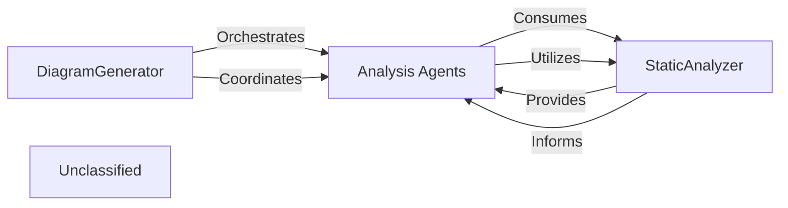

## Details

The system's architecture is centered around the DiagramGenerator, which acts as the primary orchestrator, initiating and managing the architectural analysis workflow. It coordinates a suite of Analysis Agents, each specialized for different aspects of code analysis, from metadata gathering to detailed structural examination. These Analysis Agents critically depend on the StaticAnalyzer component, which provides foundational static code analysis capabilities by extracting structural and semantic information from the codebase. Recent enhancements to the StaticAnalyzer's Language Server Protocol (LSP) client have further improved its ability to deliver comprehensive code insights, thereby empowering the Analysis Agents to perform more robust and accurate analyses. The DiagramGenerator then consolidates and persists the architectural insights generated through this collaborative process.

### DiagramGenerator
This is the core orchestrator of the architectural analysis process. It initializes, configures, and coordinates various specialized Analysis Agents to perform a multi-stage analysis of the codebase. It manages the parallel execution of component analysis, applies feedback for iterative refinement, and ultimately persists the generated architectural insights into structured Analysis Files.

**Related Classes/Methods**:

- <a href="https://github.com/CodeBoarding/CodeBoarding/blob/main/.codeboardingdiagram_analysis/diagram_generator.py" target="_blank" rel="noopener noreferrer">`diagram_analysis.diagram_generator.DiagramGenerator`</a>

### Analysis Agents
This component represents a collection of intelligent agents (MetaAgent, DetailsAgent, AbstractionAgent, PlannerAgent, ValidatorAgent, DiffAnalyzingAgent) that perform specific tasks within the analysis pipeline. They are responsible for gathering project metadata, conducting detailed code analysis, abstracting architectural components, planning subsequent analysis steps, validating the accuracy of the analysis, and managing incremental updates based on code changes.

**Related Classes/Methods**:

- <a href="https://github.com/CodeBoarding/CodeBoarding/blob/main/.codeboardingagents/meta_agent.py" target="_blank" rel="noopener noreferrer">`agents.meta_agent.MetaAgent`</a>
- <a href="https://github.com/CodeBoarding/CodeBoarding/blob/main/.codeboardingagents/details_agent.py" target="_blank" rel="noopener noreferrer">`agents.details_agent.DetailsAgent`</a>
- <a href="https://github.com/CodeBoarding/CodeBoarding/blob/main/.codeboardingagents/abstraction_agent.py" target="_blank" rel="noopener noreferrer">`agents.abstraction_agent.AbstractionAgent`</a>
- <a href="https://github.com/CodeBoarding/CodeBoarding/blob/main/.codeboardingagents/planner_agent.py" target="_blank" rel="noopener noreferrer">`agents.planner_agent.PlannerAgent`</a>
- <a href="https://github.com/CodeBoarding/CodeBoarding/blob/main/.codeboardingagents/validator_agent.py" target="_blank" rel="noopener noreferrer">`agents.validator_agent.ValidatorAgent`</a>
- <a href="https://github.com/CodeBoarding/CodeBoarding/blob/main/.codeboardingagents/diff_analyzer.py" target="_blank" rel="noopener noreferrer">`agents.diff_analyzer.DiffAnalyzingAgent`</a>

### StaticAnalyzer
Provides foundational static code analysis capabilities. It extracts structural and semantic information from the codebase without executing it, which is then consumed by the Analysis Agents to inform their analytical tasks. Recent enhancements to its internal LSP client have improved its ability to gather comprehensive code information.

**Related Classes/Methods**:

- `static_analyzer.StaticAnalyzer`

### Unclassified
Component for all unclassified files and utility functions (Utility functions/External Libraries/Dependencies)

**Related Classes/Methods**: _None_

### [FAQ](https://github.com/CodeBoarding/GeneratedOnBoardings/tree/main?tab=readme-ov-file#faq)
