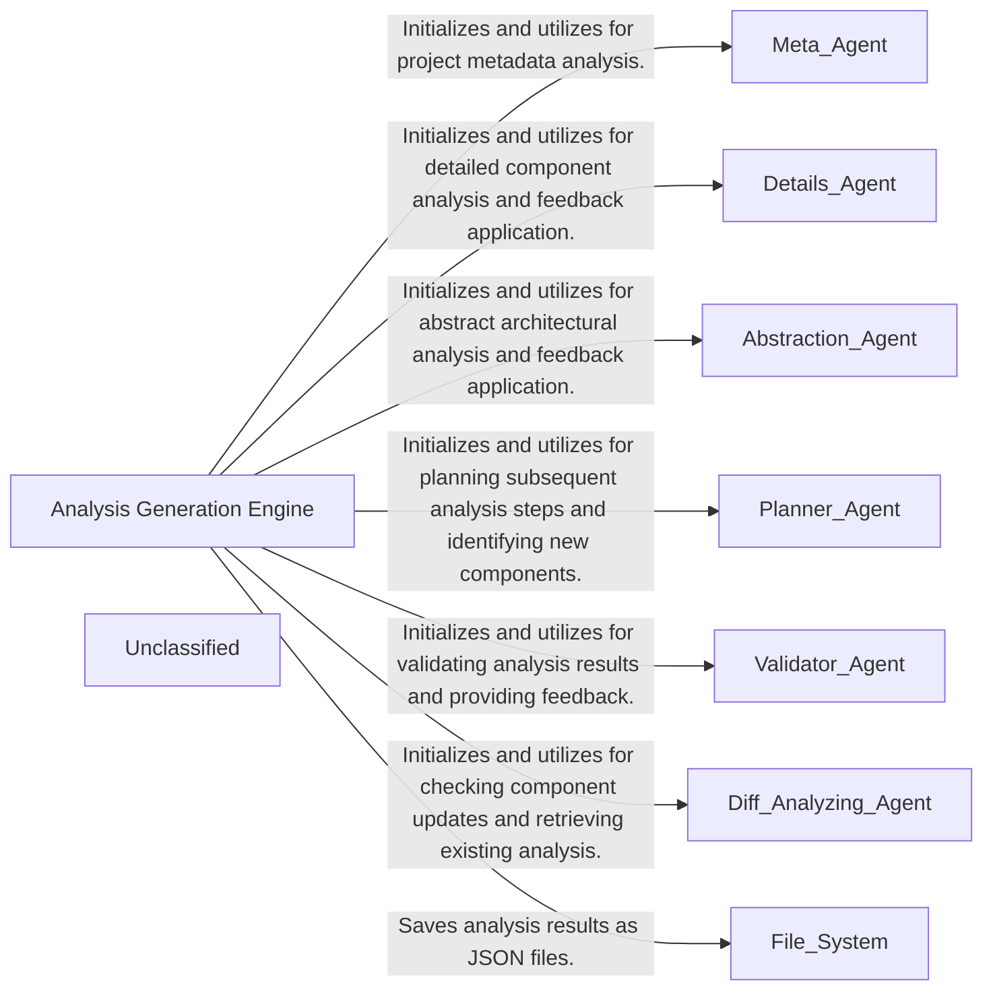

## Details

The `diagram_analysis` subsystem is centered around the Analysis Generation Engine, embodied by the `DiagramGenerator` class. This engine orchestrates a multi-agent system to perform a comprehensive architectural analysis of a codebase. It leverages a `Meta Agent` for project metadata, `Details Agent` for in-depth component analysis, `Abstraction Agent` for high-level architectural insights, a `Planner Agent` to guide the analysis process, and a `Validator Agent` to ensure the quality of the generated insights. Additionally, a `Diff Analyzing Agent` is employed to efficiently manage updates and leverage previous analysis. The primary output of this engine is a set of structured JSON files, representing the detailed architectural analysis, which can then be consumed by other systems for visualization or reporting.

### Analysis Generation Engine
This is the core component responsible for orchestrating the architectural analysis of the codebase. It initializes and coordinates various specialized agents (e.g., `DetailsAgent`, `AbstractionAgent`, `PlannerAgent`, `ValidatorAgent`, `DiffAnalyzingAgent`) to perform detailed and abstract analysis, validate insights, and plan further exploration. Its primary function is to generate structured architectural analysis data and save it as JSON files, which serve as the foundation for subsequent diagram generation or reporting.

**Related Classes/Methods**:

- <a href="https://github.com/CodeBoarding/CodeBoarding/blob/main/.codeboardingdiagram_analysis/diagram_generator.py#L22-L205" target="_blank" rel="noopener noreferrer">`diagram_analysis.diagram_generator.DiagramGenerator`:22-205</a>

### Unclassified
Component for all unclassified files and utility functions (Utility functions/External Libraries/Dependencies)

**Related Classes/Methods**: _None_

### [FAQ](https://github.com/CodeBoarding/GeneratedOnBoardings/tree/main?tab=readme-ov-file#faq)
