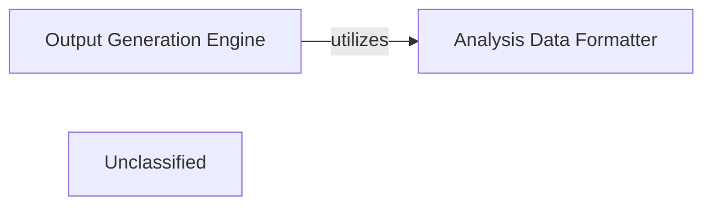

## Details

The Output Generation Engine serves as the central orchestrator for transforming raw code analysis into structured, human-readable outputs, primarily in JSON format for subsequent diagram generation. It leverages a suite of specialized agents to perform detailed analysis, abstraction, planning, and validation. The engine's primary responsibility is to manage the workflow of these agents, process components in a multi-level, parallel fashion, and persist the generated analysis in a structured format that can be consumed by external rendering tools to visualize architectural diagrams.

### Output Generation Engine [[Expand]](./Output_Generation_Engine.md)
Orchestrates the entire process of generating structured analysis outputs from interpreted code. It coordinates various agents to perform detailed analysis, abstraction, planning, and validation, ultimately producing JSON files that serve as the basis for architectural diagrams.

**Related Classes/Methods**:

- <a href="https://github.com/CodeBoarding/CodeBoarding/blob/main/.codeboardingdiagram_analysis/diagram_generator.py#L23-L196" target="_blank" rel="noopener noreferrer">`diagram_analysis.diagram_generator.DiagramGenerator`:23-196</a>

### Analysis Data Formatter
Responsible for converting the internal analysis objects into a standardized JSON format. This component ensures that the output is structured consistently, making it suitable for consumption by external diagram rendering tools.

**Related Classes/Methods**:

- <a href="https://github.com/CodeBoarding/CodeBoarding/blob/main/.codeboardingdiagram_analysis/analysis_json.py" target="_blank" rel="noopener noreferrer">`diagram_analysis.analysis_json.from_analysis_to_json`</a>

### Unclassified
Component for all unclassified files and utility functions (Utility functions/External Libraries/Dependencies)

**Related Classes/Methods**: _None_

### [FAQ](https://github.com/CodeBoarding/GeneratedOnBoardings/tree/main?tab=readme-ov-file#faq)
