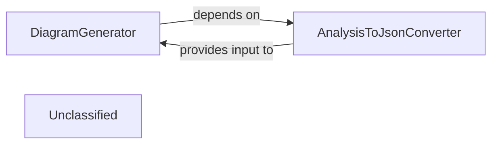

## Details

The Diagram Generation Service subsystem is responsible for converting structured architectural data into visual diagrams, enhancing comprehension through interactive and visual representations. It takes processed data and produces a final, consumable output, potentially integrating with external tools like Mermaid.js.

### DiagramGenerator
Within the Diagram Generation Service, this component orchestrates the process of transforming structured architectural analysis data into visual diagrams. It coordinates the serialization of analysis results and manages the invocation of diagramming logic, potentially integrating with external tools like Mermaid.js to produce the final visual representations.

**Related Classes/Methods**:

- <a href="https://github.com/CodeBoarding/CodeBoarding/blob/main/.codeboardingdiagram_analysis/diagram_generator.py" target="_blank" rel="noopener noreferrer">`DiagramGenerator`</a>

### AnalysisToJsonConverter
This utility component is responsible for serializing complex architectural analysis objects into a standardized JSON format. This conversion is a crucial preparatory step, ensuring the structured data is in a consumable format for diagramming tools and the DiagramGenerator.

**Related Classes/Methods**:

- <a href="https://github.com/CodeBoarding/CodeBoarding/blob/main/.codeboardingdiagram_analysis/analysis_json.py" target="_blank" rel="noopener noreferrer">`AnalysisToJsonConverter`</a>

### Unclassified
Component for all unclassified files and utility functions (Utility functions/External Libraries/Dependencies)

**Related Classes/Methods**: _None_

### [FAQ](https://github.com/CodeBoarding/GeneratedOnBoardings/tree/main?tab=readme-ov-file#faq)
