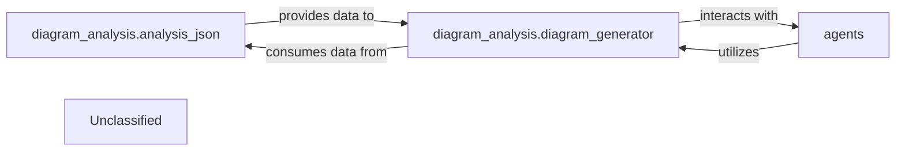

## Details

The system's architecture is centered around the `diagram_analysis` subsystem, which comprises `analysis_json` for data preparation and `diagram_generator` for visual output. A newly integrated `agents` component introduces intelligent agent capabilities, exhibiting a strong, bidirectional interaction with the `diagram_analysis` components. The `analysis_json` component processes raw architectural data into a structured format, which is then consumed by the `diagram_generator` to create visual representations. The `agents` component, responsible for agent behavior and orchestration, either provides input to the diagram generation process or leverages the diagram analysis for its operations, indicating a tightly coupled relationship for enhanced system understanding and control.

### diagram_analysis.analysis_json
This component is responsible for processing and structuring raw architectural data into a standardized, machine-readable format (likely JSON). It acts as a crucial data preparation layer, ensuring that the input for diagram generation is consistent and well-formed.

**Related Classes/Methods**:

- <a href="https://github.com/CodeBoarding/CodeBoarding/blob/main/.codeboardingdiagram_analysis/analysis_json.py" target="_blank" rel="noopener noreferrer">`diagram_analysis.analysis_json`</a>

### diagram_analysis.diagram_generator
This is the core engine of the subsystem, tasked with taking the structured architectural data (prepared by `analysis_json`) and transforming it into a visual diagram format. It likely leverages external tools like Mermaid.js for rendering the visual output. It also interacts with the `agents` component, potentially to visualize agent-related information or to be driven by agent decisions.

**Related Classes/Methods**:

- <a href="https://github.com/CodeBoarding/CodeBoarding/blob/main/.codeboardingdiagram_analysis/diagram_generator.py" target="_blank" rel="noopener noreferrer">`diagram_analysis.diagram_generator`</a>

### agents
This component encapsulates the core logic for various agents within the system. It defines agent behavior, manages their state, and orchestrates their interactions. It leverages `langchain_core` for foundational AI functionalities and interacts with `diagram_analysis` for visualization or analysis purposes, potentially providing data to or receiving instructions from the diagram generation process.

**Related Classes/Methods**:

- <a href="https://github.com/CodeBoarding/CodeBoarding/blob/main/.codeboardingagents/agent.py" target="_blank" rel="noopener noreferrer">`agents.agent`</a>

### Unclassified
This component serves as a placeholder for all unclassified files, utility functions, and external libraries/dependencies that support the primary components but are not central to the core architectural flow.

**Related Classes/Methods**:

- `unclassified.code`

### Unclassified
Component for all unclassified files and utility functions (Utility functions/External Libraries/Dependencies)

**Related Classes/Methods**: _None_

### [FAQ](https://github.com/CodeBoarding/GeneratedOnBoardings/tree/main?tab=readme-ov-file#faq)
