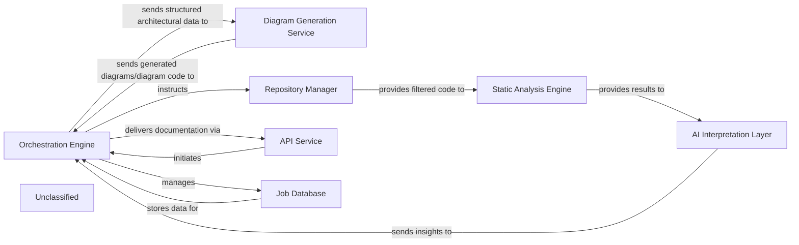

## Details

The system's architecture is centered around an Orchestration Engine that manages the entire code analysis and documentation generation workflow. It interfaces with an API Service for job initiation and delivery, and a Job Database for status management. Code acquisition and filtering are handled by the Repository Manager, which then feeds into the Static Analysis Engine for initial code analysis. The core intelligence resides in the AI Interpretation Layer, which employs specialized MetaAgent and PlannerAgent components to derive architectural insights and strategic analysis plans from the static analysis results. These insights are then relayed back to the Orchestration Engine for final documentation generation. Finally, the Diagram Generation Service converts structured architectural data into visual diagrams, enhancing comprehension.

### Orchestration Engine [[Expand]](./Orchestration_Engine.md)
Acts as the central coordinator of the analysis and documentation generation pipeline. It initiates requests, manages the flow of data between different services, and aggregates results.

**Related Classes/Methods**:

- <a href="https://github.com/CodeBoarding/CodeBoarding/blob/main/.codeboarding.codeboarding/Orchestration_Engine.md" target="_blank" rel="noopener noreferrer">`Orchestration_Engine`</a>

### Diagram Generation Service [[Expand]](./Diagram_Generation_Service.md)
Specializes in converting structured architectural data into visual diagrams, potentially using tools like Mermaid.js. It enhances comprehension by providing interactive and visual representations of the analyzed architecture.

**Related Classes/Methods**:

- <a href="https://github.com/CodeBoarding/CodeBoarding/blob/main/.codeboardingdiagram_analysis/diagram_generator.py" target="_blank" rel="noopener noreferrer">`diagram_analysis.diagram_generator`</a>
- <a href="https://github.com/CodeBoarding/CodeBoarding/blob/main/.codeboardingdiagram_analysis/analysis_json.py" target="_blank" rel="noopener noreferrer">`diagram_analysis.analysis_json`</a>

### AI Interpretation Layer
Interprets static analysis results and generates insights, encompassing specialized agents like MetaAgent and PlannerAgent.

**Related Classes/Methods**:

- <a href="https://github.com/CodeBoarding/CodeBoarding/blob/main/.codeboardingagents/agent.py" target="_blank" rel="noopener noreferrer">`agents.agent`</a>

### Static Analysis Engine [[Expand]](./Static_Analysis_Engine.md)
Performs static analysis on the provided code, receiving a filtered set of files from the Repository Manager.

**Related Classes/Methods**:

- <a href="https://github.com/CodeBoarding/CodeBoarding/blob/main/.codeboarding.codeboarding/Static_Analysis_Engine.md" target="_blank" rel="noopener noreferrer">`Static_Analysis_Engine`</a>

### Repository Manager
Responsible for fetching code from repositories and managing file and directory exclusions based on .gitignore patterns and default ignored paths.

**Related Classes/Methods**:

- <a href="https://github.com/CodeBoarding/CodeBoarding/blob/main/.codeboarding.codeboarding/Orchestration_Engine.md" target="_blank" rel="noopener noreferrer">`Orchestration_Engine`</a>

### API Service
Handles external job requests and delivers final documentation.

**Related Classes/Methods**:

- <a href="https://github.com/CodeBoarding/CodeBoarding/blob/main/.codeboarding.codeboarding/Orchestration_Engine.md" target="_blank" rel="noopener noreferrer">`Orchestration_Engine`</a>

### Job Database
Stores and manages job status and metadata.

**Related Classes/Methods**:

- <a href="https://github.com/CodeBoarding/CodeBoarding/blob/main/.codeboarding.codeboarding/Orchestration_Engine.md" target="_blank" rel="noopener noreferrer">`Orchestration_Engine`</a>

### Unclassified
Component for all unclassified files and utility functions (Utility functions/External Libraries/Dependencies)

**Related Classes/Methods**: _None_

### [FAQ](https://github.com/CodeBoarding/GeneratedOnBoardings/tree/main?tab=readme-ov-file#faq)
