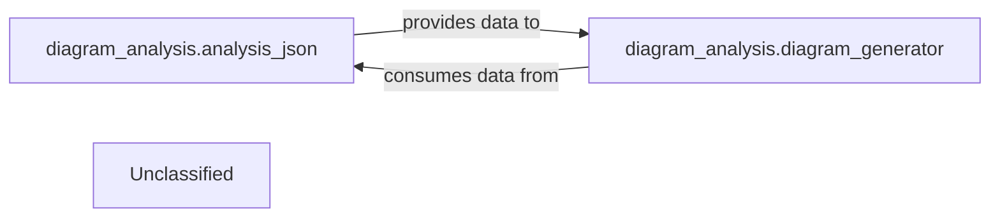

## Details

The Diagram Generation Service subsystem is encapsulated within the diagram_analysis package. Its primary function is to transform structured architectural data into visual diagrams, enhancing comprehension through interactive representations.

### diagram_analysis.analysis_json
This component is responsible for processing and structuring raw architectural data into a standardized, machine-readable format (likely JSON). It acts as a crucial data preparation layer, ensuring that the input for diagram generation is consistent and well-formed.

**Related Classes/Methods**:

- <a href="https://github.com/CodeBoarding/CodeBoarding/blob/main/.codeboardingdiagram_analysis/analysis_json.py" target="_blank" rel="noopener noreferrer">`diagram_analysis.analysis_json`</a>

### diagram_analysis.diagram_generator
This is the core engine of the subsystem, tasked with taking the structured architectural data (prepared by analysis_json) and transforming it into a visual diagram format. It likely leverages external tools like Mermaid.js for rendering the visual output.

**Related Classes/Methods**:

- <a href="https://github.com/CodeBoarding/CodeBoarding/blob/main/.codeboardingdiagram_analysis/diagram_generator.py" target="_blank" rel="noopener noreferrer">`diagram_analysis.diagram_generator`</a>

### Unclassified
Component for all unclassified files and utility functions (Utility functions/External Libraries/Dependencies)

**Related Classes/Methods**: _None_

### [FAQ](https://github.com/CodeBoarding/GeneratedOnBoardings/tree/main?tab=readme-ov-file#faq)
