```mermaid
graph LR
    API_Service["API Service"]
    Orchestration_Engine["Orchestration Engine"]
    Repository_Manager["Repository Manager"]
    Static_Analysis_Engine["Static Analysis Engine"]
    AI_Interpretation_Layer["AI Interpretation Layer"]
    Job_Database["Job Database"]
    Diagram_Generation_Service["Diagram Generation Service"]
    Output_Generation_Engine["Output Generation Engine"]
    Unclassified["Unclassified"]
    API_Service -- "initiates requests to" --> Orchestration_Engine
    Orchestration_Engine -- "coordinates tasks with" --> Repository_Manager
    Orchestration_Engine -- "coordinates tasks with" --> Static_Analysis_Engine
    Orchestration_Engine -- "coordinates tasks with" --> AI_Interpretation_Layer
    Orchestration_Engine -- "coordinates tasks with" --> Diagram_Generation_Service
    Orchestration_Engine -- "coordinates tasks with" --> Output_Generation_Engine
    Orchestration_Engine -- "updates and retrieves job status from" --> Job_Database
    Repository_Manager -- "provides source code to" --> Static_Analysis_Engine
    Static_Analysis_Engine -- "provides analysis data to" --> AI_Interpretation_Layer
    Static_Analysis_Engine -- "provides analysis data to" --> Diagram_Generation_Service
    AI_Interpretation_Layer -- "provides architectural insights to" --> Diagram_Generation_Service
    AI_Interpretation_Layer -- "provides architectural insights to" --> Output_Generation_Engine
    Diagram_Generation_Service -- "provides visual diagrams to" --> Output_Generation_Engine
    Output_Generation_Engine -- "receives data from" --> AI_Interpretation_Layer
    Output_Generation_Engine -- "receives data from" --> Diagram_Generation_Service
    click Orchestration_Engine href "https://github.com/CodeBoarding/CodeBoarding/blob/main/.codeboarding/Orchestration_Engine.md" "Details"
    click Static_Analysis_Engine href "https://github.com/CodeBoarding/CodeBoarding/blob/main/.codeboarding/Static_Analysis_Engine.md" "Details"
    click Diagram_Generation_Service href "https://github.com/CodeBoarding/CodeBoarding/blob/main/.codeboarding/Diagram_Generation_Service.md" "Details"
    click Output_Generation_Engine href "https://github.com/CodeBoarding/CodeBoarding/blob/main/.codeboarding/Output_Generation_Engine.md" "Details"
```

## Details

The CodeBoarding project provides an automated system for generating architectural documentation and diagrams from source code. The API Service acts as the entry point, receiving requests for repository analysis. The Orchestration Engine then takes charge, coordinating the entire workflow. It first utilizes the Repository Manager to clone the target repository, which then feeds the source code to the Static Analysis Engine for initial structural analysis. The raw analysis data is then passed to the AI Interpretation Layer, a suite of intelligent agents that leverage Large Language Models to derive high-level architectural insights and contextual understanding. Concurrently, the Job Database maintains the state and results of ongoing and completed analysis jobs. Once architectural insights are generated, the Diagram Generation Service transforms this data into visual representations. Finally, the Output Generation Engine compiles all insights, diagrams, and raw analysis into comprehensive documentation in various formats.

### API Service
Serves as the primary external interface, handling all incoming requests and acting as the entry point for users or other systems to initiate code analysis and documentation generation tasks.

**Related Classes/Methods**:

- <a href="https://github.com/CodeBoarding/CodeBoarding/blob/main/.codeboardingmain.py#L176-L234" target="_blank" rel="noopener noreferrer">`main.process_remote_repository`:176-234</a>
- <a href="https://github.com/CodeBoarding/CodeBoarding/blob/main/.codeboardingmain.py#L237-L267" target="_blank" rel="noopener noreferrer">`main.process_local_repository`:237-267</a>

### Orchestration Engine [[Expand]](./Orchestration_Engine.md)
The central coordinator of the entire analysis pipeline. It manages the workflow, dispatches tasks to other components, monitors their progress, and ensures the sequential or parallel execution of analysis steps.

**Related Classes/Methods**:

- <a href="https://github.com/CodeBoarding/CodeBoarding/blob/main/.codeboardingdiagram_analysis/diagram_generator.py" target="_blank" rel="noopener noreferrer">`diagram_analysis.diagram_generator.DiagramGenerator`</a>

### Repository Manager
Responsible for interacting with code repositories. It handles tasks such as cloning, fetching, and managing access to the source code that needs to be analyzed.

**Related Classes/Methods**:

- <a href="https://github.com/CodeBoarding/CodeBoarding/blob/main/.codeboardingrepo_utils/__init__.py" target="_blank" rel="noopener noreferrer">`repo_utils.clone_repository`</a>

### Static Analysis Engine [[Expand]](./Static_Analysis_Engine.md)
Performs initial, rule-based analysis of the source code. It identifies structural patterns, dependencies, and other static properties without executing the code, providing foundational data for further interpretation.

**Related Classes/Methods**:

- <a href="https://github.com/CodeBoarding/CodeBoarding/blob/main/.codeboardingstatic_analyzer/scanner.py#L13-L85" target="_blank" rel="noopener noreferrer">`static_analyzer.scanner.ProjectScanner`:13-85</a>

### AI Interpretation Layer
Leverages Large Language Models (LLMs) to derive higher-level architectural insights and contextual understanding from the raw static analysis data. It translates technical details into human-readable explanations and identifies architectural patterns.

**Related Classes/Methods**:

- <a href="https://github.com/CodeBoarding/CodeBoarding/blob/main/.codeboardingagents/meta_agent.py" target="_blank" rel="noopener noreferrer">`agents.meta_agent.MetaAgent`</a>
- <a href="https://github.com/CodeBoarding/CodeBoarding/blob/main/.codeboardingagents/abstraction_agent.py" target="_blank" rel="noopener noreferrer">`agents.abstraction_agent.AbstractionAgent`</a>
- <a href="https://github.com/CodeBoarding/CodeBoarding/blob/main/.codeboardingagents/details_agent.py" target="_blank" rel="noopener noreferrer">`agents.details_agent.DetailsAgent`</a>
- <a href="https://github.com/CodeBoarding/CodeBoarding/blob/main/.codeboardingagents/planner_agent.py" target="_blank" rel="noopener noreferrer">`agents.planner_agent.PlannerAgent`</a>
- <a href="https://github.com/CodeBoarding/CodeBoarding/blob/main/.codeboardingagents/validator_agent.py" target="_blank" rel="noopener noreferrer">`agents.validator_agent.ValidatorAgent`</a>
- <a href="https://github.com/CodeBoarding/CodeBoarding/blob/main/.codeboardingagents/diff_analyzer.py" target="_blank" rel="noopener noreferrer">`agents.diff_analyzer.DiffAnalyzingAgent`</a>

### Job Database
Persistently stores information related to ongoing and completed analysis jobs, including their status, configuration, intermediate results, and final outputs. It ensures data integrity and allows for job tracking and retrieval.

**Related Classes/Methods**:

- <a href="https://github.com/CodeBoarding/CodeBoarding/blob/main/.codeboardingduckdb_crud.py#L16-L45" target="_blank" rel="noopener noreferrer">`duckdb_crud.init_db`:16-45</a>
- <a href="https://github.com/CodeBoarding/CodeBoarding/blob/main/.codeboardingduckdb_crud.py#L49-L65" target="_blank" rel="noopener noreferrer">`duckdb_crud.insert_job`:49-65</a>
- <a href="https://github.com/CodeBoarding/CodeBoarding/blob/main/.codeboardingduckdb_crud.py#L68-L77" target="_blank" rel="noopener noreferrer">`duckdb_crud.update_job`:68-77</a>
- <a href="https://github.com/CodeBoarding/CodeBoarding/blob/main/.codeboardingduckdb_crud.py#L80-L99" target="_blank" rel="noopener noreferrer">`duckdb_crud.fetch_job`:80-99</a>
- <a href="https://github.com/CodeBoarding/CodeBoarding/blob/main/.codeboardingduckdb_crud.py#L102-L124" target="_blank" rel="noopener noreferrer">`duckdb_crud.fetch_all_jobs`:102-124</a>

### Diagram Generation Service [[Expand]](./Diagram_Generation_Service.md)
Specializes in converting structured architectural data (from static analysis and AI interpretation) into visual diagrams, potentially using tools like Mermaid.js. It enhances comprehension by providing interactive and visual representations of the analyzed architecture.

**Related Classes/Methods**:

- <a href="https://github.com/CodeBoarding/CodeBoarding/blob/main/.codeboardingdiagram_analysis/diagram_generator.py#L199-L298" target="_blank" rel="noopener noreferrer">`diagram_analysis.diagram_generator.DiagramGenerator.generate_analysis`:199-298</a>

### Output Generation Engine [[Expand]](./Output_Generation_Engine.md)
Compiles all analysis results, AI interpretations, and generated diagrams into various final output formats (e.g., Markdown, HTML, PDF). It is responsible for formatting and presenting the comprehensive documentation.

**Related Classes/Methods**:

- <a href="https://github.com/CodeBoarding/CodeBoarding/blob/main/.codeboardingoutput_generators/markdown.py#L104-L117" target="_blank" rel="noopener noreferrer">`output_generators.markdown.generate_markdown_file`:104-117</a>
- <a href="https://github.com/CodeBoarding/CodeBoarding/blob/main/.codeboardingoutput_generators/markdown.py#L44-L101" target="_blank" rel="noopener noreferrer">`output_generators.markdown.generate_markdown`:44-101</a>

### Unclassified
Component for all unclassified files and utility functions (Utility functions/External Libraries/Dependencies)

**Related Classes/Methods**: _None_

### [FAQ](https://github.com/CodeBoarding/GeneratedOnBoardings/tree/main?tab=readme-ov-file#faq)
