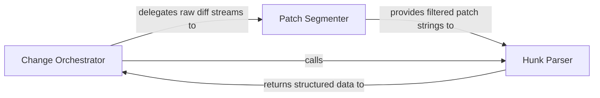

## Details

Orchestrates the transformation of raw text diffs into structured objects by parsing unified diff formats and extracting granular hunks of code changes.

### Change Orchestrator
Acts as the subsystem's facade and controller, managing the lifecycle of change detection operations and aggregating the final structured ChangeSet.

**Related Classes/Methods**:

- `repo_utils.diff_parser.detect_changes`:32-56
- `repo_utils.diff_parser._parse_diff_output`:227-266
- `repo_utils.change_detector.ChangeSet`:224-292

**Source Files:**

- [`repo_utils/change_detector.py`](https://github.com/CodeBoarding/CodeBoarding/blob/main/.codeboardingrepo_utils/change_detector.py)
  - `repo_utils.change_detector.ChangeSet` ([L224-L292](https://github.com/CodeBoarding/CodeBoarding/blob/main/.codeboardingrepo_utils/change_detector.py#L224-L292)) - Class
- [`repo_utils/diff_parser.py`](https://github.com/CodeBoarding/CodeBoarding/blob/main/.codeboardingrepo_utils/diff_parser.py)
  - `repo_utils.diff_parser.detect_changes` ([L32-L56](https://github.com/CodeBoarding/CodeBoarding/blob/main/.codeboardingrepo_utils/diff_parser.py#L32-L56)) - Function
  - `repo_utils.diff_parser._parse_diff_output` ([L227-L266](https://github.com/CodeBoarding/CodeBoarding/blob/main/.codeboardingrepo_utils/diff_parser.py#L227-L266)) - Function

### Patch Segmenter
A pre-processing engine that cleans and divides monolithic diff output, applying logic to ignore non-source files and splitting the stream into individual file-level patches.

**Related Classes/Methods**:

- `repo_utils.diff_parser._split_patch_bodies`:196-224
- `repo_utils.diff_parser._file_is_relevant`:92-98
- `repo_utils.diff_parser._append_untracked_files`:269-290

**Source Files:**

- [`repo_utils/diff_parser.py`](https://github.com/CodeBoarding/CodeBoarding/blob/main/.codeboardingrepo_utils/diff_parser.py)
  - `repo_utils.diff_parser._is_source_path` ([L87-L89](https://github.com/CodeBoarding/CodeBoarding/blob/main/.codeboardingrepo_utils/diff_parser.py#L87-L89)) - Function
  - `repo_utils.diff_parser._file_is_relevant` ([L92-L98](https://github.com/CodeBoarding/CodeBoarding/blob/main/.codeboardingrepo_utils/diff_parser.py#L92-L98)) - Function
  - `repo_utils.diff_parser._split_patch_bodies` ([L196-L224](https://github.com/CodeBoarding/CodeBoarding/blob/main/.codeboardingrepo_utils/diff_parser.py#L196-L224)) - Function
  - `repo_utils.diff_parser._split_patch_bodies._flush` ([L209-L211](https://github.com/CodeBoarding/CodeBoarding/blob/main/.codeboardingrepo_utils/diff_parser.py#L209-L211)) - Function
  - `repo_utils.diff_parser._append_untracked_files` ([L269-L290](https://github.com/CodeBoarding/CodeBoarding/blob/main/.codeboardingrepo_utils/diff_parser.py#L269-L290)) - Function

### Hunk Parser
A low-level parsing engine that interprets Unified Diff format text, transforming raw lines into structured DiffHunk objects.

**Related Classes/Methods**:

- `repo_utils.diff_parser._parse_patch_text`:159-184
- `repo_utils.change_detector.FileChange`:71-220
- `repo_utils.change_detector.DiffHunk`:46-53
- `repo_utils.diff_parser._parse_raw_line`:111-143

**Source Files:**

- [`repo_utils/change_detector.py`](https://github.com/CodeBoarding/CodeBoarding/blob/main/.codeboardingrepo_utils/change_detector.py)
  - `repo_utils.change_detector.ChangeDetectionError` ([L21-L22](https://github.com/CodeBoarding/CodeBoarding/blob/main/.codeboardingrepo_utils/change_detector.py#L21-L22)) - Class
  - `repo_utils.change_detector.ChangeType` ([L25-L42](https://github.com/CodeBoarding/CodeBoarding/blob/main/.codeboardingrepo_utils/change_detector.py#L25-L42)) - Class
  - `repo_utils.change_detector.DiffHunk` ([L46-L53](https://github.com/CodeBoarding/CodeBoarding/blob/main/.codeboardingrepo_utils/change_detector.py#L46-L53)) - Class
  - `repo_utils.change_detector.FileChange` ([L71-L220](https://github.com/CodeBoarding/CodeBoarding/blob/main/.codeboardingrepo_utils/change_detector.py#L71-L220)) - Class
  - `repo_utils.change_detector.ChangeSet.is_empty` ([L243-L244](https://github.com/CodeBoarding/CodeBoarding/blob/main/.codeboardingrepo_utils/change_detector.py#L243-L244)) - Method
  - `repo_utils.change_detector.ChangeSet.to_dict` ([L279-L292](https://github.com/CodeBoarding/CodeBoarding/blob/main/.codeboardingrepo_utils/change_detector.py#L279-L292)) - Method
- [`repo_utils/diff_parser.py`](https://github.com/CodeBoarding/CodeBoarding/blob/main/.codeboardingrepo_utils/diff_parser.py)
  - `repo_utils.diff_parser._parse_hunk_side` ([L101-L108](https://github.com/CodeBoarding/CodeBoarding/blob/main/.codeboardingrepo_utils/diff_parser.py#L101-L108)) - Function
  - `repo_utils.diff_parser._parse_raw_line` ([L111-L143](https://github.com/CodeBoarding/CodeBoarding/blob/main/.codeboardingrepo_utils/diff_parser.py#L111-L143)) - Function
  - `repo_utils.diff_parser._strip_git_quotes` ([L146-L156](https://github.com/CodeBoarding/CodeBoarding/blob/main/.codeboardingrepo_utils/diff_parser.py#L146-L156)) - Function
  - `repo_utils.diff_parser._parse_patch_text` ([L159-L184](https://github.com/CodeBoarding/CodeBoarding/blob/main/.codeboardingrepo_utils/diff_parser.py#L159-L184)) - Function
  - `repo_utils.diff_parser._finalize_file_diff` ([L187-L190](https://github.com/CodeBoarding/CodeBoarding/blob/main/.codeboardingrepo_utils/diff_parser.py#L187-L190)) - Function

### [FAQ](https://github.com/CodeBoarding/GeneratedOnBoardings/tree/main?tab=readme-ov-file#faq)