```mermaid
graph LR
    Agent_Orchestrator_Lifecycle_Manager["Agent Orchestrator & Lifecycle Manager"]
    Context_Synthesis_Prompt_Engine["Context Synthesis & Prompt Engine"]
    Repository_Discovery_Grounding["Repository Discovery & Grounding"]
    Structural_Analysis_Relation_Index["Structural Analysis & Relation Index"]
    Response_Parser_Insight_Extractor["Response Parser & Insight Extractor"]
    Agent_Orchestrator_Lifecycle_Manager -- "Dispatches analysis tasks to structural plugins" --> Structural_Analysis_Relation_Index
    Context_Synthesis_Prompt_Engine -- "Injects synthesized context into agent execution flow" --> Agent_Orchestrator_Lifecycle_Manager
    Context_Synthesis_Prompt_Engine -- "calls" --> Repository_Discovery_Grounding
    Repository_Discovery_Grounding -- "Provides grounded file system state for context assembly" --> Context_Synthesis_Prompt_Engine
    Repository_Discovery_Grounding -- "Synchronizes repository state with the orchestrator" --> Agent_Orchestrator_Lifecycle_Manager
    Structural_Analysis_Relation_Index -- "calls" --> Repository_Discovery_Grounding
    Structural_Analysis_Relation_Index -- "Provides registry access for insight validation" --> Response_Parser_Insight_Extractor
    Structural_Analysis_Relation_Index -- "Registers architectural metadata for lifecycle tracking" --> Agent_Orchestrator_Lifecycle_Manager
    Response_Parser_Insight_Extractor -- "Maps LLM insights to deterministic structural registries" --> Structural_Analysis_Relation_Index
    click Agent_Orchestrator_Lifecycle_Manager href "https://github.com/CodeBoarding/CodeBoarding/blob/main/.codeboarding/Agent_Orchestrator_Lifecycle_Manager.md" "Details"
    click Context_Synthesis_Prompt_Engine href "https://github.com/CodeBoarding/CodeBoarding/blob/main/.codeboarding/Context_Synthesis_Prompt_Engine.md" "Details"
    click Repository_Discovery_Grounding href "https://github.com/CodeBoarding/CodeBoarding/blob/main/.codeboarding/Repository_Discovery_Grounding.md" "Details"
    click Structural_Analysis_Relation_Index href "https://github.com/CodeBoarding/CodeBoarding/blob/main/.codeboarding/Structural_Analysis_Relation_Index.md" "Details"
    click Response_Parser_Insight_Extractor href "https://github.com/CodeBoarding/CodeBoarding/blob/main/.codeboarding/Response_Parser_Insight_Extractor.md" "Details"
```

## Details

Aggregates discovery results into a Repo Context and manages the meta-cache for AI agent queries.

### Agent Orchestrator & Lifecycle Manager [[Expand]](./Agent_Orchestrator_Lifecycle_Manager.md)
Manages the state machine and execution flow of specialized agents, handling initialization and coordinating analysis phases.

**Related Classes/Methods**: _None_

**Source Files:**

- [`agents/dependency_discovery.py`](https://github.com/CodeBoarding/CodeBoarding/blob/main/.codeboardingagents/dependency_discovery.py)
  - `agents.dependency_discovery.discover_dependency_files` ([L103-L159](https://github.com/CodeBoarding/CodeBoarding/blob/main/.codeboardingagents/dependency_discovery.py#L103-L159)) - Function
- [`agents/tools/base.py`](https://github.com/CodeBoarding/CodeBoarding/blob/main/.codeboardingagents/tools/base.py)
  - `agents.tools.base.BaseRepoTool.repo_dir` ([L76-L77](https://github.com/CodeBoarding/CodeBoarding/blob/main/.codeboardingagents/tools/base.py#L76-L77)) - Method
  - `agents.tools.base.BaseRepoTool.ignore_manager` ([L80-L81](https://github.com/CodeBoarding/CodeBoarding/blob/main/.codeboardingagents/tools/base.py#L80-L81)) - Method
  - `agents.tools.base.BaseRepoTool.is_subsequence` ([L87-L103](https://github.com/CodeBoarding/CodeBoarding/blob/main/.codeboardingagents/tools/base.py#L87-L103)) - Method

### Context Synthesis & Prompt Engine [[Expand]](./Context_Synthesis_Prompt_Engine.md)
Aggregates multi-modal repository data into structured prompts, acting as a context window manager for the LLM.

**Related Classes/Methods**: _None_

**Source Files:**

- [`agents/tools/base.py`](https://github.com/CodeBoarding/CodeBoarding/blob/main/.codeboardingagents/tools/base.py)
  - `agents.tools.base.RepoContext.get_files` ([L32-L36](https://github.com/CodeBoarding/CodeBoarding/blob/main/.codeboardingagents/tools/base.py#L32-L36)) - Method
  - `agents.tools.base.RepoContext.get_directories` ([L38-L42](https://github.com/CodeBoarding/CodeBoarding/blob/main/.codeboardingagents/tools/base.py#L38-L42)) - Method
  - `agents.tools.base.RepoContext._ensure_cache` ([L44-L47](https://github.com/CodeBoarding/CodeBoarding/blob/main/.codeboardingagents/tools/base.py#L44-L47)) - Method
- [`agents/tools/get_external_deps.py`](https://github.com/CodeBoarding/CodeBoarding/blob/main/.codeboardingagents/tools/get_external_deps.py)
  - `agents.tools.get_external_deps.ExternalDepsInput` ([L11-L12](https://github.com/CodeBoarding/CodeBoarding/blob/main/.codeboardingagents/tools/get_external_deps.py#L11-L12)) - Class
  - `agents.tools.get_external_deps.ExternalDepsTool._run` ([L24-L47](https://github.com/CodeBoarding/CodeBoarding/blob/main/.codeboardingagents/tools/get_external_deps.py#L24-L47)) - Method
- [`agents/tools/read_docs.py`](https://github.com/CodeBoarding/CodeBoarding/blob/main/.codeboardingagents/tools/read_docs.py)
  - `agents.tools.read_docs.ReadDocsFile` ([L10-L19](https://github.com/CodeBoarding/CodeBoarding/blob/main/.codeboardingagents/tools/read_docs.py#L10-L19)) - Class
  - `agents.tools.read_docs.ReadDocsTool.cached_files` ([L36-L49](https://github.com/CodeBoarding/CodeBoarding/blob/main/.codeboardingagents/tools/read_docs.py#L36-L49)) - Method
  - `agents.tools.read_docs.ReadDocsTool._run` ([L51-L132](https://github.com/CodeBoarding/CodeBoarding/blob/main/.codeboardingagents/tools/read_docs.py#L51-L132)) - Method
- [`agents/tools/read_file.py`](https://github.com/CodeBoarding/CodeBoarding/blob/main/.codeboardingagents/tools/read_file.py)
  - `agents.tools.read_file.ReadFileInput` ([L10-L16](https://github.com/CodeBoarding/CodeBoarding/blob/main/.codeboardingagents/tools/read_file.py#L10-L16)) - Class
  - `agents.tools.read_file.ReadFileTool._run` ([L35-L90](https://github.com/CodeBoarding/CodeBoarding/blob/main/.codeboardingagents/tools/read_file.py#L35-L90)) - Method

### Repository Discovery & Grounding [[Expand]](./Repository_Discovery_Grounding.md)
Performs filesystem scans to identify project boundaries, dependency manifests, and resolves source code references.

**Related Classes/Methods**: _None_

**Source Files:**

- [`agents/tools/read_file.py`](https://github.com/CodeBoarding/CodeBoarding/blob/main/.codeboardingagents/tools/read_file.py)
  - `agents.tools.read_file.ReadFileTool.cached_files` ([L31-L33](https://github.com/CodeBoarding/CodeBoarding/blob/main/.codeboardingagents/tools/read_file.py#L31-L33)) - Method
- [`agents/tools/read_file_structure.py`](https://github.com/CodeBoarding/CodeBoarding/blob/main/.codeboardingagents/tools/read_file_structure.py)
  - `agents.tools.read_file_structure.DirInput` ([L12-L19](https://github.com/CodeBoarding/CodeBoarding/blob/main/.codeboardingagents/tools/read_file_structure.py#L12-L19)) - Class
  - `agents.tools.read_file_structure.FileStructureTool.cached_dirs` ([L34-L37](https://github.com/CodeBoarding/CodeBoarding/blob/main/.codeboardingagents/tools/read_file_structure.py#L34-L37)) - Method
  - `agents.tools.read_file_structure.FileStructureTool._run` ([L39-L101](https://github.com/CodeBoarding/CodeBoarding/blob/main/.codeboardingagents/tools/read_file_structure.py#L39-L101)) - Method
  - `agents.tools.read_file_structure.get_tree_string` ([L104-L155](https://github.com/CodeBoarding/CodeBoarding/blob/main/.codeboardingagents/tools/read_file_structure.py#L104-L155)) - Function
- [`caching/cache.py`](https://github.com/CodeBoarding/CodeBoarding/blob/main/.codeboardingcaching/cache.py)
  - `caching.cache.ModelSettings.from_chat_model` ([L292-L310](https://github.com/CodeBoarding/CodeBoarding/blob/main/.codeboardingcaching/cache.py#L292-L310)) - Method

### Structural Analysis & Relation Index [[Expand]](./Structural_Analysis_Relation_Index.md)
Bridges static analysis results with the agent interface by grouping methods into logical clusters and indexing relationship edges.

**Related Classes/Methods**: _None_

**Source Files:**

- [`caching/meta_cache.py`](https://github.com/CodeBoarding/CodeBoarding/blob/main/.codeboardingcaching/meta_cache.py)
  - `caching.meta_cache.MetaCacheKey` ([L29-L37](https://github.com/CodeBoarding/CodeBoarding/blob/main/.codeboardingcaching/meta_cache.py#L29-L37)) - Class
  - `caching.meta_cache.MetaCache.discover_metadata_files` ([L57-L69](https://github.com/CodeBoarding/CodeBoarding/blob/main/.codeboardingcaching/meta_cache.py#L57-L69)) - Method
  - `caching.meta_cache.MetaCache.build_key` ([L71-L94](https://github.com/CodeBoarding/CodeBoarding/blob/main/.codeboardingcaching/meta_cache.py#L71-L94)) - Method
  - `caching.meta_cache.MetaCache._compute_metadata_content_hash` ([L96-L111](https://github.com/CodeBoarding/CodeBoarding/blob/main/.codeboardingcaching/meta_cache.py#L96-L111)) - Method
- [`core/__init__.py`](https://github.com/CodeBoarding/CodeBoarding/blob/main/.codeboardingcore/__init__.py)
  - `core.__init__.Registries` ([L30-L38](https://github.com/CodeBoarding/CodeBoarding/blob/main/.codeboardingcore/__init__.py#L30-L38)) - Class
  - `core.__init__.Registries.__init__` ([L36-L38](https://github.com/CodeBoarding/CodeBoarding/blob/main/.codeboardingcore/__init__.py#L36-L38)) - Method
  - `core.__init__.get_registries` ([L44-L49](https://github.com/CodeBoarding/CodeBoarding/blob/main/.codeboardingcore/__init__.py#L44-L49)) - Function
  - `core.__init__.reset_registries` ([L52-L55](https://github.com/CodeBoarding/CodeBoarding/blob/main/.codeboardingcore/__init__.py#L52-L55)) - Function
  - `core.__init__.load_plugin_tools` ([L77-L89](https://github.com/CodeBoarding/CodeBoarding/blob/main/.codeboardingcore/__init__.py#L77-L89)) - Function

### Response Parser & Insight Extractor [[Expand]](./Response_Parser_Insight_Extractor.md)
Translates LLM outputs back into deterministic system entities and extracts architectural insights.

**Related Classes/Methods**: _None_

**Source Files:**

- [`core/__init__.py`](https://github.com/CodeBoarding/CodeBoarding/blob/main/.codeboardingcore/__init__.py)
  - `core.__init__.run_plugin_health_checks` ([L58-L74](https://github.com/CodeBoarding/CodeBoarding/blob/main/.codeboardingcore/__init__.py#L58-L74)) - Function
- [`core/registry.py`](https://github.com/CodeBoarding/CodeBoarding/blob/main/.codeboardingcore/registry.py)
  - `core.registry.DuplicateRegistrationError` ([L8-L9](https://github.com/CodeBoarding/CodeBoarding/blob/main/.codeboardingcore/registry.py#L8-L9)) - Class
  - `core.registry.Registry` ([L12-L46](https://github.com/CodeBoarding/CodeBoarding/blob/main/.codeboardingcore/registry.py#L12-L46)) - Class
  - `core.registry.Registry.__init__` ([L20-L22](https://github.com/CodeBoarding/CodeBoarding/blob/main/.codeboardingcore/registry.py#L20-L22)) - Method
  - `core.registry.Registry.register` ([L24-L29](https://github.com/CodeBoarding/CodeBoarding/blob/main/.codeboardingcore/registry.py#L24-L29)) - Method
  - `core.registry.Registry.get` ([L31-L33](https://github.com/CodeBoarding/CodeBoarding/blob/main/.codeboardingcore/registry.py#L31-L33)) - Method
  - `core.registry.Registry.all` ([L35-L37](https://github.com/CodeBoarding/CodeBoarding/blob/main/.codeboardingcore/registry.py#L35-L37)) - Method
  - `core.registry.Registry.__len__` ([L39-L40](https://github.com/CodeBoarding/CodeBoarding/blob/main/.codeboardingcore/registry.py#L39-L40)) - Method
  - `core.registry.Registry.__contains__` ([L42-L43](https://github.com/CodeBoarding/CodeBoarding/blob/main/.codeboardingcore/registry.py#L42-L43)) - Method
  - `core.registry.Registry.__repr__` ([L45-L46](https://github.com/CodeBoarding/CodeBoarding/blob/main/.codeboardingcore/registry.py#L45-L46)) - Method
- [`utils.py`](https://github.com/CodeBoarding/CodeBoarding/blob/main/.codeboardingutils.py)
  - `utils.CFGGenerationError` ([L20-L21](https://github.com/CodeBoarding/CodeBoarding/blob/main/.codeboardingutils.py#L20-L21)) - Class
  - `utils.fingerprint_file` ([L67-L75](https://github.com/CodeBoarding/CodeBoarding/blob/main/.codeboardingutils.py#L67-L75)) - Function

### [FAQ](https://github.com/CodeBoarding/GeneratedOnBoardings/tree/main?tab=readme-ov-file#faq)