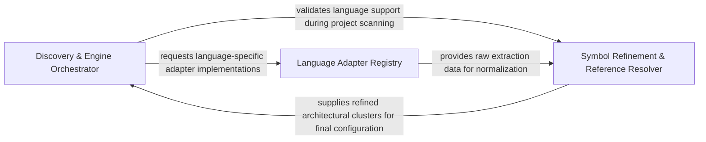

## Details

Central controller that manages the mapping between detected file types and analysis adapters, orchestrating the creation of engine configurations.

### Discovery & Engine Orchestrator
The central controller for the initialization phase. It scans the project root, detects the environment, and manages the high-level logic of creating engine configurations. It acts as the primary driver that delegates specific file-to-adapter mapping and ensures the analysis pipeline has a valid configuration for every detected language.

**Related Classes/Methods**:

- `static_analyzer.__init__._create_engine_configs`:51-148

**Source Files:**

- [`static_analyzer/__init__.py`](https://github.com/CodeBoarding/CodeBoarding/blob/main/.codeboardingstatic_analyzer/__init__.py)
  - `static_analyzer.__init__.EngineConfig` ([L34-L44](https://github.com/CodeBoarding/CodeBoarding/blob/main/.codeboardingstatic_analyzer/__init__.py#L34-L44)) - Class
  - `static_analyzer.__init__._create_engine_configs` ([L51-L148](https://github.com/CodeBoarding/CodeBoarding/blob/main/.codeboardingstatic_analyzer/__init__.py#L51-L148)) - Function
- [`static_analyzer/csharp_config_scanner.py`](https://github.com/CodeBoarding/CodeBoarding/blob/main/.codeboardingstatic_analyzer/csharp_config_scanner.py)
  - `static_analyzer.csharp_config_scanner.CSharpConfigScanner` ([L32-L103](https://github.com/CodeBoarding/CodeBoarding/blob/main/.codeboardingstatic_analyzer/csharp_config_scanner.py#L32-L103)) - Class
- [`static_analyzer/engine/adapters/__init__.py`](https://github.com/CodeBoarding/CodeBoarding/blob/main/.codeboardingstatic_analyzer/engine/adapters/__init__.py)
  - `static_analyzer.engine.adapters.__init__.get_adapter` ([L26-L31](https://github.com/CodeBoarding/CodeBoarding/blob/main/.codeboardingstatic_analyzer/engine/adapters/__init__.py#L26-L31)) - Function
- [`static_analyzer/typescript_config_scanner.py`](https://github.com/CodeBoarding/CodeBoarding/blob/main/.codeboardingstatic_analyzer/typescript_config_scanner.py)
  - `static_analyzer.typescript_config_scanner.TypeScriptConfigScanner` ([L39-L204](https://github.com/CodeBoarding/CodeBoarding/blob/main/.codeboardingstatic_analyzer/typescript_config_scanner.py#L39-L204)) - Class

### Language Adapter Registry
Implements a Factory pattern to manage and provide language-specific analysis implementations. It maintains the registry of supported file extensions and project markers, returning the appropriate adapter (e.g., Python, TypeScript) to the orchestrator. This isolates the discovery logic from the specific parsing requirements of different languages.

**Related Classes/Methods**: _None_

**Source Files:**

- [`static_analyzer/__init__.py`](https://github.com/CodeBoarding/CodeBoarding/blob/main/.codeboardingstatic_analyzer/__init__.py)
  - `static_analyzer.__init__._lang_to_adapter_name` ([L151-L166](https://github.com/CodeBoarding/CodeBoarding/blob/main/.codeboardingstatic_analyzer/__init__.py#L151-L166)) - Function
- [`static_analyzer/java_config_scanner.py`](https://github.com/CodeBoarding/CodeBoarding/blob/main/.codeboardingstatic_analyzer/java_config_scanner.py)
  - `static_analyzer.java_config_scanner.JavaConfigScanner` ([L33-L218](https://github.com/CodeBoarding/CodeBoarding/blob/main/.codeboardingstatic_analyzer/java_config_scanner.py#L33-L218)) - Class
  - `static_analyzer.java_config_scanner.scan_java_projects` ([L221-L232](https://github.com/CodeBoarding/CodeBoarding/blob/main/.codeboardingstatic_analyzer/java_config_scanner.py#L221-L232)) - Function

### Symbol Refinement & Reference Resolver
Responsible for post-processing the raw data extracted by language adapters. It ensures that all discovered entities (classes, methods, functions) have accurate source code references, resolves qualified names (QNames) across the project, and aggregates cluster results into a unified format for the Abstraction Agent.

**Related Classes/Methods**: _None_

**Source Files:**

- [`static_analyzer/engine/adapters/__init__.py`](https://github.com/CodeBoarding/CodeBoarding/blob/main/.codeboardingstatic_analyzer/engine/adapters/__init__.py)
  - `static_analyzer.engine.adapters.__init__.get_all_adapters` ([L34-L36](https://github.com/CodeBoarding/CodeBoarding/blob/main/.codeboardingstatic_analyzer/engine/adapters/__init__.py#L34-L36)) - Function
- [`static_analyzer/programming_language.py`](https://github.com/CodeBoarding/CodeBoarding/blob/main/.codeboardingstatic_analyzer/programming_language.py)
  - `static_analyzer.programming_language.ProgrammingLanguage.is_supported_lang` ([L63-L64](https://github.com/CodeBoarding/CodeBoarding/blob/main/.codeboardingstatic_analyzer/programming_language.py#L63-L64)) - Method

### [FAQ](https://github.com/CodeBoarding/GeneratedOnBoardings/tree/main?tab=readme-ov-file#faq)