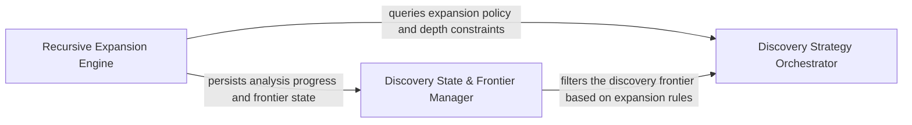

## Details

Implements the strategy for incremental discovery and depth-control, managing the task queue for deep-dive analysis and breaking down complex systems into manageable sub-components.

### Discovery Strategy Orchestrator
Acts as the decision-making layer that evaluates the current architectural state against depth-control policies and coordinates the planning of analysis tasks.

**Related Classes/Methods**:

- `agents.planner_agent.get_expandable_components`:94-117

**Source Files:**

- [`agents/planner_agent.py`](https://github.com/CodeBoarding/CodeBoarding/blob/main/.codeboardingagents/planner_agent.py)
  - `agents.planner_agent.should_expand_component` ([L74-L132](https://github.com/CodeBoarding/CodeBoarding/blob/main/.codeboardingagents/planner_agent.py#L74-L132)) - Function
  - `agents.planner_agent.get_expandable_components` ([L135-L170](https://github.com/CodeBoarding/CodeBoarding/blob/main/.codeboardingagents/planner_agent.py#L135-L170)) - Function

### Recursive Expansion Engine
The execution core responsible for the drill-down logic, triggering abstraction and static analysis workflows to resolve internal sub-structures.

**Related Classes/Methods**:

- `diagram_analysis.diagram_generator.DiagramGenerator.process_component`:144-147

**Source Files:**

- [`diagram_analysis/diagram_generator.py`](https://github.com/CodeBoarding/CodeBoarding/blob/main/.codeboardingdiagram_analysis/diagram_generator.py)
  - `diagram_analysis.diagram_generator.DiagramGenerator.process_component` ([L578-L581](https://github.com/CodeBoarding/CodeBoarding/blob/main/.codeboardingdiagram_analysis/diagram_generator.py#L578-L581)) - Method
  - `diagram_analysis.diagram_generator.DiagramGenerator._process_component` ([L607-L632](https://github.com/CodeBoarding/CodeBoarding/blob/main/.codeboardingdiagram_analysis/diagram_generator.py#L607-L632)) - Method
  - `diagram_analysis.diagram_generator.DiagramGenerator._generate_subcomponents.submit_component` ([L943-L947](https://github.com/CodeBoarding/CodeBoarding/blob/main/.codeboardingdiagram_analysis/diagram_generator.py#L943-L947)) - Function

### Discovery State & Frontier Manager
Manages the persistence of the discovery process, tracking the analysis frontier to ensure incremental progress and avoid redundant processing.

**Related Classes/Methods**:

- `diagram_analysis.io_utils._AnalysisFileStore._compute_expandable_components`:48-53

**Source Files:**

- [`diagram_analysis/io_utils.py`](https://github.com/CodeBoarding/CodeBoarding/blob/main/.codeboardingdiagram_analysis/io_utils.py)
  - `diagram_analysis.io_utils._AnalysisFileStore._compute_expandable_components` ([L50-L55](https://github.com/CodeBoarding/CodeBoarding/blob/main/.codeboardingdiagram_analysis/io_utils.py#L50-L55)) - Method
- [`telemetry/events.py`](https://github.com/CodeBoarding/CodeBoarding/blob/main/.codeboardingtelemetry/events.py)
  - `telemetry.events.track_analysis` ([L160-L222](https://github.com/CodeBoarding/CodeBoarding/blob/main/.codeboardingtelemetry/events.py#L160-L222)) - Function

### [FAQ](https://github.com/CodeBoarding/GeneratedOnBoardings/tree/main?tab=readme-ov-file#faq)