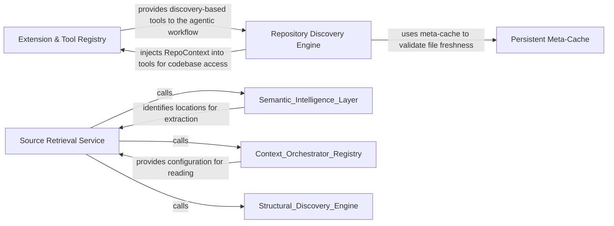

## Details

Acts as the central source of truth, maintaining a registry of plugins and storing scan results in a persistent meta-cache to prevent redundant operations.

### Source Retrieval Service [[Expand]](./Source_Retrieval_Service.md)
Fetches raw source code, documentation, and specific line ranges from the filesystem.

**Related Classes/Methods**:

- `agents.tools.read_file.ReadFileTool`:19-90

**Source Files:**

- [`agents/tools/read_file.py`](https://github.com/CodeBoarding/CodeBoarding/blob/main/.codeboardingagents/tools/read_file.py)
  - `agents.tools.read_file.ReadFileTool.cached_files` ([L31-L33](https://github.com/CodeBoarding/CodeBoarding/blob/main/.codeboardingagents/tools/read_file.py#L31-L33)) - Method
  - `agents.tools.read_file.ReadFileTool._run` ([L35-L90](https://github.com/CodeBoarding/CodeBoarding/blob/main/.codeboardingagents/tools/read_file.py#L35-L90)) - Method
- [`agents/tools/read_file_structure.py`](https://github.com/CodeBoarding/CodeBoarding/blob/main/.codeboardingagents/tools/read_file_structure.py)
  - `agents.tools.read_file_structure.FileStructureTool._run` ([L39-L101](https://github.com/CodeBoarding/CodeBoarding/blob/main/.codeboardingagents/tools/read_file_structure.py#L39-L101)) - Method

### Extension & Tool Registry [[Expand]](./Extension_Tool_Registry.md)
Acts as the central authority for system extensibility, managing the registration, validation, and lookup of tools and plugins.

**Related Classes/Methods**:

- `core.registry.Registry`:12-46
- `core.__init__.Registries`:30-38
- `core.registry.DuplicateRegistrationError`:8-9

**Source Files:**

- [`core/__init__.py`](https://github.com/CodeBoarding/CodeBoarding/blob/main/.codeboardingcore/__init__.py)
  - `core.__init__.Registries.__init__` ([L36-L38](https://github.com/CodeBoarding/CodeBoarding/blob/main/.codeboardingcore/__init__.py#L36-L38)) - Method
- [`core/registry.py`](https://github.com/CodeBoarding/CodeBoarding/blob/main/.codeboardingcore/registry.py)
  - `core.registry.DuplicateRegistrationError` ([L8-L9](https://github.com/CodeBoarding/CodeBoarding/blob/main/.codeboardingcore/registry.py#L8-L9)) - Class
  - `core.registry.Registry` ([L12-L46](https://github.com/CodeBoarding/CodeBoarding/blob/main/.codeboardingcore/registry.py#L12-L46)) - Class
  - `core.registry.Registry.register` ([L24-L29](https://github.com/CodeBoarding/CodeBoarding/blob/main/.codeboardingcore/registry.py#L24-L29)) - Method

### Persistent Meta-Cache [[Expand]](./Persistent_Meta_Cache.md)
Handles the persistence and retrieval of analysis results using a fingerprinting mechanism to enable incremental analysis.

**Related Classes/Methods**:

- `caching.meta_cache.MetaCache`:40-111
- `caching.meta_cache.MetaCacheKey`:29-37
- `utils.fingerprint_file`:63-71
- `caching.cache.ModelSettings`:271-310

**Source Files:**

- [`caching/cache.py`](https://github.com/CodeBoarding/CodeBoarding/blob/main/.codeboardingcaching/cache.py)
  - `caching.cache.ModelSettings.from_chat_model` ([L292-L310](https://github.com/CodeBoarding/CodeBoarding/blob/main/.codeboardingcaching/cache.py#L292-L310)) - Method
- [`caching/meta_cache.py`](https://github.com/CodeBoarding/CodeBoarding/blob/main/.codeboardingcaching/meta_cache.py)
  - `caching.meta_cache.MetaCacheKey` ([L29-L37](https://github.com/CodeBoarding/CodeBoarding/blob/main/.codeboardingcaching/meta_cache.py#L29-L37)) - Class
  - `caching.meta_cache.MetaCache.build_key` ([L71-L94](https://github.com/CodeBoarding/CodeBoarding/blob/main/.codeboardingcaching/meta_cache.py#L71-L94)) - Method
  - `caching.meta_cache.MetaCache._compute_metadata_content_hash` ([L96-L111](https://github.com/CodeBoarding/CodeBoarding/blob/main/.codeboardingcaching/meta_cache.py#L96-L111)) - Method
- [`utils.py`](https://github.com/CodeBoarding/CodeBoarding/blob/main/.codeboardingutils.py)
  - `utils.fingerprint_file` ([L63-L71](https://github.com/CodeBoarding/CodeBoarding/blob/main/.codeboardingutils.py#L63-L71)) - Function

### Repository Discovery Engine [[Expand]](./Repository_Discovery_Engine.md)
Provides a structured, filtered view of the repository's file system and manages directory traversal.

**Related Classes/Methods**:

- `agents.tools.base.RepoContext`:10-54
- `agents.tools.base.RepoContext._perform_walk`:42-54
- `agents.tools.read_file_structure.FileStructureTool`:22-101

**Source Files:**

- [`agents/tools/base.py`](https://github.com/CodeBoarding/CodeBoarding/blob/main/.codeboardingagents/tools/base.py)
  - `agents.tools.base.RepoContext.get_files` ([L25-L29](https://github.com/CodeBoarding/CodeBoarding/blob/main/.codeboardingagents/tools/base.py#L25-L29)) - Method
  - `agents.tools.base.RepoContext.get_directories` ([L31-L35](https://github.com/CodeBoarding/CodeBoarding/blob/main/.codeboardingagents/tools/base.py#L31-L35)) - Method
  - `agents.tools.base.RepoContext._ensure_cache` ([L37-L40](https://github.com/CodeBoarding/CodeBoarding/blob/main/.codeboardingagents/tools/base.py#L37-L40)) - Method
  - `agents.tools.base.RepoContext._perform_walk` ([L42-L54](https://github.com/CodeBoarding/CodeBoarding/blob/main/.codeboardingagents/tools/base.py#L42-L54)) - Method
  - `agents.tools.base.BaseRepoTool.repo_dir` ([L69-L70](https://github.com/CodeBoarding/CodeBoarding/blob/main/.codeboardingagents/tools/base.py#L69-L70)) - Method
  - `agents.tools.base.BaseRepoTool.ignore_manager` ([L73-L74](https://github.com/CodeBoarding/CodeBoarding/blob/main/.codeboardingagents/tools/base.py#L73-L74)) - Method
  - `agents.tools.base.BaseRepoTool.is_subsequence` ([L80-L96](https://github.com/CodeBoarding/CodeBoarding/blob/main/.codeboardingagents/tools/base.py#L80-L96)) - Method
- [`agents/tools/get_external_deps.py`](https://github.com/CodeBoarding/CodeBoarding/blob/main/.codeboardingagents/tools/get_external_deps.py)
  - `agents.tools.get_external_deps.ExternalDepsTool._run` ([L24-L47](https://github.com/CodeBoarding/CodeBoarding/blob/main/.codeboardingagents/tools/get_external_deps.py#L24-L47)) - Method
- [`agents/tools/read_docs.py`](https://github.com/CodeBoarding/CodeBoarding/blob/main/.codeboardingagents/tools/read_docs.py)
  - `agents.tools.read_docs.ReadDocsTool.cached_files` ([L36-L49](https://github.com/CodeBoarding/CodeBoarding/blob/main/.codeboardingagents/tools/read_docs.py#L36-L49)) - Method
  - `agents.tools.read_docs.ReadDocsTool._run` ([L51-L132](https://github.com/CodeBoarding/CodeBoarding/blob/main/.codeboardingagents/tools/read_docs.py#L51-L132)) - Method
- [`agents/tools/read_file.py`](https://github.com/CodeBoarding/CodeBoarding/blob/main/.codeboardingagents/tools/read_file.py)
  - `agents.tools.read_file.ReadFileTool.cached_files` ([L31-L33](https://github.com/CodeBoarding/CodeBoarding/blob/main/.codeboardingagents/tools/read_file.py#L31-L33)) - Method
  - `agents.tools.read_file.ReadFileTool._run` ([L35-L90](https://github.com/CodeBoarding/CodeBoarding/blob/main/.codeboardingagents/tools/read_file.py#L35-L90)) - Method
- [`agents/tools/read_file_structure.py`](https://github.com/CodeBoarding/CodeBoarding/blob/main/.codeboardingagents/tools/read_file_structure.py)
  - `agents.tools.read_file_structure.FileStructureTool.cached_dirs` ([L34-L37](https://github.com/CodeBoarding/CodeBoarding/blob/main/.codeboardingagents/tools/read_file_structure.py#L34-L37)) - Method
  - `agents.tools.read_file_structure.FileStructureTool._run` ([L39-L101](https://github.com/CodeBoarding/CodeBoarding/blob/main/.codeboardingagents/tools/read_file_structure.py#L39-L101)) - Method
  - `agents.tools.read_file_structure.get_tree_string` ([L104-L155](https://github.com/CodeBoarding/CodeBoarding/blob/main/.codeboardingagents/tools/read_file_structure.py#L104-L155)) - Function

### [FAQ](https://github.com/CodeBoarding/GeneratedOnBoardings/tree/main?tab=readme-ov-file#faq)