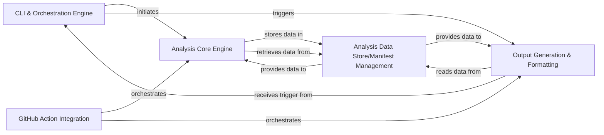

## Details

Transforms the processed analysis data and insights into user-friendly documentation formats (e.g., Markdown, HTML) and generates visual representations like architectural diagrams.

### CLI & Orchestration Engine
Serves as the primary interface and control center for the tool. It handles command-line argument parsing, environment variable validation, and orchestrates the entire workflow, from initiating repository processing to triggering analysis and output generation.

**Related Classes/Methods**:

- <a href="https://github.com/CodeBoarding/CodeBoarding/blob/main/.codeboardingmain.py" target="_blank" rel="noopener noreferrer">`main.generate_analysis`</a>
- <a href="https://github.com/CodeBoarding/CodeBoarding/blob/main/.codeboardingmain.py" target="_blank" rel="noopener noreferrer">`main.partial_update`</a>
- <a href="https://github.com/CodeBoarding/CodeBoarding/blob/main/.codeboardingmain.py" target="_blank" rel="noopener noreferrer">`main.process_local_repository`</a>

### Analysis Core Engine
Executes static code analysis, builds file coverage data, and generates detailed analysis results. It interprets code structure, relationships, and handles incremental updates to the analysis data.

**Related Classes/Methods**:

- <a href="https://github.com/CodeBoarding/CodeBoarding/blob/main/.codeboardingdiagram_analysis/diagram_generator.py" target="_blank" rel="noopener noreferrer">`diagram_analysis.diagram_generator.analyze_repository`</a>

### Analysis Data Store/Manifest Management
Manages the persistent state and metadata of the analysis. It stores the manifest and file coverage information, providing mechanisms for loading, saving, and updating these critical analysis results.

**Related Classes/Methods**:

- <a href="https://github.com/CodeBoarding/CodeBoarding/blob/main/.codeboardingdiagram_analysis/manifest.py" target="_blank" rel="noopener noreferrer">`diagram_analysis.manifest`</a>
- <a href="https://github.com/CodeBoarding/CodeBoarding/blob/main/.codeboardingdiagram_analysis/file_coverage.py" target="_blank" rel="noopener noreferrer">`diagram_analysis.file_coverage`</a>

### Output Generation & Formatting
Transforms the processed analysis data into various user‑friendly documentation formats (HTML, Markdown, MDX, reStructuredText). This component integrates templating capabilities to ensure consistent styling and structure across all generated outputs, encapsulating all format‑specific generators and the common templating engine.

**Related Classes/Methods**:

- <a href="https://github.com/CodeBoarding/CodeBoarding/blob/main/.codeboardingoutput_generators/sphinx.py" target="_blank" rel="noopener noreferrer">`output_generators.sphinx.DiagramGenerator`</a>
- <a href="https://github.com/CodeBoarding/CodeBoarding/blob/main/.codeboardingoutput_generators/sphinx.py" target="_blank" rel="noopener noreferrer">`output_generators.sphinx.MarkdownOutputGenerator`</a>
- <a href="https://github.com/CodeBoarding/CodeBoarding/blob/main/.codeboardingoutput_generators/mdx.py" target="_blank" rel="noopener noreferrer">`output_generators.mdx.MDXOutputGenerator`</a>
- <a href="https://github.com/CodeBoarding/CodeBoarding/blob/main/.codeboardingoutput_generators/sphinx.py" target="_blank" rel="noopener noreferrer">`output_generators.template_utils.TemplateEngine`</a>

### GitHub Action Integration
Provides specific entry points and orchestration logic tailored for execution within GitHub Actions CI/CD pipelines. It handles loading existing analyses and triggering documentation generation within an automated workflow context.

**Related Classes/Methods**:

- <a href="https://github.com/CodeBoarding/CodeBoarding/blob/main/.codeboardinggithub_action.py" target="_blank" rel="noopener noreferrer">`output_generators.github_actions.run_analysis`</a>

### [FAQ](https://github.com/CodeBoarding/GeneratedOnBoardings/tree/main?tab=readme-ov-file#faq)