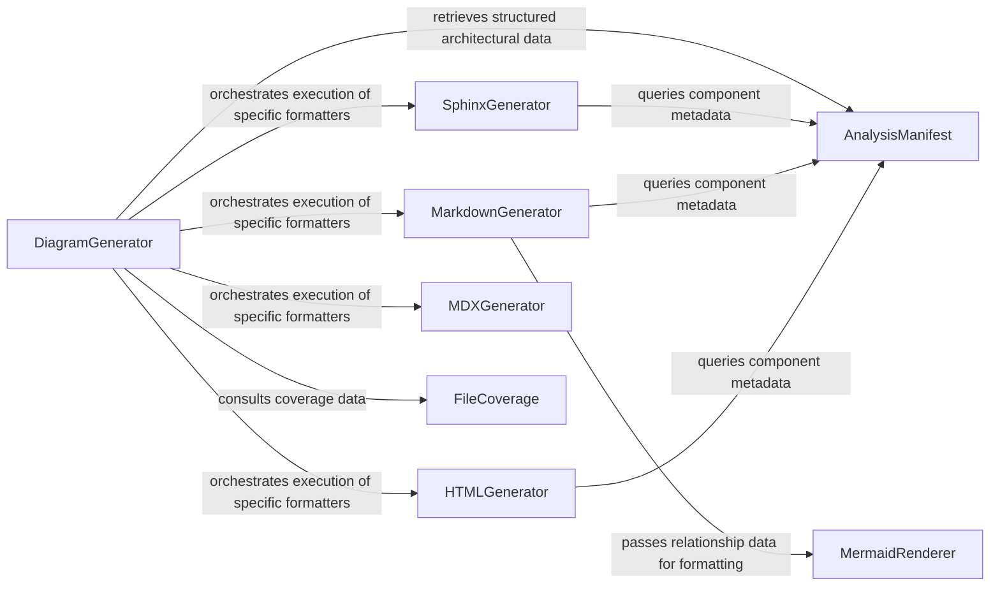

## Details

Transforms the processed analysis data and insights into user-friendly documentation formats (e.g., Markdown, HTML) and generates visual representations like architectural diagrams.

### DiagramGenerator
The central orchestrator of the output phase; coordinates the transformation of CFG data into visual Mermaid diagrams and documentation structures.

**Related Classes/Methods**:

- `output_generators.sphinx.DiagramGenerator`

### AnalysisManifest
The source‑of‑truth data structure containing the hierarchical map of architectural components, relationships, and LLM‑generated insights.

**Related Classes/Methods**:

- `core.manifest.AnalysisManifest`

### SphinxGenerator
Specialized generator that produces reStructuredText and configuration files for integration with the Sphinx documentation framework.

**Related Classes/Methods**:

- `output_generators.sphinx.SphinxGenerator`

### MarkdownGenerator
Transforms analysis data into standard Markdown files, embedding Mermaid.js code blocks for visual representation in Git platforms.

**Related Classes/Methods**:

- `output_generators.sphinx.MarkdownGenerator`

### HTMLGenerator
Produces standalone, interactive HTML reports that allow users to navigate the codebase hierarchy and view diagrams in a browser.

**Related Classes/Methods**:

- `output_generators.html.HTMLGenerator`

### MDXGenerator
Generates React‑compatible Markdown (MDX) files, optimized for modern documentation sites like Docusaurus or Next.js.

**Related Classes/Methods**:

- `output_generators.mdx.MDXGenerator`

### FileCoverage
Tracks which source files have been successfully analyzed and documented, ensuring the output reflects the current state of the repository.

**Related Classes/Methods**:

- `core.coverage.FileCoverage`

### MermaidRenderer
(Logic within DiagramGenerator) Specifically handles the conversion of Control Flow Graph (CFG) nodes and edges into Mermaid.js syntax.

**Related Classes/Methods**:

- `output_generators.sphinx.MermaidRenderer`

### [FAQ](https://github.com/CodeBoarding/GeneratedOnBoardings/tree/main?tab=readme-ov-file#faq)