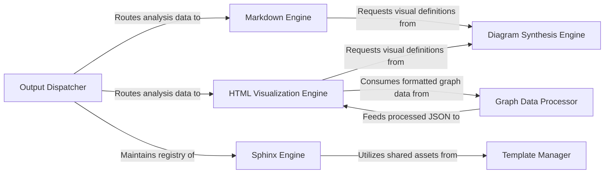

## Details

Transforms the processed analysis data and insights into user-friendly documentation formats (e.g., Markdown, HTML) and generates visual representations like architectural diagrams.

### Output Dispatcher
Acts as the central routing hub that receives structured analysis data from the Orchestrator and delegates it to the appropriate format engine based on user configuration.

**Related Classes/Methods**:

- `repos.codeboarding.output.OutputDispatcher`
- `repos.codeboarding.output.GeneratorRegistry`

### Markdown Engine
Synthesizes GitHub‑flavored Markdown and MDX documentation, handling front‑matter generation and embedding Mermaid.js strings for static rendering.

**Related Classes/Methods**:

- `repos.codeboarding.output.MarkdownOutputGenerator`
- `repos.codeboarding.output.MDXGenerator`
- `repos.codeboarding.output.FrontMatterHandler`

### Sphinx Engine
Transforms analysis results into ReStructuredText (RST) and Sphinx‑compatible directives to ensure compatibility with professional technical manual pipelines.

**Related Classes/Methods**:

- `repos.codeboarding.output.SphinxOutputGenerator`
- `repos.codeboarding.output.RSTDirectiveHandler`

### HTML Visualization Engine
Assembles interactive web reports using HTML/CSS templates and consumes processed graph structures for dynamic visual exploration.

**Related Classes/Methods**:

- `repos.codeboarding.output.HTMLReportGenerator`
- `repos.codeboarding.output.WebViewRenderer`

### Diagram Synthesis Engine
Generates visual definitions (Mermaid, Cytoscape) from structured architectural data, serving as a shared utility for both static and interactive outputs.

**Related Classes/Methods**:

- `repos.codeboarding.output.DiagramGenerator`
- `repos.codeboarding.output.MermaidGenerator`

### Graph Data Processor
Normalizes node and edge data into formats compatible with interactive graph libraries (e.g., Cytoscape JSON).

**Related Classes/Methods**:

- `repos.codeboarding.output.GraphDataProcessor`
- `repos.codeboarding.output.CytoscapeDataFormatter`

### Template Manager
Manages shared assets including CSS, HTML templates, and front‑matter configurations used across different output formats.

**Related Classes/Methods**:

- `repos.codeboarding.output.TemplateManager`
- `repos.codeboarding.output.AssetLoader`

### [FAQ](https://github.com/CodeBoarding/GeneratedOnBoardings/tree/main?tab=readme-ov-file#faq)