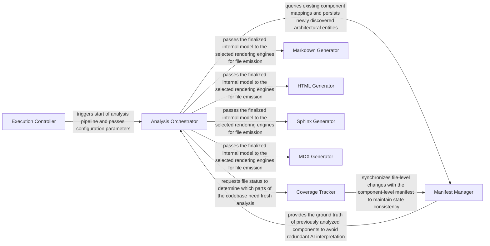

## Details

Transforms the processed analysis data and insights into user-friendly documentation formats (e.g., Markdown, HTML) and generates visual representations like architectural diagrams.

### Execution Controller
The subsystem entry point that validates the environment, parses configuration, and triggers the high-level analysis and rendering pipeline. It acts as the bridge between the user (CLI/GitHub Actions) and the internal logic.

**Related Classes/Methods**:

- <a href="https://github.com/CodeBoarding/CodeBoarding/blob/main/.codeboardingmain.py" target="_blank" rel="noopener noreferrer">`main`</a>
- <a href="https://github.com/CodeBoarding/CodeBoarding/blob/main/.codeboardinggithub_action.py" target="_blank" rel="noopener noreferrer">`github_action`</a>

### Analysis Orchestrator
The central coordinator that manages the analysis lifecycle. It handles the transition from raw repository data to structured architectural models and coordinates incremental updates.

**Related Classes/Methods**:

- <a href="https://github.com/CodeBoarding/CodeBoarding/blob/main/.codeboardingdiagram_analysis/__init__.py" target="_blank" rel="noopener noreferrer">`repos.codeboarding.output.DiagramGenerator`</a>
- <a href="https://github.com/CodeBoarding/CodeBoarding/blob/main/.codeboardingdiagram_analysis/__init__.py" target="_blank" rel="noopener noreferrer">`DiagramGenerator.generate`</a>

### Manifest Manager
Maintains the persistent mapping between source code files and discovered architectural components. It ensures that the analysis is reproducible and consistent across runs.

**Related Classes/Methods**:

- <a href="https://github.com/CodeBoarding/CodeBoarding/blob/main/.codeboardingdiagram_analysis/manifest.py#L24-L67" target="_blank" rel="noopener noreferrer">`AnalysisManifest`:24-67</a>
- <a href="https://github.com/CodeBoarding/CodeBoarding/blob/main/.codeboardingdiagram_analysis/manifest.py" target="_blank" rel="noopener noreferrer">`AnalysisManifest.load`</a>
- <a href="https://github.com/CodeBoarding/CodeBoarding/blob/main/.codeboardingdiagram_analysis/manifest.py" target="_blank" rel="noopener noreferrer">`AnalysisManifest.save`</a>

### Coverage Tracker
Handles change detection and tracks which files require re-analysis. It provides the granularity needed for performance‑optimized incremental builds.

**Related Classes/Methods**:

- <a href="https://github.com/CodeBoarding/CodeBoarding/blob/main/.codeboardingdiagram_analysis/file_coverage.py#L23-L212" target="_blank" rel="noopener noreferrer">`FileCoverage`:23-212</a>
- <a href="https://github.com/CodeBoarding/CodeBoarding/blob/main/.codeboardingdiagram_analysis/file_coverage.py" target="_blank" rel="noopener noreferrer">`FileCoverage.get_status`</a>
- <a href="https://github.com/CodeBoarding/CodeBoarding/blob/main/.codeboardingdiagram_analysis/file_coverage.py" target="_blank" rel="noopener noreferrer">`FileCoverage.update`</a>

### Markdown Generator
Transforms the internal analysis model into static Markdown files, primarily utilizing Mermaid.js for architectural diagrams.

**Related Classes/Methods**:

- <a href="https://github.com/CodeBoarding/CodeBoarding/blob/main/.codeboardingoutput_generators/markdown.py" target="_blank" rel="noopener noreferrer">`repos.codeboarding.output.MarkdownOutputGenerator`</a>
- <a href="https://github.com/CodeBoarding/CodeBoarding/blob/main/.codeboardingoutput_generators/markdown.py" target="_blank" rel="noopener noreferrer">`MarkdownOutputGenerator.render`</a>

### HTML Generator
Produces interactive documentation using Cytoscape.js for dynamic, browser‑based architectural visualizations.

**Related Classes/Methods**:

- <a href="https://github.com/CodeBoarding/CodeBoarding/blob/main/.codeboardingoutput_generators/html.py" target="_blank" rel="noopener noreferrer">`HTMLOutputGenerator`</a>
- <a href="https://github.com/CodeBoarding/CodeBoarding/blob/main/.codeboardingoutput_generators/html.py" target="_blank" rel="noopener noreferrer">`HTMLOutputGenerator.render`</a>

### Sphinx Generator
Generates reStructuredText (RST) files specifically designed for integration into the Sphinx documentation ecosystem.

**Related Classes/Methods**:

- <a href="https://github.com/CodeBoarding/CodeBoarding/blob/main/.codeboardingoutput_generators/sphinx.py" target="_blank" rel="noopener noreferrer">`SphinxOutputGenerator`</a>
- <a href="https://github.com/CodeBoarding/CodeBoarding/blob/main/.codeboardingoutput_generators/sphinx.py" target="_blank" rel="noopener noreferrer">`SphinxOutputGenerator.render`</a>

### MDX Generator
Emits React‑compatible documentation (MDX) with metadata front‑matter for modern web‑based documentation platforms (e.g., Docusaurus).

**Related Classes/Methods**:

- <a href="https://github.com/CodeBoarding/CodeBoarding/blob/main/.codeboardingoutput_generators/mdx.py" target="_blank" rel="noopener noreferrer">`MDXOutputGenerator`</a>
- <a href="https://github.com/CodeBoarding/CodeBoarding/blob/main/.codeboardingoutput_generators/mdx.py" target="_blank" rel="noopener noreferrer">`MDXOutputGenerator.render`</a>

### [FAQ](https://github.com/CodeBoarding/GeneratedOnBoardings/tree/main?tab=readme-ov-file#faq)