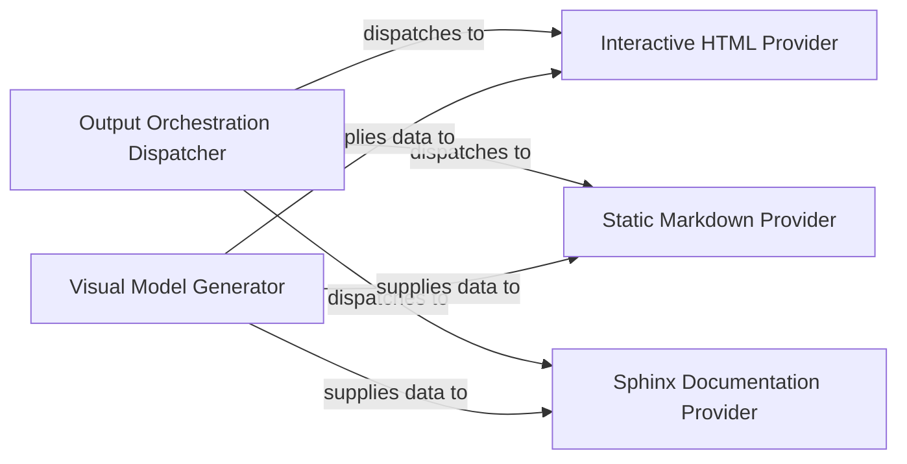

## Details

Transforms the processed analysis data and insights into user-friendly documentation formats (e.g., Markdown, HTML) and generates visual representations like architectural diagrams.

### Output Orchestration Dispatcher
The central controller that receives the final analysis manifest and routes data to the appropriate output generators based on user-defined configurations (e.g., `--format html,markdown`).

**Related Classes/Methods**:

- `repos.codeboarding.output.MultiFormatDocumenter`
- `repos.codeboarding.output.OutputGenerator`

### Visual Model Generator
The engine responsible for translating static analysis relationships into graph‑based syntax. It generates the raw Mermaid.js strings and Cytoscape JSON structures used by the providers.

**Related Classes/Methods**:

- `repos.codeboarding.output.DiagramGenerator`
- `repos.codeboarding.output.MermaidGenerator`

### Interactive HTML Provider
Generates standalone, interactive web documentation. It embeds Cytoscape.js for dynamic diagram manipulation and manages CSS/JS assets for the UI.

**Related Classes/Methods**:

- `repos.codeboarding.output.html.HTMLOutputGenerator`
- `repos.codeboarding.output.html.CytoscapeGenerator`
- `repos.codeboarding.output.html.TemplateEngine`

### Static Markdown Provider
Produces Markdown and MDX files optimized for static hosting (GitHub, Docusaurus). It embeds Mermaid.js code blocks for native rendering.

**Related Classes/Methods**:

- `repos.codeboarding.output.markdown.MarkdownOutputGenerator`
- `repos.codeboarding.output.markdown.MdxOutputGenerator`

### Sphinx Documentation Provider
A specialized generator that produces ReStructuredText (RST) files, allowing the tool's output to be seamlessly integrated into existing Python Sphinx documentation suites.

**Related Classes/Methods**:

- `repos.codeboarding.output.sphinx.SphinxOutputGenerator`
- `repos.codeboarding.output.sphinx.RstGenerator`

### [FAQ](https://github.com/CodeBoarding/GeneratedOnBoardings/tree/main?tab=readme-ov-file#faq)