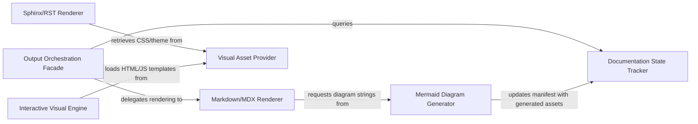

```mermaid
graph LR
    Output_Orchestration_Facade["Output Orchestration Facade"]
    Markdown_MDX_Renderer["Markdown/MDX Renderer"]
    Sphinx_RST_Renderer["Sphinx/RST Renderer"]
    Mermaid_Diagram_Generator["Mermaid Diagram Generator"]
    Interactive_Visual_Engine["Interactive Visual Engine"]
    Visual_Asset_Provider["Visual Asset Provider"]
    Documentation_State_Tracker["Documentation State Tracker"]
    Output_Orchestration_Facade -- "queries" --> Documentation_State_Tracker
    Output_Orchestration_Facade -- "delegates rendering to" --> Markdown_MDX_Renderer
    Markdown_MDX_Renderer -- "requests diagram strings from" --> Mermaid_Diagram_Generator
    Sphinx_RST_Renderer -- "retrieves CSS/theme from" --> Visual_Asset_Provider
    Interactive_Visual_Engine -- "loads HTML/JS templates from" --> Visual_Asset_Provider
    Mermaid_Diagram_Generator -- "updates manifest with generated assets" --> Documentation_State_Tracker
```

## Details

Transforms the processed analysis data and insights into user-friendly documentation formats (e.g., Markdown, HTML) and generates visual representations like architectural diagrams.

### Output Orchestration Facade
The central coordinator that selects and invokes specific renderers based on user configuration (Markdown, HTML, etc.) and queries the Documentation State Tracker for stale components.

**Related Classes/Methods**:

- `output_generators.sphinx.OutputOrchestrationFacade`

### Markdown/MDX Renderer
Transforms analysis insights into GitHub‑flavored Markdown and MDX for documentation portals, embedding diagram strings from the Mermaid Diagram Generator.

**Related Classes/Methods**:

- `output_generators.sphinx.MarkdownRenderer`

### Sphinx/RST Renderer
Generates reStructuredText files and integrates with the Sphinx documentation framework, pulling styling assets from the Visual Asset Provider.

**Related Classes/Methods**:

- `output_generators.sphinx.SphinxRenderer`

### Mermaid Diagram Generator
Translates graph‑based metadata into Mermaid.js syntax for architectural and flow diagrams, updating the manifest with generated assets.

**Related Classes/Methods**:

- `output_generators.sphinx.MermaidGenerator`

### Interactive Visual Engine
Populates HTML templates with scripts and raw graph data for interactive visualizations (e.g., Cytoscape).

**Related Classes/Methods**:

- `output_generators.sphinx.InteractiveEngine`

### Visual Asset Provider
Manages CSS, styling assets, and static templates required for consistent visual output across renderers.

**Related Classes/Methods**:

- `output_generators.sphinx.VisualAssetProvider`

### Documentation State Tracker
Interfaces with the Analysis Manifest to ensure incremental documentation updates and tracks file coverage, preventing redundant processing.

**Related Classes/Methods**:

- `output_generators.sphinx.DocumentationStateTracker`

### [FAQ](https://github.com/CodeBoarding/GeneratedOnBoardings/tree/main?tab=readme-ov-file#faq)