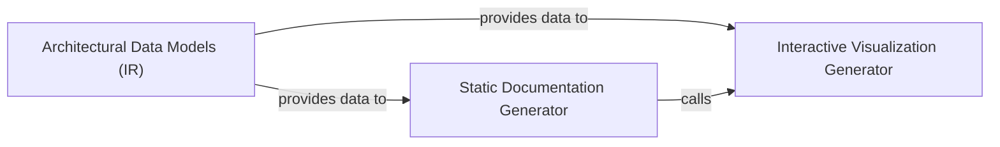

## Details

Transforms synthesized architectural data into user-facing outputs such as Mermaid diagrams, Markdown docs, and interactive HTML visualizations.

### Architectural Data Models (IR)
Defines the core schema and semantic vocabulary used to represent architectural insights. It acts as the Intermediate Representation (IR) that decouples analysis logic from output generation, ensuring all generators operate on a consistent data structure.

**Related Classes/Methods**:

- `agents.agent_responses.AnalysisInsights`:243-267
- `agents.agent_responses.Component`:196-240
- `agents.agent_responses.Relation`:90-102
- `static_analyzer.constants.NodeType`:57-108

**Source Files:**

- [`agents/agent_responses.py`](https://github.com/CodeBoarding/CodeBoarding/blob/main/.codeboardingagents/agent_responses.py)
  - `agents.agent_responses.LLMBaseModel` ([L14-L45](https://github.com/CodeBoarding/CodeBoarding/blob/main/.codeboardingagents/agent_responses.py#L14-L45)) - Class
  - `agents.agent_responses.LLMBaseModel.llm_str` ([L18-L19](https://github.com/CodeBoarding/CodeBoarding/blob/main/.codeboardingagents/agent_responses.py#L18-L19)) - Method
  - `agents.agent_responses.LLMBaseModel.extractor_str` ([L22-L45](https://github.com/CodeBoarding/CodeBoarding/blob/main/.codeboardingagents/agent_responses.py#L22-L45)) - Method
  - `agents.agent_responses.SourceCodeReference` ([L48-L87](https://github.com/CodeBoarding/CodeBoarding/blob/main/.codeboardingagents/agent_responses.py#L48-L87)) - Class
  - `agents.agent_responses.Relation` ([L90-L102](https://github.com/CodeBoarding/CodeBoarding/blob/main/.codeboardingagents/agent_responses.py#L90-L102)) - Class
  - `agents.agent_responses.Relation.llm_str` ([L101-L102](https://github.com/CodeBoarding/CodeBoarding/blob/main/.codeboardingagents/agent_responses.py#L101-L102)) - Method
  - `agents.agent_responses.ClustersComponent` ([L105-L120](https://github.com/CodeBoarding/CodeBoarding/blob/main/.codeboardingagents/agent_responses.py#L105-L120)) - Class
  - `agents.agent_responses.ClustersComponent.llm_str` ([L118-L120](https://github.com/CodeBoarding/CodeBoarding/blob/main/.codeboardingagents/agent_responses.py#L118-L120)) - Method
  - `agents.agent_responses.ClusterAnalysis` ([L123-L135](https://github.com/CodeBoarding/CodeBoarding/blob/main/.codeboardingagents/agent_responses.py#L123-L135)) - Class
  - `agents.agent_responses.ClusterAnalysis.llm_str` ([L130-L135](https://github.com/CodeBoarding/CodeBoarding/blob/main/.codeboardingagents/agent_responses.py#L130-L135)) - Method
  - `agents.agent_responses.MethodEntry` ([L138-L166](https://github.com/CodeBoarding/CodeBoarding/blob/main/.codeboardingagents/agent_responses.py#L138-L166)) - Class
  - `agents.agent_responses.MethodEntry.__hash__` ([L150-L151](https://github.com/CodeBoarding/CodeBoarding/blob/main/.codeboardingagents/agent_responses.py#L150-L151)) - Method
  - `agents.agent_responses.MethodEntry.__eq__` ([L153-L156](https://github.com/CodeBoarding/CodeBoarding/blob/main/.codeboardingagents/agent_responses.py#L153-L156)) - Method
  - `agents.agent_responses.MethodEntry.from_method_change` ([L159-L166](https://github.com/CodeBoarding/CodeBoarding/blob/main/.codeboardingagents/agent_responses.py#L159-L166)) - Method
  - `agents.agent_responses.FileMethodGroup` ([L169-L180](https://github.com/CodeBoarding/CodeBoarding/blob/main/.codeboardingagents/agent_responses.py#L169-L180)) - Class
  - `agents.agent_responses.FileEntry` ([L183-L193](https://github.com/CodeBoarding/CodeBoarding/blob/main/.codeboardingagents/agent_responses.py#L183-L193)) - Class
  - `agents.agent_responses.Component` ([L196-L240](https://github.com/CodeBoarding/CodeBoarding/blob/main/.codeboardingagents/agent_responses.py#L196-L240)) - Class
  - `agents.agent_responses.Component.llm_str` ([L230-L240](https://github.com/CodeBoarding/CodeBoarding/blob/main/.codeboardingagents/agent_responses.py#L230-L240)) - Method
  - `agents.agent_responses.AnalysisInsights` ([L243-L267](https://github.com/CodeBoarding/CodeBoarding/blob/main/.codeboardingagents/agent_responses.py#L243-L267)) - Class
  - `agents.agent_responses.AnalysisInsights.llm_str` ([L257-L263](https://github.com/CodeBoarding/CodeBoarding/blob/main/.codeboardingagents/agent_responses.py#L257-L263)) - Method
  - `agents.agent_responses.AnalysisInsights.file_to_component` ([L265-L267](https://github.com/CodeBoarding/CodeBoarding/blob/main/.codeboardingagents/agent_responses.py#L265-L267)) - Method
  - `agents.agent_responses.assign_component_ids` ([L270-L296](https://github.com/CodeBoarding/CodeBoarding/blob/main/.codeboardingagents/agent_responses.py#L270-L296)) - Function
  - `agents.agent_responses.CFGComponent` ([L299-L315](https://github.com/CodeBoarding/CodeBoarding/blob/main/.codeboardingagents/agent_responses.py#L299-L315)) - Class
  - `agents.agent_responses.CFGComponent.llm_str` ([L308-L315](https://github.com/CodeBoarding/CodeBoarding/blob/main/.codeboardingagents/agent_responses.py#L308-L315)) - Method
  - `agents.agent_responses.CFGAnalysisInsights` ([L318-L330](https://github.com/CodeBoarding/CodeBoarding/blob/main/.codeboardingagents/agent_responses.py#L318-L330)) - Class
  - `agents.agent_responses.CFGAnalysisInsights.llm_str` ([L324-L330](https://github.com/CodeBoarding/CodeBoarding/blob/main/.codeboardingagents/agent_responses.py#L324-L330)) - Method
  - `agents.agent_responses.ExpandComponent` ([L333-L340](https://github.com/CodeBoarding/CodeBoarding/blob/main/.codeboardingagents/agent_responses.py#L333-L340)) - Class
  - `agents.agent_responses.ExpandComponent.llm_str` ([L339-L340](https://github.com/CodeBoarding/CodeBoarding/blob/main/.codeboardingagents/agent_responses.py#L339-L340)) - Method
  - `agents.agent_responses.ValidationInsights` ([L343-L353](https://github.com/CodeBoarding/CodeBoarding/blob/main/.codeboardingagents/agent_responses.py#L343-L353)) - Class
  - `agents.agent_responses.ValidationInsights.llm_str` ([L352-L353](https://github.com/CodeBoarding/CodeBoarding/blob/main/.codeboardingagents/agent_responses.py#L352-L353)) - Method
  - `agents.agent_responses.UpdateAnalysis` ([L356-L365](https://github.com/CodeBoarding/CodeBoarding/blob/main/.codeboardingagents/agent_responses.py#L356-L365)) - Class
  - `agents.agent_responses.UpdateAnalysis.llm_str` ([L364-L365](https://github.com/CodeBoarding/CodeBoarding/blob/main/.codeboardingagents/agent_responses.py#L364-L365)) - Method
  - `agents.agent_responses.MetaAnalysisInsights` ([L368-L394](https://github.com/CodeBoarding/CodeBoarding/blob/main/.codeboardingagents/agent_responses.py#L368-L394)) - Class
  - `agents.agent_responses.MetaAnalysisInsights.llm_str` ([L384-L394](https://github.com/CodeBoarding/CodeBoarding/blob/main/.codeboardingagents/agent_responses.py#L384-L394)) - Method
  - `agents.agent_responses.FileClassification` ([L397-L404](https://github.com/CodeBoarding/CodeBoarding/blob/main/.codeboardingagents/agent_responses.py#L397-L404)) - Class
  - `agents.agent_responses.FileClassification.llm_str` ([L403-L404](https://github.com/CodeBoarding/CodeBoarding/blob/main/.codeboardingagents/agent_responses.py#L403-L404)) - Method
  - `agents.agent_responses.ComponentFiles` ([L407-L419](https://github.com/CodeBoarding/CodeBoarding/blob/main/.codeboardingagents/agent_responses.py#L407-L419)) - Class
  - `agents.agent_responses.ComponentFiles.llm_str` ([L414-L419](https://github.com/CodeBoarding/CodeBoarding/blob/main/.codeboardingagents/agent_responses.py#L414-L419)) - Method
  - `agents.agent_responses.FilePath` ([L422-L436](https://github.com/CodeBoarding/CodeBoarding/blob/main/.codeboardingagents/agent_responses.py#L422-L436)) - Class
  - `agents.agent_responses.FilePath.llm_str` ([L435-L436](https://github.com/CodeBoarding/CodeBoarding/blob/main/.codeboardingagents/agent_responses.py#L435-L436)) - Method
- [`static_analyzer/constants.py`](https://github.com/CodeBoarding/CodeBoarding/blob/main/.codeboardingstatic_analyzer/constants.py)
  - `static_analyzer.constants.Language` ([L10-L26](https://github.com/CodeBoarding/CodeBoarding/blob/main/.codeboardingstatic_analyzer/constants.py#L10-L26)) - Class
  - `static_analyzer.constants.ClusteringConfig` ([L29-L54](https://github.com/CodeBoarding/CodeBoarding/blob/main/.codeboardingstatic_analyzer/constants.py#L29-L54)) - Class
  - `static_analyzer.constants.NodeType` ([L57-L108](https://github.com/CodeBoarding/CodeBoarding/blob/main/.codeboardingstatic_analyzer/constants.py#L57-L108)) - Class

### Interactive Visualization Generator
Generates dynamic, web-based architectural maps by transforming the IR into Cytoscape.js-compatible JSON and injecting it into HTML templates to allow interactive exploration of component dependencies and hierarchies.

**Related Classes/Methods**:

- `output_generators.html.generate_html_file`:128-152
- `output_generators.html.generate_cytoscape_data`:10-56
- `output_generators.html_template.populate_html_template`:360-382

**Source Files:**

- [`agents/agent_responses.py`](https://github.com/CodeBoarding/CodeBoarding/blob/main/.codeboardingagents/agent_responses.py)
  - `agents.agent_responses.SourceCodeReference.llm_str` ([L69-L77](https://github.com/CodeBoarding/CodeBoarding/blob/main/.codeboardingagents/agent_responses.py#L69-L77)) - Method
  - `agents.agent_responses.SourceCodeReference.__str__` ([L79-L87](https://github.com/CodeBoarding/CodeBoarding/blob/main/.codeboardingagents/agent_responses.py#L79-L87)) - Method
- [`output_generators/html.py`](https://github.com/CodeBoarding/CodeBoarding/blob/main/.codeboardingoutput_generators/html.py)
  - `output_generators.html.generate_cytoscape_data` ([L10-L56](https://github.com/CodeBoarding/CodeBoarding/blob/main/.codeboardingoutput_generators/html.py#L10-L56)) - Function
  - `output_generators.html.generate_html` ([L59-L125](https://github.com/CodeBoarding/CodeBoarding/blob/main/.codeboardingoutput_generators/html.py#L59-L125)) - Function
  - `output_generators.html.generate_html_file` ([L128-L152](https://github.com/CodeBoarding/CodeBoarding/blob/main/.codeboardingoutput_generators/html.py#L128-L152)) - Function
  - `output_generators.html.component_header_html` ([L155-L163](https://github.com/CodeBoarding/CodeBoarding/blob/main/.codeboardingoutput_generators/html.py#L155-L163)) - Function
- [`output_generators/html_template.py`](https://github.com/CodeBoarding/CodeBoarding/blob/main/.codeboardingoutput_generators/html_template.py)
  - `output_generators.html_template._generate_css_styles` ([L4-L86](https://github.com/CodeBoarding/CodeBoarding/blob/main/.codeboardingoutput_generators/html_template.py#L4-L86)) - Function
  - `output_generators.html_template._generate_html_body` ([L89-L119](https://github.com/CodeBoarding/CodeBoarding/blob/main/.codeboardingoutput_generators/html_template.py#L89-L119)) - Function
  - `output_generators.html_template._get_library_checks` ([L122-L142](https://github.com/CodeBoarding/CodeBoarding/blob/main/.codeboardingoutput_generators/html_template.py#L122-L142)) - Function
  - `output_generators.html_template._get_dagre_registration` ([L145-L156](https://github.com/CodeBoarding/CodeBoarding/blob/main/.codeboardingoutput_generators/html_template.py#L145-L156)) - Function
  - `output_generators.html_template._get_cytoscape_style` ([L159-L218](https://github.com/CodeBoarding/CodeBoarding/blob/main/.codeboardingoutput_generators/html_template.py#L159-L218)) - Function
  - `output_generators.html_template._get_layout_config` ([L221-L232](https://github.com/CodeBoarding/CodeBoarding/blob/main/.codeboardingoutput_generators/html_template.py#L221-L232)) - Function
  - `output_generators.html_template._get_event_handlers` ([L235-L282](https://github.com/CodeBoarding/CodeBoarding/blob/main/.codeboardingoutput_generators/html_template.py#L235-L282)) - Function
  - `output_generators.html_template._get_control_functions` ([L285-L311](https://github.com/CodeBoarding/CodeBoarding/blob/main/.codeboardingoutput_generators/html_template.py#L285-L311)) - Function
  - `output_generators.html_template._generate_cytoscape_script` ([L314-L357](https://github.com/CodeBoarding/CodeBoarding/blob/main/.codeboardingoutput_generators/html_template.py#L314-L357)) - Function
  - `output_generators.html_template.populate_html_template` ([L360-L382](https://github.com/CodeBoarding/CodeBoarding/blob/main/.codeboardingoutput_generators/html_template.py#L360-L382)) - Function

### Static Documentation Generator
Produces static documentation files optimized for version control and developer portals by converting architectural relationships into Mermaid.js syntax and wrapping them in Markdown/MDX files.

**Related Classes/Methods**:

- `output_generators.markdown.generate_markdown_file`:125-146
- `output_generators.mdx.generate_mdx_file`:161-183
- `output_generators.markdown.generated_mermaid_str`:9-40

**Source Files:**

- [`output_generators/markdown.py`](https://github.com/CodeBoarding/CodeBoarding/blob/main/.codeboardingoutput_generators/markdown.py)
  - `output_generators.markdown.generated_mermaid_str` ([L9-L40](https://github.com/CodeBoarding/CodeBoarding/blob/main/.codeboardingoutput_generators/markdown.py#L9-L40)) - Function
  - `output_generators.markdown.generate_markdown` ([L43-L122](https://github.com/CodeBoarding/CodeBoarding/blob/main/.codeboardingoutput_generators/markdown.py#L43-L122)) - Function
  - `output_generators.markdown.generate_markdown_file` ([L125-L146](https://github.com/CodeBoarding/CodeBoarding/blob/main/.codeboardingoutput_generators/markdown.py#L125-L146)) - Function
  - `output_generators.markdown.component_header` ([L149-L157](https://github.com/CodeBoarding/CodeBoarding/blob/main/.codeboardingoutput_generators/markdown.py#L149-L157)) - Function
- [`output_generators/mdx.py`](https://github.com/CodeBoarding/CodeBoarding/blob/main/.codeboardingoutput_generators/mdx.py)
  - `output_generators.mdx.generated_mermaid_str` ([L8-L35](https://github.com/CodeBoarding/CodeBoarding/blob/main/.codeboardingoutput_generators/mdx.py#L8-L35)) - Function
  - `output_generators.mdx.generate_frontmatter` ([L38-L49](https://github.com/CodeBoarding/CodeBoarding/blob/main/.codeboardingoutput_generators/mdx.py#L38-L49)) - Function
  - `output_generators.mdx.generate_mdx` ([L52-L158](https://github.com/CodeBoarding/CodeBoarding/blob/main/.codeboardingoutput_generators/mdx.py#L52-L158)) - Function
  - `output_generators.mdx.generate_mdx_file` ([L161-L183](https://github.com/CodeBoarding/CodeBoarding/blob/main/.codeboardingoutput_generators/mdx.py#L161-L183)) - Function
  - `output_generators.mdx.component_header` ([L186-L194](https://github.com/CodeBoarding/CodeBoarding/blob/main/.codeboardingoutput_generators/mdx.py#L186-L194)) - Function
- [`static_analyzer/constants.py`](https://github.com/CodeBoarding/CodeBoarding/blob/main/.codeboardingstatic_analyzer/constants.py)
  - `static_analyzer.constants.NodeType.label` ([L94-L96](https://github.com/CodeBoarding/CodeBoarding/blob/main/.codeboardingstatic_analyzer/constants.py#L94-L96)) - Method
  - `static_analyzer.constants.NodeType.from_name` ([L99-L108](https://github.com/CodeBoarding/CodeBoarding/blob/main/.codeboardingstatic_analyzer/constants.py#L99-L108)) - Method

### [FAQ](https://github.com/CodeBoarding/GeneratedOnBoardings/tree/main?tab=readme-ov-file#faq)