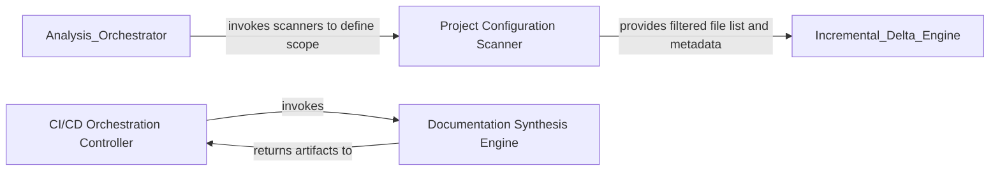

## Details

Handles the 'Output' phase by transforming internal analysis artifacts into user-facing documentation and providing CI/CD integration.

### Project Configuration Scanner
Handles the discovery of language-specific project structures and respects repository-level ignore rules.

**Related Classes/Methods**:

- `repo_utils.ignore.RepoIgnoreManager`:164-329
- `static_analyzer.csharp_config_scanner.CSharpConfigScanner`:32-103
- `static_analyzer.typescript_config_scanner.TypeScriptConfigScanner`:39-204

**Source Files:**

- [`repo_utils/ignore.py`](https://github.com/CodeBoarding/CodeBoarding/blob/main/.codeboardingrepo_utils/ignore.py)
  - `repo_utils.ignore.RepoIgnoreManager` ([L164-L329](https://github.com/CodeBoarding/CodeBoarding/blob/main/.codeboardingrepo_utils/ignore.py#L164-L329)) - Class
- [`static_analyzer/csharp_config_scanner.py`](https://github.com/CodeBoarding/CodeBoarding/blob/main/.codeboardingstatic_analyzer/csharp_config_scanner.py)
  - `static_analyzer.csharp_config_scanner.CSharpConfigScanner.__init__` ([L45-L47](https://github.com/CodeBoarding/CodeBoarding/blob/main/.codeboardingstatic_analyzer/csharp_config_scanner.py#L45-L47)) - Method
- [`static_analyzer/java_config_scanner.py`](https://github.com/CodeBoarding/CodeBoarding/blob/main/.codeboardingstatic_analyzer/java_config_scanner.py)
  - `static_analyzer.java_config_scanner.JavaConfigScanner.__init__` ([L35-L37](https://github.com/CodeBoarding/CodeBoarding/blob/main/.codeboardingstatic_analyzer/java_config_scanner.py#L35-L37)) - Method
- [`static_analyzer/typescript_config_scanner.py`](https://github.com/CodeBoarding/CodeBoarding/blob/main/.codeboardingstatic_analyzer/typescript_config_scanner.py)
  - `static_analyzer.typescript_config_scanner.TypeScriptConfigScanner.__init__` ([L44-L46](https://github.com/CodeBoarding/CodeBoarding/blob/main/.codeboardingstatic_analyzer/typescript_config_scanner.py#L44-L46)) - Method

### CI/CD Orchestration Controller
Acts as the primary entry point for the subsystem, managing the execution environment, handling file system I/O, and sequencing the transition from analysis to documentation generation.

**Related Classes/Methods**:

- `github_action.generate_analysis`:87-131

**Source Files:**

- [`codeboarding_workflows/rendering.py`](https://github.com/CodeBoarding/CodeBoarding/blob/main/.codeboardingcodeboarding_workflows/rendering.py)
  - `codeboarding_workflows.rendering.render_docs` ([L57-L92](https://github.com/CodeBoarding/CodeBoarding/blob/main/.codeboardingcodeboarding_workflows/rendering.py#L57-L92)) - Function
- [`github_action.py`](https://github.com/CodeBoarding/CodeBoarding/blob/main/.codeboardinggithub_action.py)
  - `github_action.generate_html` ([L32-L41](https://github.com/CodeBoarding/CodeBoarding/blob/main/.codeboardinggithub_action.py#L32-L41)) - Function
  - `github_action.generate_mdx` ([L44-L58](https://github.com/CodeBoarding/CodeBoarding/blob/main/.codeboardinggithub_action.py#L44-L58)) - Function
  - `github_action._seed_existing_analysis` ([L78-L84](https://github.com/CodeBoarding/CodeBoarding/blob/main/.codeboardinggithub_action.py#L78-L84)) - Function
- [`repo_utils/__init__.py`](https://github.com/CodeBoarding/CodeBoarding/blob/main/.codeboardingrepo_utils/__init__.py)
  - `repo_utils.__init__.checkout_repo` ([L126-L133](https://github.com/CodeBoarding/CodeBoarding/blob/main/.codeboardingrepo_utils/__init__.py#L126-L133)) - Function

### Documentation Synthesis Engine
Transforms internal analysis artifacts and LLM-generated insights into human-readable Markdown files and Mermaid.js diagrams.

**Related Classes/Methods**:

- `codeboarding_workflows.rendering.render_docs`:57-92
- `codeboarding_workflows.rendering._load_entries`:34-54
- `diagram_analysis.analysis_json.build_id_to_name_map`:459-465

**Source Files:**

- [`codeboarding_workflows/rendering.py`](https://github.com/CodeBoarding/CodeBoarding/blob/main/.codeboardingcodeboarding_workflows/rendering.py)
  - `codeboarding_workflows.rendering._load_entries` ([L34-L54](https://github.com/CodeBoarding/CodeBoarding/blob/main/.codeboardingcodeboarding_workflows/rendering.py#L34-L54)) - Function
- [`diagram_analysis/analysis_json.py`](https://github.com/CodeBoarding/CodeBoarding/blob/main/.codeboardingdiagram_analysis/analysis_json.py)
  - `diagram_analysis.analysis_json.build_id_to_name_map` ([L459-L465](https://github.com/CodeBoarding/CodeBoarding/blob/main/.codeboardingdiagram_analysis/analysis_json.py#L459-L465)) - Function
- [`github_action.py`](https://github.com/CodeBoarding/CodeBoarding/blob/main/.codeboardinggithub_action.py)
  - `github_action.generate_markdown` ([L15-L29](https://github.com/CodeBoarding/CodeBoarding/blob/main/.codeboardinggithub_action.py#L15-L29)) - Function
  - `github_action.generate_rst` ([L61-L75](https://github.com/CodeBoarding/CodeBoarding/blob/main/.codeboardinggithub_action.py#L61-L75)) - Function
  - `github_action.generate_analysis` ([L87-L131](https://github.com/CodeBoarding/CodeBoarding/blob/main/.codeboardinggithub_action.py#L87-L131)) - Function

### [FAQ](https://github.com/CodeBoarding/GeneratedOnBoardings/tree/main?tab=readme-ov-file#faq)