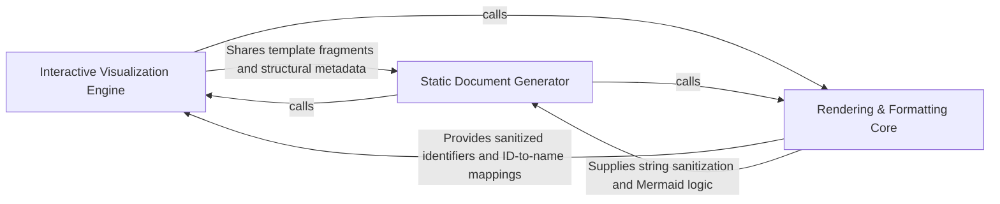

## Details

Presentation layer that transforms analysis models into human-readable formats like Mermaid diagrams and HTML/Markdown documentation.

### Interactive Visualization Engine
Orchestrates the creation of dynamic, browser-based documentation using Cytoscape.js for interactive graph explorations.

**Related Classes/Methods**:

- `output_generators.html.generate_html`:59-125
- `output_generators.html_template.populate_html_template`:360-382
- `output_generators.html_template._generate_cytoscape_script`:314-357
- `output_generators.html_template._get_layout_config`:221-232

**Source Files:**

- [`agents/agent_responses.py`](https://github.com/CodeBoarding/CodeBoarding/blob/main/.codeboardingagents/agent_responses.py)
  - `agents.agent_responses.SourceCodeReference.llm_str` ([L148-L156](https://github.com/CodeBoarding/CodeBoarding/blob/main/.codeboardingagents/agent_responses.py#L148-L156)) - Method
- [`output_generators/html.py`](https://github.com/CodeBoarding/CodeBoarding/blob/main/.codeboardingoutput_generators/html.py)
  - `output_generators.html.generate_cytoscape_data` ([L10-L56](https://github.com/CodeBoarding/CodeBoarding/blob/main/.codeboardingoutput_generators/html.py#L10-L56)) - Function
  - `output_generators.html.generate_html` ([L59-L125](https://github.com/CodeBoarding/CodeBoarding/blob/main/.codeboardingoutput_generators/html.py#L59-L125)) - Function
  - `output_generators.html.generate_html_file` ([L128-L152](https://github.com/CodeBoarding/CodeBoarding/blob/main/.codeboardingoutput_generators/html.py#L128-L152)) - Function
- [`output_generators/html_template.py`](https://github.com/CodeBoarding/CodeBoarding/blob/main/.codeboardingoutput_generators/html_template.py)
  - `output_generators.html_template._generate_css_styles` ([L4-L86](https://github.com/CodeBoarding/CodeBoarding/blob/main/.codeboardingoutput_generators/html_template.py#L4-L86)) - Function
  - `output_generators.html_template._generate_html_body` ([L89-L119](https://github.com/CodeBoarding/CodeBoarding/blob/main/.codeboardingoutput_generators/html_template.py#L89-L119)) - Function
  - `output_generators.html_template._get_library_checks` ([L122-L142](https://github.com/CodeBoarding/CodeBoarding/blob/main/.codeboardingoutput_generators/html_template.py#L122-L142)) - Function
  - `output_generators.html_template._get_dagre_registration` ([L145-L156](https://github.com/CodeBoarding/CodeBoarding/blob/main/.codeboardingoutput_generators/html_template.py#L145-L156)) - Function
  - `output_generators.html_template._get_cytoscape_style` ([L159-L218](https://github.com/CodeBoarding/CodeBoarding/blob/main/.codeboardingoutput_generators/html_template.py#L159-L218)) - Function
  - `output_generators.html_template._get_layout_config` ([L221-L232](https://github.com/CodeBoarding/CodeBoarding/blob/main/.codeboardingoutput_generators/html_template.py#L221-L232)) - Function
  - `output_generators.html_template._get_event_handlers` ([L235-L282](https://github.com/CodeBoarding/CodeBoarding/blob/main/.codeboardingoutput_generators/html_template.py#L235-L282)) - Function
  - `output_generators.html_template._get_control_functions` ([L285-L311](https://github.com/CodeBoarding/CodeBoarding/blob/main/.codeboardingoutput_generators/html_template.py#L285-L311)) - Function
  - `output_generators.html_template._generate_cytoscape_script` ([L314-L357](https://github.com/CodeBoarding/CodeBoarding/blob/main/.codeboardingoutput_generators/html_template.py#L314-L357)) - Function
  - `output_generators.html_template.populate_html_template` ([L360-L382](https://github.com/CodeBoarding/CodeBoarding/blob/main/.codeboardingoutput_generators/html_template.py#L360-L382)) - Function

### Static Document Generator
Manages the transformation of analysis data into text-based formats like Markdown, MDX, and Sphinx, including Mermaid.js diagram generation.

**Related Classes/Methods**:

- `output_generators.markdown.generate_markdown`:43-122
- `output_generators.markdown.generated_mermaid_str`:9-40
- `output_generators.mdx.generate_mdx`:52-158
- `output_generators.sphinx.generate_rst`:46-155

**Source Files:**

- [`output_generators/markdown.py`](https://github.com/CodeBoarding/CodeBoarding/blob/main/.codeboardingoutput_generators/markdown.py)
  - `output_generators.markdown.generated_mermaid_str` ([L9-L40](https://github.com/CodeBoarding/CodeBoarding/blob/main/.codeboardingoutput_generators/markdown.py#L9-L40)) - Function
  - `output_generators.markdown.generate_markdown` ([L43-L122](https://github.com/CodeBoarding/CodeBoarding/blob/main/.codeboardingoutput_generators/markdown.py#L43-L122)) - Function
  - `output_generators.markdown.generate_markdown_file` ([L125-L146](https://github.com/CodeBoarding/CodeBoarding/blob/main/.codeboardingoutput_generators/markdown.py#L125-L146)) - Function
  - `output_generators.markdown.component_header` ([L149-L157](https://github.com/CodeBoarding/CodeBoarding/blob/main/.codeboardingoutput_generators/markdown.py#L149-L157)) - Function
- [`output_generators/mdx.py`](https://github.com/CodeBoarding/CodeBoarding/blob/main/.codeboardingoutput_generators/mdx.py)
  - `output_generators.mdx.generated_mermaid_str` ([L8-L35](https://github.com/CodeBoarding/CodeBoarding/blob/main/.codeboardingoutput_generators/mdx.py#L8-L35)) - Function
  - `output_generators.mdx.generate_frontmatter` ([L38-L49](https://github.com/CodeBoarding/CodeBoarding/blob/main/.codeboardingoutput_generators/mdx.py#L38-L49)) - Function
  - `output_generators.mdx.generate_mdx` ([L52-L158](https://github.com/CodeBoarding/CodeBoarding/blob/main/.codeboardingoutput_generators/mdx.py#L52-L158)) - Function
  - `output_generators.mdx.generate_mdx_file` ([L161-L183](https://github.com/CodeBoarding/CodeBoarding/blob/main/.codeboardingoutput_generators/mdx.py#L161-L183)) - Function
  - `output_generators.mdx.component_header` ([L186-L194](https://github.com/CodeBoarding/CodeBoarding/blob/main/.codeboardingoutput_generators/mdx.py#L186-L194)) - Function
- [`output_generators/sphinx.py`](https://github.com/CodeBoarding/CodeBoarding/blob/main/.codeboardingoutput_generators/sphinx.py)
  - `output_generators.sphinx.generated_mermaid_str` ([L8-L43](https://github.com/CodeBoarding/CodeBoarding/blob/main/.codeboardingoutput_generators/sphinx.py#L8-L43)) - Function
  - `output_generators.sphinx.generate_rst` ([L46-L155](https://github.com/CodeBoarding/CodeBoarding/blob/main/.codeboardingoutput_generators/sphinx.py#L46-L155)) - Function
  - `output_generators.sphinx.generate_rst_file` ([L158-L183](https://github.com/CodeBoarding/CodeBoarding/blob/main/.codeboardingoutput_generators/sphinx.py#L158-L183)) - Function
  - `output_generators.sphinx.component_header` ([L186-L197](https://github.com/CodeBoarding/CodeBoarding/blob/main/.codeboardingoutput_generators/sphinx.py#L186-L197)) - Function
- [`static_analyzer/constants.py`](https://github.com/CodeBoarding/CodeBoarding/blob/main/.codeboardingstatic_analyzer/constants.py)
  - `static_analyzer.constants.NodeType.label` ([L123-L125](https://github.com/CodeBoarding/CodeBoarding/blob/main/.codeboardingstatic_analyzer/constants.py#L123-L125)) - Method
  - `static_analyzer.constants.NodeType.from_name` ([L128-L137](https://github.com/CodeBoarding/CodeBoarding/blob/main/.codeboardingstatic_analyzer/constants.py#L128-L137)) - Method

### Rendering & Formatting Core
Provides foundational logic for data normalization, identifier sanitization, and mapping internal IDs to human-readable labels.

**Related Classes/Methods**:

- `utils.sanitize`:90-92
- `diagram_analysis.analysis_json.build_id_to_name_map`:459-465
- `output_generators.html.component_header_html`:155-163

**Source Files:**

- [`codeboarding_workflows/rendering.py`](https://github.com/CodeBoarding/CodeBoarding/blob/main/.codeboardingcodeboarding_workflows/rendering.py)
  - `codeboarding_workflows.rendering._load_entries` ([L34-L54](https://github.com/CodeBoarding/CodeBoarding/blob/main/.codeboardingcodeboarding_workflows/rendering.py#L34-L54)) - Function
- [`diagram_analysis/analysis_json.py`](https://github.com/CodeBoarding/CodeBoarding/blob/main/.codeboardingdiagram_analysis/analysis_json.py)
  - `diagram_analysis.analysis_json.build_id_to_name_map` ([L459-L465](https://github.com/CodeBoarding/CodeBoarding/blob/main/.codeboardingdiagram_analysis/analysis_json.py#L459-L465)) - Function
- [`output_generators/html.py`](https://github.com/CodeBoarding/CodeBoarding/blob/main/.codeboardingoutput_generators/html.py)
  - `output_generators.html.component_header_html` ([L155-L163](https://github.com/CodeBoarding/CodeBoarding/blob/main/.codeboardingoutput_generators/html.py#L155-L163)) - Function
- [`utils.py`](https://github.com/CodeBoarding/CodeBoarding/blob/main/.codeboardingutils.py)
  - `utils.sanitize` ([L90-L92](https://github.com/CodeBoarding/CodeBoarding/blob/main/.codeboardingutils.py#L90-L92)) - Function

### [FAQ](https://github.com/CodeBoarding/GeneratedOnBoardings/tree/main?tab=readme-ov-file#faq)