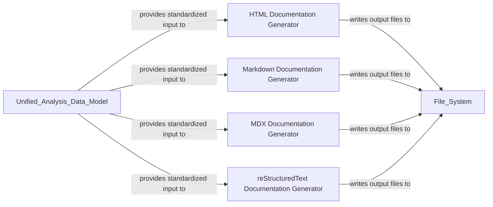

## Details

This component is responsible for transforming the processed analysis data and AI-generated insights into various human-readable documentation formats, including HTML, Markdown, MDX, and reStructuredText, ensuring clear and effective presentation of architectural insights.

### HTML Documentation Generator
Produces interactive HTML documentation. This involves generating Cytoscape graph data, constructing the HTML structure, and populating HTML templates with dynamic elements like CSS styles, Cytoscape scripts, and interactive control functions for rich visualization.

**Related Classes/Methods**:

- <a href="https://github.com/CodeBoarding/CodeBoarding/blob/main/.codeboardingoutput_generators/html.py" target="_blank" rel="noopener noreferrer">`output_generators.html.generate_html`</a>

### Markdown Documentation Generator
Generates documentation content in standard Markdown format. This includes creating component headers, producing Markdown content, writing to files, and incorporating Mermaid diagrams for visualization.

**Related Classes/Methods**:

- <a href="https://github.com/CodeBoarding/CodeBoarding/blob/main/.codeboardingoutput_generators/markdown.py" target="_blank" rel="noopener noreferrer">`output_generators.markdown.generate_markdown`</a>

### MDX Documentation Generator
Generates documentation in MDX (Markdown with JSX) format, allowing for embedding interactive components and richer content within Markdown. This includes creating component headers, generating frontmatter, producing MDX content, writing to files, and embedding Mermaid diagrams.

**Related Classes/Methods**:

- <a href="https://github.com/CodeBoarding/CodeBoarding/blob/main/.codeboardingoutput_generators/mdx.py" target="_blank" rel="noopener noreferrer">`output_generators.mdx.generate_mdx`</a>

### reStructuredText Documentation Generator
Creates documentation in reStructuredText (RST) format, specifically tailored for projects that use Sphinx for their documentation generation. This includes generating component headers, RST content, writing to files, and incorporating Mermaid diagrams.

**Related Classes/Methods**:

- <a href="https://github.com/CodeBoarding/CodeBoarding/blob/main/.codeboardingoutput_generators/sphinx.py" target="_blank" rel="noopener noreferrer">`output_generators.sphinx.generate_rst`</a>

### [FAQ](https://github.com/CodeBoarding/GeneratedOnBoardings/tree/main?tab=readme-ov-file#faq)
