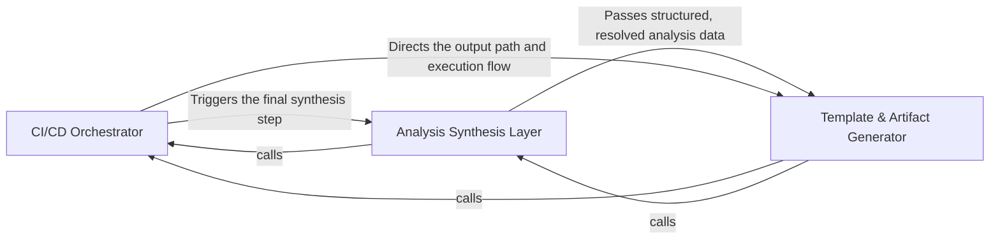

## Details

Transforms structured analysis entries into final documentation artifacts and integrates with CI/CD environments for publishing.

### CI/CD Orchestrator
Acts as the primary entry point for the subsystem, managing the lifecycle of documentation generation within automated environments.

**Related Classes/Methods**:

- `github_action.generate_analysis`:87-131
- `codeboarding_workflows.rendering.render_docs`:57-92

**Source Files:**

- [`codeboarding_workflows/rendering.py`](https://github.com/CodeBoarding/CodeBoarding/blob/main/.codeboardingcodeboarding_workflows/rendering.py)
  - `codeboarding_workflows.rendering._load_entries` ([L34-L54](https://github.com/CodeBoarding/CodeBoarding/blob/main/.codeboardingcodeboarding_workflows/rendering.py#L34-L54)) - Function
  - `codeboarding_workflows.rendering.render_docs` ([L57-L92](https://github.com/CodeBoarding/CodeBoarding/blob/main/.codeboardingcodeboarding_workflows/rendering.py#L57-L92)) - Function
- [`diagram_analysis/analysis_json.py`](https://github.com/CodeBoarding/CodeBoarding/blob/main/.codeboardingdiagram_analysis/analysis_json.py)
  - `diagram_analysis.analysis_json.build_id_to_name_map` ([L459-L465](https://github.com/CodeBoarding/CodeBoarding/blob/main/.codeboardingdiagram_analysis/analysis_json.py#L459-L465)) - Function

### Analysis Synthesis Layer
Aggregates and resolves the hierarchical data produced by the LLM agents, mapping raw code clusters into a coherent structure.

**Related Classes/Methods**: _None_

**Source Files:**

- [`github_action.py`](https://github.com/CodeBoarding/CodeBoarding/blob/main/.codeboardinggithub_action.py)
  - `github_action.generate_mdx` ([L44-L58](https://github.com/CodeBoarding/CodeBoarding/blob/main/.codeboardinggithub_action.py#L44-L58)) - Function
  - `github_action.generate_rst` ([L61-L75](https://github.com/CodeBoarding/CodeBoarding/blob/main/.codeboardinggithub_action.py#L61-L75)) - Function
- [`repo_utils/__init__.py`](https://github.com/CodeBoarding/CodeBoarding/blob/main/.codeboardingrepo_utils/__init__.py)
  - `repo_utils.__init__.checkout_repo` ([L126-L133](https://github.com/CodeBoarding/CodeBoarding/blob/main/.codeboardingrepo_utils/__init__.py#L126-L133)) - Function

### Template & Artifact Generator
Executes the physical transformation of structured analysis entries into final Markdown files and Mermaid diagrams.

**Related Classes/Methods**:

- `codeboarding_workflows.rendering._load_entries`:34-54

**Source Files:**

- [`github_action.py`](https://github.com/CodeBoarding/CodeBoarding/blob/main/.codeboardinggithub_action.py)
  - `github_action.generate_markdown` ([L15-L29](https://github.com/CodeBoarding/CodeBoarding/blob/main/.codeboardinggithub_action.py#L15-L29)) - Function
  - `github_action.generate_html` ([L32-L41](https://github.com/CodeBoarding/CodeBoarding/blob/main/.codeboardinggithub_action.py#L32-L41)) - Function
  - `github_action._seed_existing_analysis` ([L78-L84](https://github.com/CodeBoarding/CodeBoarding/blob/main/.codeboardinggithub_action.py#L78-L84)) - Function
  - `github_action.generate_analysis` ([L87-L131](https://github.com/CodeBoarding/CodeBoarding/blob/main/.codeboardinggithub_action.py#L87-L131)) - Function

### [FAQ](https://github.com/CodeBoarding/GeneratedOnBoardings/tree/main?tab=readme-ov-file#faq)