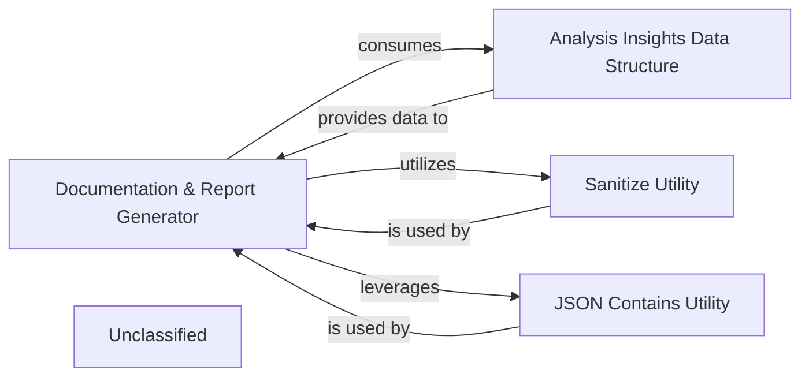

## Details

This system is designed to process analysis insights and generate comprehensive documentation and reports, primarily in Markdown format. The main flow involves the 'Documentation & Report Generator' component taking structured analysis data from the 'Analysis Insights Data Structure', utilizing the 'Sanitize Utility' for data cleaning, and leveraging the 'JSON Contains Utility' to handle JSON content. Its purpose is to transform raw analysis findings into readable and well-formatted reports.

### Documentation & Report Generator [[Expand]](./Documentation_Report_Generator.md)
This is the core component of the subsystem, responsible for taking processed analysis insights and transforming them into various documentation formats, primarily Markdown. It orchestrates the generation of textual summaries, structured data, and embedded diagrams (e.g., Mermaid.js diagrams) to create comprehensive reports.

**Related Classes/Methods**:

- <a href="https://github.com/CodeBoarding/CodeBoarding/blob/main/.codeboardingoutput_generators/markdown.py" target="_blank" rel="noopener noreferrer">`output_generators.markdown`</a>

### Analysis Insights Data Structure
This component defines the standardized data model for the insights derived from the AI's analysis. It encapsulates information about identified components, their relationships, and descriptive details, serving as the crucial input for the Documentation & Report Generator.

**Related Classes/Methods**:

- <a href="https://github.com/CodeBoarding/CodeBoarding/blob/main/.codeboardingagents/agent_responses.py" target="_blank" rel="noopener noreferrer">`agents.agent_responses`</a>

### Sanitize Utility
Provides essential utility functions for cleaning and validating data, such as names and strings, before they are incorporated into the final documentation. This ensures data integrity and proper formatting within the generated reports.

**Related Classes/Methods**:

- <a href="https://github.com/CodeBoarding/CodeBoarding/blob/main/.codeboardingoutput_generators/__init__.py" target="_blank" rel="noopener noreferrer">`output_generators.sanitize`</a>

### JSON Contains Utility
This utility is responsible for detecting and managing JSON content within various data sources or files. It likely assists the Documentation & Report Generator in identifying and correctly embedding or referencing JSON-formatted data within the documentation.

**Related Classes/Methods**:

- <a href="https://github.com/CodeBoarding/CodeBoarding/blob/main/.codeboardingutils.py#L37-L41" target="_blank" rel="noopener noreferrer">`utils.contains_json`:37-41</a>

### Unclassified
Component for all unclassified files and utility functions (Utility functions/External Libraries/Dependencies)

**Related Classes/Methods**: _None_

### [FAQ](https://github.com/CodeBoarding/GeneratedOnBoardings/tree/main?tab=readme-ov-file#faq)
