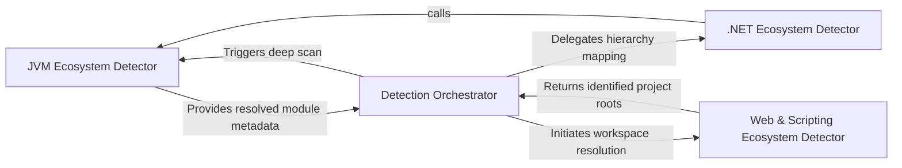

## Details

Specialized modules that identify project boundaries, module hierarchies, and build configurations for specific programming environments.

### JVM Ecosystem Detector
Specialized logic for identifying and parsing Java/Kotlin build systems, resolving Maven and Gradle project hierarchies.

**Related Classes/Methods**:

- `static_analyzer.java_config_scanner.JavaConfigScanner`:33-218
- `static_analyzer.java_config_scanner.JavaConfigScanner._analyze_maven_project`:132-166
- `static_analyzer.java_config_scanner.JavaConfigScanner._analyze_gradle_project`:168-198

**Source Files:**

- [`static_analyzer/csharp_config_scanner.py`](https://github.com/CodeBoarding/CodeBoarding/blob/main/.codeboardingstatic_analyzer/csharp_config_scanner.py)
  - `static_analyzer.csharp_config_scanner.CSharpProjectConfig` ([L17-L29](https://github.com/CodeBoarding/CodeBoarding/blob/main/.codeboardingstatic_analyzer/csharp_config_scanner.py#L17-L29)) - Class
  - `static_analyzer.csharp_config_scanner.CSharpConfigScanner._find_solution_roots` ([L77-L82](https://github.com/CodeBoarding/CodeBoarding/blob/main/.codeboardingstatic_analyzer/csharp_config_scanner.py#L77-L82)) - Method
  - `static_analyzer.csharp_config_scanner.CSharpConfigScanner._find_project_roots` ([L84-L86](https://github.com/CodeBoarding/CodeBoarding/blob/main/.codeboardingstatic_analyzer/csharp_config_scanner.py#L84-L86)) - Method
  - `static_analyzer.csharp_config_scanner.CSharpConfigScanner._has_cs_files` ([L88-L94](https://github.com/CodeBoarding/CodeBoarding/blob/main/.codeboardingstatic_analyzer/csharp_config_scanner.py#L88-L94)) - Method

### .NET Ecosystem Detector
Maps the Microsoft ecosystem by locating Solution and Project files and identifying assembly relationships.

**Related Classes/Methods**:

- `static_analyzer.csharp_config_scanner.CSharpConfigScanner`:32-103

**Source Files:**

- [`static_analyzer/csharp_config_scanner.py`](https://github.com/CodeBoarding/CodeBoarding/blob/main/.codeboardingstatic_analyzer/csharp_config_scanner.py)
  - `static_analyzer.csharp_config_scanner.CSharpConfigScanner.scan` ([L49-L75](https://github.com/CodeBoarding/CodeBoarding/blob/main/.codeboardingstatic_analyzer/csharp_config_scanner.py#L49-L75)) - Method
  - `static_analyzer.csharp_config_scanner.CSharpConfigScanner._is_subpath` ([L97-L103](https://github.com/CodeBoarding/CodeBoarding/blob/main/.codeboardingstatic_analyzer/csharp_config_scanner.py#L97-L103)) - Method

### Web & Scripting Ecosystem Detector
Identifies JavaScript/TypeScript workspace boundaries by resolving tsconfig and package.json configurations.

**Related Classes/Methods**:

- `static_analyzer.typescript_config_scanner.TypeScriptConfigScanner`:39-204

**Source Files:**

- [`static_analyzer/java_config_scanner.py`](https://github.com/CodeBoarding/CodeBoarding/blob/main/.codeboardingstatic_analyzer/java_config_scanner.py)
  - `static_analyzer.java_config_scanner.JavaProjectConfig` ([L10-L30](https://github.com/CodeBoarding/CodeBoarding/blob/main/.codeboardingstatic_analyzer/java_config_scanner.py#L10-L30)) - Class
  - `static_analyzer.java_config_scanner.JavaConfigScanner._analyze_maven_project` ([L132-L166](https://github.com/CodeBoarding/CodeBoarding/blob/main/.codeboardingstatic_analyzer/java_config_scanner.py#L132-L166)) - Method
  - `static_analyzer.java_config_scanner.JavaConfigScanner._analyze_gradle_project` ([L168-L198](https://github.com/CodeBoarding/CodeBoarding/blob/main/.codeboardingstatic_analyzer/java_config_scanner.py#L168-L198)) - Method

### Detection Orchestrator
The central registry and dispatching mechanism that performs initial crawls and delegates scanning to language-specific detectors.

**Related Classes/Methods**: _None_

**Source Files:**

- [`static_analyzer/java_config_scanner.py`](https://github.com/CodeBoarding/CodeBoarding/blob/main/.codeboardingstatic_analyzer/java_config_scanner.py)
  - `static_analyzer.java_config_scanner.JavaConfigScanner.scan` ([L39-L103](https://github.com/CodeBoarding/CodeBoarding/blob/main/.codeboardingstatic_analyzer/java_config_scanner.py#L39-L103)) - Method
  - `static_analyzer.java_config_scanner.JavaConfigScanner._find_maven_projects` ([L105-L107](https://github.com/CodeBoarding/CodeBoarding/blob/main/.codeboardingstatic_analyzer/java_config_scanner.py#L105-L107)) - Method
  - `static_analyzer.java_config_scanner.JavaConfigScanner._find_gradle_projects` ([L109-L124](https://github.com/CodeBoarding/CodeBoarding/blob/main/.codeboardingstatic_analyzer/java_config_scanner.py#L109-L124)) - Method
  - `static_analyzer.java_config_scanner.JavaConfigScanner._find_eclipse_projects` ([L126-L130](https://github.com/CodeBoarding/CodeBoarding/blob/main/.codeboardingstatic_analyzer/java_config_scanner.py#L126-L130)) - Method
  - `static_analyzer.java_config_scanner.JavaConfigScanner._has_gradle_wrapper` ([L200-L202](https://github.com/CodeBoarding/CodeBoarding/blob/main/.codeboardingstatic_analyzer/java_config_scanner.py#L200-L202)) - Method
  - `static_analyzer.java_config_scanner.JavaConfigScanner._has_java_files` ([L204-L210](https://github.com/CodeBoarding/CodeBoarding/blob/main/.codeboardingstatic_analyzer/java_config_scanner.py#L204-L210)) - Method
  - `static_analyzer.java_config_scanner.JavaConfigScanner._is_subpath` ([L212-L218](https://github.com/CodeBoarding/CodeBoarding/blob/main/.codeboardingstatic_analyzer/java_config_scanner.py#L212-L218)) - Method
- [`static_analyzer/typescript_config_scanner.py`](https://github.com/CodeBoarding/CodeBoarding/blob/main/.codeboardingstatic_analyzer/typescript_config_scanner.py)
  - `static_analyzer.typescript_config_scanner.TypeScriptProject` ([L25-L33](https://github.com/CodeBoarding/CodeBoarding/blob/main/.codeboardingstatic_analyzer/typescript_config_scanner.py#L25-L33)) - Class
  - `static_analyzer.typescript_config_scanner.TypeScriptConfigScanner.find_typescript_projects` ([L48-L86](https://github.com/CodeBoarding/CodeBoarding/blob/main/.codeboardingstatic_analyzer/typescript_config_scanner.py#L48-L86)) - Method
  - `static_analyzer.typescript_config_scanner.TypeScriptConfigScanner._discover_candidates` ([L88-L103](https://github.com/CodeBoarding/CodeBoarding/blob/main/.codeboardingstatic_analyzer/typescript_config_scanner.py#L88-L103)) - Method
  - `static_analyzer.typescript_config_scanner.TypeScriptConfigScanner._trim_overlap` ([L178-L204](https://github.com/CodeBoarding/CodeBoarding/blob/main/.codeboardingstatic_analyzer/typescript_config_scanner.py#L178-L204)) - Method

### [FAQ](https://github.com/CodeBoarding/GeneratedOnBoardings/tree/main?tab=readme-ov-file#faq)