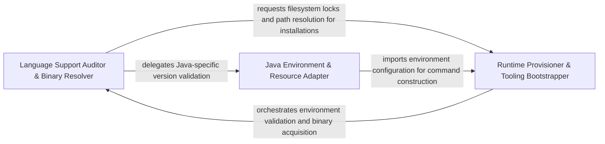

## Details

Manages the low-level acquisition of external dependencies, including platform-specific binary downloads, archive extraction, and runtime environment setup.

### Language Support Auditor & Binary Resolver [[Expand]](./Language_Support_Auditor_Binary_Resolver.md)
Evaluates the host system's readiness for various programming languages by checking for existing toolchains and resolving missing platform-specific requirements.

**Related Classes/Methods**:

- `install.LanguageSupportCheck`:43-62
- `install.download_jdtls`:500-508
- `install.resolve_missing_vcpp`:434-455
- `install.get_platform_bin_dir`:291-293
- `install.print_language_support_summary`:670-677

**Source Files:**

- [`install.py`](https://github.com/CodeBoarding/CodeBoarding/blob/main/.codeboardinginstall.py)
  - `install.LanguageSupportCheck` ([L43-L62](https://github.com/CodeBoarding/CodeBoarding/blob/main/.codeboardinginstall.py#L43-L62)) - Class
  - `install.LanguageSupportCheck.evaluate` ([L52-L62](https://github.com/CodeBoarding/CodeBoarding/blob/main/.codeboardinginstall.py#L52-L62)) - Method
  - `install.check_rust_toolchain` ([L65-L78](https://github.com/CodeBoarding/CodeBoarding/blob/main/.codeboardinginstall.py#L65-L78)) - Function
  - `install.is_non_interactive_mode` ([L172-L178](https://github.com/CodeBoarding/CodeBoarding/blob/main/.codeboardinginstall.py#L172-L178)) - Function
  - `install.get_platform_bin_dir` ([L291-L293](https://github.com/CodeBoarding/CodeBoarding/blob/main/.codeboardinginstall.py#L291-L293)) - Function
  - `install.verify_binary` ([L336-L361](https://github.com/CodeBoarding/CodeBoarding/blob/main/.codeboardinginstall.py#L336-L361)) - Function
  - `install.install_vcpp_redistributable` ([L364-L431](https://github.com/CodeBoarding/CodeBoarding/blob/main/.codeboardinginstall.py#L364-L431)) - Function
  - `install.resolve_missing_vcpp` ([L434-L455](https://github.com/CodeBoarding/CodeBoarding/blob/main/.codeboardinginstall.py#L434-L455)) - Function
  - `install.download_binaries` ([L458-L497](https://github.com/CodeBoarding/CodeBoarding/blob/main/.codeboardinginstall.py#L458-L497)) - Function
  - `install.download_jdtls` ([L500-L508](https://github.com/CodeBoarding/CodeBoarding/blob/main/.codeboardinginstall.py#L500-L508)) - Function
  - `install.install_package_manager_lsp_servers` ([L511-L534](https://github.com/CodeBoarding/CodeBoarding/blob/main/.codeboardinginstall.py#L511-L534)) - Function
  - `install._language_checks_from_registry` ([L575-L667](https://github.com/CodeBoarding/CodeBoarding/blob/main/.codeboardinginstall.py#L575-L667)) - Function
  - `install.print_language_support_summary` ([L670-L677](https://github.com/CodeBoarding/CodeBoarding/blob/main/.codeboardinginstall.py#L670-L677)) - Function
- [`static_analyzer/dotnet_sdk.py`](https://github.com/CodeBoarding/CodeBoarding/blob/main/.codeboardingstatic_analyzer/dotnet_sdk.py)
  - `static_analyzer.dotnet_sdk.DotnetSdkError` ([L39-L40](https://github.com/CodeBoarding/CodeBoarding/blob/main/.codeboardingstatic_analyzer/dotnet_sdk.py#L39-L40)) - Class
  - `static_analyzer.dotnet_sdk.DotnetSdkResolution` ([L44-L50](https://github.com/CodeBoarding/CodeBoarding/blob/main/.codeboardingstatic_analyzer/dotnet_sdk.py#L44-L50)) - Class
  - `static_analyzer.dotnet_sdk._Probe` ([L54-L57](https://github.com/CodeBoarding/CodeBoarding/blob/main/.codeboardingstatic_analyzer/dotnet_sdk.py#L54-L57)) - Class
  - `static_analyzer.dotnet_sdk.dotnet_install_dir` ([L60-L61](https://github.com/CodeBoarding/CodeBoarding/blob/main/.codeboardingstatic_analyzer/dotnet_sdk.py#L60-L61)) - Function
  - `static_analyzer.dotnet_sdk.private_dotnet_path` ([L64-L65](https://github.com/CodeBoarding/CodeBoarding/blob/main/.codeboardingstatic_analyzer/dotnet_sdk.py#L64-L65)) - Function
  - `static_analyzer.dotnet_sdk.find_global_json` ([L68-L75](https://github.com/CodeBoarding/CodeBoarding/blob/main/.codeboardingstatic_analyzer/dotnet_sdk.py#L68-L75)) - Function
  - `static_analyzer.dotnet_sdk.read_global_sdk_version` ([L78-L84](https://github.com/CodeBoarding/CodeBoarding/blob/main/.codeboardingstatic_analyzer/dotnet_sdk.py#L78-L84)) - Function
  - `static_analyzer.dotnet_sdk.resolve_dotnet_sdk` ([L87-L155](https://github.com/CodeBoarding/CodeBoarding/blob/main/.codeboardingstatic_analyzer/dotnet_sdk.py#L87-L155)) - Function
  - `static_analyzer.dotnet_sdk.system_dotnet_env` ([L158-L185](https://github.com/CodeBoarding/CodeBoarding/blob/main/.codeboardingstatic_analyzer/dotnet_sdk.py#L158-L185)) - Function
  - `static_analyzer.dotnet_sdk._private_dotnet_env` ([L188-L193](https://github.com/CodeBoarding/CodeBoarding/blob/main/.codeboardingstatic_analyzer/dotnet_sdk.py#L188-L193)) - Function
  - `static_analyzer.dotnet_sdk._merged_env` ([L196-L199](https://github.com/CodeBoarding/CodeBoarding/blob/main/.codeboardingstatic_analyzer/dotnet_sdk.py#L196-L199)) - Function
  - `static_analyzer.dotnet_sdk._probe_dotnet` ([L202-L215](https://github.com/CodeBoarding/CodeBoarding/blob/main/.codeboardingstatic_analyzer/dotnet_sdk.py#L202-L215)) - Function
  - `static_analyzer.dotnet_sdk._has_sdk_major` ([L218-L242](https://github.com/CodeBoarding/CodeBoarding/blob/main/.codeboardingstatic_analyzer/dotnet_sdk.py#L218-L242)) - Function
  - `static_analyzer.dotnet_sdk._install_from_global_json` ([L245-L247](https://github.com/CodeBoarding/CodeBoarding/blob/main/.codeboardingstatic_analyzer/dotnet_sdk.py#L245-L247)) - Function
  - `static_analyzer.dotnet_sdk._install_channel` ([L250-L252](https://github.com/CodeBoarding/CodeBoarding/blob/main/.codeboardingstatic_analyzer/dotnet_sdk.py#L250-L252)) - Function
  - `static_analyzer.dotnet_sdk._run_install_script` ([L255-L291](https://github.com/CodeBoarding/CodeBoarding/blob/main/.codeboardingstatic_analyzer/dotnet_sdk.py#L255-L291)) - Function
  - `static_analyzer.dotnet_sdk._download_install_script` ([L294-L316](https://github.com/CodeBoarding/CodeBoarding/blob/main/.codeboardingstatic_analyzer/dotnet_sdk.py#L294-L316)) - Function
  - `static_analyzer.dotnet_sdk._to_powershell_install_args` ([L319-L327](https://github.com/CodeBoarding/CodeBoarding/blob/main/.codeboardingstatic_analyzer/dotnet_sdk.py#L319-L327)) - Function
- [`static_analyzer/engine/adapters/csharp_adapter.py`](https://github.com/CodeBoarding/CodeBoarding/blob/main/.codeboardingstatic_analyzer/engine/adapters/csharp_adapter.py)
  - `static_analyzer.engine.adapters.csharp_adapter.CSharpAdapter.get_lsp_command` ([L51-L59](https://github.com/CodeBoarding/CodeBoarding/blob/main/.codeboardingstatic_analyzer/engine/adapters/csharp_adapter.py#L51-L59)) - Method
  - `static_analyzer.engine.adapters.csharp_adapter.CSharpAdapter._ensure_csharp_ls_installed` ([L61-L93](https://github.com/CodeBoarding/CodeBoarding/blob/main/.codeboardingstatic_analyzer/engine/adapters/csharp_adapter.py#L61-L93)) - Method
  - `static_analyzer.engine.adapters.csharp_adapter.CSharpAdapter.prepare_project` ([L192-L242](https://github.com/CodeBoarding/CodeBoarding/blob/main/.codeboardingstatic_analyzer/engine/adapters/csharp_adapter.py#L192-L242)) - Method
  - `static_analyzer.engine.adapters.csharp_adapter.CSharpAdapter.get_lsp_env` ([L244-L260](https://github.com/CodeBoarding/CodeBoarding/blob/main/.codeboardingstatic_analyzer/engine/adapters/csharp_adapter.py#L244-L260)) - Method
- [`tool_registry/installers.py`](https://github.com/CodeBoarding/CodeBoarding/blob/main/.codeboardingtool_registry/installers.py)
  - `tool_registry.installers.asset_url` ([L51-L57](https://github.com/CodeBoarding/CodeBoarding/blob/main/.codeboardingtool_registry/installers.py#L51-L57)) - Function
  - `tool_registry.installers.resolve_native_asset_name` ([L60-L82](https://github.com/CodeBoarding/CodeBoarding/blob/main/.codeboardingtool_registry/installers.py#L60-L82)) - Function
  - `tool_registry.installers._is_compressed_asset` ([L85-L88](https://github.com/CodeBoarding/CodeBoarding/blob/main/.codeboardingtool_registry/installers.py#L85-L88)) - Function
  - `tool_registry.installers._extract_compressed_binary` ([L91-L137](https://github.com/CodeBoarding/CodeBoarding/blob/main/.codeboardingtool_registry/installers.py#L91-L137)) - Function
  - `tool_registry.installers.download_asset` ([L140-L163](https://github.com/CodeBoarding/CodeBoarding/blob/main/.codeboardingtool_registry/installers.py#L140-L163)) - Function
  - `tool_registry.installers.install_native_tools` ([L169-L271](https://github.com/CodeBoarding/CodeBoarding/blob/main/.codeboardingtool_registry/installers.py#L169-L271)) - Function
  - `tool_registry.installers.package_manager_tool_dir` ([L277-L284](https://github.com/CodeBoarding/CodeBoarding/blob/main/.codeboardingtool_registry/installers.py#L277-L284)) - Function
  - `tool_registry.installers.package_manager_tool_fingerprint` ([L287-L301](https://github.com/CodeBoarding/CodeBoarding/blob/main/.codeboardingtool_registry/installers.py#L287-L301)) - Function
  - `tool_registry.installers.package_manager_tool_is_current` ([L304-L320](https://github.com/CodeBoarding/CodeBoarding/blob/main/.codeboardingtool_registry/installers.py#L304-L320)) - Function
  - `tool_registry.installers._write_package_manager_tool_stamp` ([L323-L330](https://github.com/CodeBoarding/CodeBoarding/blob/main/.codeboardingtool_registry/installers.py#L323-L330)) - Function
  - `tool_registry.installers.install_package_manager_tools` ([L333-L423](https://github.com/CodeBoarding/CodeBoarding/blob/main/.codeboardingtool_registry/installers.py#L333-L423)) - Function
  - `tool_registry.installers.install_archive_tool` ([L475-L509](https://github.com/CodeBoarding/CodeBoarding/blob/main/.codeboardingtool_registry/installers.py#L475-L509)) - Function
  - `tool_registry.installers.install_tools` ([L515-L537](https://github.com/CodeBoarding/CodeBoarding/blob/main/.codeboardingtool_registry/installers.py#L515-L537)) - Function
- [`tool_registry/manifest.py`](https://github.com/CodeBoarding/CodeBoarding/blob/main/.codeboardingtool_registry/manifest.py)
  - `tool_registry.manifest.package_manager_tool_path` ([L189-L200](https://github.com/CodeBoarding/CodeBoarding/blob/main/.codeboardingtool_registry/manifest.py#L189-L200)) - Function
  - `tool_registry.manifest.resolve_config` ([L203-L249](https://github.com/CodeBoarding/CodeBoarding/blob/main/.codeboardingtool_registry/manifest.py#L203-L249)) - Function
  - `tool_registry.manifest.has_required_tools` ([L278-L347](https://github.com/CodeBoarding/CodeBoarding/blob/main/.codeboardingtool_registry/manifest.py#L278-L347)) - Function
- [`tool_registry/paths.py`](https://github.com/CodeBoarding/CodeBoarding/blob/main/.codeboardingtool_registry/paths.py)
  - `tool_registry.paths.exe_suffix` ([L31-L33](https://github.com/CodeBoarding/CodeBoarding/blob/main/.codeboardingtool_registry/paths.py#L31-L33)) - Function
  - `tool_registry.paths.platform_bin_dir` ([L53-L59](https://github.com/CodeBoarding/CodeBoarding/blob/main/.codeboardingtool_registry/paths.py#L53-L59)) - Function
  - `tool_registry.paths.native_binary_ok` ([L62-L72](https://github.com/CodeBoarding/CodeBoarding/blob/main/.codeboardingtool_registry/paths.py#L62-L72)) - Function
  - `tool_registry.paths.user_data_dir` ([L78-L80](https://github.com/CodeBoarding/CodeBoarding/blob/main/.codeboardingtool_registry/paths.py#L78-L80)) - Function
- [`tool_registry/registry.py`](https://github.com/CodeBoarding/CodeBoarding/blob/main/.codeboardingtool_registry/registry.py)
  - `tool_registry.registry.ToolKind` ([L54-L62](https://github.com/CodeBoarding/CodeBoarding/blob/main/.codeboardingtool_registry/registry.py#L54-L62)) - Class
  - `tool_registry.registry.ConfigSection` ([L65-L69](https://github.com/CodeBoarding/CodeBoarding/blob/main/.codeboardingtool_registry/registry.py#L65-L69)) - Class
  - `tool_registry.registry.ToolDependency` ([L125-L150](https://github.com/CodeBoarding/CodeBoarding/blob/main/.codeboardingtool_registry/registry.py#L125-L150)) - Class
  - `tool_registry.registry.ToolDependency.is_available_on_host` ([L138-L150](https://github.com/CodeBoarding/CodeBoarding/blob/main/.codeboardingtool_registry/registry.py#L138-L150)) - Method
- [`vscode_constants.py`](https://github.com/CodeBoarding/CodeBoarding/blob/main/.codeboardingvscode_constants.py)
  - `vscode_constants.find_runnable` ([L65-L69](https://github.com/CodeBoarding/CodeBoarding/blob/main/.codeboardingvscode_constants.py#L65-L69)) - Function

### Runtime Provisioner & Tooling Bootstrapper [[Expand]](./Runtime_Provisioner_Tooling_Bootstrapper.md)
Manages the physical acquisition and setup of core execution runtimes, focusing on Node.js/NPM environments and safe archive extraction.

**Related Classes/Methods**:

- `install.ensure_tools`:680-713
- `install.bootstrap_npm`:120-169
- `install.ensure_node_runtime`:181-234
- `install.extract_tarball_safely`:109-117
- `install.install_node_servers`:296-321

**Source Files:**

- [`install.py`](https://github.com/CodeBoarding/CodeBoarding/blob/main/.codeboardinginstall.py)
  - `install.check_npm` ([L81-L101](https://github.com/CodeBoarding/CodeBoarding/blob/main/.codeboardinginstall.py#L81-L101)) - Function
  - `install.bootstrapped_npm_cli_path` ([L104-L106](https://github.com/CodeBoarding/CodeBoarding/blob/main/.codeboardinginstall.py#L104-L106)) - Function
  - `install.extract_tarball_safely` ([L109-L117](https://github.com/CodeBoarding/CodeBoarding/blob/main/.codeboardinginstall.py#L109-L117)) - Function
  - `install.bootstrap_npm` ([L120-L169](https://github.com/CodeBoarding/CodeBoarding/blob/main/.codeboardinginstall.py#L120-L169)) - Function
  - `install.ensure_node_runtime` ([L181-L234](https://github.com/CodeBoarding/CodeBoarding/blob/main/.codeboardinginstall.py#L181-L234)) - Function
  - `install.resolve_missing_npm` ([L237-L262](https://github.com/CodeBoarding/CodeBoarding/blob/main/.codeboardinginstall.py#L237-L262)) - Function
  - `install.resolve_npm_availability` ([L265-L272](https://github.com/CodeBoarding/CodeBoarding/blob/main/.codeboardinginstall.py#L265-L272)) - Function
  - `install.parse_args` ([L275-L288](https://github.com/CodeBoarding/CodeBoarding/blob/main/.codeboardinginstall.py#L275-L288)) - Function
  - `install.install_node_servers` ([L296-L321](https://github.com/CodeBoarding/CodeBoarding/blob/main/.codeboardinginstall.py#L296-L321)) - Function
  - `install.BinaryStatus` ([L328-L333](https://github.com/CodeBoarding/CodeBoarding/blob/main/.codeboardinginstall.py#L328-L333)) - Class
  - `install.install_pre_commit_hooks` ([L537-L572](https://github.com/CodeBoarding/CodeBoarding/blob/main/.codeboardinginstall.py#L537-L572)) - Function
  - `install.ensure_tools` ([L680-L713](https://github.com/CodeBoarding/CodeBoarding/blob/main/.codeboardinginstall.py#L680-L713)) - Function
  - `install.run_install` ([L716-L763](https://github.com/CodeBoarding/CodeBoarding/blob/main/.codeboardinginstall.py#L716-L763)) - Function
  - `install.run_install.unified_progress` ([L748-L752](https://github.com/CodeBoarding/CodeBoarding/blob/main/.codeboardinginstall.py#L748-L752)) - Function
  - `install.main` ([L766-L791](https://github.com/CodeBoarding/CodeBoarding/blob/main/.codeboardinginstall.py#L766-L791)) - Function
- [`static_analyzer/typescript_config_scanner.py`](https://github.com/CodeBoarding/CodeBoarding/blob/main/.codeboardingstatic_analyzer/typescript_config_scanner.py)
  - `static_analyzer.typescript_config_scanner._resolve_system_tsc` ([L215-L218](https://github.com/CodeBoarding/CodeBoarding/blob/main/.codeboardingstatic_analyzer/typescript_config_scanner.py#L215-L218)) - Function
  - `static_analyzer.typescript_config_scanner._resolve_tsc_command` ([L221-L235](https://github.com/CodeBoarding/CodeBoarding/blob/main/.codeboardingstatic_analyzer/typescript_config_scanner.py#L221-L235)) - Function
- [`tool_registry/installers.py`](https://github.com/CodeBoarding/CodeBoarding/blob/main/.codeboardingtool_registry/installers.py)
  - `tool_registry.installers.install_node_tools` ([L429-L469](https://github.com/CodeBoarding/CodeBoarding/blob/main/.codeboardingtool_registry/installers.py#L429-L469)) - Function
  - `tool_registry.installers.embedded_node_is_healthy` ([L548-L574](https://github.com/CodeBoarding/CodeBoarding/blob/main/.codeboardingtool_registry/installers.py#L548-L574)) - Function
  - `tool_registry.installers.initialize_nodeenv_globals` ([L577-L600](https://github.com/CodeBoarding/CodeBoarding/blob/main/.codeboardingtool_registry/installers.py#L577-L600)) - Function
  - `tool_registry.installers.nodeenv_needs_unofficial_builds` ([L603-L618](https://github.com/CodeBoarding/CodeBoarding/blob/main/.codeboardingtool_registry/installers.py#L603-L618)) - Function
  - `tool_registry.installers.install_embedded_node` ([L621-L703](https://github.com/CodeBoarding/CodeBoarding/blob/main/.codeboardingtool_registry/installers.py#L621-L703)) - Function
- [`tool_registry/manifest.py`](https://github.com/CodeBoarding/CodeBoarding/blob/main/.codeboardingtool_registry/manifest.py)
  - `tool_registry.manifest.installed_version` ([L40-L44](https://github.com/CodeBoarding/CodeBoarding/blob/main/.codeboardingtool_registry/manifest.py#L40-L44)) - Function
  - `tool_registry.manifest.manifest_path` ([L47-L48](https://github.com/CodeBoarding/CodeBoarding/blob/main/.codeboardingtool_registry/manifest.py#L47-L48)) - Function
  - `tool_registry.manifest.read_manifest` ([L51-L55](https://github.com/CodeBoarding/CodeBoarding/blob/main/.codeboardingtool_registry/manifest.py#L51-L55)) - Function
  - `tool_registry.manifest.npm_specs_fingerprint` ([L58-L68](https://github.com/CodeBoarding/CodeBoarding/blob/main/.codeboardingtool_registry/manifest.py#L58-L68)) - Function
  - `tool_registry.manifest.tools_fingerprint` ([L71-L91](https://github.com/CodeBoarding/CodeBoarding/blob/main/.codeboardingtool_registry/manifest.py#L71-L91)) - Function
  - `tool_registry.manifest.write_manifest` ([L94-L116](https://github.com/CodeBoarding/CodeBoarding/blob/main/.codeboardingtool_registry/manifest.py#L94-L116)) - Function
  - `tool_registry.manifest.needs_install` ([L119-L128](https://github.com/CodeBoarding/CodeBoarding/blob/main/.codeboardingtool_registry/manifest.py#L119-L128)) - Function
  - `tool_registry.manifest.acquire_lock` ([L134-L160](https://github.com/CodeBoarding/CodeBoarding/blob/main/.codeboardingtool_registry/manifest.py#L134-L160)) - Function
  - `tool_registry.manifest.build_config` ([L166-L186](https://github.com/CodeBoarding/CodeBoarding/blob/main/.codeboardingtool_registry/manifest.py#L166-L186)) - Function
  - `tool_registry.manifest.resolve_config_from_path` ([L252-L275](https://github.com/CodeBoarding/CodeBoarding/blob/main/.codeboardingtool_registry/manifest.py#L252-L275)) - Function
- [`tool_registry/paths.py`](https://github.com/CodeBoarding/CodeBoarding/blob/main/.codeboardingtool_registry/paths.py)
  - `tool_registry.paths.get_servers_dir` ([L83-L85](https://github.com/CodeBoarding/CodeBoarding/blob/main/.codeboardingtool_registry/paths.py#L83-L85)) - Function
  - `tool_registry.paths.nodeenv_root_dir` ([L91-L93](https://github.com/CodeBoarding/CodeBoarding/blob/main/.codeboardingtool_registry/paths.py#L91-L93)) - Function
  - `tool_registry.paths.nodeenv_bin_dir` ([L96-L99](https://github.com/CodeBoarding/CodeBoarding/blob/main/.codeboardingtool_registry/paths.py#L96-L99)) - Function
  - `tool_registry.paths.embedded_node_path` ([L102-L106](https://github.com/CodeBoarding/CodeBoarding/blob/main/.codeboardingtool_registry/paths.py#L102-L106)) - Function
  - `tool_registry.paths.embedded_npm_path` ([L109-L113](https://github.com/CodeBoarding/CodeBoarding/blob/main/.codeboardingtool_registry/paths.py#L109-L113)) - Function
  - `tool_registry.paths.embedded_npm_cli_path` ([L116-L119](https://github.com/CodeBoarding/CodeBoarding/blob/main/.codeboardingtool_registry/paths.py#L116-L119)) - Function
  - `tool_registry.paths.node_version_tuple` ([L126-L172](https://github.com/CodeBoarding/CodeBoarding/blob/main/.codeboardingtool_registry/paths.py#L126-L172)) - Function
  - `tool_registry.paths.node_is_acceptable` ([L175-L196](https://github.com/CodeBoarding/CodeBoarding/blob/main/.codeboardingtool_registry/paths.py#L175-L196)) - Function
  - `tool_registry.paths.preferred_node_path` ([L202-L217](https://github.com/CodeBoarding/CodeBoarding/blob/main/.codeboardingtool_registry/paths.py#L202-L217)) - Function
  - `tool_registry.paths.sibling_npm_path` ([L220-L231](https://github.com/CodeBoarding/CodeBoarding/blob/main/.codeboardingtool_registry/paths.py#L220-L231)) - Function
  - `tool_registry.paths.preferred_npm_command` ([L234-L252](https://github.com/CodeBoarding/CodeBoarding/blob/main/.codeboardingtool_registry/paths.py#L234-L252)) - Function
  - `tool_registry.paths.npm_subprocess_env` ([L255-L264](https://github.com/CodeBoarding/CodeBoarding/blob/main/.codeboardingtool_registry/paths.py#L255-L264)) - Function
- [`user_config.py`](https://github.com/CodeBoarding/CodeBoarding/blob/main/.codeboardinguser_config.py)
  - `user_config.ensure_config_template` ([L165-L171](https://github.com/CodeBoarding/CodeBoarding/blob/main/.codeboardinguser_config.py#L165-L171)) - Function
  - `user_config._append_commented_key` ([L174-L183](https://github.com/CodeBoarding/CodeBoarding/blob/main/.codeboardinguser_config.py#L174-L183)) - Function

### Java Environment & Resource Adapter
Provides specialized logic for detecting and configuring Java environments and calculating hardware-optimized execution parameters for the Java Language Server.

**Related Classes/Methods**:

- `static_analyzer.java_utils.find_java_21_or_later`:95-137
- `static_analyzer.java_utils.create_jdtls_command`:184-242
- `static_analyzer.engine.adapters.java_adapter.JavaAdapter`:25-300
- `static_analyzer.engine.utils.total_ram_gb`:68-87

**Source Files:**

- [`static_analyzer/engine/adapters/java_adapter.py`](https://github.com/CodeBoarding/CodeBoarding/blob/main/.codeboardingstatic_analyzer/engine/adapters/java_adapter.py)
  - `static_analyzer.engine.adapters.java_adapter.JavaAdapter` ([L25-L300](https://github.com/CodeBoarding/CodeBoarding/blob/main/.codeboardingstatic_analyzer/engine/adapters/java_adapter.py#L25-L300)) - Class
  - `static_analyzer.engine.adapters.java_adapter.JavaAdapter.wait_for_workspace_ready` ([L28-L33](https://github.com/CodeBoarding/CodeBoarding/blob/main/.codeboardingstatic_analyzer/engine/adapters/java_adapter.py#L28-L33)) - Method
  - `static_analyzer.engine.adapters.java_adapter.JavaAdapter.language` ([L36-L37](https://github.com/CodeBoarding/CodeBoarding/blob/main/.codeboardingstatic_analyzer/engine/adapters/java_adapter.py#L36-L37)) - Method
  - `static_analyzer.engine.adapters.java_adapter.JavaAdapter.language_enum` ([L40-L41](https://github.com/CodeBoarding/CodeBoarding/blob/main/.codeboardingstatic_analyzer/engine/adapters/java_adapter.py#L40-L41)) - Method
  - `static_analyzer.engine.adapters.java_adapter.JavaAdapter.lsp_command` ([L44-L45](https://github.com/CodeBoarding/CodeBoarding/blob/main/.codeboardingstatic_analyzer/engine/adapters/java_adapter.py#L44-L45)) - Method
  - `static_analyzer.engine.adapters.java_adapter.JavaAdapter.language_id` ([L48-L49](https://github.com/CodeBoarding/CodeBoarding/blob/main/.codeboardingstatic_analyzer/engine/adapters/java_adapter.py#L48-L49)) - Method
  - `static_analyzer.engine.adapters.java_adapter.JavaAdapter.get_lsp_command` ([L51-L71](https://github.com/CodeBoarding/CodeBoarding/blob/main/.codeboardingstatic_analyzer/engine/adapters/java_adapter.py#L51-L71)) - Method
  - `static_analyzer.engine.adapters.java_adapter.JavaAdapter._find_jdtls_root` ([L74-L103](https://github.com/CodeBoarding/CodeBoarding/blob/main/.codeboardingstatic_analyzer/engine/adapters/java_adapter.py#L74-L103)) - Method
  - `static_analyzer.engine.adapters.java_adapter.JavaAdapter._calculate_heap_size` ([L106-L131](https://github.com/CodeBoarding/CodeBoarding/blob/main/.codeboardingstatic_analyzer/engine/adapters/java_adapter.py#L106-L131)) - Method
  - `static_analyzer.engine.adapters.java_adapter.JavaAdapter.build_qualified_name` ([L133-L158](https://github.com/CodeBoarding/CodeBoarding/blob/main/.codeboardingstatic_analyzer/engine/adapters/java_adapter.py#L133-L158)) - Method
  - `static_analyzer.engine.adapters.java_adapter.JavaAdapter._clean_symbol_name` ([L161-L199](https://github.com/CodeBoarding/CodeBoarding/blob/main/.codeboardingstatic_analyzer/engine/adapters/java_adapter.py#L161-L199)) - Method
  - `static_analyzer.engine.adapters.java_adapter.JavaAdapter._strip_generics` ([L202-L213](https://github.com/CodeBoarding/CodeBoarding/blob/main/.codeboardingstatic_analyzer/engine/adapters/java_adapter.py#L202-L213)) - Method
  - `static_analyzer.engine.adapters.java_adapter.JavaAdapter._split_params` ([L216-L235](https://github.com/CodeBoarding/CodeBoarding/blob/main/.codeboardingstatic_analyzer/engine/adapters/java_adapter.py#L216-L235)) - Method
  - `static_analyzer.engine.adapters.java_adapter.JavaAdapter.extract_package` ([L237-L267](https://github.com/CodeBoarding/CodeBoarding/blob/main/.codeboardingstatic_analyzer/engine/adapters/java_adapter.py#L237-L267)) - Method
  - `static_analyzer.engine.adapters.java_adapter.JavaAdapter.get_workspace_settings` ([L269-L281](https://github.com/CodeBoarding/CodeBoarding/blob/main/.codeboardingstatic_analyzer/engine/adapters/java_adapter.py#L269-L281)) - Method
  - `static_analyzer.engine.adapters.java_adapter.JavaAdapter.edge_strategy` ([L284-L286](https://github.com/CodeBoarding/CodeBoarding/blob/main/.codeboardingstatic_analyzer/engine/adapters/java_adapter.py#L284-L286)) - Method
  - `static_analyzer.engine.adapters.java_adapter.JavaAdapter.should_track_for_edges` ([L288-L289](https://github.com/CodeBoarding/CodeBoarding/blob/main/.codeboardingstatic_analyzer/engine/adapters/java_adapter.py#L288-L289)) - Method
  - `static_analyzer.engine.adapters.java_adapter.JavaAdapter.get_package_for_file` ([L291-L294](https://github.com/CodeBoarding/CodeBoarding/blob/main/.codeboardingstatic_analyzer/engine/adapters/java_adapter.py#L291-L294)) - Method
  - `static_analyzer.engine.adapters.java_adapter.JavaAdapter.get_all_packages` ([L296-L300](https://github.com/CodeBoarding/CodeBoarding/blob/main/.codeboardingstatic_analyzer/engine/adapters/java_adapter.py#L296-L300)) - Method
- [`static_analyzer/engine/utils.py`](https://github.com/CodeBoarding/CodeBoarding/blob/main/.codeboardingstatic_analyzer/engine/utils.py)
  - `static_analyzer.engine.utils._MemoryStatusEx` ([L54-L65](https://github.com/CodeBoarding/CodeBoarding/blob/main/.codeboardingstatic_analyzer/engine/utils.py#L54-L65)) - Class
  - `static_analyzer.engine.utils.total_ram_gb` ([L68-L87](https://github.com/CodeBoarding/CodeBoarding/blob/main/.codeboardingstatic_analyzer/engine/utils.py#L68-L87)) - Function
- [`static_analyzer/java_utils.py`](https://github.com/CodeBoarding/CodeBoarding/blob/main/.codeboardingstatic_analyzer/java_utils.py)
  - `static_analyzer.java_utils.get_java_version` ([L12-L34](https://github.com/CodeBoarding/CodeBoarding/blob/main/.codeboardingstatic_analyzer/java_utils.py#L12-L34)) - Function
  - `static_analyzer.java_utils.detect_java_installations` ([L37-L92](https://github.com/CodeBoarding/CodeBoarding/blob/main/.codeboardingstatic_analyzer/java_utils.py#L37-L92)) - Function
  - `static_analyzer.java_utils.find_java_21_or_later` ([L95-L137](https://github.com/CodeBoarding/CodeBoarding/blob/main/.codeboardingstatic_analyzer/java_utils.py#L95-L137)) - Function
  - `static_analyzer.java_utils._is_arm64` ([L140-L142](https://github.com/CodeBoarding/CodeBoarding/blob/main/.codeboardingstatic_analyzer/java_utils.py#L140-L142)) - Function
  - `static_analyzer.java_utils.get_jdtls_config_dir` ([L145-L157](https://github.com/CodeBoarding/CodeBoarding/blob/main/.codeboardingstatic_analyzer/java_utils.py#L145-L157)) - Function
  - `static_analyzer.java_utils.find_launcher_jar` ([L160-L181](https://github.com/CodeBoarding/CodeBoarding/blob/main/.codeboardingstatic_analyzer/java_utils.py#L160-L181)) - Function
  - `static_analyzer.java_utils.create_jdtls_command` ([L184-L242](https://github.com/CodeBoarding/CodeBoarding/blob/main/.codeboardingstatic_analyzer/java_utils.py#L184-L242)) - Function
- [`utils.py`](https://github.com/CodeBoarding/CodeBoarding/blob/main/.codeboardingutils.py)
  - `utils.get_config` ([L83-L89](https://github.com/CodeBoarding/CodeBoarding/blob/main/.codeboardingutils.py#L83-L89)) - Function

### [FAQ](https://github.com/CodeBoarding/GeneratedOnBoardings/tree/main?tab=readme-ov-file#faq)