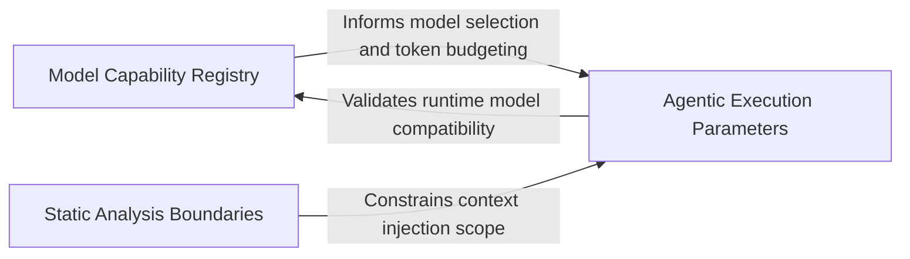

## Details

Defines operational boundaries and capabilities of the provisioned environment, communicating performance limits to the Agentic Workflow.

### Model Capability Registry
Defines the cognitive and physical boundaries of the LLMs, acting as a policy engine for context window limits, token pricing, and model-specific features.

**Related Classes/Methods**: _None_

**Source Files:**

- [`agents/constants.py`](https://github.com/CodeBoarding/CodeBoarding/blob/main/.codeboardingagents/constants.py)
  - `agents.constants.FileStructureConfig` ([L10-L13](https://github.com/CodeBoarding/CodeBoarding/blob/main/.codeboardingagents/constants.py#L10-L13)) - Class

### Static Analysis Boundaries
Governs the depth and breadth of project structure analysis by providing configuration parameters that limit filesystem traversal.

**Related Classes/Methods**: _None_

**Source Files:**

- [`agents/constants.py`](https://github.com/CodeBoarding/CodeBoarding/blob/main/.codeboardingagents/constants.py)
  - `agents.constants.LLMDefaults` ([L4-L7](https://github.com/CodeBoarding/CodeBoarding/blob/main/.codeboardingagents/constants.py#L4-L7)) - Class

### Agentic Execution Parameters
Manages operational constants that dictate the behavior and state management of primary agents, bridging static configuration with runtime execution.

**Related Classes/Methods**: _None_

**Source Files:**

- [`agents/constants.py`](https://github.com/CodeBoarding/CodeBoarding/blob/main/.codeboardingagents/constants.py)
  - `agents.constants.ModelCapabilities` ([L16-L38](https://github.com/CodeBoarding/CodeBoarding/blob/main/.codeboardingagents/constants.py#L16-L38)) - Class

### [FAQ](https://github.com/CodeBoarding/GeneratedOnBoardings/tree/main?tab=readme-ov-file#faq)