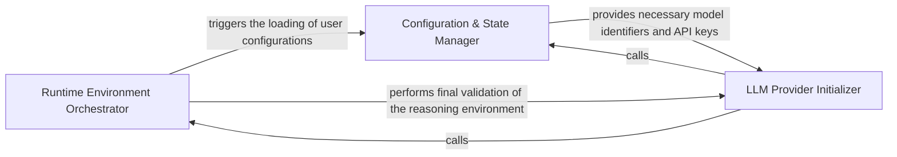

## Details

Prepares the execution environment by loading configurations, initializing LLM providers, and ensuring system dependencies are available.

### Runtime Environment Orchestrator [[Expand]](./Runtime_Environment_Orchestrator.md)
Prepares the physical and system-level execution context, including logging directories, configuration templates, and external system dependencies.

**Related Classes/Methods**:

- `codeboarding_cli.bootstrap.bootstrap_environment`:38-53

**Source Files:**

- [`agents/llm_config.py`](https://github.com/CodeBoarding/CodeBoarding/blob/main/.codeboardingagents/llm_config.py)
  - `agents.llm_config.configure_models` ([L54-L80](https://github.com/CodeBoarding/CodeBoarding/blob/main/.codeboardingagents/llm_config.py#L54-L80)) - Function
- [`codeboarding_cli/bootstrap.py`](https://github.com/CodeBoarding/CodeBoarding/blob/main/.codeboardingcodeboarding_cli/bootstrap.py)
  - `codeboarding_cli.bootstrap.bootstrap_environment` ([L38-L53](https://github.com/CodeBoarding/CodeBoarding/blob/main/.codeboardingcodeboarding_cli/bootstrap.py#L38-L53)) - Function

### Configuration & State Manager [[Expand]](./Configuration_State_Manager.md)
Handles the ingestion and application of user-specific settings, parsing configuration files and injecting values into the process environment.

**Related Classes/Methods**:

- `user_config.UserConfig.apply_to_env`:118-123

**Source Files:**

- [`repo_utils/__init__.py`](https://github.com/CodeBoarding/CodeBoarding/blob/main/.codeboardingrepo_utils/__init__.py)
  - `repo_utils.__init__.require_git_import.decorator.wrapper` ([L39-L53](https://github.com/CodeBoarding/CodeBoarding/blob/main/.codeboardingrepo_utils/__init__.py#L39-L53)) - Function
- [`user_config.py`](https://github.com/CodeBoarding/CodeBoarding/blob/main/.codeboardinguser_config.py)
  - `user_config.UserConfig.apply_to_env` ([L118-L123](https://github.com/CodeBoarding/CodeBoarding/blob/main/.codeboardinguser_config.py#L118-L123)) - Method
  - `user_config.ensure_config_template` ([L163-L169](https://github.com/CodeBoarding/CodeBoarding/blob/main/.codeboardinguser_config.py#L163-L169)) - Function
  - `user_config._append_commented_key` ([L172-L181](https://github.com/CodeBoarding/CodeBoarding/blob/main/.codeboardinguser_config.py#L172-L181)) - Function

### LLM Provider Initializer [[Expand]](./LLM_Provider_Initializer.md)
Configures the reasoning layer by mapping user preferences to LLM service instances and validating API connectivity.

**Related Classes/Methods**:

- `agents.llm_config.configure_models`:54-80

**Source Files:**

- [`core/plugin_loader.py`](https://github.com/CodeBoarding/CodeBoarding/blob/main/.codeboardingcore/plugin_loader.py)
  - `core.plugin_loader.load_plugins` ([L17-L46](https://github.com/CodeBoarding/CodeBoarding/blob/main/.codeboardingcore/plugin_loader.py#L17-L46)) - Function
- [`diagram_analysis/__init__.py`](https://github.com/CodeBoarding/CodeBoarding/blob/main/.codeboardingdiagram_analysis/__init__.py)
  - `diagram_analysis.__init__.__getattr__` ([L6-L22](https://github.com/CodeBoarding/CodeBoarding/blob/main/.codeboardingdiagram_analysis/__init__.py#L6-L22)) - Function
- [`repo_utils/__init__.py`](https://github.com/CodeBoarding/CodeBoarding/blob/main/.codeboardingrepo_utils/__init__.py)
  - `repo_utils.__init__.require_git_import` ([L30-L57](https://github.com/CodeBoarding/CodeBoarding/blob/main/.codeboardingrepo_utils/__init__.py#L30-L57)) - Function
  - `repo_utils.__init__.require_git_import.decorator` ([L37-L55](https://github.com/CodeBoarding/CodeBoarding/blob/main/.codeboardingrepo_utils/__init__.py#L37-L55)) - Function

### [FAQ](https://github.com/CodeBoarding/GeneratedOnBoardings/tree/main?tab=readme-ov-file#faq)