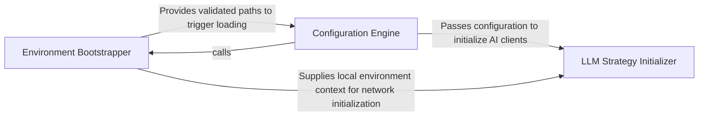

## Details

Handles the pre-flight phase, resolving local paths, loading configuration files, and initializing LLM provider settings.

### Environment Bootstrapper
Handles the pre-flight phase by validating the execution context, resolving paths, and establishing the workspace root.

**Related Classes/Methods**:

- `codeboarding_cli.bootstrap.bootstrap_environment`:38-53

**Source Files:**

- [`agents/constants.py`](https://github.com/CodeBoarding/CodeBoarding/blob/main/.codeboardingagents/constants.py)
  - `agents.constants.LLMDefaults` ([L4-L7](https://github.com/CodeBoarding/CodeBoarding/blob/main/.codeboardingagents/constants.py#L4-L7)) - Class
  - `agents.constants.FileStructureConfig` ([L10-L13](https://github.com/CodeBoarding/CodeBoarding/blob/main/.codeboardingagents/constants.py#L10-L13)) - Class
  - `agents.constants.ModelCapabilities` ([L16-L38](https://github.com/CodeBoarding/CodeBoarding/blob/main/.codeboardingagents/constants.py#L16-L38)) - Class
- [`agents/llm_config.py`](https://github.com/CodeBoarding/CodeBoarding/blob/main/.codeboardingagents/llm_config.py)
  - `agents.llm_config.configure_models` ([L54-L80](https://github.com/CodeBoarding/CodeBoarding/blob/main/.codeboardingagents/llm_config.py#L54-L80)) - Function
- [`codeboarding_cli/bootstrap.py`](https://github.com/CodeBoarding/CodeBoarding/blob/main/.codeboardingcodeboarding_cli/bootstrap.py)
  - `codeboarding_cli.bootstrap.LocalRunPaths` ([L18-L23](https://github.com/CodeBoarding/CodeBoarding/blob/main/.codeboardingcodeboarding_cli/bootstrap.py#L18-L23)) - Class
  - `codeboarding_cli.bootstrap.resolve_local_run_paths` ([L26-L35](https://github.com/CodeBoarding/CodeBoarding/blob/main/.codeboardingcodeboarding_cli/bootstrap.py#L26-L35)) - Function
  - `codeboarding_cli.bootstrap.bootstrap_environment` ([L38-L53](https://github.com/CodeBoarding/CodeBoarding/blob/main/.codeboardingcodeboarding_cli/bootstrap.py#L38-L53)) - Function

### Configuration Engine
Loads and validates configuration files, mapping raw data into structured Python objects with schema enforcement.

**Related Classes/Methods**:

- `user_config.UserConfig`:114-123

**Source Files:**

- [`core/plugin_loader.py`](https://github.com/CodeBoarding/CodeBoarding/blob/main/.codeboardingcore/plugin_loader.py)
  - `core.plugin_loader.load_plugins` ([L17-L46](https://github.com/CodeBoarding/CodeBoarding/blob/main/.codeboardingcore/plugin_loader.py#L17-L46)) - Function
- [`diagram_analysis/__init__.py`](https://github.com/CodeBoarding/CodeBoarding/blob/main/.codeboardingdiagram_analysis/__init__.py)
  - `diagram_analysis.__init__.__getattr__` ([L6-L22](https://github.com/CodeBoarding/CodeBoarding/blob/main/.codeboardingdiagram_analysis/__init__.py#L6-L22)) - Function
- [`user_config.py`](https://github.com/CodeBoarding/CodeBoarding/blob/main/.codeboardinguser_config.py)
  - `user_config.UserConfig.apply_to_env` ([L118-L123](https://github.com/CodeBoarding/CodeBoarding/blob/main/.codeboardinguser_config.py#L118-L123)) - Method

### LLM Strategy Initializer
Translates validated configuration settings into operational LLM model instances and manages provider-specific configurations.

**Related Classes/Methods**:

- `agents.llm_config.configure_models`:54-80

**Source Files:**

- [`user_config.py`](https://github.com/CodeBoarding/CodeBoarding/blob/main/.codeboardinguser_config.py)
  - `user_config.ensure_config_template` ([L163-L169](https://github.com/CodeBoarding/CodeBoarding/blob/main/.codeboardinguser_config.py#L163-L169)) - Function
  - `user_config._append_commented_key` ([L172-L181](https://github.com/CodeBoarding/CodeBoarding/blob/main/.codeboardinguser_config.py#L172-L181)) - Function

### [FAQ](https://github.com/CodeBoarding/GeneratedOnBoardings/tree/main?tab=readme-ov-file#faq)