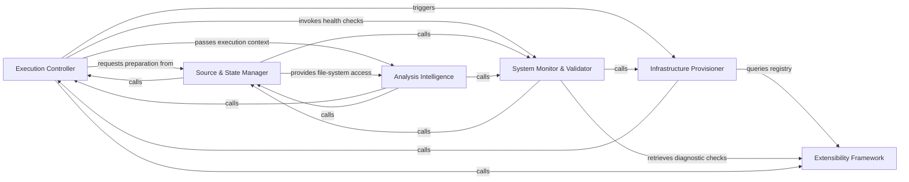

## Details

System entry point and lifecycle manager handling CLI parsing, environment bootstrapping, and pipeline coordination.

### Execution Controller
Manages the primary entry point, CLI parsing, and the high-level selection of analysis pipelines.

**Related Classes/Methods**:

- `codeboarding_cli.bootstrap.bootstrap_environment`:38-53
- `codeboarding_workflows.orchestration.run_analysis_pipeline`:25-48
- `codeboarding_workflows.analysis.run_incremental`:164-213

**Source Files:**

- [`agents/change_status.py`](https://github.com/CodeBoarding/CodeBoarding/blob/main/.codeboardingagents/change_status.py)
  - `agents.change_status.ChangeStatus` ([L4-L9](https://github.com/CodeBoarding/CodeBoarding/blob/main/.codeboardingagents/change_status.py#L4-L9)) - Class
- [`agents/constants.py`](https://github.com/CodeBoarding/CodeBoarding/blob/main/.codeboardingagents/constants.py)
  - `agents.constants.LLMDefaults` ([L4-L7](https://github.com/CodeBoarding/CodeBoarding/blob/main/.codeboardingagents/constants.py#L4-L7)) - Class
  - `agents.constants.FileStructureConfig` ([L10-L13](https://github.com/CodeBoarding/CodeBoarding/blob/main/.codeboardingagents/constants.py#L10-L13)) - Class
  - `agents.constants.ModelCapabilities` ([L16-L38](https://github.com/CodeBoarding/CodeBoarding/blob/main/.codeboardingagents/constants.py#L16-L38)) - Class
- [`agents/llm_config.py`](https://github.com/CodeBoarding/CodeBoarding/blob/main/.codeboardingagents/llm_config.py)
  - `agents.llm_config.configure_models` ([L54-L80](https://github.com/CodeBoarding/CodeBoarding/blob/main/.codeboardingagents/llm_config.py#L54-L80)) - Function
- [`codeboarding_cli/bootstrap.py`](https://github.com/CodeBoarding/CodeBoarding/blob/main/.codeboardingcodeboarding_cli/bootstrap.py)
  - `codeboarding_cli.bootstrap.resolve_local_run_paths` ([L17-L26](https://github.com/CodeBoarding/CodeBoarding/blob/main/.codeboardingcodeboarding_cli/bootstrap.py#L17-L26)) - Function
  - `codeboarding_cli.bootstrap.bootstrap_environment` ([L29-L44](https://github.com/CodeBoarding/CodeBoarding/blob/main/.codeboardingcodeboarding_cli/bootstrap.py#L29-L44)) - Function
- [`codeboarding_cli/commands/full_analysis.py`](https://github.com/CodeBoarding/CodeBoarding/blob/main/.codeboardingcodeboarding_cli/commands/full_analysis.py)
  - `codeboarding_cli.commands.full_analysis.add_arguments` ([L25-L51](https://github.com/CodeBoarding/CodeBoarding/blob/main/.codeboardingcodeboarding_cli/commands/full_analysis.py#L25-L51)) - Function
  - `codeboarding_cli.commands.full_analysis.validate_arguments` ([L54-L67](https://github.com/CodeBoarding/CodeBoarding/blob/main/.codeboardingcodeboarding_cli/commands/full_analysis.py#L54-L67)) - Function
  - `codeboarding_cli.commands.full_analysis.run_from_args` ([L70-L76](https://github.com/CodeBoarding/CodeBoarding/blob/main/.codeboardingcodeboarding_cli/commands/full_analysis.py#L70-L76)) - Function
  - `codeboarding_cli.commands.full_analysis._run_local` ([L79-L113](https://github.com/CodeBoarding/CodeBoarding/blob/main/.codeboardingcodeboarding_cli/commands/full_analysis.py#L79-L113)) - Function
  - `codeboarding_cli.commands.full_analysis._run_remote` ([L116-L154](https://github.com/CodeBoarding/CodeBoarding/blob/main/.codeboardingcodeboarding_cli/commands/full_analysis.py#L116-L154)) - Function
  - `codeboarding_cli.commands.full_analysis._process_one_remote` ([L157-L203](https://github.com/CodeBoarding/CodeBoarding/blob/main/.codeboardingcodeboarding_cli/commands/full_analysis.py#L157-L203)) - Function
- [`codeboarding_cli/commands/incremental_analysis.py`](https://github.com/CodeBoarding/CodeBoarding/blob/main/.codeboardingcodeboarding_cli/commands/incremental_analysis.py)
  - `codeboarding_cli.commands.incremental_analysis.add_arguments` ([L18-L23](https://github.com/CodeBoarding/CodeBoarding/blob/main/.codeboardingcodeboarding_cli/commands/incremental_analysis.py#L18-L23)) - Function
  - `codeboarding_cli.commands.incremental_analysis.validate_arguments` ([L26-L28](https://github.com/CodeBoarding/CodeBoarding/blob/main/.codeboardingcodeboarding_cli/commands/incremental_analysis.py#L26-L28)) - Function
  - `codeboarding_cli.commands.incremental_analysis.run_from_args` ([L31-L85](https://github.com/CodeBoarding/CodeBoarding/blob/main/.codeboardingcodeboarding_cli/commands/incremental_analysis.py#L31-L85)) - Function
  - `codeboarding_cli.commands.incremental_analysis._emit_error` ([L88-L95](https://github.com/CodeBoarding/CodeBoarding/blob/main/.codeboardingcodeboarding_cli/commands/incremental_analysis.py#L88-L95)) - Function
  - `codeboarding_cli.commands.incremental_analysis._emit` ([L98-L101](https://github.com/CodeBoarding/CodeBoarding/blob/main/.codeboardingcodeboarding_cli/commands/incremental_analysis.py#L98-L101)) - Function
- [`codeboarding_cli/commands/partial_analysis.py`](https://github.com/CodeBoarding/CodeBoarding/blob/main/.codeboardingcodeboarding_cli/commands/partial_analysis.py)
  - `codeboarding_cli.commands.partial_analysis.add_arguments` ([L17-L28](https://github.com/CodeBoarding/CodeBoarding/blob/main/.codeboardingcodeboarding_cli/commands/partial_analysis.py#L17-L28)) - Function
  - `codeboarding_cli.commands.partial_analysis.validate_arguments` ([L31-L33](https://github.com/CodeBoarding/CodeBoarding/blob/main/.codeboardingcodeboarding_cli/commands/partial_analysis.py#L31-L33)) - Function
  - `codeboarding_cli.commands.partial_analysis.run_from_args` ([L36-L69](https://github.com/CodeBoarding/CodeBoarding/blob/main/.codeboardingcodeboarding_cli/commands/partial_analysis.py#L36-L69)) - Function
  - `codeboarding_cli.commands.partial_analysis.run_from_args.scope` ([L51-L56](https://github.com/CodeBoarding/CodeBoarding/blob/main/.codeboardingcodeboarding_cli/commands/partial_analysis.py#L51-L56)) - Function
- [`codeboarding_cli/view_instructions.py`](https://github.com/CodeBoarding/CodeBoarding/blob/main/.codeboardingcodeboarding_cli/view_instructions.py)
  - `codeboarding_cli.view_instructions.print_view_instructions` ([L20-L41](https://github.com/CodeBoarding/CodeBoarding/blob/main/.codeboardingcodeboarding_cli/view_instructions.py#L20-L41)) - Function
- [`codeboarding_workflows/analysis.py`](https://github.com/CodeBoarding/CodeBoarding/blob/main/.codeboardingcodeboarding_workflows/analysis.py)
  - `codeboarding_workflows.analysis.build_generator` ([L27-L46](https://github.com/CodeBoarding/CodeBoarding/blob/main/.codeboardingcodeboarding_workflows/analysis.py#L27-L46)) - Function
  - `codeboarding_workflows.analysis.run_partial` ([L77-L146](https://github.com/CodeBoarding/CodeBoarding/blob/main/.codeboardingcodeboarding_workflows/analysis.py#L77-L146)) - Function
  - `codeboarding_workflows.analysis.run_incremental` ([L149-L190](https://github.com/CodeBoarding/CodeBoarding/blob/main/.codeboardingcodeboarding_workflows/analysis.py#L149-L190)) - Function
  - `codeboarding_workflows.analysis.run_incremental_workflow` ([L193-L216](https://github.com/CodeBoarding/CodeBoarding/blob/main/.codeboardingcodeboarding_workflows/analysis.py#L193-L216)) - Function
- [`codeboarding_workflows/orchestration.py`](https://github.com/CodeBoarding/CodeBoarding/blob/main/.codeboardingcodeboarding_workflows/orchestration.py)
  - `codeboarding_workflows.orchestration.run_analysis_pipeline` ([L25-L48](https://github.com/CodeBoarding/CodeBoarding/blob/main/.codeboardingcodeboarding_workflows/orchestration.py#L25-L48)) - Function
- [`codeboarding_workflows/sources/local.py`](https://github.com/CodeBoarding/CodeBoarding/blob/main/.codeboardingcodeboarding_workflows/sources/local.py)
  - `codeboarding_workflows.sources.local.local_source` ([L22-L23](https://github.com/CodeBoarding/CodeBoarding/blob/main/.codeboardingcodeboarding_workflows/sources/local.py#L22-L23)) - Function
- [`constants.py`](https://github.com/CodeBoarding/CodeBoarding/blob/main/.codeboardingconstants.py)
  - `constants.AppConfig` ([L11-L15](https://github.com/CodeBoarding/CodeBoarding/blob/main/.codeboardingconstants.py#L11-L15)) - Class
- [`core/plugin_loader.py`](https://github.com/CodeBoarding/CodeBoarding/blob/main/.codeboardingcore/plugin_loader.py)
  - `core.plugin_loader.load_plugins` ([L17-L46](https://github.com/CodeBoarding/CodeBoarding/blob/main/.codeboardingcore/plugin_loader.py#L17-L46)) - Function
- [`diagram_analysis/__init__.py`](https://github.com/CodeBoarding/CodeBoarding/blob/main/.codeboardingdiagram_analysis/__init__.py)
  - `diagram_analysis.__init__.__getattr__` ([L6-L26](https://github.com/CodeBoarding/CodeBoarding/blob/main/.codeboardingdiagram_analysis/__init__.py#L6-L26)) - Function
- [`diagram_analysis/io_utils.py`](https://github.com/CodeBoarding/CodeBoarding/blob/main/.codeboardingdiagram_analysis/io_utils.py)
  - `diagram_analysis.io_utils._AnalysisFileStore` ([L38-L251](https://github.com/CodeBoarding/CodeBoarding/blob/main/.codeboardingdiagram_analysis/io_utils.py#L38-L251)) - Class
  - `diagram_analysis.io_utils._AnalysisFileStore.read` ([L72-L90](https://github.com/CodeBoarding/CodeBoarding/blob/main/.codeboardingdiagram_analysis/io_utils.py#L72-L90)) - Method
  - `diagram_analysis.io_utils._AnalysisFileStore.read_root` ([L92-L95](https://github.com/CodeBoarding/CodeBoarding/blob/main/.codeboardingdiagram_analysis/io_utils.py#L92-L95)) - Method
  - `diagram_analysis.io_utils._AnalysisFileStore.read_sub` ([L101-L111](https://github.com/CodeBoarding/CodeBoarding/blob/main/.codeboardingdiagram_analysis/io_utils.py#L101-L111)) - Method
  - `diagram_analysis.io_utils._AnalysisFileStore.write_sub` ([L139-L178](https://github.com/CodeBoarding/CodeBoarding/blob/main/.codeboardingdiagram_analysis/io_utils.py#L139-L178)) - Method
  - `diagram_analysis.io_utils._AnalysisFileStore.detect_expanded_components` ([L180-L187](https://github.com/CodeBoarding/CodeBoarding/blob/main/.codeboardingdiagram_analysis/io_utils.py#L180-L187)) - Method
  - `diagram_analysis.io_utils._get_store` ([L261-L266](https://github.com/CodeBoarding/CodeBoarding/blob/main/.codeboardingdiagram_analysis/io_utils.py#L261-L266)) - Function
  - `diagram_analysis.io_utils.load_root_analysis` ([L274-L276](https://github.com/CodeBoarding/CodeBoarding/blob/main/.codeboardingdiagram_analysis/io_utils.py#L274-L276)) - Function
  - `diagram_analysis.io_utils.load_full_analysis` ([L286-L296](https://github.com/CodeBoarding/CodeBoarding/blob/main/.codeboardingdiagram_analysis/io_utils.py#L286-L296)) - Function
  - `diagram_analysis.io_utils.load_analysis_metadata` ([L299-L304](https://github.com/CodeBoarding/CodeBoarding/blob/main/.codeboardingdiagram_analysis/io_utils.py#L299-L304)) - Function
  - `diagram_analysis.io_utils.load_sub_analysis` ([L370-L372](https://github.com/CodeBoarding/CodeBoarding/blob/main/.codeboardingdiagram_analysis/io_utils.py#L370-L372)) - Function
  - `diagram_analysis.io_utils.save_sub_analysis` ([L375-L382](https://github.com/CodeBoarding/CodeBoarding/blob/main/.codeboardingdiagram_analysis/io_utils.py#L375-L382)) - Function
- [`diagram_analysis/run_context.py`](https://github.com/CodeBoarding/CodeBoarding/blob/main/.codeboardingdiagram_analysis/run_context.py)
  - `diagram_analysis.run_context.RunContext.resolve` ([L30-L45](https://github.com/CodeBoarding/CodeBoarding/blob/main/.codeboardingdiagram_analysis/run_context.py#L30-L45)) - Method
  - `diagram_analysis.run_context.RunContext.finalize` ([L47-L49](https://github.com/CodeBoarding/CodeBoarding/blob/main/.codeboardingdiagram_analysis/run_context.py#L47-L49)) - Method
- [`diagram_analysis/run_mode.py`](https://github.com/CodeBoarding/CodeBoarding/blob/main/.codeboardingdiagram_analysis/run_mode.py)
  - `diagram_analysis.run_mode.RunMode` ([L8-L10](https://github.com/CodeBoarding/CodeBoarding/blob/main/.codeboardingdiagram_analysis/run_mode.py#L8-L10)) - Class
- [`main.py`](https://github.com/CodeBoarding/CodeBoarding/blob/main/.codeboardingmain.py)
  - `main._build_shared_parser` ([L11-L22](https://github.com/CodeBoarding/CodeBoarding/blob/main/.codeboardingmain.py#L11-L22)) - Function
  - `main.build_parser` ([L25-L59](https://github.com/CodeBoarding/CodeBoarding/blob/main/.codeboardingmain.py#L25-L59)) - Function
  - `main._inject_default_subcommand` ([L62-L75](https://github.com/CodeBoarding/CodeBoarding/blob/main/.codeboardingmain.py#L62-L75)) - Function
  - `main.main` ([L78-L91](https://github.com/CodeBoarding/CodeBoarding/blob/main/.codeboardingmain.py#L78-L91)) - Function
- [`monitoring/paths.py`](https://github.com/CodeBoarding/CodeBoarding/blob/main/.codeboardingmonitoring/paths.py)
  - `monitoring.paths.generate_log_path` ([L25-L27](https://github.com/CodeBoarding/CodeBoarding/blob/main/.codeboardingmonitoring/paths.py#L25-L27)) - Function
- [`repo_utils/ignore.py`](https://github.com/CodeBoarding/CodeBoarding/blob/main/.codeboardingrepo_utils/ignore.py)
  - `repo_utils.ignore.initialize_codeboardingignore` ([L334-L347](https://github.com/CodeBoarding/CodeBoarding/blob/main/.codeboardingrepo_utils/ignore.py#L334-L347)) - Function
- [`static_analyzer/engine/adapters/python_adapter.py`](https://github.com/CodeBoarding/CodeBoarding/blob/main/.codeboardingstatic_analyzer/engine/adapters/python_adapter.py)
  - `static_analyzer.engine.adapters.python_adapter.PythonAdapter` ([L10-L57](https://github.com/CodeBoarding/CodeBoarding/blob/main/.codeboardingstatic_analyzer/engine/adapters/python_adapter.py#L10-L57)) - Class
  - `static_analyzer.engine.adapters.python_adapter.PythonAdapter.language` ([L13-L14](https://github.com/CodeBoarding/CodeBoarding/blob/main/.codeboardingstatic_analyzer/engine/adapters/python_adapter.py#L13-L14)) - Method
  - `static_analyzer.engine.adapters.python_adapter.PythonAdapter.language_enum` ([L17-L18](https://github.com/CodeBoarding/CodeBoarding/blob/main/.codeboardingstatic_analyzer/engine/adapters/python_adapter.py#L17-L18)) - Method
  - `static_analyzer.engine.adapters.python_adapter.PythonAdapter.lsp_command` ([L21-L22](https://github.com/CodeBoarding/CodeBoarding/blob/main/.codeboardingstatic_analyzer/engine/adapters/python_adapter.py#L21-L22)) - Method
  - `static_analyzer.engine.adapters.python_adapter.PythonAdapter.language_id` ([L25-L26](https://github.com/CodeBoarding/CodeBoarding/blob/main/.codeboardingstatic_analyzer/engine/adapters/python_adapter.py#L25-L26)) - Method
  - `static_analyzer.engine.adapters.python_adapter.PythonAdapter.get_lsp_init_options` ([L28-L37](https://github.com/CodeBoarding/CodeBoarding/blob/main/.codeboardingstatic_analyzer/engine/adapters/python_adapter.py#L28-L37)) - Method
  - `static_analyzer.engine.adapters.python_adapter.PythonAdapter.get_workspace_settings` ([L39-L57](https://github.com/CodeBoarding/CodeBoarding/blob/main/.codeboardingstatic_analyzer/engine/adapters/python_adapter.py#L39-L57)) - Method
- [`static_analyzer/engine/lsp_constants.py`](https://github.com/CodeBoarding/CodeBoarding/blob/main/.codeboardingstatic_analyzer/engine/lsp_constants.py)
  - `static_analyzer.engine.lsp_constants.EdgeStrategy` ([L29-L33](https://github.com/CodeBoarding/CodeBoarding/blob/main/.codeboardingstatic_analyzer/engine/lsp_constants.py#L29-L33)) - Class
- [`user_config.py`](https://github.com/CodeBoarding/CodeBoarding/blob/main/.codeboardinguser_config.py)
  - `user_config.UserConfig.apply_to_env` ([L120-L125](https://github.com/CodeBoarding/CodeBoarding/blob/main/.codeboardinguser_config.py#L120-L125)) - Method
  - `user_config.ensure_config_template` ([L165-L171](https://github.com/CodeBoarding/CodeBoarding/blob/main/.codeboardinguser_config.py#L165-L171)) - Function
  - `user_config._append_commented_key` ([L174-L183](https://github.com/CodeBoarding/CodeBoarding/blob/main/.codeboardinguser_config.py#L174-L183)) - Function
- [`utils.py`](https://github.com/CodeBoarding/CodeBoarding/blob/main/.codeboardingutils.py)
  - `utils.monitoring_enabled` ([L78-L80](https://github.com/CodeBoarding/CodeBoarding/blob/main/.codeboardingutils.py#L78-L80)) - Function
  - `utils.generate_run_id` ([L97-L98](https://github.com/CodeBoarding/CodeBoarding/blob/main/.codeboardingutils.py#L97-L98)) - Function

### Infrastructure Provisioner
Ensures the local environment has the necessary runtimes and Language Server Protocol (LSP) tools required for deep code analysis.

**Related Classes/Methods**:

- `install.run_install`:694-741
- `tool_registry.installers.install_tools`:515-537
- `static_analyzer.dotnet_sdk.resolve_dotnet_sdk`:87-155

**Source Files:**

- [`install.py`](https://github.com/CodeBoarding/CodeBoarding/blob/main/.codeboardinginstall.py)
  - `install.LanguageSupportCheck` ([L43-L62](https://github.com/CodeBoarding/CodeBoarding/blob/main/.codeboardinginstall.py#L43-L62)) - Class
  - `install.LanguageSupportCheck.evaluate` ([L52-L62](https://github.com/CodeBoarding/CodeBoarding/blob/main/.codeboardinginstall.py#L52-L62)) - Method
  - `install.check_npm` ([L81-L101](https://github.com/CodeBoarding/CodeBoarding/blob/main/.codeboardinginstall.py#L81-L101)) - Function
  - `install.bootstrapped_npm_cli_path` ([L104-L106](https://github.com/CodeBoarding/CodeBoarding/blob/main/.codeboardinginstall.py#L104-L106)) - Function
  - `install.extract_tarball_safely` ([L109-L117](https://github.com/CodeBoarding/CodeBoarding/blob/main/.codeboardinginstall.py#L109-L117)) - Function
  - `install.bootstrap_npm` ([L120-L169](https://github.com/CodeBoarding/CodeBoarding/blob/main/.codeboardinginstall.py#L120-L169)) - Function
  - `install.is_non_interactive_mode` ([L172-L178](https://github.com/CodeBoarding/CodeBoarding/blob/main/.codeboardinginstall.py#L172-L178)) - Function
  - `install.ensure_node_runtime` ([L181-L234](https://github.com/CodeBoarding/CodeBoarding/blob/main/.codeboardinginstall.py#L181-L234)) - Function
  - `install.resolve_missing_npm` ([L237-L262](https://github.com/CodeBoarding/CodeBoarding/blob/main/.codeboardinginstall.py#L237-L262)) - Function
  - `install.resolve_npm_availability` ([L265-L272](https://github.com/CodeBoarding/CodeBoarding/blob/main/.codeboardinginstall.py#L265-L272)) - Function
  - `install.parse_args` ([L275-L288](https://github.com/CodeBoarding/CodeBoarding/blob/main/.codeboardinginstall.py#L275-L288)) - Function
  - `install.get_platform_bin_dir` ([L291-L293](https://github.com/CodeBoarding/CodeBoarding/blob/main/.codeboardinginstall.py#L291-L293)) - Function
  - `install.install_node_servers` ([L296-L321](https://github.com/CodeBoarding/CodeBoarding/blob/main/.codeboardinginstall.py#L296-L321)) - Function
  - `install.BinaryStatus` ([L328-L333](https://github.com/CodeBoarding/CodeBoarding/blob/main/.codeboardinginstall.py#L328-L333)) - Class
  - `install.verify_binary` ([L336-L361](https://github.com/CodeBoarding/CodeBoarding/blob/main/.codeboardinginstall.py#L336-L361)) - Function
  - `install.install_vcpp_redistributable` ([L364-L431](https://github.com/CodeBoarding/CodeBoarding/blob/main/.codeboardinginstall.py#L364-L431)) - Function
  - `install.resolve_missing_vcpp` ([L434-L455](https://github.com/CodeBoarding/CodeBoarding/blob/main/.codeboardinginstall.py#L434-L455)) - Function
  - `install.download_binaries` ([L458-L497](https://github.com/CodeBoarding/CodeBoarding/blob/main/.codeboardinginstall.py#L458-L497)) - Function
  - `install.download_jdtls` ([L500-L508](https://github.com/CodeBoarding/CodeBoarding/blob/main/.codeboardinginstall.py#L500-L508)) - Function
  - `install.install_package_manager_lsp_servers` ([L511-L534](https://github.com/CodeBoarding/CodeBoarding/blob/main/.codeboardinginstall.py#L511-L534)) - Function
  - `install.install_pre_commit_hooks` ([L537-L572](https://github.com/CodeBoarding/CodeBoarding/blob/main/.codeboardinginstall.py#L537-L572)) - Function
  - `install._language_checks_from_registry` ([L575-L667](https://github.com/CodeBoarding/CodeBoarding/blob/main/.codeboardinginstall.py#L575-L667)) - Function
  - `install.print_language_support_summary` ([L670-L677](https://github.com/CodeBoarding/CodeBoarding/blob/main/.codeboardinginstall.py#L670-L677)) - Function
  - `install.ensure_tools` ([L680-L713](https://github.com/CodeBoarding/CodeBoarding/blob/main/.codeboardinginstall.py#L680-L713)) - Function
  - `install.run_install` ([L716-L763](https://github.com/CodeBoarding/CodeBoarding/blob/main/.codeboardinginstall.py#L716-L763)) - Function
  - `install.run_install.unified_progress` ([L748-L752](https://github.com/CodeBoarding/CodeBoarding/blob/main/.codeboardinginstall.py#L748-L752)) - Function
  - `install.main` ([L766-L791](https://github.com/CodeBoarding/CodeBoarding/blob/main/.codeboardinginstall.py#L766-L791)) - Function
- [`static_analyzer/dotnet_sdk.py`](https://github.com/CodeBoarding/CodeBoarding/blob/main/.codeboardingstatic_analyzer/dotnet_sdk.py)
  - `static_analyzer.dotnet_sdk.DotnetSdkError` ([L39-L40](https://github.com/CodeBoarding/CodeBoarding/blob/main/.codeboardingstatic_analyzer/dotnet_sdk.py#L39-L40)) - Class
  - `static_analyzer.dotnet_sdk.DotnetSdkResolution` ([L44-L50](https://github.com/CodeBoarding/CodeBoarding/blob/main/.codeboardingstatic_analyzer/dotnet_sdk.py#L44-L50)) - Class
  - `static_analyzer.dotnet_sdk._Probe` ([L54-L57](https://github.com/CodeBoarding/CodeBoarding/blob/main/.codeboardingstatic_analyzer/dotnet_sdk.py#L54-L57)) - Class
  - `static_analyzer.dotnet_sdk.dotnet_install_dir` ([L60-L61](https://github.com/CodeBoarding/CodeBoarding/blob/main/.codeboardingstatic_analyzer/dotnet_sdk.py#L60-L61)) - Function
  - `static_analyzer.dotnet_sdk.private_dotnet_path` ([L64-L65](https://github.com/CodeBoarding/CodeBoarding/blob/main/.codeboardingstatic_analyzer/dotnet_sdk.py#L64-L65)) - Function
  - `static_analyzer.dotnet_sdk.find_global_json` ([L68-L75](https://github.com/CodeBoarding/CodeBoarding/blob/main/.codeboardingstatic_analyzer/dotnet_sdk.py#L68-L75)) - Function
  - `static_analyzer.dotnet_sdk.read_global_sdk_version` ([L78-L84](https://github.com/CodeBoarding/CodeBoarding/blob/main/.codeboardingstatic_analyzer/dotnet_sdk.py#L78-L84)) - Function
  - `static_analyzer.dotnet_sdk.resolve_dotnet_sdk` ([L87-L155](https://github.com/CodeBoarding/CodeBoarding/blob/main/.codeboardingstatic_analyzer/dotnet_sdk.py#L87-L155)) - Function
  - `static_analyzer.dotnet_sdk.system_dotnet_env` ([L158-L185](https://github.com/CodeBoarding/CodeBoarding/blob/main/.codeboardingstatic_analyzer/dotnet_sdk.py#L158-L185)) - Function
  - `static_analyzer.dotnet_sdk._private_dotnet_env` ([L188-L193](https://github.com/CodeBoarding/CodeBoarding/blob/main/.codeboardingstatic_analyzer/dotnet_sdk.py#L188-L193)) - Function
  - `static_analyzer.dotnet_sdk._merged_env` ([L196-L199](https://github.com/CodeBoarding/CodeBoarding/blob/main/.codeboardingstatic_analyzer/dotnet_sdk.py#L196-L199)) - Function
  - `static_analyzer.dotnet_sdk._probe_dotnet` ([L202-L215](https://github.com/CodeBoarding/CodeBoarding/blob/main/.codeboardingstatic_analyzer/dotnet_sdk.py#L202-L215)) - Function
  - `static_analyzer.dotnet_sdk._has_sdk_major` ([L218-L242](https://github.com/CodeBoarding/CodeBoarding/blob/main/.codeboardingstatic_analyzer/dotnet_sdk.py#L218-L242)) - Function
  - `static_analyzer.dotnet_sdk._install_from_global_json` ([L245-L247](https://github.com/CodeBoarding/CodeBoarding/blob/main/.codeboardingstatic_analyzer/dotnet_sdk.py#L245-L247)) - Function
  - `static_analyzer.dotnet_sdk._install_channel` ([L250-L252](https://github.com/CodeBoarding/CodeBoarding/blob/main/.codeboardingstatic_analyzer/dotnet_sdk.py#L250-L252)) - Function
  - `static_analyzer.dotnet_sdk._run_install_script` ([L255-L291](https://github.com/CodeBoarding/CodeBoarding/blob/main/.codeboardingstatic_analyzer/dotnet_sdk.py#L255-L291)) - Function
  - `static_analyzer.dotnet_sdk._download_install_script` ([L294-L316](https://github.com/CodeBoarding/CodeBoarding/blob/main/.codeboardingstatic_analyzer/dotnet_sdk.py#L294-L316)) - Function
  - `static_analyzer.dotnet_sdk._to_powershell_install_args` ([L319-L327](https://github.com/CodeBoarding/CodeBoarding/blob/main/.codeboardingstatic_analyzer/dotnet_sdk.py#L319-L327)) - Function
- [`static_analyzer/engine/adapters/csharp_adapter.py`](https://github.com/CodeBoarding/CodeBoarding/blob/main/.codeboardingstatic_analyzer/engine/adapters/csharp_adapter.py)
  - `static_analyzer.engine.adapters.csharp_adapter.CSharpAdapter` ([L29-L268](https://github.com/CodeBoarding/CodeBoarding/blob/main/.codeboardingstatic_analyzer/engine/adapters/csharp_adapter.py#L29-L268)) - Class
  - `static_analyzer.engine.adapters.csharp_adapter.CSharpAdapter.language` ([L32-L33](https://github.com/CodeBoarding/CodeBoarding/blob/main/.codeboardingstatic_analyzer/engine/adapters/csharp_adapter.py#L32-L33)) - Method
  - `static_analyzer.engine.adapters.csharp_adapter.CSharpAdapter.language_enum` ([L36-L37](https://github.com/CodeBoarding/CodeBoarding/blob/main/.codeboardingstatic_analyzer/engine/adapters/csharp_adapter.py#L36-L37)) - Method
  - `static_analyzer.engine.adapters.csharp_adapter.CSharpAdapter.lsp_command` ([L40-L41](https://github.com/CodeBoarding/CodeBoarding/blob/main/.codeboardingstatic_analyzer/engine/adapters/csharp_adapter.py#L40-L41)) - Method
  - `static_analyzer.engine.adapters.csharp_adapter.CSharpAdapter.language_id` ([L44-L45](https://github.com/CodeBoarding/CodeBoarding/blob/main/.codeboardingstatic_analyzer/engine/adapters/csharp_adapter.py#L44-L45)) - Method
  - `static_analyzer.engine.adapters.csharp_adapter.CSharpAdapter.get_lsp_command` ([L47-L55](https://github.com/CodeBoarding/CodeBoarding/blob/main/.codeboardingstatic_analyzer/engine/adapters/csharp_adapter.py#L47-L55)) - Method
  - `static_analyzer.engine.adapters.csharp_adapter.CSharpAdapter._ensure_csharp_ls_installed` ([L57-L89](https://github.com/CodeBoarding/CodeBoarding/blob/main/.codeboardingstatic_analyzer/engine/adapters/csharp_adapter.py#L57-L89)) - Method
  - `static_analyzer.engine.adapters.csharp_adapter.CSharpAdapter.build_qualified_name` ([L91-L135](https://github.com/CodeBoarding/CodeBoarding/blob/main/.codeboardingstatic_analyzer/engine/adapters/csharp_adapter.py#L91-L135)) - Method
  - `static_analyzer.engine.adapters.csharp_adapter.CSharpAdapter.get_lsp_init_options` ([L144-L153](https://github.com/CodeBoarding/CodeBoarding/blob/main/.codeboardingstatic_analyzer/engine/adapters/csharp_adapter.py#L144-L153)) - Method
  - `static_analyzer.engine.adapters.csharp_adapter.CSharpAdapter.get_workspace_settings` ([L155-L160](https://github.com/CodeBoarding/CodeBoarding/blob/main/.codeboardingstatic_analyzer/engine/adapters/csharp_adapter.py#L155-L160)) - Method
  - `static_analyzer.engine.adapters.csharp_adapter.CSharpAdapter.probe_before_open` ([L163-L165](https://github.com/CodeBoarding/CodeBoarding/blob/main/.codeboardingstatic_analyzer/engine/adapters/csharp_adapter.py#L163-L165)) - Method
  - `static_analyzer.engine.adapters.csharp_adapter.CSharpAdapter.get_lsp_default_timeout` ([L167-L169](https://github.com/CodeBoarding/CodeBoarding/blob/main/.codeboardingstatic_analyzer/engine/adapters/csharp_adapter.py#L167-L169)) - Method
  - `static_analyzer.engine.adapters.csharp_adapter.CSharpAdapter.get_probe_timeout_minimum` ([L171-L173](https://github.com/CodeBoarding/CodeBoarding/blob/main/.codeboardingstatic_analyzer/engine/adapters/csharp_adapter.py#L171-L173)) - Method
  - `static_analyzer.engine.adapters.csharp_adapter.CSharpAdapter.prepare_project` ([L188-L238](https://github.com/CodeBoarding/CodeBoarding/blob/main/.codeboardingstatic_analyzer/engine/adapters/csharp_adapter.py#L188-L238)) - Method
  - `static_analyzer.engine.adapters.csharp_adapter.CSharpAdapter.get_lsp_env` ([L240-L256](https://github.com/CodeBoarding/CodeBoarding/blob/main/.codeboardingstatic_analyzer/engine/adapters/csharp_adapter.py#L240-L256)) - Method
  - `static_analyzer.engine.adapters.csharp_adapter.CSharpAdapter.fail_on_empty_symbols` ([L259-L260](https://github.com/CodeBoarding/CodeBoarding/blob/main/.codeboardingstatic_analyzer/engine/adapters/csharp_adapter.py#L259-L260)) - Method
- [`static_analyzer/engine/adapters/go_adapter.py`](https://github.com/CodeBoarding/CodeBoarding/blob/main/.codeboardingstatic_analyzer/engine/adapters/go_adapter.py)
  - `static_analyzer.engine.adapters.go_adapter.GoAdapter` ([L73-L223](https://github.com/CodeBoarding/CodeBoarding/blob/main/.codeboardingstatic_analyzer/engine/adapters/go_adapter.py#L73-L223)) - Class
  - `static_analyzer.engine.adapters.go_adapter.GoAdapter.language` ([L76-L77](https://github.com/CodeBoarding/CodeBoarding/blob/main/.codeboardingstatic_analyzer/engine/adapters/go_adapter.py#L76-L77)) - Method
  - `static_analyzer.engine.adapters.go_adapter.GoAdapter.language_enum` ([L80-L81](https://github.com/CodeBoarding/CodeBoarding/blob/main/.codeboardingstatic_analyzer/engine/adapters/go_adapter.py#L80-L81)) - Method
  - `static_analyzer.engine.adapters.go_adapter.GoAdapter.lsp_command` ([L84-L85](https://github.com/CodeBoarding/CodeBoarding/blob/main/.codeboardingstatic_analyzer/engine/adapters/go_adapter.py#L84-L85)) - Method
  - `static_analyzer.engine.adapters.go_adapter.GoAdapter.language_id` ([L88-L89](https://github.com/CodeBoarding/CodeBoarding/blob/main/.codeboardingstatic_analyzer/engine/adapters/go_adapter.py#L88-L89)) - Method
  - `static_analyzer.engine.adapters.go_adapter.GoAdapter.get_lsp_command` ([L91-L103](https://github.com/CodeBoarding/CodeBoarding/blob/main/.codeboardingstatic_analyzer/engine/adapters/go_adapter.py#L91-L103)) - Method
  - `static_analyzer.engine.adapters.go_adapter.GoAdapter.build_reference_key` ([L134-L136](https://github.com/CodeBoarding/CodeBoarding/blob/main/.codeboardingstatic_analyzer/engine/adapters/go_adapter.py#L134-L136)) - Method
  - `static_analyzer.engine.adapters.go_adapter.GoAdapter.get_workspace_settings` ([L167-L176](https://github.com/CodeBoarding/CodeBoarding/blob/main/.codeboardingstatic_analyzer/engine/adapters/go_adapter.py#L167-L176)) - Method
  - `static_analyzer.engine.adapters.go_adapter.GoAdapter.get_lsp_env` ([L178-L186](https://github.com/CodeBoarding/CodeBoarding/blob/main/.codeboardingstatic_analyzer/engine/adapters/go_adapter.py#L178-L186)) - Method
- [`static_analyzer/engine/adapters/java_adapter.py`](https://github.com/CodeBoarding/CodeBoarding/blob/main/.codeboardingstatic_analyzer/engine/adapters/java_adapter.py)
  - `static_analyzer.engine.adapters.java_adapter.JavaAdapter.get_lsp_command` ([L51-L71](https://github.com/CodeBoarding/CodeBoarding/blob/main/.codeboardingstatic_analyzer/engine/adapters/java_adapter.py#L51-L71)) - Method
  - `static_analyzer.engine.adapters.java_adapter.JavaAdapter._find_jdtls_root` ([L74-L103](https://github.com/CodeBoarding/CodeBoarding/blob/main/.codeboardingstatic_analyzer/engine/adapters/java_adapter.py#L74-L103)) - Method
  - `static_analyzer.engine.adapters.java_adapter.JavaAdapter._calculate_heap_size` ([L106-L131](https://github.com/CodeBoarding/CodeBoarding/blob/main/.codeboardingstatic_analyzer/engine/adapters/java_adapter.py#L106-L131)) - Method
- [`static_analyzer/engine/adapters/rust_adapter.py`](https://github.com/CodeBoarding/CodeBoarding/blob/main/.codeboardingstatic_analyzer/engine/adapters/rust_adapter.py)
  - `static_analyzer.engine.adapters.rust_adapter.RustAdapter` ([L76-L232](https://github.com/CodeBoarding/CodeBoarding/blob/main/.codeboardingstatic_analyzer/engine/adapters/rust_adapter.py#L76-L232)) - Class
  - `static_analyzer.engine.adapters.rust_adapter.RustAdapter.language` ([L80-L81](https://github.com/CodeBoarding/CodeBoarding/blob/main/.codeboardingstatic_analyzer/engine/adapters/rust_adapter.py#L80-L81)) - Method
  - `static_analyzer.engine.adapters.rust_adapter.RustAdapter.language_enum` ([L84-L85](https://github.com/CodeBoarding/CodeBoarding/blob/main/.codeboardingstatic_analyzer/engine/adapters/rust_adapter.py#L84-L85)) - Method
  - `static_analyzer.engine.adapters.rust_adapter.RustAdapter.references_per_query_timeout` ([L88-L91](https://github.com/CodeBoarding/CodeBoarding/blob/main/.codeboardingstatic_analyzer/engine/adapters/rust_adapter.py#L88-L91)) - Method
  - `static_analyzer.engine.adapters.rust_adapter.RustAdapter.wait_for_workspace_ready` ([L94-L100](https://github.com/CodeBoarding/CodeBoarding/blob/main/.codeboardingstatic_analyzer/engine/adapters/rust_adapter.py#L94-L100)) - Method
  - `static_analyzer.engine.adapters.rust_adapter.RustAdapter.extra_client_capabilities` ([L103-L107](https://github.com/CodeBoarding/CodeBoarding/blob/main/.codeboardingstatic_analyzer/engine/adapters/rust_adapter.py#L103-L107)) - Method
  - `static_analyzer.engine.adapters.rust_adapter.RustAdapter.lsp_command` ([L133-L134](https://github.com/CodeBoarding/CodeBoarding/blob/main/.codeboardingstatic_analyzer/engine/adapters/rust_adapter.py#L133-L134)) - Method
  - `static_analyzer.engine.adapters.rust_adapter.RustAdapter.language_id` ([L137-L138](https://github.com/CodeBoarding/CodeBoarding/blob/main/.codeboardingstatic_analyzer/engine/adapters/rust_adapter.py#L137-L138)) - Method
  - `static_analyzer.engine.adapters.rust_adapter.RustAdapter.get_lsp_command` ([L140-L155](https://github.com/CodeBoarding/CodeBoarding/blob/main/.codeboardingstatic_analyzer/engine/adapters/rust_adapter.py#L140-L155)) - Method
  - `static_analyzer.engine.adapters.rust_adapter.RustAdapter.get_lsp_init_options` ([L187-L206](https://github.com/CodeBoarding/CodeBoarding/blob/main/.codeboardingstatic_analyzer/engine/adapters/rust_adapter.py#L187-L206)) - Method
- [`static_analyzer/engine/language_adapter.py`](https://github.com/CodeBoarding/CodeBoarding/blob/main/.codeboardingstatic_analyzer/engine/language_adapter.py)
  - `static_analyzer.engine.language_adapter.LanguageAdapter.lsp_command` ([L50-L51](https://github.com/CodeBoarding/CodeBoarding/blob/main/.codeboardingstatic_analyzer/engine/language_adapter.py#L50-L51)) - Method
  - `static_analyzer.engine.language_adapter.LanguageAdapter.get_lsp_command` ([L62-L74](https://github.com/CodeBoarding/CodeBoarding/blob/main/.codeboardingstatic_analyzer/engine/language_adapter.py#L62-L74)) - Method
- [`static_analyzer/engine/utils.py`](https://github.com/CodeBoarding/CodeBoarding/blob/main/.codeboardingstatic_analyzer/engine/utils.py)
  - `static_analyzer.engine.utils._MemoryStatusEx` ([L35-L46](https://github.com/CodeBoarding/CodeBoarding/blob/main/.codeboardingstatic_analyzer/engine/utils.py#L35-L46)) - Class
  - `static_analyzer.engine.utils.total_ram_gb` ([L49-L68](https://github.com/CodeBoarding/CodeBoarding/blob/main/.codeboardingstatic_analyzer/engine/utils.py#L49-L68)) - Function
- [`static_analyzer/java_utils.py`](https://github.com/CodeBoarding/CodeBoarding/blob/main/.codeboardingstatic_analyzer/java_utils.py)
  - `static_analyzer.java_utils.get_java_version` ([L12-L34](https://github.com/CodeBoarding/CodeBoarding/blob/main/.codeboardingstatic_analyzer/java_utils.py#L12-L34)) - Function
  - `static_analyzer.java_utils.detect_java_installations` ([L37-L92](https://github.com/CodeBoarding/CodeBoarding/blob/main/.codeboardingstatic_analyzer/java_utils.py#L37-L92)) - Function
  - `static_analyzer.java_utils.find_java_21_or_later` ([L95-L137](https://github.com/CodeBoarding/CodeBoarding/blob/main/.codeboardingstatic_analyzer/java_utils.py#L95-L137)) - Function
  - `static_analyzer.java_utils._is_arm64` ([L140-L142](https://github.com/CodeBoarding/CodeBoarding/blob/main/.codeboardingstatic_analyzer/java_utils.py#L140-L142)) - Function
  - `static_analyzer.java_utils.get_jdtls_config_dir` ([L145-L157](https://github.com/CodeBoarding/CodeBoarding/blob/main/.codeboardingstatic_analyzer/java_utils.py#L145-L157)) - Function
  - `static_analyzer.java_utils.find_launcher_jar` ([L160-L181](https://github.com/CodeBoarding/CodeBoarding/blob/main/.codeboardingstatic_analyzer/java_utils.py#L160-L181)) - Function
  - `static_analyzer.java_utils.create_jdtls_command` ([L184-L242](https://github.com/CodeBoarding/CodeBoarding/blob/main/.codeboardingstatic_analyzer/java_utils.py#L184-L242)) - Function
- [`static_analyzer/typescript_config_scanner.py`](https://github.com/CodeBoarding/CodeBoarding/blob/main/.codeboardingstatic_analyzer/typescript_config_scanner.py)
  - `static_analyzer.typescript_config_scanner._resolve_system_tsc` ([L215-L218](https://github.com/CodeBoarding/CodeBoarding/blob/main/.codeboardingstatic_analyzer/typescript_config_scanner.py#L215-L218)) - Function
  - `static_analyzer.typescript_config_scanner._resolve_tsc_command` ([L221-L235](https://github.com/CodeBoarding/CodeBoarding/blob/main/.codeboardingstatic_analyzer/typescript_config_scanner.py#L221-L235)) - Function
- [`tool_registry/installers.py`](https://github.com/CodeBoarding/CodeBoarding/blob/main/.codeboardingtool_registry/installers.py)
  - `tool_registry.installers.asset_url` ([L51-L57](https://github.com/CodeBoarding/CodeBoarding/blob/main/.codeboardingtool_registry/installers.py#L51-L57)) - Function
  - `tool_registry.installers.resolve_native_asset_name` ([L60-L82](https://github.com/CodeBoarding/CodeBoarding/blob/main/.codeboardingtool_registry/installers.py#L60-L82)) - Function
  - `tool_registry.installers._is_compressed_asset` ([L85-L88](https://github.com/CodeBoarding/CodeBoarding/blob/main/.codeboardingtool_registry/installers.py#L85-L88)) - Function
  - `tool_registry.installers._extract_compressed_binary` ([L91-L137](https://github.com/CodeBoarding/CodeBoarding/blob/main/.codeboardingtool_registry/installers.py#L91-L137)) - Function
  - `tool_registry.installers.download_asset` ([L140-L163](https://github.com/CodeBoarding/CodeBoarding/blob/main/.codeboardingtool_registry/installers.py#L140-L163)) - Function
  - `tool_registry.installers.install_native_tools` ([L169-L271](https://github.com/CodeBoarding/CodeBoarding/blob/main/.codeboardingtool_registry/installers.py#L169-L271)) - Function
  - `tool_registry.installers.package_manager_tool_dir` ([L277-L284](https://github.com/CodeBoarding/CodeBoarding/blob/main/.codeboardingtool_registry/installers.py#L277-L284)) - Function
  - `tool_registry.installers.package_manager_tool_fingerprint` ([L287-L301](https://github.com/CodeBoarding/CodeBoarding/blob/main/.codeboardingtool_registry/installers.py#L287-L301)) - Function
  - `tool_registry.installers.package_manager_tool_is_current` ([L304-L320](https://github.com/CodeBoarding/CodeBoarding/blob/main/.codeboardingtool_registry/installers.py#L304-L320)) - Function
  - `tool_registry.installers._write_package_manager_tool_stamp` ([L323-L330](https://github.com/CodeBoarding/CodeBoarding/blob/main/.codeboardingtool_registry/installers.py#L323-L330)) - Function
  - `tool_registry.installers.install_package_manager_tools` ([L333-L423](https://github.com/CodeBoarding/CodeBoarding/blob/main/.codeboardingtool_registry/installers.py#L333-L423)) - Function
  - `tool_registry.installers.install_node_tools` ([L429-L469](https://github.com/CodeBoarding/CodeBoarding/blob/main/.codeboardingtool_registry/installers.py#L429-L469)) - Function
  - `tool_registry.installers.install_archive_tool` ([L475-L509](https://github.com/CodeBoarding/CodeBoarding/blob/main/.codeboardingtool_registry/installers.py#L475-L509)) - Function
  - `tool_registry.installers.install_tools` ([L515-L537](https://github.com/CodeBoarding/CodeBoarding/blob/main/.codeboardingtool_registry/installers.py#L515-L537)) - Function
  - `tool_registry.installers.embedded_node_is_healthy` ([L548-L574](https://github.com/CodeBoarding/CodeBoarding/blob/main/.codeboardingtool_registry/installers.py#L548-L574)) - Function
  - `tool_registry.installers.initialize_nodeenv_globals` ([L577-L600](https://github.com/CodeBoarding/CodeBoarding/blob/main/.codeboardingtool_registry/installers.py#L577-L600)) - Function
  - `tool_registry.installers.nodeenv_needs_unofficial_builds` ([L603-L618](https://github.com/CodeBoarding/CodeBoarding/blob/main/.codeboardingtool_registry/installers.py#L603-L618)) - Function
  - `tool_registry.installers.install_embedded_node` ([L621-L703](https://github.com/CodeBoarding/CodeBoarding/blob/main/.codeboardingtool_registry/installers.py#L621-L703)) - Function
- [`tool_registry/manifest.py`](https://github.com/CodeBoarding/CodeBoarding/blob/main/.codeboardingtool_registry/manifest.py)
  - `tool_registry.manifest.installed_version` ([L40-L44](https://github.com/CodeBoarding/CodeBoarding/blob/main/.codeboardingtool_registry/manifest.py#L40-L44)) - Function
  - `tool_registry.manifest.manifest_path` ([L47-L48](https://github.com/CodeBoarding/CodeBoarding/blob/main/.codeboardingtool_registry/manifest.py#L47-L48)) - Function
  - `tool_registry.manifest.read_manifest` ([L51-L55](https://github.com/CodeBoarding/CodeBoarding/blob/main/.codeboardingtool_registry/manifest.py#L51-L55)) - Function
  - `tool_registry.manifest.npm_specs_fingerprint` ([L58-L68](https://github.com/CodeBoarding/CodeBoarding/blob/main/.codeboardingtool_registry/manifest.py#L58-L68)) - Function
  - `tool_registry.manifest.tools_fingerprint` ([L71-L91](https://github.com/CodeBoarding/CodeBoarding/blob/main/.codeboardingtool_registry/manifest.py#L71-L91)) - Function
  - `tool_registry.manifest.write_manifest` ([L94-L116](https://github.com/CodeBoarding/CodeBoarding/blob/main/.codeboardingtool_registry/manifest.py#L94-L116)) - Function
  - `tool_registry.manifest.needs_install` ([L119-L128](https://github.com/CodeBoarding/CodeBoarding/blob/main/.codeboardingtool_registry/manifest.py#L119-L128)) - Function
  - `tool_registry.manifest.acquire_lock` ([L134-L160](https://github.com/CodeBoarding/CodeBoarding/blob/main/.codeboardingtool_registry/manifest.py#L134-L160)) - Function
  - `tool_registry.manifest.build_config` ([L166-L186](https://github.com/CodeBoarding/CodeBoarding/blob/main/.codeboardingtool_registry/manifest.py#L166-L186)) - Function
  - `tool_registry.manifest.package_manager_tool_path` ([L189-L200](https://github.com/CodeBoarding/CodeBoarding/blob/main/.codeboardingtool_registry/manifest.py#L189-L200)) - Function
  - `tool_registry.manifest.resolve_config` ([L203-L249](https://github.com/CodeBoarding/CodeBoarding/blob/main/.codeboardingtool_registry/manifest.py#L203-L249)) - Function
  - `tool_registry.manifest.resolve_config_from_path` ([L252-L275](https://github.com/CodeBoarding/CodeBoarding/blob/main/.codeboardingtool_registry/manifest.py#L252-L275)) - Function
  - `tool_registry.manifest.has_required_tools` ([L278-L347](https://github.com/CodeBoarding/CodeBoarding/blob/main/.codeboardingtool_registry/manifest.py#L278-L347)) - Function
- [`tool_registry/paths.py`](https://github.com/CodeBoarding/CodeBoarding/blob/main/.codeboardingtool_registry/paths.py)
  - `tool_registry.paths.exe_suffix` ([L31-L33](https://github.com/CodeBoarding/CodeBoarding/blob/main/.codeboardingtool_registry/paths.py#L31-L33)) - Function
  - `tool_registry.paths.platform_bin_dir` ([L53-L59](https://github.com/CodeBoarding/CodeBoarding/blob/main/.codeboardingtool_registry/paths.py#L53-L59)) - Function
  - `tool_registry.paths.native_binary_ok` ([L62-L72](https://github.com/CodeBoarding/CodeBoarding/blob/main/.codeboardingtool_registry/paths.py#L62-L72)) - Function
  - `tool_registry.paths.user_data_dir` ([L78-L80](https://github.com/CodeBoarding/CodeBoarding/blob/main/.codeboardingtool_registry/paths.py#L78-L80)) - Function
  - `tool_registry.paths.get_servers_dir` ([L83-L85](https://github.com/CodeBoarding/CodeBoarding/blob/main/.codeboardingtool_registry/paths.py#L83-L85)) - Function
  - `tool_registry.paths.nodeenv_root_dir` ([L91-L93](https://github.com/CodeBoarding/CodeBoarding/blob/main/.codeboardingtool_registry/paths.py#L91-L93)) - Function
  - `tool_registry.paths.nodeenv_bin_dir` ([L96-L99](https://github.com/CodeBoarding/CodeBoarding/blob/main/.codeboardingtool_registry/paths.py#L96-L99)) - Function
  - `tool_registry.paths.embedded_node_path` ([L102-L106](https://github.com/CodeBoarding/CodeBoarding/blob/main/.codeboardingtool_registry/paths.py#L102-L106)) - Function
  - `tool_registry.paths.embedded_npm_path` ([L109-L113](https://github.com/CodeBoarding/CodeBoarding/blob/main/.codeboardingtool_registry/paths.py#L109-L113)) - Function
  - `tool_registry.paths.embedded_npm_cli_path` ([L116-L119](https://github.com/CodeBoarding/CodeBoarding/blob/main/.codeboardingtool_registry/paths.py#L116-L119)) - Function
  - `tool_registry.paths.node_version_tuple` ([L126-L172](https://github.com/CodeBoarding/CodeBoarding/blob/main/.codeboardingtool_registry/paths.py#L126-L172)) - Function
  - `tool_registry.paths.node_is_acceptable` ([L175-L196](https://github.com/CodeBoarding/CodeBoarding/blob/main/.codeboardingtool_registry/paths.py#L175-L196)) - Function
  - `tool_registry.paths.preferred_node_path` ([L202-L217](https://github.com/CodeBoarding/CodeBoarding/blob/main/.codeboardingtool_registry/paths.py#L202-L217)) - Function
  - `tool_registry.paths.sibling_npm_path` ([L220-L231](https://github.com/CodeBoarding/CodeBoarding/blob/main/.codeboardingtool_registry/paths.py#L220-L231)) - Function
  - `tool_registry.paths.preferred_npm_command` ([L234-L252](https://github.com/CodeBoarding/CodeBoarding/blob/main/.codeboardingtool_registry/paths.py#L234-L252)) - Function
  - `tool_registry.paths.npm_subprocess_env` ([L255-L264](https://github.com/CodeBoarding/CodeBoarding/blob/main/.codeboardingtool_registry/paths.py#L255-L264)) - Function
- [`tool_registry/registry.py`](https://github.com/CodeBoarding/CodeBoarding/blob/main/.codeboardingtool_registry/registry.py)
  - `tool_registry.registry.ToolKind` ([L54-L62](https://github.com/CodeBoarding/CodeBoarding/blob/main/.codeboardingtool_registry/registry.py#L54-L62)) - Class
  - `tool_registry.registry.ConfigSection` ([L65-L69](https://github.com/CodeBoarding/CodeBoarding/blob/main/.codeboardingtool_registry/registry.py#L65-L69)) - Class
  - `tool_registry.registry.ToolSource` ([L73-L76](https://github.com/CodeBoarding/CodeBoarding/blob/main/.codeboardingtool_registry/registry.py#L73-L76)) - Class
  - `tool_registry.registry.GitHubToolSource` ([L80-L101](https://github.com/CodeBoarding/CodeBoarding/blob/main/.codeboardingtool_registry/registry.py#L80-L101)) - Class
  - `tool_registry.registry.UpstreamToolSource` ([L105-L109](https://github.com/CodeBoarding/CodeBoarding/blob/main/.codeboardingtool_registry/registry.py#L105-L109)) - Class
  - `tool_registry.registry.PackageManagerToolSource` ([L113-L121](https://github.com/CodeBoarding/CodeBoarding/blob/main/.codeboardingtool_registry/registry.py#L113-L121)) - Class
  - `tool_registry.registry.ToolDependency` ([L125-L150](https://github.com/CodeBoarding/CodeBoarding/blob/main/.codeboardingtool_registry/registry.py#L125-L150)) - Class
  - `tool_registry.registry.ToolDependency.is_available_on_host` ([L138-L150](https://github.com/CodeBoarding/CodeBoarding/blob/main/.codeboardingtool_registry/registry.py#L138-L150)) - Method
- [`utils.py`](https://github.com/CodeBoarding/CodeBoarding/blob/main/.codeboardingutils.py)
  - `utils.CFGGenerationError` ([L20-L21](https://github.com/CodeBoarding/CodeBoarding/blob/main/.codeboardingutils.py#L20-L21)) - Class
  - `utils.get_config` ([L83-L89](https://github.com/CodeBoarding/CodeBoarding/blob/main/.codeboardingutils.py#L83-L89)) - Function
- [`vscode_constants.py`](https://github.com/CodeBoarding/CodeBoarding/blob/main/.codeboardingvscode_constants.py)
  - `vscode_constants.find_runnable` ([L65-L69](https://github.com/CodeBoarding/CodeBoarding/blob/main/.codeboardingvscode_constants.py#L65-L69)) - Function

### Source & State Manager
Handles the lifecycle of the target codebase, including cloning, local path resolution, and maintaining the analysis cache.

**Related Classes/Methods**:

- `codeboarding_workflows.sources.local.local_source`:22-23
- `repo_utils.git_ops.get_current_commit`:47-64
- `static_analyzer.analysis_cache.copy_cache_files`:279-318

**Source Files:**

- [`codeboarding_cli/commands/full_analysis.py`](https://github.com/CodeBoarding/CodeBoarding/blob/main/.codeboardingcodeboarding_cli/commands/full_analysis.py)
  - `codeboarding_cli.commands.full_analysis._run_local.scope` ([L93-L101](https://github.com/CodeBoarding/CodeBoarding/blob/main/.codeboardingcodeboarding_cli/commands/full_analysis.py#L93-L101)) - Function
  - `codeboarding_cli.commands.full_analysis._process_one_remote.scope` ([L164-L197](https://github.com/CodeBoarding/CodeBoarding/blob/main/.codeboardingcodeboarding_cli/commands/full_analysis.py#L164-L197)) - Function
- [`codeboarding_workflows/analysis.py`](https://github.com/CodeBoarding/CodeBoarding/blob/main/.codeboardingcodeboarding_workflows/analysis.py)
  - `codeboarding_workflows.analysis.run_full` ([L49-L74](https://github.com/CodeBoarding/CodeBoarding/blob/main/.codeboardingcodeboarding_workflows/analysis.py#L49-L74)) - Function
- [`codeboarding_workflows/rendering.py`](https://github.com/CodeBoarding/CodeBoarding/blob/main/.codeboardingcodeboarding_workflows/rendering.py)
  - `codeboarding_workflows.rendering.render_docs` ([L104-L139](https://github.com/CodeBoarding/CodeBoarding/blob/main/.codeboardingcodeboarding_workflows/rendering.py#L104-L139)) - Function
- [`codeboarding_workflows/sources/local.py`](https://github.com/CodeBoarding/CodeBoarding/blob/main/.codeboardingcodeboarding_workflows/sources/local.py)
  - `codeboarding_workflows.sources.local.SourceContext` ([L8-L18](https://github.com/CodeBoarding/CodeBoarding/blob/main/.codeboardingcodeboarding_workflows/sources/local.py#L8-L18)) - Class
- [`codeboarding_workflows/sources/remote.py`](https://github.com/CodeBoarding/CodeBoarding/blob/main/.codeboardingcodeboarding_workflows/sources/remote.py)
  - `codeboarding_workflows.sources.remote.onboarding_materials_exist` ([L18-L28](https://github.com/CodeBoarding/CodeBoarding/blob/main/.codeboardingcodeboarding_workflows/sources/remote.py#L18-L28)) - Function
  - `codeboarding_workflows.sources.remote.remote_source` ([L32-L71](https://github.com/CodeBoarding/CodeBoarding/blob/main/.codeboardingcodeboarding_workflows/sources/remote.py#L32-L71)) - Function
- [`github_action.py`](https://github.com/CodeBoarding/CodeBoarding/blob/main/.codeboardinggithub_action.py)
  - `github_action.generate_markdown` ([L15-L29](https://github.com/CodeBoarding/CodeBoarding/blob/main/.codeboardinggithub_action.py#L15-L29)) - Function
  - `github_action.generate_html` ([L32-L41](https://github.com/CodeBoarding/CodeBoarding/blob/main/.codeboardinggithub_action.py#L32-L41)) - Function
  - `github_action.generate_mdx` ([L44-L58](https://github.com/CodeBoarding/CodeBoarding/blob/main/.codeboardinggithub_action.py#L44-L58)) - Function
  - `github_action.generate_rst` ([L61-L75](https://github.com/CodeBoarding/CodeBoarding/blob/main/.codeboardinggithub_action.py#L61-L75)) - Function
  - `github_action._seed_existing_analysis` ([L78-L84](https://github.com/CodeBoarding/CodeBoarding/blob/main/.codeboardinggithub_action.py#L78-L84)) - Function
  - `github_action.generate_analysis` ([L87-L131](https://github.com/CodeBoarding/CodeBoarding/blob/main/.codeboardinggithub_action.py#L87-L131)) - Function
- [`monitoring/context.py`](https://github.com/CodeBoarding/CodeBoarding/blob/main/.codeboardingmonitoring/context.py)
  - `monitoring.context.monitor_execution.DummyContext.step` ([L33-L34](https://github.com/CodeBoarding/CodeBoarding/blob/main/.codeboardingmonitoring/context.py#L33-L34)) - Method
  - `monitoring.context.monitor_execution.MonitorContext.step` ([L77-L81](https://github.com/CodeBoarding/CodeBoarding/blob/main/.codeboardingmonitoring/context.py#L77-L81)) - Method
- [`monitoring/paths.py`](https://github.com/CodeBoarding/CodeBoarding/blob/main/.codeboardingmonitoring/paths.py)
  - `monitoring.paths.get_monitoring_base_dir` ([L8-L12](https://github.com/CodeBoarding/CodeBoarding/blob/main/.codeboardingmonitoring/paths.py#L8-L12)) - Function
  - `monitoring.paths.get_monitoring_run_dir` ([L15-L22](https://github.com/CodeBoarding/CodeBoarding/blob/main/.codeboardingmonitoring/paths.py#L15-L22)) - Function
  - `monitoring.paths.get_latest_run_dir` ([L30-L50](https://github.com/CodeBoarding/CodeBoarding/blob/main/.codeboardingmonitoring/paths.py#L30-L50)) - Function
- [`repo_utils/__init__.py`](https://github.com/CodeBoarding/CodeBoarding/blob/main/.codeboardingrepo_utils/__init__.py)
  - `repo_utils.__init__.sanitize_repo_url` ([L64-L78](https://github.com/CodeBoarding/CodeBoarding/blob/main/.codeboardingrepo_utils/__init__.py#L64-L78)) - Function
  - `repo_utils.__init__.remote_repo_exists` ([L82-L93](https://github.com/CodeBoarding/CodeBoarding/blob/main/.codeboardingrepo_utils/__init__.py#L82-L93)) - Function
  - `repo_utils.__init__.get_repo_name` ([L96-L100](https://github.com/CodeBoarding/CodeBoarding/blob/main/.codeboardingrepo_utils/__init__.py#L96-L100)) - Function
  - `repo_utils.__init__.clone_repository` ([L104-L126](https://github.com/CodeBoarding/CodeBoarding/blob/main/.codeboardingrepo_utils/__init__.py#L104-L126)) - Function
  - `repo_utils.__init__.checkout_repo` ([L130-L137](https://github.com/CodeBoarding/CodeBoarding/blob/main/.codeboardingrepo_utils/__init__.py#L130-L137)) - Function
  - `repo_utils.__init__.upload_onboarding_materials` ([L148-L177](https://github.com/CodeBoarding/CodeBoarding/blob/main/.codeboardingrepo_utils/__init__.py#L148-L177)) - Function
  - `repo_utils.__init__.get_branch` ([L222-L227](https://github.com/CodeBoarding/CodeBoarding/blob/main/.codeboardingrepo_utils/__init__.py#L222-L227)) - Function
- [`repo_utils/errors.py`](https://github.com/CodeBoarding/CodeBoarding/blob/main/.codeboardingrepo_utils/errors.py)
  - `repo_utils.errors.RepoDontExistError` ([L5-L6](https://github.com/CodeBoarding/CodeBoarding/blob/main/.codeboardingrepo_utils/errors.py#L5-L6)) - Class
- [`repo_utils/git_ops.py`](https://github.com/CodeBoarding/CodeBoarding/blob/main/.codeboardingrepo_utils/git_ops.py)
  - `repo_utils.git_ops.get_current_commit` ([L45-L62](https://github.com/CodeBoarding/CodeBoarding/blob/main/.codeboardingrepo_utils/git_ops.py#L45-L62)) - Function
- [`static_analyzer/analysis_cache.py`](https://github.com/CodeBoarding/CodeBoarding/blob/main/.codeboardingstatic_analyzer/analysis_cache.py)
  - `static_analyzer.analysis_cache.copy_cache_files` ([L279-L318](https://github.com/CodeBoarding/CodeBoarding/blob/main/.codeboardingstatic_analyzer/analysis_cache.py#L279-L318)) - Function
  - `static_analyzer.analysis_cache._atomic_copy` ([L321-L336](https://github.com/CodeBoarding/CodeBoarding/blob/main/.codeboardingstatic_analyzer/analysis_cache.py#L321-L336)) - Function
- [`utils.py`](https://github.com/CodeBoarding/CodeBoarding/blob/main/.codeboardingutils.py)
  - `utils.create_temp_repo_folder` ([L24-L28](https://github.com/CodeBoarding/CodeBoarding/blob/main/.codeboardingutils.py#L24-L28)) - Function
  - `utils.remove_temp_repo_folder` ([L31-L35](https://github.com/CodeBoarding/CodeBoarding/blob/main/.codeboardingutils.py#L31-L35)) - Function
  - `utils.get_project_root` ([L59-L64](https://github.com/CodeBoarding/CodeBoarding/blob/main/.codeboardingutils.py#L59-L64)) - Function
  - `utils.copy_files` ([L101-L107](https://github.com/CodeBoarding/CodeBoarding/blob/main/.codeboardingutils.py#L101-L107)) - Function

### System Monitor & Validator
Executes health checks and architectural validations while collecting telemetry on the analysis process.

**Related Classes/Methods**:

- `health.runner.run_health_checks`:193-242
- `telemetry.service.ProductTelemetry`:21-94
- `monitoring.context.monitor_execution`:19-128

**Source Files:**

- [`agents/incremental_planning_agent.py`](https://github.com/CodeBoarding/CodeBoarding/blob/main/.codeboardingagents/incremental_planning_agent.py)
  - `agents.incremental_planning_agent._track_invalid_planning_decision` ([L121-L131](https://github.com/CodeBoarding/CodeBoarding/blob/main/.codeboardingagents/incremental_planning_agent.py#L121-L131)) - Function
- [`diagram_analysis/diagram_generator.py`](https://github.com/CodeBoarding/CodeBoarding/blob/main/.codeboardingdiagram_analysis/diagram_generator.py)
  - `diagram_analysis.diagram_generator.DiagramGenerator._run_health_report` ([L163-L181](https://github.com/CodeBoarding/CodeBoarding/blob/main/.codeboardingdiagram_analysis/diagram_generator.py#L163-L181)) - Method
  - `diagram_analysis.diagram_generator.DiagramGenerator.pre_analysis.get_static_with_new_analyzer` ([L336-L346](https://github.com/CodeBoarding/CodeBoarding/blob/main/.codeboardingdiagram_analysis/diagram_generator.py#L336-L346)) - Function
- [`health/checks/circular_deps.py`](https://github.com/CodeBoarding/CodeBoarding/blob/main/.codeboardinghealth/checks/circular_deps.py)
  - `health.checks.circular_deps.check_circular_dependencies` ([L10-L48](https://github.com/CodeBoarding/CodeBoarding/blob/main/.codeboardinghealth/checks/circular_deps.py#L10-L48)) - Function
- [`health/checks/cohesion.py`](https://github.com/CodeBoarding/CodeBoarding/blob/main/.codeboardinghealth/checks/cohesion.py)
  - `health.checks.cohesion.check_component_cohesion` ([L9-L99](https://github.com/CodeBoarding/CodeBoarding/blob/main/.codeboardinghealth/checks/cohesion.py#L9-L99)) - Function
- [`health/checks/coupling.py`](https://github.com/CodeBoarding/CodeBoarding/blob/main/.codeboardinghealth/checks/coupling.py)
  - `health.checks.coupling.collect_coupling_values` ([L15-L32](https://github.com/CodeBoarding/CodeBoarding/blob/main/.codeboardinghealth/checks/coupling.py#L15-L32)) - Function
  - `health.checks.coupling.check_fan_out` ([L35-L85](https://github.com/CodeBoarding/CodeBoarding/blob/main/.codeboardinghealth/checks/coupling.py#L35-L85)) - Function
  - `health.checks.coupling.check_fan_in` ([L88-L140](https://github.com/CodeBoarding/CodeBoarding/blob/main/.codeboardinghealth/checks/coupling.py#L88-L140)) - Function
- [`health/checks/function_size.py`](https://github.com/CodeBoarding/CodeBoarding/blob/main/.codeboardinghealth/checks/function_size.py)
  - `health.checks.function_size.collect_function_sizes` ([L16-L25](https://github.com/CodeBoarding/CodeBoarding/blob/main/.codeboardinghealth/checks/function_size.py#L16-L25)) - Function
  - `health.checks.function_size.check_function_size` ([L28-L85](https://github.com/CodeBoarding/CodeBoarding/blob/main/.codeboardinghealth/checks/function_size.py#L28-L85)) - Function
- [`health/checks/god_class.py`](https://github.com/CodeBoarding/CodeBoarding/blob/main/.codeboardinghealth/checks/god_class.py)
  - `health.checks.god_class._group_methods_by_class` ([L16-L27](https://github.com/CodeBoarding/CodeBoarding/blob/main/.codeboardinghealth/checks/god_class.py#L16-L27)) - Function
  - `health.checks.god_class.collect_god_class_values` ([L30-L64](https://github.com/CodeBoarding/CodeBoarding/blob/main/.codeboardinghealth/checks/god_class.py#L30-L64)) - Function
  - `health.checks.god_class.check_god_classes` ([L67-L167](https://github.com/CodeBoarding/CodeBoarding/blob/main/.codeboardinghealth/checks/god_class.py#L67-L167)) - Function
- [`health/checks/inheritance.py`](https://github.com/CodeBoarding/CodeBoarding/blob/main/.codeboardinghealth/checks/inheritance.py)
  - `health.checks.inheritance._compute_inheritance_depths` ([L15-L50](https://github.com/CodeBoarding/CodeBoarding/blob/main/.codeboardinghealth/checks/inheritance.py#L15-L50)) - Function
  - `health.checks.inheritance.check_inheritance_depth` ([L53-L104](https://github.com/CodeBoarding/CodeBoarding/blob/main/.codeboardinghealth/checks/inheritance.py#L53-L104)) - Function
- [`health/checks/instability.py`](https://github.com/CodeBoarding/CodeBoarding/blob/main/.codeboardinghealth/checks/instability.py)
  - `health.checks.instability.check_package_instability` ([L8-L77](https://github.com/CodeBoarding/CodeBoarding/blob/main/.codeboardinghealth/checks/instability.py#L8-L77)) - Function
- [`health/checks/unused_code_diagnostics.py`](https://github.com/CodeBoarding/CodeBoarding/blob/main/.codeboardinghealth/checks/unused_code_diagnostics.py)
  - `health.checks.unused_code_diagnostics.DeadCodeCategory` ([L31-L41](https://github.com/CodeBoarding/CodeBoarding/blob/main/.codeboardinghealth/checks/unused_code_diagnostics.py#L31-L41)) - Class
  - `health.checks.unused_code_diagnostics.DiagnosticIssue` ([L45-L54](https://github.com/CodeBoarding/CodeBoarding/blob/main/.codeboardinghealth/checks/unused_code_diagnostics.py#L45-L54)) - Class
  - `health.checks.unused_code_diagnostics.FileDiagnostic` ([L131-L135](https://github.com/CodeBoarding/CodeBoarding/blob/main/.codeboardinghealth/checks/unused_code_diagnostics.py#L131-L135)) - Class
  - `health.checks.unused_code_diagnostics.LSPDiagnosticsCollector` ([L138-L262](https://github.com/CodeBoarding/CodeBoarding/blob/main/.codeboardinghealth/checks/unused_code_diagnostics.py#L138-L262)) - Class
  - `health.checks.unused_code_diagnostics.LSPDiagnosticsCollector.__init__` ([L141-L143](https://github.com/CodeBoarding/CodeBoarding/blob/main/.codeboardinghealth/checks/unused_code_diagnostics.py#L141-L143)) - Method
  - `health.checks.unused_code_diagnostics.LSPDiagnosticsCollector.add_diagnostic` ([L145-L146](https://github.com/CodeBoarding/CodeBoarding/blob/main/.codeboardinghealth/checks/unused_code_diagnostics.py#L145-L146)) - Method
  - `health.checks.unused_code_diagnostics.LSPDiagnosticsCollector.process_diagnostics` ([L148-L183](https://github.com/CodeBoarding/CodeBoarding/blob/main/.codeboardinghealth/checks/unused_code_diagnostics.py#L148-L183)) - Method
  - `health.checks.unused_code_diagnostics.LSPDiagnosticsCollector._convert_to_issue` ([L185-L213](https://github.com/CodeBoarding/CodeBoarding/blob/main/.codeboardinghealth/checks/unused_code_diagnostics.py#L185-L213)) - Method
  - `health.checks.unused_code_diagnostics.LSPDiagnosticsCollector._categorize_diagnostic` ([L215-L235](https://github.com/CodeBoarding/CodeBoarding/blob/main/.codeboardinghealth/checks/unused_code_diagnostics.py#L215-L235)) - Method
  - `health.checks.unused_code_diagnostics.LSPDiagnosticsCollector._categorize_by_message` ([L237-L243](https://github.com/CodeBoarding/CodeBoarding/blob/main/.codeboardinghealth/checks/unused_code_diagnostics.py#L237-L243)) - Method
  - `health.checks.unused_code_diagnostics.LSPDiagnosticsCollector._map_severity` ([L245-L253](https://github.com/CodeBoarding/CodeBoarding/blob/main/.codeboardinghealth/checks/unused_code_diagnostics.py#L245-L253)) - Method
  - `health.checks.unused_code_diagnostics.LSPDiagnosticsCollector.get_issues_by_category` ([L255-L262](https://github.com/CodeBoarding/CodeBoarding/blob/main/.codeboardinghealth/checks/unused_code_diagnostics.py#L255-L262)) - Method
  - `health.checks.unused_code_diagnostics.check_unused_code_diagnostics` ([L265-L340](https://github.com/CodeBoarding/CodeBoarding/blob/main/.codeboardinghealth/checks/unused_code_diagnostics.py#L265-L340)) - Function
  - `health.checks.unused_code_diagnostics.get_category_description` ([L343-L355](https://github.com/CodeBoarding/CodeBoarding/blob/main/.codeboardinghealth/checks/unused_code_diagnostics.py#L343-L355)) - Function
- [`health/config.py`](https://github.com/CodeBoarding/CodeBoarding/blob/main/.codeboardinghealth/config.py)
  - `health.config._initialize_template` ([L77-L84](https://github.com/CodeBoarding/CodeBoarding/blob/main/.codeboardinghealth/config.py#L77-L84)) - Function
  - `health.config.initialize_health_dir` ([L87-L98](https://github.com/CodeBoarding/CodeBoarding/blob/main/.codeboardinghealth/config.py#L87-L98)) - Function
  - `health.config._load_health_exclude_patterns` ([L101-L126](https://github.com/CodeBoarding/CodeBoarding/blob/main/.codeboardinghealth/config.py#L101-L126)) - Function
  - `health.config.load_health_config` ([L129-L173](https://github.com/CodeBoarding/CodeBoarding/blob/main/.codeboardinghealth/config.py#L129-L173)) - Function
- [`health/models.py`](https://github.com/CodeBoarding/CodeBoarding/blob/main/.codeboardinghealth/models.py)
  - `health.models.Severity` ([L10-L15](https://github.com/CodeBoarding/CodeBoarding/blob/main/.codeboardinghealth/models.py#L10-L15)) - Class
  - `health.models.FindingEntity` ([L18-L39](https://github.com/CodeBoarding/CodeBoarding/blob/main/.codeboardinghealth/models.py#L18-L39)) - Class
  - `health.models.FindingGroup` ([L42-L48](https://github.com/CodeBoarding/CodeBoarding/blob/main/.codeboardinghealth/models.py#L42-L48)) - Class
  - `health.models.BaseCheckSummary` ([L51-L60](https://github.com/CodeBoarding/CodeBoarding/blob/main/.codeboardinghealth/models.py#L51-L60)) - Class
  - `health.models.StandardCheckSummary` ([L63-L85](https://github.com/CodeBoarding/CodeBoarding/blob/main/.codeboardinghealth/models.py#L63-L85)) - Class
  - `health.models.StandardCheckSummary.findings` ([L76-L85](https://github.com/CodeBoarding/CodeBoarding/blob/main/.codeboardinghealth/models.py#L76-L85)) - Method
  - `health.models.CircularDependencyCheck` ([L88-L103](https://github.com/CodeBoarding/CodeBoarding/blob/main/.codeboardinghealth/models.py#L88-L103)) - Class
  - `health.models.CircularDependencyCheck.score` ([L97-L103](https://github.com/CodeBoarding/CodeBoarding/blob/main/.codeboardinghealth/models.py#L97-L103)) - Method
  - `health.models.FileHealthSummary` ([L110-L119](https://github.com/CodeBoarding/CodeBoarding/blob/main/.codeboardinghealth/models.py#L110-L119)) - Class
  - `health.models.HealthReport` ([L122-L135](https://github.com/CodeBoarding/CodeBoarding/blob/main/.codeboardinghealth/models.py#L122-L135)) - Class
  - `health.models.HealthCheckConfig` ([L138-L186](https://github.com/CodeBoarding/CodeBoarding/blob/main/.codeboardinghealth/models.py#L138-L186)) - Class
- [`health/runner.py`](https://github.com/CodeBoarding/CodeBoarding/blob/main/.codeboardinghealth/runner.py)
  - `health.runner._matches_exclude_pattern` ([L34-L41](https://github.com/CodeBoarding/CodeBoarding/blob/main/.codeboardinghealth/runner.py#L34-L41)) - Function
  - `health.runner._apply_exclude_patterns` ([L44-L63](https://github.com/CodeBoarding/CodeBoarding/blob/main/.codeboardinghealth/runner.py#L44-L63)) - Function
  - `health.runner._relativize_path` ([L66-L68](https://github.com/CodeBoarding/CodeBoarding/blob/main/.codeboardinghealth/runner.py#L66-L68)) - Function
  - `health.runner._collect_checks_for_language` ([L71-L131](https://github.com/CodeBoarding/CodeBoarding/blob/main/.codeboardinghealth/runner.py#L71-L131)) - Function
  - `health.runner._compute_overall_score` ([L134-L142](https://github.com/CodeBoarding/CodeBoarding/blob/main/.codeboardinghealth/runner.py#L134-L142)) - Function
  - `health.runner._aggregate_file_summaries` ([L145-L171](https://github.com/CodeBoarding/CodeBoarding/blob/main/.codeboardinghealth/runner.py#L145-L171)) - Function
  - `health.runner._relativize_report_paths` ([L174-L190](https://github.com/CodeBoarding/CodeBoarding/blob/main/.codeboardinghealth/runner.py#L174-L190)) - Function
  - `health.runner.run_health_checks` ([L193-L242](https://github.com/CodeBoarding/CodeBoarding/blob/main/.codeboardinghealth/runner.py#L193-L242)) - Function
- [`health_main.py`](https://github.com/CodeBoarding/CodeBoarding/blob/main/.codeboardinghealth_main.py)
  - `health_main.run_health_check_local` ([L29-L49](https://github.com/CodeBoarding/CodeBoarding/blob/main/.codeboardinghealth_main.py#L29-L49)) - Function
  - `health_main.run_health_check_remote` ([L52-L71](https://github.com/CodeBoarding/CodeBoarding/blob/main/.codeboardinghealth_main.py#L52-L71)) - Function
  - `health_main._run_health_checks` ([L74-L94](https://github.com/CodeBoarding/CodeBoarding/blob/main/.codeboardinghealth_main.py#L74-L94)) - Function
  - `health_main.main` ([L97-L148](https://github.com/CodeBoarding/CodeBoarding/blob/main/.codeboardinghealth_main.py#L97-L148)) - Function
- [`logging_config.py`](https://github.com/CodeBoarding/CodeBoarding/blob/main/.codeboardinglogging_config.py)
  - `logging_config.setup_logging` ([L14-L71](https://github.com/CodeBoarding/CodeBoarding/blob/main/.codeboardinglogging_config.py#L14-L71)) - Function
  - `logging_config.add_file_handler` ([L74-L95](https://github.com/CodeBoarding/CodeBoarding/blob/main/.codeboardinglogging_config.py#L74-L95)) - Function
  - `logging_config._resolve_log_path` ([L98-L120](https://github.com/CodeBoarding/CodeBoarding/blob/main/.codeboardinglogging_config.py#L98-L120)) - Function
  - `logging_config._fix_console_encoding` ([L123-L136](https://github.com/CodeBoarding/CodeBoarding/blob/main/.codeboardinglogging_config.py#L123-L136)) - Function
- [`monitoring/callbacks.py`](https://github.com/CodeBoarding/CodeBoarding/blob/main/.codeboardingmonitoring/callbacks.py)
  - `monitoring.callbacks.MonitoringCallback` ([L16-L163](https://github.com/CodeBoarding/CodeBoarding/blob/main/.codeboardingmonitoring/callbacks.py#L16-L163)) - Class
- [`monitoring/context.py`](https://github.com/CodeBoarding/CodeBoarding/blob/main/.codeboardingmonitoring/context.py)
  - `monitoring.context.monitor_execution` ([L19-L128](https://github.com/CodeBoarding/CodeBoarding/blob/main/.codeboardingmonitoring/context.py#L19-L128)) - Function
  - `monitoring.context.monitor_execution.DummyContext` ([L32-L37](https://github.com/CodeBoarding/CodeBoarding/blob/main/.codeboardingmonitoring/context.py#L32-L37)) - Class
  - `monitoring.context.monitor_execution.MonitorContext` ([L73-L91](https://github.com/CodeBoarding/CodeBoarding/blob/main/.codeboardingmonitoring/context.py#L73-L91)) - Class
  - `monitoring.context.monitor_execution.MonitorContext.end_step` ([L83-L87](https://github.com/CodeBoarding/CodeBoarding/blob/main/.codeboardingmonitoring/context.py#L83-L87)) - Method
  - `monitoring.context.monitor_execution.MonitorContext.close` ([L89-L91](https://github.com/CodeBoarding/CodeBoarding/blob/main/.codeboardingmonitoring/context.py#L89-L91)) - Method
- [`monitoring/mixin.py`](https://github.com/CodeBoarding/CodeBoarding/blob/main/.codeboardingmonitoring/mixin.py)
  - `monitoring.mixin.MonitoringMixin` ([L5-L16](https://github.com/CodeBoarding/CodeBoarding/blob/main/.codeboardingmonitoring/mixin.py#L5-L16)) - Class
  - `monitoring.mixin.MonitoringMixin.__init__` ([L6-L12](https://github.com/CodeBoarding/CodeBoarding/blob/main/.codeboardingmonitoring/mixin.py#L6-L12)) - Method
  - `monitoring.mixin.MonitoringMixin.get_monitoring_results` ([L14-L16](https://github.com/CodeBoarding/CodeBoarding/blob/main/.codeboardingmonitoring/mixin.py#L14-L16)) - Method
- [`monitoring/stats.py`](https://github.com/CodeBoarding/CodeBoarding/blob/main/.codeboardingmonitoring/stats.py)
  - `monitoring.stats.RunStats` ([L10-L46](https://github.com/CodeBoarding/CodeBoarding/blob/main/.codeboardingmonitoring/stats.py#L10-L46)) - Class
  - `monitoring.stats.RunStats.__init__` ([L13-L15](https://github.com/CodeBoarding/CodeBoarding/blob/main/.codeboardingmonitoring/stats.py#L13-L15)) - Method
  - `monitoring.stats.RunStats.reset` ([L17-L26](https://github.com/CodeBoarding/CodeBoarding/blob/main/.codeboardingmonitoring/stats.py#L17-L26)) - Method
  - `monitoring.stats.RunStats.to_dict` ([L28-L46](https://github.com/CodeBoarding/CodeBoarding/blob/main/.codeboardingmonitoring/stats.py#L28-L46)) - Method
- [`monitoring/writers.py`](https://github.com/CodeBoarding/CodeBoarding/blob/main/.codeboardingmonitoring/writers.py)
  - `monitoring.writers.StreamingStatsWriter.llm_usage_file` ([L47-L48](https://github.com/CodeBoarding/CodeBoarding/blob/main/.codeboardingmonitoring/writers.py#L47-L48)) - Method
  - `monitoring.writers.StreamingStatsWriter.__enter__` ([L50-L52](https://github.com/CodeBoarding/CodeBoarding/blob/main/.codeboardingmonitoring/writers.py#L50-L52)) - Method
  - `monitoring.writers.StreamingStatsWriter.__exit__` ([L54-L56](https://github.com/CodeBoarding/CodeBoarding/blob/main/.codeboardingmonitoring/writers.py#L54-L56)) - Method
  - `monitoring.writers.StreamingStatsWriter.start` ([L58-L68](https://github.com/CodeBoarding/CodeBoarding/blob/main/.codeboardingmonitoring/writers.py#L58-L68)) - Method
  - `monitoring.writers.StreamingStatsWriter.stop` ([L70-L82](https://github.com/CodeBoarding/CodeBoarding/blob/main/.codeboardingmonitoring/writers.py#L70-L82)) - Method
  - `monitoring.writers.StreamingStatsWriter._loop` ([L84-L88](https://github.com/CodeBoarding/CodeBoarding/blob/main/.codeboardingmonitoring/writers.py#L84-L88)) - Method
  - `monitoring.writers.StreamingStatsWriter._stream_token_usage` ([L90-L114](https://github.com/CodeBoarding/CodeBoarding/blob/main/.codeboardingmonitoring/writers.py#L90-L114)) - Method
  - `monitoring.writers.StreamingStatsWriter._save_llm_usage` ([L116-L137](https://github.com/CodeBoarding/CodeBoarding/blob/main/.codeboardingmonitoring/writers.py#L116-L137)) - Method
  - `monitoring.writers.StreamingStatsWriter._save_run_metadata` ([L139-L172](https://github.com/CodeBoarding/CodeBoarding/blob/main/.codeboardingmonitoring/writers.py#L139-L172)) - Method
- [`repo_utils/ignore.py`](https://github.com/CodeBoarding/CodeBoarding/blob/main/.codeboardingrepo_utils/ignore.py)
  - `repo_utils.ignore.RepoIgnoreManager.should_skip_file` ([L292-L301](https://github.com/CodeBoarding/CodeBoarding/blob/main/.codeboardingrepo_utils/ignore.py#L292-L301)) - Method
- [`static_analyzer/__init__.py`](https://github.com/CodeBoarding/CodeBoarding/blob/main/.codeboardingstatic_analyzer/__init__.py)
  - `static_analyzer.__init__.StaticAnalyzer` ([L169-L817](https://github.com/CodeBoarding/CodeBoarding/blob/main/.codeboardingstatic_analyzer/__init__.py#L169-L817)) - Class
  - `static_analyzer.__init__.get_static_analysis` ([L820-L856](https://github.com/CodeBoarding/CodeBoarding/blob/main/.codeboardingstatic_analyzer/__init__.py#L820-L856)) - Function
- [`static_analyzer/cluster_helpers.py`](https://github.com/CodeBoarding/CodeBoarding/blob/main/.codeboardingstatic_analyzer/cluster_helpers.py)
  - `static_analyzer.cluster_helpers.get_files_for_cluster_ids` ([L496-L511](https://github.com/CodeBoarding/CodeBoarding/blob/main/.codeboardingstatic_analyzer/cluster_helpers.py#L496-L511)) - Function
- [`static_analyzer/graph.py`](https://github.com/CodeBoarding/CodeBoarding/blob/main/.codeboardingstatic_analyzer/graph.py)
  - `static_analyzer.graph.ClusterResult.get_files_for_cluster` ([L64-L65](https://github.com/CodeBoarding/CodeBoarding/blob/main/.codeboardingstatic_analyzer/graph.py#L64-L65)) - Method
- [`static_analyzer/node.py`](https://github.com/CodeBoarding/CodeBoarding/blob/main/.codeboardingstatic_analyzer/node.py)
  - `static_analyzer.node.Node.is_class` ([L37-L39](https://github.com/CodeBoarding/CodeBoarding/blob/main/.codeboardingstatic_analyzer/node.py#L37-L39)) - Method
  - `static_analyzer.node.Node.is_data` ([L41-L43](https://github.com/CodeBoarding/CodeBoarding/blob/main/.codeboardingstatic_analyzer/node.py#L41-L43)) - Method
  - `static_analyzer.node.Node.__hash__` ([L65-L66](https://github.com/CodeBoarding/CodeBoarding/blob/main/.codeboardingstatic_analyzer/node.py#L65-L66)) - Method
  - `static_analyzer.node.Node.__repr__` ([L68-L69](https://github.com/CodeBoarding/CodeBoarding/blob/main/.codeboardingstatic_analyzer/node.py#L68-L69)) - Method
- [`telemetry/device_id.py`](https://github.com/CodeBoarding/CodeBoarding/blob/main/.codeboardingtelemetry/device_id.py)
  - `telemetry.device_id._sha256` ([L10-L11](https://github.com/CodeBoarding/CodeBoarding/blob/main/.codeboardingtelemetry/device_id.py#L10-L11)) - Function
  - `telemetry.device_id._shell` ([L14-L16](https://github.com/CodeBoarding/CodeBoarding/blob/main/.codeboardingtelemetry/device_id.py#L14-L16)) - Function
  - `telemetry.device_id._linux_machine_id` ([L19-L24](https://github.com/CodeBoarding/CodeBoarding/blob/main/.codeboardingtelemetry/device_id.py#L19-L24)) - Function
  - `telemetry.device_id._system_uuid` ([L27-L42](https://github.com/CodeBoarding/CodeBoarding/blob/main/.codeboardingtelemetry/device_id.py#L27-L42)) - Function
  - `telemetry.device_id._disk_serial` ([L45-L60](https://github.com/CodeBoarding/CodeBoarding/blob/main/.codeboardingtelemetry/device_id.py#L45-L60)) - Function
  - `telemetry.device_id._raw_cpu_model` ([L63-L82](https://github.com/CodeBoarding/CodeBoarding/blob/main/.codeboardingtelemetry/device_id.py#L63-L82)) - Function
  - `telemetry.device_id.generate_device_id` ([L85-L91](https://github.com/CodeBoarding/CodeBoarding/blob/main/.codeboardingtelemetry/device_id.py#L85-L91)) - Function
- [`telemetry/events.py`](https://github.com/CodeBoarding/CodeBoarding/blob/main/.codeboardingtelemetry/events.py)
  - `telemetry.events._app_version` ([L41-L45](https://github.com/CodeBoarding/CodeBoarding/blob/main/.codeboardingtelemetry/events.py#L41-L45)) - Function
  - `telemetry.events._resolve_run_id` ([L53-L55](https://github.com/CodeBoarding/CodeBoarding/blob/main/.codeboardingtelemetry/events.py#L53-L55)) - Function
  - `telemetry.events._token_usage` ([L58-L70](https://github.com/CodeBoarding/CodeBoarding/blob/main/.codeboardingtelemetry/events.py#L58-L70)) - Function
  - `telemetry.events.track_tech_stack` ([L73-L91](https://github.com/CodeBoarding/CodeBoarding/blob/main/.codeboardingtelemetry/events.py#L73-L91)) - Function
  - `telemetry.events.track_lsp_result` ([L94-L157](https://github.com/CodeBoarding/CodeBoarding/blob/main/.codeboardingtelemetry/events.py#L94-L157)) - Function
  - `telemetry.events.track_analysis.wrapper` ([L170-L220](https://github.com/CodeBoarding/CodeBoarding/blob/main/.codeboardingtelemetry/events.py#L170-L220)) - Function
  - `telemetry.events.capture_error` ([L225-L240](https://github.com/CodeBoarding/CodeBoarding/blob/main/.codeboardingtelemetry/events.py#L225-L240)) - Function
  - `telemetry.events._exception_properties` ([L243-L246](https://github.com/CodeBoarding/CodeBoarding/blob/main/.codeboardingtelemetry/events.py#L243-L246)) - Function
- [`telemetry/schemas.py`](https://github.com/CodeBoarding/CodeBoarding/blob/main/.codeboardingtelemetry/schemas.py)
  - `telemetry.schemas.LanguageStat` ([L10-L13](https://github.com/CodeBoarding/CodeBoarding/blob/main/.codeboardingtelemetry/schemas.py#L10-L13)) - Class
  - `telemetry.schemas.RepoScanned` ([L16-L22](https://github.com/CodeBoarding/CodeBoarding/blob/main/.codeboardingtelemetry/schemas.py#L16-L22)) - Class
  - `telemetry.schemas.LspAnalysisResult` ([L25-L40](https://github.com/CodeBoarding/CodeBoarding/blob/main/.codeboardingtelemetry/schemas.py#L25-L40)) - Class
  - `telemetry.schemas.AnalysisStarted` ([L43-L47](https://github.com/CodeBoarding/CodeBoarding/blob/main/.codeboardingtelemetry/schemas.py#L43-L47)) - Class
  - `telemetry.schemas.AnalysisCompleted` ([L50-L60](https://github.com/CodeBoarding/CodeBoarding/blob/main/.codeboardingtelemetry/schemas.py#L50-L60)) - Class
  - `telemetry.schemas.TokenSnapshot` ([L63-L67](https://github.com/CodeBoarding/CodeBoarding/blob/main/.codeboardingtelemetry/schemas.py#L63-L67)) - Class
- [`telemetry/service.py`](https://github.com/CodeBoarding/CodeBoarding/blob/main/.codeboardingtelemetry/service.py)
  - `telemetry.service._telemetry_disabled` ([L15-L18](https://github.com/CodeBoarding/CodeBoarding/blob/main/.codeboardingtelemetry/service.py#L15-L18)) - Function
  - `telemetry.service.ProductTelemetry` ([L21-L94](https://github.com/CodeBoarding/CodeBoarding/blob/main/.codeboardingtelemetry/service.py#L21-L94)) - Class
  - `telemetry.service.ProductTelemetry.__new__` ([L26-L30](https://github.com/CodeBoarding/CodeBoarding/blob/main/.codeboardingtelemetry/service.py#L26-L30)) - Method
  - `telemetry.service.ProductTelemetry._init` ([L32-L49](https://github.com/CodeBoarding/CodeBoarding/blob/main/.codeboardingtelemetry/service.py#L32-L49)) - Method
  - `telemetry.service.ProductTelemetry.user_id` ([L52-L58](https://github.com/CodeBoarding/CodeBoarding/blob/main/.codeboardingtelemetry/service.py#L52-L58)) - Method
  - `telemetry.service.ProductTelemetry.capture` ([L60-L73](https://github.com/CodeBoarding/CodeBoarding/blob/main/.codeboardingtelemetry/service.py#L60-L73)) - Method
  - `telemetry.service.ProductTelemetry.capture_exception` ([L75-L87](https://github.com/CodeBoarding/CodeBoarding/blob/main/.codeboardingtelemetry/service.py#L75-L87)) - Method
  - `telemetry.service.ProductTelemetry.flush` ([L89-L94](https://github.com/CodeBoarding/CodeBoarding/blob/main/.codeboardingtelemetry/service.py#L89-L94)) - Method
- [`utils.py`](https://github.com/CodeBoarding/CodeBoarding/blob/main/.codeboardingutils.py)
  - `utils.get_artifact_dir` ([L48-L56](https://github.com/CodeBoarding/CodeBoarding/blob/main/.codeboardingutils.py#L48-L56)) - Function
- [`vscode_constants.py`](https://github.com/CodeBoarding/CodeBoarding/blob/main/.codeboardingvscode_constants.py)
  - `vscode_constants.get_bin_path` ([L5-L12](https://github.com/CodeBoarding/CodeBoarding/blob/main/.codeboardingvscode_constants.py#L5-L12)) - Function
  - `vscode_constants.update_command_paths` ([L15-L62](https://github.com/CodeBoarding/CodeBoarding/blob/main/.codeboardingvscode_constants.py#L15-L62)) - Function
  - `vscode_constants.update_config` ([L72-L74](https://github.com/CodeBoarding/CodeBoarding/blob/main/.codeboardingvscode_constants.py#L72-L74)) - Function

### Extensibility Framework
Provides the registry pattern used by all other components to discover plugins, tools, and health check definitions.

**Related Classes/Methods**:

- `core.registry.Registry`:12-46
- `core.__init__.get_registries`:44-49
- `core.__init__.load_plugin_tools`:77-89

**Source Files:**

- [`core/__init__.py`](https://github.com/CodeBoarding/CodeBoarding/blob/main/.codeboardingcore/__init__.py)
  - `core.__init__.Registries` ([L30-L38](https://github.com/CodeBoarding/CodeBoarding/blob/main/.codeboardingcore/__init__.py#L30-L38)) - Class
  - `core.__init__.Registries.__init__` ([L36-L38](https://github.com/CodeBoarding/CodeBoarding/blob/main/.codeboardingcore/__init__.py#L36-L38)) - Method
  - `core.__init__.get_registries` ([L44-L49](https://github.com/CodeBoarding/CodeBoarding/blob/main/.codeboardingcore/__init__.py#L44-L49)) - Function
  - `core.__init__.reset_registries` ([L52-L55](https://github.com/CodeBoarding/CodeBoarding/blob/main/.codeboardingcore/__init__.py#L52-L55)) - Function
  - `core.__init__.run_plugin_health_checks` ([L58-L74](https://github.com/CodeBoarding/CodeBoarding/blob/main/.codeboardingcore/__init__.py#L58-L74)) - Function
  - `core.__init__.load_plugin_tools` ([L77-L89](https://github.com/CodeBoarding/CodeBoarding/blob/main/.codeboardingcore/__init__.py#L77-L89)) - Function
- [`core/registry.py`](https://github.com/CodeBoarding/CodeBoarding/blob/main/.codeboardingcore/registry.py)
  - `core.registry.DuplicateRegistrationError` ([L8-L9](https://github.com/CodeBoarding/CodeBoarding/blob/main/.codeboardingcore/registry.py#L8-L9)) - Class
  - `core.registry.Registry` ([L12-L46](https://github.com/CodeBoarding/CodeBoarding/blob/main/.codeboardingcore/registry.py#L12-L46)) - Class
  - `core.registry.Registry.__init__` ([L20-L22](https://github.com/CodeBoarding/CodeBoarding/blob/main/.codeboardingcore/registry.py#L20-L22)) - Method
  - `core.registry.Registry.register` ([L24-L29](https://github.com/CodeBoarding/CodeBoarding/blob/main/.codeboardingcore/registry.py#L24-L29)) - Method
  - `core.registry.Registry.get` ([L31-L33](https://github.com/CodeBoarding/CodeBoarding/blob/main/.codeboardingcore/registry.py#L31-L33)) - Method
  - `core.registry.Registry.all` ([L35-L37](https://github.com/CodeBoarding/CodeBoarding/blob/main/.codeboardingcore/registry.py#L35-L37)) - Method
  - `core.registry.Registry.__len__` ([L39-L40](https://github.com/CodeBoarding/CodeBoarding/blob/main/.codeboardingcore/registry.py#L39-L40)) - Method
  - `core.registry.Registry.__contains__` ([L42-L43](https://github.com/CodeBoarding/CodeBoarding/blob/main/.codeboardingcore/registry.py#L42-L43)) - Method
  - `core.registry.Registry.__repr__` ([L45-L46](https://github.com/CodeBoarding/CodeBoarding/blob/main/.codeboardingcore/registry.py#L45-L46)) - Method

### Analysis Intelligence
Represents the logic that the Orchestration layer feeds into, consuming the prepared environment to generate architectural abstractions.

**Related Classes/Methods**:

- `agents.abstraction_agent.AbstractionAgent`:38-177
- `diagram_analysis.analysis_json.build_unified_analysis_json`:360-402

**Source Files:**

- [`agents/abstraction_agent.py`](https://github.com/CodeBoarding/CodeBoarding/blob/main/.codeboardingagents/abstraction_agent.py)
  - `agents.abstraction_agent.AbstractionAgent` ([L44-L272](https://github.com/CodeBoarding/CodeBoarding/blob/main/.codeboardingagents/abstraction_agent.py#L44-L272)) - Class
- [`agents/agent_responses.py`](https://github.com/CodeBoarding/CodeBoarding/blob/main/.codeboardingagents/agent_responses.py)
  - `agents.agent_responses.iter_components` ([L655-L663](https://github.com/CodeBoarding/CodeBoarding/blob/main/.codeboardingagents/agent_responses.py#L655-L663)) - Function
  - `agents.agent_responses.index_components_by_id` ([L666-L675](https://github.com/CodeBoarding/CodeBoarding/blob/main/.codeboardingagents/agent_responses.py#L666-L675)) - Function
- [`agents/details_agent.py`](https://github.com/CodeBoarding/CodeBoarding/blob/main/.codeboardingagents/details_agent.py)
  - `agents.details_agent.DetailsAgent` ([L47-L363](https://github.com/CodeBoarding/CodeBoarding/blob/main/.codeboardingagents/details_agent.py#L47-L363)) - Class
- [`agents/incremental_agent.py`](https://github.com/CodeBoarding/CodeBoarding/blob/main/.codeboardingagents/incremental_agent.py)
  - `agents.incremental_agent.IncrementalAgent` ([L41-L275](https://github.com/CodeBoarding/CodeBoarding/blob/main/.codeboardingagents/incremental_agent.py#L41-L275)) - Class
  - `agents.incremental_agent.remove_deleted_files` ([L507-L517](https://github.com/CodeBoarding/CodeBoarding/blob/main/.codeboardingagents/incremental_agent.py#L507-L517)) - Function
  - `agents.incremental_agent._scrub_one_analysis` ([L520-L538](https://github.com/CodeBoarding/CodeBoarding/blob/main/.codeboardingagents/incremental_agent.py#L520-L538)) - Function
  - `agents.incremental_agent.prune_empty_components` ([L541-L580](https://github.com/CodeBoarding/CodeBoarding/blob/main/.codeboardingagents/incremental_agent.py#L541-L580)) - Function
  - `agents.incremental_agent.prune_empty_components.has_methods` ([L550-L555](https://github.com/CodeBoarding/CodeBoarding/blob/main/.codeboardingagents/incremental_agent.py#L550-L555)) - Function
  - `agents.incremental_agent.prune_empty_components.collect_empty` ([L557-L560](https://github.com/CodeBoarding/CodeBoarding/blob/main/.codeboardingagents/incremental_agent.py#L557-L560)) - Function
  - `agents.incremental_agent._collect_descendant_ids` ([L583-L600](https://github.com/CodeBoarding/CodeBoarding/blob/main/.codeboardingagents/incremental_agent.py#L583-L600)) - Function
- [`agents/incremental_planning_agent.py`](https://github.com/CodeBoarding/CodeBoarding/blob/main/.codeboardingagents/incremental_planning_agent.py)
  - `agents.incremental_planning_agent.IncrementalPlanningAgent` ([L47-L118](https://github.com/CodeBoarding/CodeBoarding/blob/main/.codeboardingagents/incremental_planning_agent.py#L47-L118)) - Class
- [`agents/incremental_results.py`](https://github.com/CodeBoarding/CodeBoarding/blob/main/.codeboardingagents/incremental_results.py)
  - `agents.incremental_results.RecursiveScopeUpdateResult` ([L15-L18](https://github.com/CodeBoarding/CodeBoarding/blob/main/.codeboardingagents/incremental_results.py#L15-L18)) - Class
- [`agents/meta_agent.py`](https://github.com/CodeBoarding/CodeBoarding/blob/main/.codeboardingagents/meta_agent.py)
  - `agents.meta_agent.MetaAgent` ([L18-L66](https://github.com/CodeBoarding/CodeBoarding/blob/main/.codeboardingagents/meta_agent.py#L18-L66)) - Class
- [`agents/planner_agent.py`](https://github.com/CodeBoarding/CodeBoarding/blob/main/.codeboardingagents/planner_agent.py)
  - `agents.planner_agent.should_expand_component` ([L33-L91](https://github.com/CodeBoarding/CodeBoarding/blob/main/.codeboardingagents/planner_agent.py#L33-L91)) - Function
  - `agents.planner_agent.get_expandable_components` ([L94-L117](https://github.com/CodeBoarding/CodeBoarding/blob/main/.codeboardingagents/planner_agent.py#L94-L117)) - Function
- [`caching/cache.py`](https://github.com/CodeBoarding/CodeBoarding/blob/main/.codeboardingcaching/cache.py)
  - `caching.cache.BaseCache` ([L30-L268](https://github.com/CodeBoarding/CodeBoarding/blob/main/.codeboardingcaching/cache.py#L30-L268)) - Class
  - `caching.cache.BaseCache.close` ([L259-L268](https://github.com/CodeBoarding/CodeBoarding/blob/main/.codeboardingcaching/cache.py#L259-L268)) - Method
  - `caching.cache.ModelSettings` ([L271-L310](https://github.com/CodeBoarding/CodeBoarding/blob/main/.codeboardingcaching/cache.py#L271-L310)) - Class
  - `caching.cache.ModelSettings.canonical_json` ([L284-L286](https://github.com/CodeBoarding/CodeBoarding/blob/main/.codeboardingcaching/cache.py#L284-L286)) - Method
  - `caching.cache.ModelSettings.signature` ([L288-L289](https://github.com/CodeBoarding/CodeBoarding/blob/main/.codeboardingcaching/cache.py#L288-L289)) - Method
- [`diagram_analysis/analysis_json.py`](https://github.com/CodeBoarding/CodeBoarding/blob/main/.codeboardingdiagram_analysis/analysis_json.py)
  - `diagram_analysis.analysis_json.RelationJson` ([L30-L43](https://github.com/CodeBoarding/CodeBoarding/blob/main/.codeboardingdiagram_analysis/analysis_json.py#L30-L43)) - Class
  - `diagram_analysis.analysis_json.ComponentJson` ([L46-L70](https://github.com/CodeBoarding/CodeBoarding/blob/main/.codeboardingdiagram_analysis/analysis_json.py#L46-L70)) - Class
  - `diagram_analysis.analysis_json.NotAnalyzedFile` ([L73-L75](https://github.com/CodeBoarding/CodeBoarding/blob/main/.codeboardingdiagram_analysis/analysis_json.py#L73-L75)) - Class
  - `diagram_analysis.analysis_json.FileCoverageSummary` ([L78-L84](https://github.com/CodeBoarding/CodeBoarding/blob/main/.codeboardingdiagram_analysis/analysis_json.py#L78-L84)) - Class
  - `diagram_analysis.analysis_json.FileCoverageReport` ([L87-L92](https://github.com/CodeBoarding/CodeBoarding/blob/main/.codeboardingdiagram_analysis/analysis_json.py#L87-L92)) - Class
  - `diagram_analysis.analysis_json.AnalysisMetadata` ([L95-L108](https://github.com/CodeBoarding/CodeBoarding/blob/main/.codeboardingdiagram_analysis/analysis_json.py#L95-L108)) - Class
  - `diagram_analysis.analysis_json.FileEntryJson` ([L131-L144](https://github.com/CodeBoarding/CodeBoarding/blob/main/.codeboardingdiagram_analysis/analysis_json.py#L131-L144)) - Class
  - `diagram_analysis.analysis_json.UnifiedAnalysisJson` ([L147-L161](https://github.com/CodeBoarding/CodeBoarding/blob/main/.codeboardingdiagram_analysis/analysis_json.py#L147-L161)) - Class
  - `diagram_analysis.analysis_json._build_files_index_from_analysis` ([L164-L166](https://github.com/CodeBoarding/CodeBoarding/blob/main/.codeboardingdiagram_analysis/analysis_json.py#L164-L166)) - Function
  - `diagram_analysis.analysis_json._method_key` ([L169-L171](https://github.com/CodeBoarding/CodeBoarding/blob/main/.codeboardingdiagram_analysis/analysis_json.py#L169-L171)) - Function
  - `diagram_analysis.analysis_json._build_methods_index_from_files` ([L215-L227](https://github.com/CodeBoarding/CodeBoarding/blob/main/.codeboardingdiagram_analysis/analysis_json.py#L215-L227)) - Function
  - `diagram_analysis.analysis_json._build_file_entry_json_from_files` ([L230-L237](https://github.com/CodeBoarding/CodeBoarding/blob/main/.codeboardingdiagram_analysis/analysis_json.py#L230-L237)) - Function
  - `diagram_analysis.analysis_json._relation_to_json` ([L275-L287](https://github.com/CodeBoarding/CodeBoarding/blob/main/.codeboardingdiagram_analysis/analysis_json.py#L275-L287)) - Function
  - `diagram_analysis.analysis_json.from_component_to_json_component` ([L290-L332](https://github.com/CodeBoarding/CodeBoarding/blob/main/.codeboardingdiagram_analysis/analysis_json.py#L290-L332)) - Function
  - `diagram_analysis.analysis_json.from_analysis_to_json` ([L335-L361](https://github.com/CodeBoarding/CodeBoarding/blob/main/.codeboardingdiagram_analysis/analysis_json.py#L335-L361)) - Function
  - `diagram_analysis.analysis_json._compute_depth_level` ([L364-L405](https://github.com/CodeBoarding/CodeBoarding/blob/main/.codeboardingdiagram_analysis/analysis_json.py#L364-L405)) - Function
  - `diagram_analysis.analysis_json._compute_depth_level.get_depth` ([L375-L385](https://github.com/CodeBoarding/CodeBoarding/blob/main/.codeboardingdiagram_analysis/analysis_json.py#L375-L385)) - Function
  - `diagram_analysis.analysis_json.build_unified_analysis_json` ([L408-L454](https://github.com/CodeBoarding/CodeBoarding/blob/main/.codeboardingdiagram_analysis/analysis_json.py#L408-L454)) - Function
- [`diagram_analysis/cluster_delta.py`](https://github.com/CodeBoarding/CodeBoarding/blob/main/.codeboardingdiagram_analysis/cluster_delta.py)
  - `diagram_analysis.cluster_delta.LanguageDelta.affected_cluster_ids` ([L41-L42](https://github.com/CodeBoarding/CodeBoarding/blob/main/.codeboardingdiagram_analysis/cluster_delta.py#L41-L42)) - Method
  - `diagram_analysis.cluster_delta.ClusterDelta.has_changes` ([L50-L51](https://github.com/CodeBoarding/CodeBoarding/blob/main/.codeboardingdiagram_analysis/cluster_delta.py#L50-L51)) - Method
  - `diagram_analysis.cluster_delta.ClusterDelta.cluster_results` ([L53-L54](https://github.com/CodeBoarding/CodeBoarding/blob/main/.codeboardingdiagram_analysis/cluster_delta.py#L53-L54)) - Method
  - `diagram_analysis.cluster_delta.LanguageStructuralDiff.has_changes` ([L93-L94](https://github.com/CodeBoarding/CodeBoarding/blob/main/.codeboardingdiagram_analysis/cluster_delta.py#L93-L94)) - Method
  - `diagram_analysis.cluster_delta.StructuralClusterDiff.has_changes` ([L102-L103](https://github.com/CodeBoarding/CodeBoarding/blob/main/.codeboardingdiagram_analysis/cluster_delta.py#L102-L103)) - Method
- [`diagram_analysis/diagram_generator.py`](https://github.com/CodeBoarding/CodeBoarding/blob/main/.codeboardingdiagram_analysis/diagram_generator.py)
  - `diagram_analysis.diagram_generator._component_depth` ([L71-L75](https://github.com/CodeBoarding/CodeBoarding/blob/main/.codeboardingdiagram_analysis/diagram_generator.py#L71-L75)) - Function
  - `diagram_analysis.diagram_generator._component_expansion_seeds` ([L78-L84](https://github.com/CodeBoarding/CodeBoarding/blob/main/.codeboardingdiagram_analysis/diagram_generator.py#L78-L84)) - Function
  - `diagram_analysis.diagram_generator.DiagramGenerator` ([L87-L870](https://github.com/CodeBoarding/CodeBoarding/blob/main/.codeboardingdiagram_analysis/diagram_generator.py#L87-L870)) - Class
  - `diagram_analysis.diagram_generator.DiagramGenerator.__init__` ([L88-L135](https://github.com/CodeBoarding/CodeBoarding/blob/main/.codeboardingdiagram_analysis/diagram_generator.py#L88-L135)) - Method
  - `diagram_analysis.diagram_generator.DiagramGenerator.process_component` ([L138-L141](https://github.com/CodeBoarding/CodeBoarding/blob/main/.codeboardingdiagram_analysis/diagram_generator.py#L138-L141)) - Method
  - `diagram_analysis.diagram_generator.DiagramGenerator._process_component` ([L143-L161](https://github.com/CodeBoarding/CodeBoarding/blob/main/.codeboardingdiagram_analysis/diagram_generator.py#L143-L161)) - Method
  - `diagram_analysis.diagram_generator.DiagramGenerator._strip_ignored` ([L183-L203](https://github.com/CodeBoarding/CodeBoarding/blob/main/.codeboardingdiagram_analysis/diagram_generator.py#L183-L203)) - Method
  - `diagram_analysis.diagram_generator.DiagramGenerator._build_file_coverage` ([L205-L214](https://github.com/CodeBoarding/CodeBoarding/blob/main/.codeboardingdiagram_analysis/diagram_generator.py#L205-L214)) - Method
  - `diagram_analysis.diagram_generator.DiagramGenerator._write_file_coverage` ([L216-L232](https://github.com/CodeBoarding/CodeBoarding/blob/main/.codeboardingdiagram_analysis/diagram_generator.py#L216-L232)) - Method
  - `diagram_analysis.diagram_generator.DiagramGenerator._get_static_from_injected_analyzer` ([L249-L262](https://github.com/CodeBoarding/CodeBoarding/blob/main/.codeboardingdiagram_analysis/diagram_generator.py#L249-L262)) - Method
  - `diagram_analysis.diagram_generator.DiagramGenerator.pre_analysis` ([L300-L420](https://github.com/CodeBoarding/CodeBoarding/blob/main/.codeboardingdiagram_analysis/diagram_generator.py#L300-L420)) - Method
  - `diagram_analysis.diagram_generator.DiagramGenerator.pre_analysis.get_static_with_injected_analyzer` ([L324-L334](https://github.com/CodeBoarding/CodeBoarding/blob/main/.codeboardingdiagram_analysis/diagram_generator.py#L324-L334)) - Function
  - `diagram_analysis.diagram_generator.DiagramGenerator._generate_subcomponents` ([L422-L499](https://github.com/CodeBoarding/CodeBoarding/blob/main/.codeboardingdiagram_analysis/diagram_generator.py#L422-L499)) - Method
  - `diagram_analysis.diagram_generator.DiagramGenerator._generate_subcomponents.submit_component` ([L439-L443](https://github.com/CodeBoarding/CodeBoarding/blob/main/.codeboardingdiagram_analysis/diagram_generator.py#L439-L443)) - Function
  - `diagram_analysis.diagram_generator.DiagramGenerator.generate_analysis` ([L502-L529](https://github.com/CodeBoarding/CodeBoarding/blob/main/.codeboardingdiagram_analysis/diagram_generator.py#L502-L529)) - Method
  - `diagram_analysis.diagram_generator.DiagramGenerator._build_file_coverage_summary` ([L642-L651](https://github.com/CodeBoarding/CodeBoarding/blob/main/.codeboardingdiagram_analysis/diagram_generator.py#L642-L651)) - Method
  - `diagram_analysis.diagram_generator.DiagramGenerator._apply_incremental_scope_recursively` ([L653-L712](https://github.com/CodeBoarding/CodeBoarding/blob/main/.codeboardingdiagram_analysis/diagram_generator.py#L653-L712)) - Method
  - `diagram_analysis.diagram_generator.DiagramGenerator.generate_analysis_incremental` ([L715-L844](https://github.com/CodeBoarding/CodeBoarding/blob/main/.codeboardingdiagram_analysis/diagram_generator.py#L715-L844)) - Method
  - `diagram_analysis.diagram_generator._collect_components_by_id` ([L873-L888](https://github.com/CodeBoarding/CodeBoarding/blob/main/.codeboardingdiagram_analysis/diagram_generator.py#L873-L888)) - Function
  - `diagram_analysis.diagram_generator._drop_removed_subtree_analyses` ([L891-L895](https://github.com/CodeBoarding/CodeBoarding/blob/main/.codeboardingdiagram_analysis/diagram_generator.py#L891-L895)) - Function
  - `diagram_analysis.diagram_generator._cluster_backed_empty_component_ids` ([L898-L912](https://github.com/CodeBoarding/CodeBoarding/blob/main/.codeboardingdiagram_analysis/diagram_generator.py#L898-L912)) - Function
  - `diagram_analysis.diagram_generator._child_scope_needs_recursive_update` ([L915-L930](https://github.com/CodeBoarding/CodeBoarding/blob/main/.codeboardingdiagram_analysis/diagram_generator.py#L915-L930)) - Function
  - `diagram_analysis.diagram_generator._merge_sub_analyses` ([L981-L1011](https://github.com/CodeBoarding/CodeBoarding/blob/main/.codeboardingdiagram_analysis/diagram_generator.py#L981-L1011)) - Function
- [`diagram_analysis/exceptions.py`](https://github.com/CodeBoarding/CodeBoarding/blob/main/.codeboardingdiagram_analysis/exceptions.py)
  - `diagram_analysis.exceptions.IncrementalCacheMissingError` ([L8-L43](https://github.com/CodeBoarding/CodeBoarding/blob/main/.codeboardingdiagram_analysis/exceptions.py#L8-L43)) - Class
  - `diagram_analysis.exceptions.IncrementalCacheMissingError.__init__` ([L25-L43](https://github.com/CodeBoarding/CodeBoarding/blob/main/.codeboardingdiagram_analysis/exceptions.py#L25-L43)) - Method
- [`diagram_analysis/file_coverage.py`](https://github.com/CodeBoarding/CodeBoarding/blob/main/.codeboardingdiagram_analysis/file_coverage.py)
  - `diagram_analysis.file_coverage.FileCoverage` ([L23-L212](https://github.com/CodeBoarding/CodeBoarding/blob/main/.codeboardingdiagram_analysis/file_coverage.py#L23-L212)) - Class
  - `diagram_analysis.file_coverage.FileCoverage.__init__` ([L30-L38](https://github.com/CodeBoarding/CodeBoarding/blob/main/.codeboardingdiagram_analysis/file_coverage.py#L30-L38)) - Method
  - `diagram_analysis.file_coverage.FileCoverage.load` ([L176-L199](https://github.com/CodeBoarding/CodeBoarding/blob/main/.codeboardingdiagram_analysis/file_coverage.py#L176-L199)) - Method
  - `diagram_analysis.file_coverage.FileCoverage.save` ([L202-L212](https://github.com/CodeBoarding/CodeBoarding/blob/main/.codeboardingdiagram_analysis/file_coverage.py#L202-L212)) - Method
- [`diagram_analysis/io_utils.py`](https://github.com/CodeBoarding/CodeBoarding/blob/main/.codeboardingdiagram_analysis/io_utils.py)
  - `diagram_analysis.io_utils._AnalysisFileStore._compute_expandable_components` ([L48-L53](https://github.com/CodeBoarding/CodeBoarding/blob/main/.codeboardingdiagram_analysis/io_utils.py#L48-L53)) - Method
  - `diagram_analysis.io_utils._AnalysisFileStore.__init__` ([L55-L61](https://github.com/CodeBoarding/CodeBoarding/blob/main/.codeboardingdiagram_analysis/io_utils.py#L55-L61)) - Method
  - `diagram_analysis.io_utils._AnalysisFileStore.write` ([L113-L137](https://github.com/CodeBoarding/CodeBoarding/blob/main/.codeboardingdiagram_analysis/io_utils.py#L113-L137)) - Method
  - `diagram_analysis.io_utils._AnalysisFileStore._write_with_lock_held` ([L189-L251](https://github.com/CodeBoarding/CodeBoarding/blob/main/.codeboardingdiagram_analysis/io_utils.py#L189-L251)) - Method
  - `diagram_analysis.io_utils.save_analysis` ([L344-L367](https://github.com/CodeBoarding/CodeBoarding/blob/main/.codeboardingdiagram_analysis/io_utils.py#L344-L367)) - Function
- [`monitoring/writers.py`](https://github.com/CodeBoarding/CodeBoarding/blob/main/.codeboardingmonitoring/writers.py)
  - `monitoring.writers.StreamingStatsWriter` ([L18-L172](https://github.com/CodeBoarding/CodeBoarding/blob/main/.codeboardingmonitoring/writers.py#L18-L172)) - Class
  - `monitoring.writers.StreamingStatsWriter.__init__` ([L24-L44](https://github.com/CodeBoarding/CodeBoarding/blob/main/.codeboardingmonitoring/writers.py#L24-L44)) - Method
- [`repo_utils/__init__.py`](https://github.com/CodeBoarding/CodeBoarding/blob/main/.codeboardingrepo_utils/__init__.py)
  - `repo_utils.__init__.is_repo_dirty` ([L181-L184](https://github.com/CodeBoarding/CodeBoarding/blob/main/.codeboardingrepo_utils/__init__.py#L181-L184)) - Function
- [`repo_utils/ignore.py`](https://github.com/CodeBoarding/CodeBoarding/blob/main/.codeboardingrepo_utils/ignore.py)
  - `repo_utils.ignore.RepoIgnoreManager` ([L166-L331](https://github.com/CodeBoarding/CodeBoarding/blob/main/.codeboardingrepo_utils/ignore.py#L166-L331)) - Class
- [`static_analyzer/analysis_result.py`](https://github.com/CodeBoarding/CodeBoarding/blob/main/.codeboardingstatic_analyzer/analysis_result.py)
  - `static_analyzer.analysis_result.StaticAnalysisResults.get_source_files` ([L315-L320](https://github.com/CodeBoarding/CodeBoarding/blob/main/.codeboardingstatic_analyzer/analysis_result.py#L315-L320)) - Method
  - `static_analyzer.analysis_result.StaticAnalysisResults.get_all_source_files` ([L322-L327](https://github.com/CodeBoarding/CodeBoarding/blob/main/.codeboardingstatic_analyzer/analysis_result.py#L322-L327)) - Method
- [`static_analyzer/csharp_config_scanner.py`](https://github.com/CodeBoarding/CodeBoarding/blob/main/.codeboardingstatic_analyzer/csharp_config_scanner.py)
  - `static_analyzer.csharp_config_scanner.CSharpProjectConfig.__init__` ([L20-L26](https://github.com/CodeBoarding/CodeBoarding/blob/main/.codeboardingstatic_analyzer/csharp_config_scanner.py#L20-L26)) - Method
  - `static_analyzer.csharp_config_scanner.CSharpProjectConfig.__repr__` ([L28-L29](https://github.com/CodeBoarding/CodeBoarding/blob/main/.codeboardingstatic_analyzer/csharp_config_scanner.py#L28-L29)) - Method
  - `static_analyzer.csharp_config_scanner.CSharpConfigScanner.__init__` ([L45-L47](https://github.com/CodeBoarding/CodeBoarding/blob/main/.codeboardingstatic_analyzer/csharp_config_scanner.py#L45-L47)) - Method
- [`static_analyzer/java_config_scanner.py`](https://github.com/CodeBoarding/CodeBoarding/blob/main/.codeboardingstatic_analyzer/java_config_scanner.py)
  - `static_analyzer.java_config_scanner.JavaProjectConfig.__init__` ([L12-L22](https://github.com/CodeBoarding/CodeBoarding/blob/main/.codeboardingstatic_analyzer/java_config_scanner.py#L12-L22)) - Method
  - `static_analyzer.java_config_scanner.JavaProjectConfig.__repr__` ([L24-L30](https://github.com/CodeBoarding/CodeBoarding/blob/main/.codeboardingstatic_analyzer/java_config_scanner.py#L24-L30)) - Method
  - `static_analyzer.java_config_scanner.JavaConfigScanner.__init__` ([L35-L37](https://github.com/CodeBoarding/CodeBoarding/blob/main/.codeboardingstatic_analyzer/java_config_scanner.py#L35-L37)) - Method
- [`static_analyzer/typescript_config_scanner.py`](https://github.com/CodeBoarding/CodeBoarding/blob/main/.codeboardingstatic_analyzer/typescript_config_scanner.py)
  - `static_analyzer.typescript_config_scanner.TypeScriptConfigScanner.__init__` ([L44-L46](https://github.com/CodeBoarding/CodeBoarding/blob/main/.codeboardingstatic_analyzer/typescript_config_scanner.py#L44-L46)) - Method
- [`telemetry/events.py`](https://github.com/CodeBoarding/CodeBoarding/blob/main/.codeboardingtelemetry/events.py)
  - `telemetry.events.track_analysis` ([L160-L222](https://github.com/CodeBoarding/CodeBoarding/blob/main/.codeboardingtelemetry/events.py#L160-L222)) - Function

### [FAQ](https://github.com/CodeBoarding/GeneratedOnBoardings/tree/main?tab=readme-ov-file#faq)