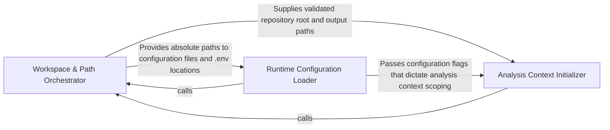

## Details

Handles pre-flight configuration by mapping inputs to system paths and initializing output directories.

### Workspace & Path Orchestrator
The primary entry point that maps relative project paths to absolute system locations and manages the physical lifecycle of output directories.

**Related Classes/Methods**: _None_

**Source Files:**

- [`diagram_analysis/io_utils.py`](https://github.com/CodeBoarding/CodeBoarding/blob/main/.codeboardingdiagram_analysis/io_utils.py)
  - `diagram_analysis.io_utils._AnalysisFileStore.read` ([L81-L99](https://github.com/CodeBoarding/CodeBoarding/blob/main/.codeboardingdiagram_analysis/io_utils.py#L81-L99)) - Method
  - `diagram_analysis.io_utils._AnalysisFileStore.read_sub` ([L106-L116](https://github.com/CodeBoarding/CodeBoarding/blob/main/.codeboardingdiagram_analysis/io_utils.py#L106-L116)) - Method

### Runtime Configuration Loader
Manages the bootstrapping of the execution environment, including loading .env files, validating API keys for LLM providers, and configuring the Python/uv runtime settings.

**Related Classes/Methods**: _None_

**Source Files:**

- [`diagram_analysis/io_utils.py`](https://github.com/CodeBoarding/CodeBoarding/blob/main/.codeboardingdiagram_analysis/io_utils.py)
  - `diagram_analysis.io_utils._AnalysisFileStore.read_root` ([L101-L104](https://github.com/CodeBoarding/CodeBoarding/blob/main/.codeboardingdiagram_analysis/io_utils.py#L101-L104)) - Method

### Analysis Context Initializer
Bridges the gap between the physical environment and the static analysis engine by identifying target languages and preparing the data structures for source code reference mapping.

**Related Classes/Methods**: _None_

**Source Files:**

- [`diagram_analysis/io_utils.py`](https://github.com/CodeBoarding/CodeBoarding/blob/main/.codeboardingdiagram_analysis/io_utils.py)
  - `diagram_analysis.io_utils._AnalysisFileStore.write` ([L118-L142](https://github.com/CodeBoarding/CodeBoarding/blob/main/.codeboardingdiagram_analysis/io_utils.py#L118-L142)) - Method
  - `diagram_analysis.io_utils._AnalysisFileStore.write_sub` ([L144-L174](https://github.com/CodeBoarding/CodeBoarding/blob/main/.codeboardingdiagram_analysis/io_utils.py#L144-L174)) - Method

### [FAQ](https://github.com/CodeBoarding/GeneratedOnBoardings/tree/main?tab=readme-ov-file#faq)