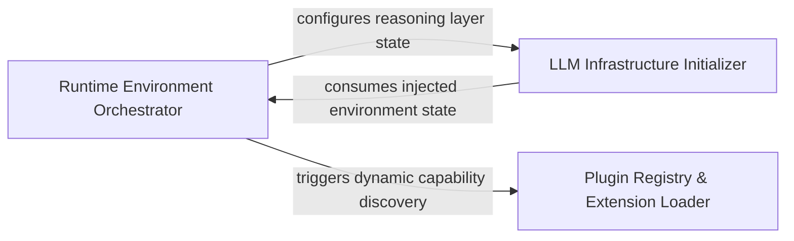

## Details

Responsible for pre-flight operations, including loading user configurations, initializing LLM providers, and dynamically loading plugins to ensure system state validity.

### Runtime Environment Orchestrator
Handles the pre-flight phase by parsing configurations and CLI flags to establish global system state and environment variables.

**Related Classes/Methods**:

- `codeboarding_cli.bootstrap.bootstrap_environment`:29-44

**Source Files:**

- [`agents/llm_config.py`](https://github.com/CodeBoarding/CodeBoarding/blob/main/.codeboardingagents/llm_config.py)
  - `agents.llm_config.configure_models` ([L54-L80](https://github.com/CodeBoarding/CodeBoarding/blob/main/.codeboardingagents/llm_config.py#L54-L80)) - Function
- [`codeboarding_cli/bootstrap.py`](https://github.com/CodeBoarding/CodeBoarding/blob/main/.codeboardingcodeboarding_cli/bootstrap.py)
  - `codeboarding_cli.bootstrap.bootstrap_environment` ([L29-L44](https://github.com/CodeBoarding/CodeBoarding/blob/main/.codeboardingcodeboarding_cli/bootstrap.py#L29-L44)) - Function

### LLM Infrastructure Initializer
Sets up and validates the AI reasoning layer by mapping environment variables to LLM provider configurations and initializing model parameters.

**Related Classes/Methods**: _None_

**Source Files:**

- [`core/plugin_loader.py`](https://github.com/CodeBoarding/CodeBoarding/blob/main/.codeboardingcore/plugin_loader.py)
  - `core.plugin_loader.load_plugins` ([L17-L46](https://github.com/CodeBoarding/CodeBoarding/blob/main/.codeboardingcore/plugin_loader.py#L17-L46)) - Function
- [`diagram_analysis/__init__.py`](https://github.com/CodeBoarding/CodeBoarding/blob/main/.codeboardingdiagram_analysis/__init__.py)
  - `diagram_analysis.__init__.__getattr__` ([L6-L26](https://github.com/CodeBoarding/CodeBoarding/blob/main/.codeboardingdiagram_analysis/__init__.py#L6-L26)) - Function
- [`user_config.py`](https://github.com/CodeBoarding/CodeBoarding/blob/main/.codeboardinguser_config.py)
  - `user_config.UserConfig.apply_to_env` ([L120-L125](https://github.com/CodeBoarding/CodeBoarding/blob/main/.codeboardinguser_config.py#L120-L125)) - Method

### Plugin Registry & Extension Loader
Manages late-binding of system capabilities through dynamic discovery and importing of modules to ensure extensibility.

**Related Classes/Methods**: _None_

**Source Files:**

- [`user_config.py`](https://github.com/CodeBoarding/CodeBoarding/blob/main/.codeboardinguser_config.py)
  - `user_config.ensure_config_template` ([L165-L171](https://github.com/CodeBoarding/CodeBoarding/blob/main/.codeboardinguser_config.py#L165-L171)) - Function
  - `user_config._append_commented_key` ([L174-L183](https://github.com/CodeBoarding/CodeBoarding/blob/main/.codeboardinguser_config.py#L174-L183)) - Function

### [FAQ](https://github.com/CodeBoarding/GeneratedOnBoardings/tree/main?tab=readme-ov-file#faq)