```mermaid
graph LR
    Tooling_Registry_Infrastructure["Tooling & Registry Infrastructure"]
    Project_Discovery_Scanning["Project Discovery & Scanning"]
    Runtime_Environment_Resolver["Runtime Environment Resolver"]
    Agentic_Repository_Context["Agentic Repository Context"]
    Tooling_Registry_Infrastructure -- "Provides paths to installed binaries and adapters" --> Runtime_Environment_Resolver
    Project_Discovery_Scanning -- "Supplies language profiles and build configurations" --> Runtime_Environment_Resolver
    Project_Discovery_Scanning -- "Feeds filtered file maps and dependency metadata" --> Agentic_Repository_Context
    Tooling_Registry_Infrastructure -- "Supplies registry-based filtering rules" --> Project_Discovery_Scanning
    Runtime_Environment_Resolver -- "Validates language support for agent tools" --> Agentic_Repository_Context
    Project_Discovery_Scanning -- "calls" --> Tooling_Registry_Infrastructure
    Runtime_Environment_Resolver -- "calls" --> Tooling_Registry_Infrastructure
    Agentic_Repository_Context -- "calls" --> Project_Discovery_Scanning
    click Tooling_Registry_Infrastructure href "https://github.com/CodeBoarding/CodeBoarding/blob/main/.codeboarding/Tooling_Registry_Infrastructure.md" "Details"
    click Project_Discovery_Scanning href "https://github.com/CodeBoarding/CodeBoarding/blob/main/.codeboarding/Project_Discovery_Scanning.md" "Details"
    click Runtime_Environment_Resolver href "https://github.com/CodeBoarding/CodeBoarding/blob/main/.codeboarding/Runtime_Environment_Resolver.md" "Details"
    click Agentic_Repository_Context href "https://github.com/CodeBoarding/CodeBoarding/blob/main/.codeboarding/Agentic_Repository_Context.md" "Details"
```

## Details

Handles pre-flight operations, including environment setup (LSP servers, Node.js), project scanning to identify languages, and plugin registry management.

### Tooling & Registry Infrastructure [[Expand]](./Tooling_Registry_Infrastructure.md)
Manages the lifecycle of external binaries, plugin architecture, and automated installation of runtimes into isolated environments.

**Related Classes/Methods**:

- `core.registry.Registry`:12-46
- `tool_registry.installers.install_tools`:515-537
- `tool_registry.paths.preferred_node_path`:183-198
- `install.run_install`:694-741

**Source Files:**

- [`core/__init__.py`](https://github.com/CodeBoarding/CodeBoarding/blob/main/.codeboardingcore/__init__.py)
  - `core.__init__.Registries.__init__` ([L36-L38](https://github.com/CodeBoarding/CodeBoarding/blob/main/.codeboardingcore/__init__.py#L36-L38)) - Method
  - `core.__init__.reset_registries` ([L52-L55](https://github.com/CodeBoarding/CodeBoarding/blob/main/.codeboardingcore/__init__.py#L52-L55)) - Function
- [`core/registry.py`](https://github.com/CodeBoarding/CodeBoarding/blob/main/.codeboardingcore/registry.py)
  - `core.registry.DuplicateRegistrationError` ([L8-L9](https://github.com/CodeBoarding/CodeBoarding/blob/main/.codeboardingcore/registry.py#L8-L9)) - Class
  - `core.registry.Registry` ([L12-L46](https://github.com/CodeBoarding/CodeBoarding/blob/main/.codeboardingcore/registry.py#L12-L46)) - Class
  - `core.registry.Registry.__init__` ([L20-L22](https://github.com/CodeBoarding/CodeBoarding/blob/main/.codeboardingcore/registry.py#L20-L22)) - Method
  - `core.registry.Registry.register` ([L24-L29](https://github.com/CodeBoarding/CodeBoarding/blob/main/.codeboardingcore/registry.py#L24-L29)) - Method
  - `core.registry.Registry.get` ([L31-L33](https://github.com/CodeBoarding/CodeBoarding/blob/main/.codeboardingcore/registry.py#L31-L33)) - Method
  - `core.registry.Registry.__len__` ([L39-L40](https://github.com/CodeBoarding/CodeBoarding/blob/main/.codeboardingcore/registry.py#L39-L40)) - Method
  - `core.registry.Registry.__contains__` ([L42-L43](https://github.com/CodeBoarding/CodeBoarding/blob/main/.codeboardingcore/registry.py#L42-L43)) - Method
  - `core.registry.Registry.__repr__` ([L45-L46](https://github.com/CodeBoarding/CodeBoarding/blob/main/.codeboardingcore/registry.py#L45-L46)) - Method
- [`install.py`](https://github.com/CodeBoarding/CodeBoarding/blob/main/.codeboardinginstall.py)
  - `install.check_npm` ([L61-L81](https://github.com/CodeBoarding/CodeBoarding/blob/main/.codeboardinginstall.py#L61-L81)) - Function
  - `install.bootstrapped_npm_cli_path` ([L84-L86](https://github.com/CodeBoarding/CodeBoarding/blob/main/.codeboardinginstall.py#L84-L86)) - Function
  - `install.extract_tarball_safely` ([L89-L97](https://github.com/CodeBoarding/CodeBoarding/blob/main/.codeboardinginstall.py#L89-L97)) - Function
  - `install.bootstrap_npm` ([L100-L149](https://github.com/CodeBoarding/CodeBoarding/blob/main/.codeboardinginstall.py#L100-L149)) - Function
  - `install.is_non_interactive_mode` ([L152-L158](https://github.com/CodeBoarding/CodeBoarding/blob/main/.codeboardinginstall.py#L152-L158)) - Function
  - `install.ensure_node_runtime` ([L161-L214](https://github.com/CodeBoarding/CodeBoarding/blob/main/.codeboardinginstall.py#L161-L214)) - Function
  - `install.resolve_missing_npm` ([L217-L242](https://github.com/CodeBoarding/CodeBoarding/blob/main/.codeboardinginstall.py#L217-L242)) - Function
  - `install.resolve_npm_availability` ([L245-L252](https://github.com/CodeBoarding/CodeBoarding/blob/main/.codeboardinginstall.py#L245-L252)) - Function
  - `install.parse_args` ([L255-L268](https://github.com/CodeBoarding/CodeBoarding/blob/main/.codeboardinginstall.py#L255-L268)) - Function
  - `install.install_node_servers` ([L276-L301](https://github.com/CodeBoarding/CodeBoarding/blob/main/.codeboardinginstall.py#L276-L301)) - Function
  - `install.BinaryStatus` ([L308-L313](https://github.com/CodeBoarding/CodeBoarding/blob/main/.codeboardinginstall.py#L308-L313)) - Class
  - `install.verify_binary` ([L316-L341](https://github.com/CodeBoarding/CodeBoarding/blob/main/.codeboardinginstall.py#L316-L341)) - Function
  - `install.install_vcpp_redistributable` ([L344-L411](https://github.com/CodeBoarding/CodeBoarding/blob/main/.codeboardinginstall.py#L344-L411)) - Function
  - `install.resolve_missing_vcpp` ([L414-L435](https://github.com/CodeBoarding/CodeBoarding/blob/main/.codeboardinginstall.py#L414-L435)) - Function
  - `install.download_binaries` ([L438-L477](https://github.com/CodeBoarding/CodeBoarding/blob/main/.codeboardinginstall.py#L438-L477)) - Function
  - `install.download_jdtls` ([L480-L488](https://github.com/CodeBoarding/CodeBoarding/blob/main/.codeboardinginstall.py#L480-L488)) - Function
  - `install.install_pre_commit_hooks` ([L517-L552](https://github.com/CodeBoarding/CodeBoarding/blob/main/.codeboardinginstall.py#L517-L552)) - Function
  - `install.ensure_tools` ([L658-L691](https://github.com/CodeBoarding/CodeBoarding/blob/main/.codeboardinginstall.py#L658-L691)) - Function
  - `install.run_install` ([L694-L741](https://github.com/CodeBoarding/CodeBoarding/blob/main/.codeboardinginstall.py#L694-L741)) - Function
  - `install.run_install.unified_progress` ([L726-L730](https://github.com/CodeBoarding/CodeBoarding/blob/main/.codeboardinginstall.py#L726-L730)) - Function
  - `install.main` ([L744-L769](https://github.com/CodeBoarding/CodeBoarding/blob/main/.codeboardinginstall.py#L744-L769)) - Function
- [`repo_utils/ignore.py`](https://github.com/CodeBoarding/CodeBoarding/blob/main/.codeboardingrepo_utils/ignore.py)
  - `repo_utils.ignore.RepoIgnoreManager.__init__` ([L173-L175](https://github.com/CodeBoarding/CodeBoarding/blob/main/.codeboardingrepo_utils/ignore.py#L173-L175)) - Method
  - `repo_utils.ignore.RepoIgnoreManager.reload` ([L177-L189](https://github.com/CodeBoarding/CodeBoarding/blob/main/.codeboardingrepo_utils/ignore.py#L177-L189)) - Method
  - `repo_utils.ignore.RepoIgnoreManager._load_gitignore_patterns` ([L191-L202](https://github.com/CodeBoarding/CodeBoarding/blob/main/.codeboardingrepo_utils/ignore.py#L191-L202)) - Method
  - `repo_utils.ignore.RepoIgnoreManager._load_codeboardingignore_patterns` ([L204-L221](https://github.com/CodeBoarding/CodeBoarding/blob/main/.codeboardingrepo_utils/ignore.py#L204-L221)) - Method
- [`static_analyzer/engine/adapters/go_adapter.py`](https://github.com/CodeBoarding/CodeBoarding/blob/main/.codeboardingstatic_analyzer/engine/adapters/go_adapter.py)
  - `static_analyzer.engine.adapters.go_adapter._directory_filters_from_ignore_manager` ([L22-L70](https://github.com/CodeBoarding/CodeBoarding/blob/main/.codeboardingstatic_analyzer/engine/adapters/go_adapter.py#L22-L70)) - Function
  - `static_analyzer.engine.adapters.go_adapter.GoAdapter` ([L73-L223](https://github.com/CodeBoarding/CodeBoarding/blob/main/.codeboardingstatic_analyzer/engine/adapters/go_adapter.py#L73-L223)) - Class
  - `static_analyzer.engine.adapters.go_adapter.GoAdapter.language` ([L76-L77](https://github.com/CodeBoarding/CodeBoarding/blob/main/.codeboardingstatic_analyzer/engine/adapters/go_adapter.py#L76-L77)) - Method
  - `static_analyzer.engine.adapters.go_adapter.GoAdapter.language_enum` ([L80-L81](https://github.com/CodeBoarding/CodeBoarding/blob/main/.codeboardingstatic_analyzer/engine/adapters/go_adapter.py#L80-L81)) - Method
  - `static_analyzer.engine.adapters.go_adapter.GoAdapter.lsp_command` ([L84-L85](https://github.com/CodeBoarding/CodeBoarding/blob/main/.codeboardingstatic_analyzer/engine/adapters/go_adapter.py#L84-L85)) - Method
  - `static_analyzer.engine.adapters.go_adapter.GoAdapter.language_id` ([L88-L89](https://github.com/CodeBoarding/CodeBoarding/blob/main/.codeboardingstatic_analyzer/engine/adapters/go_adapter.py#L88-L89)) - Method
  - `static_analyzer.engine.adapters.go_adapter.GoAdapter.build_reference_key` ([L134-L136](https://github.com/CodeBoarding/CodeBoarding/blob/main/.codeboardingstatic_analyzer/engine/adapters/go_adapter.py#L134-L136)) - Method
  - `static_analyzer.engine.adapters.go_adapter.GoAdapter.get_lsp_init_options` ([L138-L165](https://github.com/CodeBoarding/CodeBoarding/blob/main/.codeboardingstatic_analyzer/engine/adapters/go_adapter.py#L138-L165)) - Method
  - `static_analyzer.engine.adapters.go_adapter.GoAdapter.get_workspace_settings` ([L167-L176](https://github.com/CodeBoarding/CodeBoarding/blob/main/.codeboardingstatic_analyzer/engine/adapters/go_adapter.py#L167-L176)) - Method
  - `static_analyzer.engine.adapters.go_adapter.GoAdapter.get_lsp_env` ([L178-L186](https://github.com/CodeBoarding/CodeBoarding/blob/main/.codeboardingstatic_analyzer/engine/adapters/go_adapter.py#L178-L186)) - Method
- [`static_analyzer/typescript_config_scanner.py`](https://github.com/CodeBoarding/CodeBoarding/blob/main/.codeboardingstatic_analyzer/typescript_config_scanner.py)
  - `static_analyzer.typescript_config_scanner._resolve_system_tsc` ([L215-L218](https://github.com/CodeBoarding/CodeBoarding/blob/main/.codeboardingstatic_analyzer/typescript_config_scanner.py#L215-L218)) - Function
  - `static_analyzer.typescript_config_scanner._resolve_tsc_command` ([L221-L235](https://github.com/CodeBoarding/CodeBoarding/blob/main/.codeboardingstatic_analyzer/typescript_config_scanner.py#L221-L235)) - Function
- [`tool_registry/installers.py`](https://github.com/CodeBoarding/CodeBoarding/blob/main/.codeboardingtool_registry/installers.py)
  - `tool_registry.installers.asset_url` ([L51-L57](https://github.com/CodeBoarding/CodeBoarding/blob/main/.codeboardingtool_registry/installers.py#L51-L57)) - Function
  - `tool_registry.installers.resolve_native_asset_name` ([L60-L82](https://github.com/CodeBoarding/CodeBoarding/blob/main/.codeboardingtool_registry/installers.py#L60-L82)) - Function
  - `tool_registry.installers._is_compressed_asset` ([L85-L88](https://github.com/CodeBoarding/CodeBoarding/blob/main/.codeboardingtool_registry/installers.py#L85-L88)) - Function
  - `tool_registry.installers._extract_compressed_binary` ([L91-L137](https://github.com/CodeBoarding/CodeBoarding/blob/main/.codeboardingtool_registry/installers.py#L91-L137)) - Function
  - `tool_registry.installers.download_asset` ([L140-L163](https://github.com/CodeBoarding/CodeBoarding/blob/main/.codeboardingtool_registry/installers.py#L140-L163)) - Function
  - `tool_registry.installers.install_native_tools` ([L169-L271](https://github.com/CodeBoarding/CodeBoarding/blob/main/.codeboardingtool_registry/installers.py#L169-L271)) - Function
  - `tool_registry.installers.install_node_tools` ([L429-L469](https://github.com/CodeBoarding/CodeBoarding/blob/main/.codeboardingtool_registry/installers.py#L429-L469)) - Function
  - `tool_registry.installers.install_archive_tool` ([L475-L509](https://github.com/CodeBoarding/CodeBoarding/blob/main/.codeboardingtool_registry/installers.py#L475-L509)) - Function
  - `tool_registry.installers.install_tools` ([L515-L537](https://github.com/CodeBoarding/CodeBoarding/blob/main/.codeboardingtool_registry/installers.py#L515-L537)) - Function
  - `tool_registry.installers.embedded_node_is_healthy` ([L548-L574](https://github.com/CodeBoarding/CodeBoarding/blob/main/.codeboardingtool_registry/installers.py#L548-L574)) - Function
  - `tool_registry.installers.initialize_nodeenv_globals` ([L577-L600](https://github.com/CodeBoarding/CodeBoarding/blob/main/.codeboardingtool_registry/installers.py#L577-L600)) - Function
  - `tool_registry.installers.nodeenv_needs_unofficial_builds` ([L603-L618](https://github.com/CodeBoarding/CodeBoarding/blob/main/.codeboardingtool_registry/installers.py#L603-L618)) - Function
  - `tool_registry.installers.install_embedded_node` ([L621-L703](https://github.com/CodeBoarding/CodeBoarding/blob/main/.codeboardingtool_registry/installers.py#L621-L703)) - Function
- [`tool_registry/manifest.py`](https://github.com/CodeBoarding/CodeBoarding/blob/main/.codeboardingtool_registry/manifest.py)
  - `tool_registry.manifest.installed_version` ([L40-L44](https://github.com/CodeBoarding/CodeBoarding/blob/main/.codeboardingtool_registry/manifest.py#L40-L44)) - Function
  - `tool_registry.manifest.manifest_path` ([L47-L48](https://github.com/CodeBoarding/CodeBoarding/blob/main/.codeboardingtool_registry/manifest.py#L47-L48)) - Function
  - `tool_registry.manifest.read_manifest` ([L51-L55](https://github.com/CodeBoarding/CodeBoarding/blob/main/.codeboardingtool_registry/manifest.py#L51-L55)) - Function
  - `tool_registry.manifest.npm_specs_fingerprint` ([L58-L68](https://github.com/CodeBoarding/CodeBoarding/blob/main/.codeboardingtool_registry/manifest.py#L58-L68)) - Function
  - `tool_registry.manifest.tools_fingerprint` ([L71-L91](https://github.com/CodeBoarding/CodeBoarding/blob/main/.codeboardingtool_registry/manifest.py#L71-L91)) - Function
  - `tool_registry.manifest.write_manifest` ([L94-L116](https://github.com/CodeBoarding/CodeBoarding/blob/main/.codeboardingtool_registry/manifest.py#L94-L116)) - Function
  - `tool_registry.manifest.needs_install` ([L119-L128](https://github.com/CodeBoarding/CodeBoarding/blob/main/.codeboardingtool_registry/manifest.py#L119-L128)) - Function
  - `tool_registry.manifest.acquire_lock` ([L134-L160](https://github.com/CodeBoarding/CodeBoarding/blob/main/.codeboardingtool_registry/manifest.py#L134-L160)) - Function
  - `tool_registry.manifest.build_config` ([L166-L186](https://github.com/CodeBoarding/CodeBoarding/blob/main/.codeboardingtool_registry/manifest.py#L166-L186)) - Function
  - `tool_registry.manifest.resolve_config_from_path` ([L252-L275](https://github.com/CodeBoarding/CodeBoarding/blob/main/.codeboardingtool_registry/manifest.py#L252-L275)) - Function
- [`tool_registry/paths.py`](https://github.com/CodeBoarding/CodeBoarding/blob/main/.codeboardingtool_registry/paths.py)
  - `tool_registry.paths.get_servers_dir` ([L64-L66](https://github.com/CodeBoarding/CodeBoarding/blob/main/.codeboardingtool_registry/paths.py#L64-L66)) - Function
  - `tool_registry.paths.nodeenv_root_dir` ([L72-L74](https://github.com/CodeBoarding/CodeBoarding/blob/main/.codeboardingtool_registry/paths.py#L72-L74)) - Function
  - `tool_registry.paths.nodeenv_bin_dir` ([L77-L80](https://github.com/CodeBoarding/CodeBoarding/blob/main/.codeboardingtool_registry/paths.py#L77-L80)) - Function
  - `tool_registry.paths.embedded_node_path` ([L83-L87](https://github.com/CodeBoarding/CodeBoarding/blob/main/.codeboardingtool_registry/paths.py#L83-L87)) - Function
  - `tool_registry.paths.embedded_npm_path` ([L90-L94](https://github.com/CodeBoarding/CodeBoarding/blob/main/.codeboardingtool_registry/paths.py#L90-L94)) - Function
  - `tool_registry.paths.embedded_npm_cli_path` ([L97-L100](https://github.com/CodeBoarding/CodeBoarding/blob/main/.codeboardingtool_registry/paths.py#L97-L100)) - Function
  - `tool_registry.paths.node_version_tuple` ([L107-L153](https://github.com/CodeBoarding/CodeBoarding/blob/main/.codeboardingtool_registry/paths.py#L107-L153)) - Function
  - `tool_registry.paths.node_is_acceptable` ([L156-L177](https://github.com/CodeBoarding/CodeBoarding/blob/main/.codeboardingtool_registry/paths.py#L156-L177)) - Function
  - `tool_registry.paths.preferred_node_path` ([L183-L198](https://github.com/CodeBoarding/CodeBoarding/blob/main/.codeboardingtool_registry/paths.py#L183-L198)) - Function
  - `tool_registry.paths.sibling_npm_path` ([L201-L212](https://github.com/CodeBoarding/CodeBoarding/blob/main/.codeboardingtool_registry/paths.py#L201-L212)) - Function
  - `tool_registry.paths.preferred_npm_command` ([L215-L233](https://github.com/CodeBoarding/CodeBoarding/blob/main/.codeboardingtool_registry/paths.py#L215-L233)) - Function
  - `tool_registry.paths.npm_subprocess_env` ([L236-L245](https://github.com/CodeBoarding/CodeBoarding/blob/main/.codeboardingtool_registry/paths.py#L236-L245)) - Function
- [`tool_registry/registry.py`](https://github.com/CodeBoarding/CodeBoarding/blob/main/.codeboardingtool_registry/registry.py)
  - `tool_registry.registry.ToolKind` ([L56-L64](https://github.com/CodeBoarding/CodeBoarding/blob/main/.codeboardingtool_registry/registry.py#L56-L64)) - Class
  - `tool_registry.registry.ConfigSection` ([L67-L71](https://github.com/CodeBoarding/CodeBoarding/blob/main/.codeboardingtool_registry/registry.py#L67-L71)) - Class
  - `tool_registry.registry.ToolSource` ([L75-L78](https://github.com/CodeBoarding/CodeBoarding/blob/main/.codeboardingtool_registry/registry.py#L75-L78)) - Class
  - `tool_registry.registry.GitHubToolSource` ([L82-L103](https://github.com/CodeBoarding/CodeBoarding/blob/main/.codeboardingtool_registry/registry.py#L82-L103)) - Class
  - `tool_registry.registry.UpstreamToolSource` ([L107-L111](https://github.com/CodeBoarding/CodeBoarding/blob/main/.codeboardingtool_registry/registry.py#L107-L111)) - Class
  - `tool_registry.registry.PackageManagerToolSource` ([L115-L123](https://github.com/CodeBoarding/CodeBoarding/blob/main/.codeboardingtool_registry/registry.py#L115-L123)) - Class
  - `tool_registry.registry.ToolDependency` ([L127-L152](https://github.com/CodeBoarding/CodeBoarding/blob/main/.codeboardingtool_registry/registry.py#L127-L152)) - Class
  - `tool_registry.registry.ToolDependency.is_available_on_host` ([L140-L152](https://github.com/CodeBoarding/CodeBoarding/blob/main/.codeboardingtool_registry/registry.py#L140-L152)) - Method

### Project Discovery & Scanning [[Expand]](./Project_Discovery_Scanning.md)
Traverses the filesystem to identify project DNA, detect languages, locate dependency manifests, and apply ignore-rules.

**Related Classes/Methods**:

- `static_analyzer.scanner.ProjectScanner`:14-106
- `repo_utils.ignore.RepoIgnoreManager`:164-329
- `agents.dependency_discovery.discover_dependency_files`:103-159
- `static_analyzer.java_config_scanner.JavaConfigScanner`:33-218

**Source Files:**

- [`agents/dependency_discovery.py`](https://github.com/CodeBoarding/CodeBoarding/blob/main/.codeboardingagents/dependency_discovery.py)
  - `agents.dependency_discovery.Ecosystem` ([L12-L17](https://github.com/CodeBoarding/CodeBoarding/blob/main/.codeboardingagents/dependency_discovery.py#L12-L17)) - Class
  - `agents.dependency_discovery.FileRole` ([L20-L23](https://github.com/CodeBoarding/CodeBoarding/blob/main/.codeboardingagents/dependency_discovery.py#L20-L23)) - Class
  - `agents.dependency_discovery.DependencyFileSpec` ([L27-L30](https://github.com/CodeBoarding/CodeBoarding/blob/main/.codeboardingagents/dependency_discovery.py#L27-L30)) - Class
  - `agents.dependency_discovery.DiscoveredDependencyFile` ([L98-L100](https://github.com/CodeBoarding/CodeBoarding/blob/main/.codeboardingagents/dependency_discovery.py#L98-L100)) - Class
  - `agents.dependency_discovery.discover_dependency_files` ([L103-L159](https://github.com/CodeBoarding/CodeBoarding/blob/main/.codeboardingagents/dependency_discovery.py#L103-L159)) - Function
  - `agents.dependency_discovery.discover_dependency_files._walk` ([L127-L150](https://github.com/CodeBoarding/CodeBoarding/blob/main/.codeboardingagents/dependency_discovery.py#L127-L150)) - Function
- [`caching/cache.py`](https://github.com/CodeBoarding/CodeBoarding/blob/main/.codeboardingcaching/cache.py)
  - `caching.cache.ModelSettings.from_chat_model` ([L292-L310](https://github.com/CodeBoarding/CodeBoarding/blob/main/.codeboardingcaching/cache.py#L292-L310)) - Method
- [`caching/meta_cache.py`](https://github.com/CodeBoarding/CodeBoarding/blob/main/.codeboardingcaching/meta_cache.py)
  - `caching.meta_cache.MetaCacheKey` ([L29-L37](https://github.com/CodeBoarding/CodeBoarding/blob/main/.codeboardingcaching/meta_cache.py#L29-L37)) - Class
  - `caching.meta_cache.MetaCache.discover_metadata_files` ([L57-L69](https://github.com/CodeBoarding/CodeBoarding/blob/main/.codeboardingcaching/meta_cache.py#L57-L69)) - Method
  - `caching.meta_cache.MetaCache.build_key` ([L71-L94](https://github.com/CodeBoarding/CodeBoarding/blob/main/.codeboardingcaching/meta_cache.py#L71-L94)) - Method
  - `caching.meta_cache.MetaCache._compute_metadata_content_hash` ([L96-L111](https://github.com/CodeBoarding/CodeBoarding/blob/main/.codeboardingcaching/meta_cache.py#L96-L111)) - Method
- [`repo_utils/__init__.py`](https://github.com/CodeBoarding/CodeBoarding/blob/main/.codeboardingrepo_utils/__init__.py)
  - `repo_utils.__init__.get_repo_state_hash` ([L193-L223](https://github.com/CodeBoarding/CodeBoarding/blob/main/.codeboardingrepo_utils/__init__.py#L193-L223)) - Function
- [`repo_utils/ignore.py`](https://github.com/CodeBoarding/CodeBoarding/blob/main/.codeboardingrepo_utils/ignore.py)
  - `repo_utils.ignore.RepoIgnoreManager.should_ignore` ([L223-L251](https://github.com/CodeBoarding/CodeBoarding/blob/main/.codeboardingrepo_utils/ignore.py#L223-L251)) - Method
  - `repo_utils.ignore.RepoIgnoreManager.filter_paths` ([L253-L255](https://github.com/CodeBoarding/CodeBoarding/blob/main/.codeboardingrepo_utils/ignore.py#L253-L255)) - Method
  - `repo_utils.ignore.RepoIgnoreManager.strip_ignored` ([L257-L287](https://github.com/CodeBoarding/CodeBoarding/blob/main/.codeboardingrepo_utils/ignore.py#L257-L287)) - Method
- [`static_analyzer/__init__.py`](https://github.com/CodeBoarding/CodeBoarding/blob/main/.codeboardingstatic_analyzer/__init__.py)
  - `static_analyzer.__init__.EngineConfig` ([L34-L44](https://github.com/CodeBoarding/CodeBoarding/blob/main/.codeboardingstatic_analyzer/__init__.py#L34-L44)) - Class
  - `static_analyzer.__init__._create_engine_configs` ([L51-L148](https://github.com/CodeBoarding/CodeBoarding/blob/main/.codeboardingstatic_analyzer/__init__.py#L51-L148)) - Function
  - `static_analyzer.__init__._lang_to_adapter_name` ([L151-L166](https://github.com/CodeBoarding/CodeBoarding/blob/main/.codeboardingstatic_analyzer/__init__.py#L151-L166)) - Function
  - `static_analyzer.__init__.StaticAnalyzer.__init__` ([L172-L189](https://github.com/CodeBoarding/CodeBoarding/blob/main/.codeboardingstatic_analyzer/__init__.py#L172-L189)) - Method
- [`static_analyzer/csharp_config_scanner.py`](https://github.com/CodeBoarding/CodeBoarding/blob/main/.codeboardingstatic_analyzer/csharp_config_scanner.py)
  - `static_analyzer.csharp_config_scanner.CSharpProjectConfig` ([L17-L29](https://github.com/CodeBoarding/CodeBoarding/blob/main/.codeboardingstatic_analyzer/csharp_config_scanner.py#L17-L29)) - Class
  - `static_analyzer.csharp_config_scanner.CSharpConfigScanner` ([L32-L103](https://github.com/CodeBoarding/CodeBoarding/blob/main/.codeboardingstatic_analyzer/csharp_config_scanner.py#L32-L103)) - Class
  - `static_analyzer.csharp_config_scanner.CSharpConfigScanner.scan` ([L49-L75](https://github.com/CodeBoarding/CodeBoarding/blob/main/.codeboardingstatic_analyzer/csharp_config_scanner.py#L49-L75)) - Method
  - `static_analyzer.csharp_config_scanner.CSharpConfigScanner._find_solution_roots` ([L77-L82](https://github.com/CodeBoarding/CodeBoarding/blob/main/.codeboardingstatic_analyzer/csharp_config_scanner.py#L77-L82)) - Method
  - `static_analyzer.csharp_config_scanner.CSharpConfigScanner._find_project_roots` ([L84-L86](https://github.com/CodeBoarding/CodeBoarding/blob/main/.codeboardingstatic_analyzer/csharp_config_scanner.py#L84-L86)) - Method
  - `static_analyzer.csharp_config_scanner.CSharpConfigScanner._has_cs_files` ([L88-L94](https://github.com/CodeBoarding/CodeBoarding/blob/main/.codeboardingstatic_analyzer/csharp_config_scanner.py#L88-L94)) - Method
  - `static_analyzer.csharp_config_scanner.CSharpConfigScanner._is_subpath` ([L97-L103](https://github.com/CodeBoarding/CodeBoarding/blob/main/.codeboardingstatic_analyzer/csharp_config_scanner.py#L97-L103)) - Method
- [`static_analyzer/engine/adapters/__init__.py`](https://github.com/CodeBoarding/CodeBoarding/blob/main/.codeboardingstatic_analyzer/engine/adapters/__init__.py)
  - `static_analyzer.engine.adapters.__init__.get_adapter` ([L26-L31](https://github.com/CodeBoarding/CodeBoarding/blob/main/.codeboardingstatic_analyzer/engine/adapters/__init__.py#L26-L31)) - Function
  - `static_analyzer.engine.adapters.__init__.get_all_adapters` ([L34-L36](https://github.com/CodeBoarding/CodeBoarding/blob/main/.codeboardingstatic_analyzer/engine/adapters/__init__.py#L34-L36)) - Function
- [`static_analyzer/engine/language_adapter.py`](https://github.com/CodeBoarding/CodeBoarding/blob/main/.codeboardingstatic_analyzer/engine/language_adapter.py)
  - `static_analyzer.engine.language_adapter.LanguageAdapter._walk` ([L252-L265](https://github.com/CodeBoarding/CodeBoarding/blob/main/.codeboardingstatic_analyzer/engine/language_adapter.py#L252-L265)) - Method
- [`static_analyzer/java_config_scanner.py`](https://github.com/CodeBoarding/CodeBoarding/blob/main/.codeboardingstatic_analyzer/java_config_scanner.py)
  - `static_analyzer.java_config_scanner.JavaProjectConfig` ([L10-L30](https://github.com/CodeBoarding/CodeBoarding/blob/main/.codeboardingstatic_analyzer/java_config_scanner.py#L10-L30)) - Class
  - `static_analyzer.java_config_scanner.JavaConfigScanner` ([L33-L218](https://github.com/CodeBoarding/CodeBoarding/blob/main/.codeboardingstatic_analyzer/java_config_scanner.py#L33-L218)) - Class
  - `static_analyzer.java_config_scanner.JavaConfigScanner.scan` ([L39-L103](https://github.com/CodeBoarding/CodeBoarding/blob/main/.codeboardingstatic_analyzer/java_config_scanner.py#L39-L103)) - Method
  - `static_analyzer.java_config_scanner.JavaConfigScanner._find_maven_projects` ([L105-L107](https://github.com/CodeBoarding/CodeBoarding/blob/main/.codeboardingstatic_analyzer/java_config_scanner.py#L105-L107)) - Method
  - `static_analyzer.java_config_scanner.JavaConfigScanner._find_gradle_projects` ([L109-L124](https://github.com/CodeBoarding/CodeBoarding/blob/main/.codeboardingstatic_analyzer/java_config_scanner.py#L109-L124)) - Method
  - `static_analyzer.java_config_scanner.JavaConfigScanner._find_eclipse_projects` ([L126-L130](https://github.com/CodeBoarding/CodeBoarding/blob/main/.codeboardingstatic_analyzer/java_config_scanner.py#L126-L130)) - Method
  - `static_analyzer.java_config_scanner.JavaConfigScanner._analyze_maven_project` ([L132-L166](https://github.com/CodeBoarding/CodeBoarding/blob/main/.codeboardingstatic_analyzer/java_config_scanner.py#L132-L166)) - Method
  - `static_analyzer.java_config_scanner.JavaConfigScanner._analyze_gradle_project` ([L168-L198](https://github.com/CodeBoarding/CodeBoarding/blob/main/.codeboardingstatic_analyzer/java_config_scanner.py#L168-L198)) - Method
  - `static_analyzer.java_config_scanner.JavaConfigScanner._has_gradle_wrapper` ([L200-L202](https://github.com/CodeBoarding/CodeBoarding/blob/main/.codeboardingstatic_analyzer/java_config_scanner.py#L200-L202)) - Method
  - `static_analyzer.java_config_scanner.JavaConfigScanner._has_java_files` ([L204-L210](https://github.com/CodeBoarding/CodeBoarding/blob/main/.codeboardingstatic_analyzer/java_config_scanner.py#L204-L210)) - Method
  - `static_analyzer.java_config_scanner.JavaConfigScanner._is_subpath` ([L212-L218](https://github.com/CodeBoarding/CodeBoarding/blob/main/.codeboardingstatic_analyzer/java_config_scanner.py#L212-L218)) - Method
  - `static_analyzer.java_config_scanner.scan_java_projects` ([L221-L232](https://github.com/CodeBoarding/CodeBoarding/blob/main/.codeboardingstatic_analyzer/java_config_scanner.py#L221-L232)) - Function
- [`static_analyzer/programming_language.py`](https://github.com/CodeBoarding/CodeBoarding/blob/main/.codeboardingstatic_analyzer/programming_language.py)
  - `static_analyzer.programming_language.LanguageConfig` ([L11-L14](https://github.com/CodeBoarding/CodeBoarding/blob/main/.codeboardingstatic_analyzer/programming_language.py#L11-L14)) - Class
  - `static_analyzer.programming_language.JavaConfig` ([L17-L20](https://github.com/CodeBoarding/CodeBoarding/blob/main/.codeboardingstatic_analyzer/programming_language.py#L17-L20)) - Class
  - `static_analyzer.programming_language.ProgrammingLanguage` ([L23-L75](https://github.com/CodeBoarding/CodeBoarding/blob/main/.codeboardingstatic_analyzer/programming_language.py#L23-L75)) - Class
  - `static_analyzer.programming_language.ProgrammingLanguage.__init__` ([L24-L42](https://github.com/CodeBoarding/CodeBoarding/blob/main/.codeboardingstatic_analyzer/programming_language.py#L24-L42)) - Method
  - `static_analyzer.programming_language.ProgrammingLanguage.get_suffix_pattern` ([L44-L49](https://github.com/CodeBoarding/CodeBoarding/blob/main/.codeboardingstatic_analyzer/programming_language.py#L44-L49)) - Method
  - `static_analyzer.programming_language.ProgrammingLanguage.get_language_id` ([L51-L53](https://github.com/CodeBoarding/CodeBoarding/blob/main/.codeboardingstatic_analyzer/programming_language.py#L51-L53)) - Method
  - `static_analyzer.programming_language.ProgrammingLanguage.get_server_parameters` ([L55-L61](https://github.com/CodeBoarding/CodeBoarding/blob/main/.codeboardingstatic_analyzer/programming_language.py#L55-L61)) - Method
  - `static_analyzer.programming_language.ProgrammingLanguage.is_supported_lang` ([L63-L64](https://github.com/CodeBoarding/CodeBoarding/blob/main/.codeboardingstatic_analyzer/programming_language.py#L63-L64)) - Method
  - `static_analyzer.programming_language.ProgrammingLanguage.__hash__` ([L66-L67](https://github.com/CodeBoarding/CodeBoarding/blob/main/.codeboardingstatic_analyzer/programming_language.py#L66-L67)) - Method
  - `static_analyzer.programming_language.ProgrammingLanguage.__eq__` ([L69-L72](https://github.com/CodeBoarding/CodeBoarding/blob/main/.codeboardingstatic_analyzer/programming_language.py#L69-L72)) - Method
  - `static_analyzer.programming_language.ProgrammingLanguage.__str__` ([L74-L75](https://github.com/CodeBoarding/CodeBoarding/blob/main/.codeboardingstatic_analyzer/programming_language.py#L74-L75)) - Method
  - `static_analyzer.programming_language.ProgrammingLanguageBuilder` ([L78-L152](https://github.com/CodeBoarding/CodeBoarding/blob/main/.codeboardingstatic_analyzer/programming_language.py#L78-L152)) - Class
  - `static_analyzer.programming_language.ProgrammingLanguageBuilder.__init__` ([L81-L89](https://github.com/CodeBoarding/CodeBoarding/blob/main/.codeboardingstatic_analyzer/programming_language.py#L81-L89)) - Method
  - `static_analyzer.programming_language.ProgrammingLanguageBuilder._find_lsp_server_key` ([L91-L114](https://github.com/CodeBoarding/CodeBoarding/blob/main/.codeboardingstatic_analyzer/programming_language.py#L91-L114)) - Method
  - `static_analyzer.programming_language.ProgrammingLanguageBuilder.build` ([L116-L149](https://github.com/CodeBoarding/CodeBoarding/blob/main/.codeboardingstatic_analyzer/programming_language.py#L116-L149)) - Method
  - `static_analyzer.programming_language.ProgrammingLanguageBuilder.get_supported_extensions` ([L151-L152](https://github.com/CodeBoarding/CodeBoarding/blob/main/.codeboardingstatic_analyzer/programming_language.py#L151-L152)) - Method
- [`static_analyzer/scanner.py`](https://github.com/CodeBoarding/CodeBoarding/blob/main/.codeboardingstatic_analyzer/scanner.py)
  - `static_analyzer.scanner.ProjectScanner` ([L14-L106](https://github.com/CodeBoarding/CodeBoarding/blob/main/.codeboardingstatic_analyzer/scanner.py#L14-L106)) - Class
  - `static_analyzer.scanner.ProjectScanner.__init__` ([L15-L17](https://github.com/CodeBoarding/CodeBoarding/blob/main/.codeboardingstatic_analyzer/scanner.py#L15-L17)) - Method
  - `static_analyzer.scanner.ProjectScanner.scan` ([L19-L88](https://github.com/CodeBoarding/CodeBoarding/blob/main/.codeboardingstatic_analyzer/scanner.py#L19-L88)) - Method
  - `static_analyzer.scanner.ProjectScanner._extract_suffixes` ([L91-L106](https://github.com/CodeBoarding/CodeBoarding/blob/main/.codeboardingstatic_analyzer/scanner.py#L91-L106)) - Method
- [`static_analyzer/typescript_config_scanner.py`](https://github.com/CodeBoarding/CodeBoarding/blob/main/.codeboardingstatic_analyzer/typescript_config_scanner.py)
  - `static_analyzer.typescript_config_scanner.TypeScriptProject` ([L25-L33](https://github.com/CodeBoarding/CodeBoarding/blob/main/.codeboardingstatic_analyzer/typescript_config_scanner.py#L25-L33)) - Class
  - `static_analyzer.typescript_config_scanner.TypeScriptConfigScanner` ([L39-L204](https://github.com/CodeBoarding/CodeBoarding/blob/main/.codeboardingstatic_analyzer/typescript_config_scanner.py#L39-L204)) - Class
  - `static_analyzer.typescript_config_scanner.TypeScriptConfigScanner.find_typescript_projects` ([L48-L86](https://github.com/CodeBoarding/CodeBoarding/blob/main/.codeboardingstatic_analyzer/typescript_config_scanner.py#L48-L86)) - Method
  - `static_analyzer.typescript_config_scanner.TypeScriptConfigScanner._discover_candidates` ([L88-L103](https://github.com/CodeBoarding/CodeBoarding/blob/main/.codeboardingstatic_analyzer/typescript_config_scanner.py#L88-L103)) - Method
  - `static_analyzer.typescript_config_scanner.TypeScriptConfigScanner._resolve_project_files` ([L105-L127](https://github.com/CodeBoarding/CodeBoarding/blob/main/.codeboardingstatic_analyzer/typescript_config_scanner.py#L105-L127)) - Method
  - `static_analyzer.typescript_config_scanner.TypeScriptConfigScanner._showconfig` ([L129-L153](https://github.com/CodeBoarding/CodeBoarding/blob/main/.codeboardingstatic_analyzer/typescript_config_scanner.py#L129-L153)) - Method
  - `static_analyzer.typescript_config_scanner.TypeScriptConfigScanner._fallback_walk` ([L155-L175](https://github.com/CodeBoarding/CodeBoarding/blob/main/.codeboardingstatic_analyzer/typescript_config_scanner.py#L155-L175)) - Method
  - `static_analyzer.typescript_config_scanner.TypeScriptConfigScanner._trim_overlap` ([L178-L204](https://github.com/CodeBoarding/CodeBoarding/blob/main/.codeboardingstatic_analyzer/typescript_config_scanner.py#L178-L204)) - Method
  - `static_analyzer.typescript_config_scanner._is_ancestor` ([L207-L212](https://github.com/CodeBoarding/CodeBoarding/blob/main/.codeboardingstatic_analyzer/typescript_config_scanner.py#L207-L212)) - Function
- [`utils.py`](https://github.com/CodeBoarding/CodeBoarding/blob/main/.codeboardingutils.py)
  - `utils.fingerprint_file` ([L63-L71](https://github.com/CodeBoarding/CodeBoarding/blob/main/.codeboardingutils.py#L63-L71)) - Function

### Runtime Environment Resolver [[Expand]](./Runtime_Environment_Resolver.md)
Translates project metadata into execution commands, resolves SDK paths, and verifies LSP adapter requirements.

**Related Classes/Methods**:

- `static_analyzer.engine.language_adapter.LanguageAdapter.get_lsp_command`:62-74
- `static_analyzer.dotnet_sdk.resolve_dotnet_sdk`:87-155
- `install.LanguageSupportCheck`:42-58

**Source Files:**

- [`install.py`](https://github.com/CodeBoarding/CodeBoarding/blob/main/.codeboardinginstall.py)
  - `install.LanguageSupportCheck` ([L42-L58](https://github.com/CodeBoarding/CodeBoarding/blob/main/.codeboardinginstall.py#L42-L58)) - Class
  - `install.LanguageSupportCheck.evaluate` ([L50-L58](https://github.com/CodeBoarding/CodeBoarding/blob/main/.codeboardinginstall.py#L50-L58)) - Method
  - `install.get_platform_bin_dir` ([L271-L273](https://github.com/CodeBoarding/CodeBoarding/blob/main/.codeboardinginstall.py#L271-L273)) - Function
  - `install.install_package_manager_lsp_servers` ([L491-L514](https://github.com/CodeBoarding/CodeBoarding/blob/main/.codeboardinginstall.py#L491-L514)) - Function
  - `install._language_checks_from_registry` ([L555-L645](https://github.com/CodeBoarding/CodeBoarding/blob/main/.codeboardinginstall.py#L555-L645)) - Function
  - `install.print_language_support_summary` ([L648-L655](https://github.com/CodeBoarding/CodeBoarding/blob/main/.codeboardinginstall.py#L648-L655)) - Function
- [`static_analyzer/dotnet_sdk.py`](https://github.com/CodeBoarding/CodeBoarding/blob/main/.codeboardingstatic_analyzer/dotnet_sdk.py)
  - `static_analyzer.dotnet_sdk.DotnetSdkError` ([L39-L40](https://github.com/CodeBoarding/CodeBoarding/blob/main/.codeboardingstatic_analyzer/dotnet_sdk.py#L39-L40)) - Class
  - `static_analyzer.dotnet_sdk.DotnetSdkResolution` ([L44-L50](https://github.com/CodeBoarding/CodeBoarding/blob/main/.codeboardingstatic_analyzer/dotnet_sdk.py#L44-L50)) - Class
  - `static_analyzer.dotnet_sdk._Probe` ([L54-L57](https://github.com/CodeBoarding/CodeBoarding/blob/main/.codeboardingstatic_analyzer/dotnet_sdk.py#L54-L57)) - Class
  - `static_analyzer.dotnet_sdk.dotnet_install_dir` ([L60-L61](https://github.com/CodeBoarding/CodeBoarding/blob/main/.codeboardingstatic_analyzer/dotnet_sdk.py#L60-L61)) - Function
  - `static_analyzer.dotnet_sdk.private_dotnet_path` ([L64-L65](https://github.com/CodeBoarding/CodeBoarding/blob/main/.codeboardingstatic_analyzer/dotnet_sdk.py#L64-L65)) - Function
  - `static_analyzer.dotnet_sdk.find_global_json` ([L68-L75](https://github.com/CodeBoarding/CodeBoarding/blob/main/.codeboardingstatic_analyzer/dotnet_sdk.py#L68-L75)) - Function
  - `static_analyzer.dotnet_sdk.read_global_sdk_version` ([L78-L84](https://github.com/CodeBoarding/CodeBoarding/blob/main/.codeboardingstatic_analyzer/dotnet_sdk.py#L78-L84)) - Function
  - `static_analyzer.dotnet_sdk.resolve_dotnet_sdk` ([L87-L155](https://github.com/CodeBoarding/CodeBoarding/blob/main/.codeboardingstatic_analyzer/dotnet_sdk.py#L87-L155)) - Function
  - `static_analyzer.dotnet_sdk.system_dotnet_env` ([L158-L185](https://github.com/CodeBoarding/CodeBoarding/blob/main/.codeboardingstatic_analyzer/dotnet_sdk.py#L158-L185)) - Function
  - `static_analyzer.dotnet_sdk._private_dotnet_env` ([L188-L193](https://github.com/CodeBoarding/CodeBoarding/blob/main/.codeboardingstatic_analyzer/dotnet_sdk.py#L188-L193)) - Function
  - `static_analyzer.dotnet_sdk._merged_env` ([L196-L199](https://github.com/CodeBoarding/CodeBoarding/blob/main/.codeboardingstatic_analyzer/dotnet_sdk.py#L196-L199)) - Function
  - `static_analyzer.dotnet_sdk._probe_dotnet` ([L202-L215](https://github.com/CodeBoarding/CodeBoarding/blob/main/.codeboardingstatic_analyzer/dotnet_sdk.py#L202-L215)) - Function
  - `static_analyzer.dotnet_sdk._has_sdk_major` ([L218-L242](https://github.com/CodeBoarding/CodeBoarding/blob/main/.codeboardingstatic_analyzer/dotnet_sdk.py#L218-L242)) - Function
  - `static_analyzer.dotnet_sdk._install_from_global_json` ([L245-L247](https://github.com/CodeBoarding/CodeBoarding/blob/main/.codeboardingstatic_analyzer/dotnet_sdk.py#L245-L247)) - Function
  - `static_analyzer.dotnet_sdk._install_channel` ([L250-L252](https://github.com/CodeBoarding/CodeBoarding/blob/main/.codeboardingstatic_analyzer/dotnet_sdk.py#L250-L252)) - Function
  - `static_analyzer.dotnet_sdk._run_install_script` ([L255-L291](https://github.com/CodeBoarding/CodeBoarding/blob/main/.codeboardingstatic_analyzer/dotnet_sdk.py#L255-L291)) - Function
  - `static_analyzer.dotnet_sdk._download_install_script` ([L294-L316](https://github.com/CodeBoarding/CodeBoarding/blob/main/.codeboardingstatic_analyzer/dotnet_sdk.py#L294-L316)) - Function
  - `static_analyzer.dotnet_sdk._to_powershell_install_args` ([L319-L327](https://github.com/CodeBoarding/CodeBoarding/blob/main/.codeboardingstatic_analyzer/dotnet_sdk.py#L319-L327)) - Function
- [`static_analyzer/engine/adapters/csharp_adapter.py`](https://github.com/CodeBoarding/CodeBoarding/blob/main/.codeboardingstatic_analyzer/engine/adapters/csharp_adapter.py)
  - `static_analyzer.engine.adapters.csharp_adapter.CSharpAdapter` ([L29-L268](https://github.com/CodeBoarding/CodeBoarding/blob/main/.codeboardingstatic_analyzer/engine/adapters/csharp_adapter.py#L29-L268)) - Class
  - `static_analyzer.engine.adapters.csharp_adapter.CSharpAdapter.language` ([L32-L33](https://github.com/CodeBoarding/CodeBoarding/blob/main/.codeboardingstatic_analyzer/engine/adapters/csharp_adapter.py#L32-L33)) - Method
  - `static_analyzer.engine.adapters.csharp_adapter.CSharpAdapter.language_enum` ([L36-L37](https://github.com/CodeBoarding/CodeBoarding/blob/main/.codeboardingstatic_analyzer/engine/adapters/csharp_adapter.py#L36-L37)) - Method
  - `static_analyzer.engine.adapters.csharp_adapter.CSharpAdapter.lsp_command` ([L40-L41](https://github.com/CodeBoarding/CodeBoarding/blob/main/.codeboardingstatic_analyzer/engine/adapters/csharp_adapter.py#L40-L41)) - Method
  - `static_analyzer.engine.adapters.csharp_adapter.CSharpAdapter.language_id` ([L44-L45](https://github.com/CodeBoarding/CodeBoarding/blob/main/.codeboardingstatic_analyzer/engine/adapters/csharp_adapter.py#L44-L45)) - Method
  - `static_analyzer.engine.adapters.csharp_adapter.CSharpAdapter.get_lsp_command` ([L47-L55](https://github.com/CodeBoarding/CodeBoarding/blob/main/.codeboardingstatic_analyzer/engine/adapters/csharp_adapter.py#L47-L55)) - Method
  - `static_analyzer.engine.adapters.csharp_adapter.CSharpAdapter._ensure_csharp_ls_installed` ([L57-L89](https://github.com/CodeBoarding/CodeBoarding/blob/main/.codeboardingstatic_analyzer/engine/adapters/csharp_adapter.py#L57-L89)) - Method
  - `static_analyzer.engine.adapters.csharp_adapter.CSharpAdapter.build_qualified_name` ([L91-L135](https://github.com/CodeBoarding/CodeBoarding/blob/main/.codeboardingstatic_analyzer/engine/adapters/csharp_adapter.py#L91-L135)) - Method
  - `static_analyzer.engine.adapters.csharp_adapter.CSharpAdapter.get_lsp_init_options` ([L144-L153](https://github.com/CodeBoarding/CodeBoarding/blob/main/.codeboardingstatic_analyzer/engine/adapters/csharp_adapter.py#L144-L153)) - Method
  - `static_analyzer.engine.adapters.csharp_adapter.CSharpAdapter.get_workspace_settings` ([L155-L160](https://github.com/CodeBoarding/CodeBoarding/blob/main/.codeboardingstatic_analyzer/engine/adapters/csharp_adapter.py#L155-L160)) - Method
  - `static_analyzer.engine.adapters.csharp_adapter.CSharpAdapter.probe_before_open` ([L163-L165](https://github.com/CodeBoarding/CodeBoarding/blob/main/.codeboardingstatic_analyzer/engine/adapters/csharp_adapter.py#L163-L165)) - Method
  - `static_analyzer.engine.adapters.csharp_adapter.CSharpAdapter.get_lsp_default_timeout` ([L167-L169](https://github.com/CodeBoarding/CodeBoarding/blob/main/.codeboardingstatic_analyzer/engine/adapters/csharp_adapter.py#L167-L169)) - Method
  - `static_analyzer.engine.adapters.csharp_adapter.CSharpAdapter.get_probe_timeout_minimum` ([L171-L173](https://github.com/CodeBoarding/CodeBoarding/blob/main/.codeboardingstatic_analyzer/engine/adapters/csharp_adapter.py#L171-L173)) - Method
  - `static_analyzer.engine.adapters.csharp_adapter.CSharpAdapter.prepare_project` ([L188-L238](https://github.com/CodeBoarding/CodeBoarding/blob/main/.codeboardingstatic_analyzer/engine/adapters/csharp_adapter.py#L188-L238)) - Method
  - `static_analyzer.engine.adapters.csharp_adapter.CSharpAdapter.get_lsp_env` ([L240-L256](https://github.com/CodeBoarding/CodeBoarding/blob/main/.codeboardingstatic_analyzer/engine/adapters/csharp_adapter.py#L240-L256)) - Method
  - `static_analyzer.engine.adapters.csharp_adapter.CSharpAdapter.fail_on_empty_symbols` ([L259-L260](https://github.com/CodeBoarding/CodeBoarding/blob/main/.codeboardingstatic_analyzer/engine/adapters/csharp_adapter.py#L259-L260)) - Method
- [`static_analyzer/engine/adapters/go_adapter.py`](https://github.com/CodeBoarding/CodeBoarding/blob/main/.codeboardingstatic_analyzer/engine/adapters/go_adapter.py)
  - `static_analyzer.engine.adapters.go_adapter.GoAdapter.get_lsp_command` ([L91-L103](https://github.com/CodeBoarding/CodeBoarding/blob/main/.codeboardingstatic_analyzer/engine/adapters/go_adapter.py#L91-L103)) - Method
- [`static_analyzer/engine/adapters/java_adapter.py`](https://github.com/CodeBoarding/CodeBoarding/blob/main/.codeboardingstatic_analyzer/engine/adapters/java_adapter.py)
  - `static_analyzer.engine.adapters.java_adapter.JavaAdapter.get_lsp_command` ([L51-L71](https://github.com/CodeBoarding/CodeBoarding/blob/main/.codeboardingstatic_analyzer/engine/adapters/java_adapter.py#L51-L71)) - Method
  - `static_analyzer.engine.adapters.java_adapter.JavaAdapter._find_jdtls_root` ([L74-L103](https://github.com/CodeBoarding/CodeBoarding/blob/main/.codeboardingstatic_analyzer/engine/adapters/java_adapter.py#L74-L103)) - Method
  - `static_analyzer.engine.adapters.java_adapter.JavaAdapter._calculate_heap_size` ([L106-L131](https://github.com/CodeBoarding/CodeBoarding/blob/main/.codeboardingstatic_analyzer/engine/adapters/java_adapter.py#L106-L131)) - Method
- [`static_analyzer/engine/adapters/rust_adapter.py`](https://github.com/CodeBoarding/CodeBoarding/blob/main/.codeboardingstatic_analyzer/engine/adapters/rust_adapter.py)
  - `static_analyzer.engine.adapters.rust_adapter.RustAdapter.get_lsp_command` ([L130-L143](https://github.com/CodeBoarding/CodeBoarding/blob/main/.codeboardingstatic_analyzer/engine/adapters/rust_adapter.py#L130-L143)) - Method
- [`static_analyzer/engine/language_adapter.py`](https://github.com/CodeBoarding/CodeBoarding/blob/main/.codeboardingstatic_analyzer/engine/language_adapter.py)
  - `static_analyzer.engine.language_adapter.LanguageAdapter.lsp_command` ([L50-L51](https://github.com/CodeBoarding/CodeBoarding/blob/main/.codeboardingstatic_analyzer/engine/language_adapter.py#L50-L51)) - Method
  - `static_analyzer.engine.language_adapter.LanguageAdapter.config_key` ([L54-L60](https://github.com/CodeBoarding/CodeBoarding/blob/main/.codeboardingstatic_analyzer/engine/language_adapter.py#L54-L60)) - Method
  - `static_analyzer.engine.language_adapter.LanguageAdapter.get_lsp_command` ([L62-L74](https://github.com/CodeBoarding/CodeBoarding/blob/main/.codeboardingstatic_analyzer/engine/language_adapter.py#L62-L74)) - Method
- [`static_analyzer/engine/utils.py`](https://github.com/CodeBoarding/CodeBoarding/blob/main/.codeboardingstatic_analyzer/engine/utils.py)
  - `static_analyzer.engine.utils._MemoryStatusEx` ([L35-L46](https://github.com/CodeBoarding/CodeBoarding/blob/main/.codeboardingstatic_analyzer/engine/utils.py#L35-L46)) - Class
  - `static_analyzer.engine.utils.total_ram_gb` ([L49-L68](https://github.com/CodeBoarding/CodeBoarding/blob/main/.codeboardingstatic_analyzer/engine/utils.py#L49-L68)) - Function
- [`static_analyzer/java_utils.py`](https://github.com/CodeBoarding/CodeBoarding/blob/main/.codeboardingstatic_analyzer/java_utils.py)
  - `static_analyzer.java_utils.get_java_version` ([L12-L34](https://github.com/CodeBoarding/CodeBoarding/blob/main/.codeboardingstatic_analyzer/java_utils.py#L12-L34)) - Function
  - `static_analyzer.java_utils.detect_java_installations` ([L37-L92](https://github.com/CodeBoarding/CodeBoarding/blob/main/.codeboardingstatic_analyzer/java_utils.py#L37-L92)) - Function
  - `static_analyzer.java_utils.find_java_21_or_later` ([L95-L137](https://github.com/CodeBoarding/CodeBoarding/blob/main/.codeboardingstatic_analyzer/java_utils.py#L95-L137)) - Function
  - `static_analyzer.java_utils._is_arm64` ([L140-L142](https://github.com/CodeBoarding/CodeBoarding/blob/main/.codeboardingstatic_analyzer/java_utils.py#L140-L142)) - Function
  - `static_analyzer.java_utils.get_jdtls_config_dir` ([L145-L157](https://github.com/CodeBoarding/CodeBoarding/blob/main/.codeboardingstatic_analyzer/java_utils.py#L145-L157)) - Function
  - `static_analyzer.java_utils.find_launcher_jar` ([L160-L181](https://github.com/CodeBoarding/CodeBoarding/blob/main/.codeboardingstatic_analyzer/java_utils.py#L160-L181)) - Function
  - `static_analyzer.java_utils.create_jdtls_command` ([L184-L242](https://github.com/CodeBoarding/CodeBoarding/blob/main/.codeboardingstatic_analyzer/java_utils.py#L184-L242)) - Function
- [`tool_registry/installers.py`](https://github.com/CodeBoarding/CodeBoarding/blob/main/.codeboardingtool_registry/installers.py)
  - `tool_registry.installers.package_manager_tool_dir` ([L277-L284](https://github.com/CodeBoarding/CodeBoarding/blob/main/.codeboardingtool_registry/installers.py#L277-L284)) - Function
  - `tool_registry.installers.package_manager_tool_fingerprint` ([L287-L301](https://github.com/CodeBoarding/CodeBoarding/blob/main/.codeboardingtool_registry/installers.py#L287-L301)) - Function
  - `tool_registry.installers.package_manager_tool_is_current` ([L304-L320](https://github.com/CodeBoarding/CodeBoarding/blob/main/.codeboardingtool_registry/installers.py#L304-L320)) - Function
  - `tool_registry.installers._write_package_manager_tool_stamp` ([L323-L330](https://github.com/CodeBoarding/CodeBoarding/blob/main/.codeboardingtool_registry/installers.py#L323-L330)) - Function
  - `tool_registry.installers.install_package_manager_tools` ([L333-L423](https://github.com/CodeBoarding/CodeBoarding/blob/main/.codeboardingtool_registry/installers.py#L333-L423)) - Function
- [`tool_registry/manifest.py`](https://github.com/CodeBoarding/CodeBoarding/blob/main/.codeboardingtool_registry/manifest.py)
  - `tool_registry.manifest.package_manager_tool_path` ([L189-L200](https://github.com/CodeBoarding/CodeBoarding/blob/main/.codeboardingtool_registry/manifest.py#L189-L200)) - Function
  - `tool_registry.manifest.resolve_config` ([L203-L249](https://github.com/CodeBoarding/CodeBoarding/blob/main/.codeboardingtool_registry/manifest.py#L203-L249)) - Function
  - `tool_registry.manifest.has_required_tools` ([L278-L347](https://github.com/CodeBoarding/CodeBoarding/blob/main/.codeboardingtool_registry/manifest.py#L278-L347)) - Function
- [`tool_registry/paths.py`](https://github.com/CodeBoarding/CodeBoarding/blob/main/.codeboardingtool_registry/paths.py)
  - `tool_registry.paths.exe_suffix` ([L29-L31](https://github.com/CodeBoarding/CodeBoarding/blob/main/.codeboardingtool_registry/paths.py#L29-L31)) - Function
  - `tool_registry.paths.platform_bin_dir` ([L34-L40](https://github.com/CodeBoarding/CodeBoarding/blob/main/.codeboardingtool_registry/paths.py#L34-L40)) - Function
  - `tool_registry.paths.native_binary_ok` ([L43-L53](https://github.com/CodeBoarding/CodeBoarding/blob/main/.codeboardingtool_registry/paths.py#L43-L53)) - Function
  - `tool_registry.paths.user_data_dir` ([L59-L61](https://github.com/CodeBoarding/CodeBoarding/blob/main/.codeboardingtool_registry/paths.py#L59-L61)) - Function
- [`utils.py`](https://github.com/CodeBoarding/CodeBoarding/blob/main/.codeboardingutils.py)
  - `utils.get_config` ([L79-L85](https://github.com/CodeBoarding/CodeBoarding/blob/main/.codeboardingutils.py#L79-L85)) - Function
- [`vscode_constants.py`](https://github.com/CodeBoarding/CodeBoarding/blob/main/.codeboardingvscode_constants.py)
  - `vscode_constants.find_runnable` ([L65-L69](https://github.com/CodeBoarding/CodeBoarding/blob/main/.codeboardingvscode_constants.py#L65-L69)) - Function

### Agentic Repository Context [[Expand]](./Agentic_Repository_Context.md)
Provides high-level interfaces for AI agents to query the discovered environment and repository structure.

**Related Classes/Methods**:

- `agents.tools.base.RepoContext`:10-54
- `agents.tools.read_file_structure.FileStructureTool`:22-101

**Source Files:**

- [`agents/tools/base.py`](https://github.com/CodeBoarding/CodeBoarding/blob/main/.codeboardingagents/tools/base.py)
  - `agents.tools.base.RepoContext.get_files` ([L25-L29](https://github.com/CodeBoarding/CodeBoarding/blob/main/.codeboardingagents/tools/base.py#L25-L29)) - Method
  - `agents.tools.base.RepoContext.get_directories` ([L31-L35](https://github.com/CodeBoarding/CodeBoarding/blob/main/.codeboardingagents/tools/base.py#L31-L35)) - Method
  - `agents.tools.base.RepoContext._ensure_cache` ([L37-L40](https://github.com/CodeBoarding/CodeBoarding/blob/main/.codeboardingagents/tools/base.py#L37-L40)) - Method
  - `agents.tools.base.RepoContext._perform_walk` ([L42-L54](https://github.com/CodeBoarding/CodeBoarding/blob/main/.codeboardingagents/tools/base.py#L42-L54)) - Method
  - `agents.tools.base.BaseRepoTool.repo_dir` ([L69-L70](https://github.com/CodeBoarding/CodeBoarding/blob/main/.codeboardingagents/tools/base.py#L69-L70)) - Method
  - `agents.tools.base.BaseRepoTool.ignore_manager` ([L73-L74](https://github.com/CodeBoarding/CodeBoarding/blob/main/.codeboardingagents/tools/base.py#L73-L74)) - Method
  - `agents.tools.base.BaseRepoTool.is_subsequence` ([L80-L96](https://github.com/CodeBoarding/CodeBoarding/blob/main/.codeboardingagents/tools/base.py#L80-L96)) - Method
- [`agents/tools/get_external_deps.py`](https://github.com/CodeBoarding/CodeBoarding/blob/main/.codeboardingagents/tools/get_external_deps.py)
  - `agents.tools.get_external_deps.ExternalDepsTool._run` ([L24-L47](https://github.com/CodeBoarding/CodeBoarding/blob/main/.codeboardingagents/tools/get_external_deps.py#L24-L47)) - Method
- [`agents/tools/read_docs.py`](https://github.com/CodeBoarding/CodeBoarding/blob/main/.codeboardingagents/tools/read_docs.py)
  - `agents.tools.read_docs.ReadDocsTool.cached_files` ([L36-L49](https://github.com/CodeBoarding/CodeBoarding/blob/main/.codeboardingagents/tools/read_docs.py#L36-L49)) - Method
  - `agents.tools.read_docs.ReadDocsTool._run` ([L51-L132](https://github.com/CodeBoarding/CodeBoarding/blob/main/.codeboardingagents/tools/read_docs.py#L51-L132)) - Method
- [`agents/tools/read_file.py`](https://github.com/CodeBoarding/CodeBoarding/blob/main/.codeboardingagents/tools/read_file.py)
  - `agents.tools.read_file.ReadFileTool.cached_files` ([L31-L33](https://github.com/CodeBoarding/CodeBoarding/blob/main/.codeboardingagents/tools/read_file.py#L31-L33)) - Method
  - `agents.tools.read_file.ReadFileTool._run` ([L35-L90](https://github.com/CodeBoarding/CodeBoarding/blob/main/.codeboardingagents/tools/read_file.py#L35-L90)) - Method
- [`agents/tools/read_file_structure.py`](https://github.com/CodeBoarding/CodeBoarding/blob/main/.codeboardingagents/tools/read_file_structure.py)
  - `agents.tools.read_file_structure.FileStructureTool.cached_dirs` ([L34-L37](https://github.com/CodeBoarding/CodeBoarding/blob/main/.codeboardingagents/tools/read_file_structure.py#L34-L37)) - Method
  - `agents.tools.read_file_structure.FileStructureTool._run` ([L39-L101](https://github.com/CodeBoarding/CodeBoarding/blob/main/.codeboardingagents/tools/read_file_structure.py#L39-L101)) - Method
  - `agents.tools.read_file_structure.get_tree_string` ([L104-L155](https://github.com/CodeBoarding/CodeBoarding/blob/main/.codeboardingagents/tools/read_file_structure.py#L104-L155)) - Function

### [FAQ](https://github.com/CodeBoarding/GeneratedOnBoardings/tree/main?tab=readme-ov-file#faq)