```mermaid
graph LR
    Runtime_Provisioning_Tool_Registry["Runtime Provisioning & Tool Registry"]
    Project_Discovery_Language_Mapping["Project Discovery & Language Mapping"]
    LSP_Adapter_Protocol_Orchestration["LSP Adapter & Protocol Orchestration"]
    Repository_State_Change_Tracking["Repository State & Change Tracking"]
    Discovery_Context_Agent_Interface["Discovery Context & Agent Interface"]
    Diagnostic_Inspection_Health_Baseline["Diagnostic Inspection & Health Baseline"]
    Runtime_Provisioning_Tool_Registry -- "Configures and validates LSP execution environments" --> LSP_Adapter_Protocol_Orchestration
    Project_Discovery_Language_Mapping -- "Locates language-specific compilers and runtimes" --> Runtime_Provisioning_Tool_Registry
    LSP_Adapter_Protocol_Orchestration -- "Resolves tool paths and platform-specific suffixes" --> Runtime_Provisioning_Tool_Registry
    Discovery_Context_Agent_Interface -- "Orchestrates codebase traversal and file filtering" --> Project_Discovery_Language_Mapping
    Diagnostic_Inspection_Health_Baseline -- "Consumes LSP diagnostics for code health analysis" --> LSP_Adapter_Protocol_Orchestration
    Diagnostic_Inspection_Health_Baseline -- "Registers and executes health-check plugins" --> Discovery_Context_Agent_Interface
    click Runtime_Provisioning_Tool_Registry href "https://github.com/CodeBoarding/CodeBoarding/blob/main/.codeboarding/Runtime_Provisioning_Tool_Registry.md" "Details"
    click Project_Discovery_Language_Mapping href "https://github.com/CodeBoarding/CodeBoarding/blob/main/.codeboarding/Project_Discovery_Language_Mapping.md" "Details"
    click LSP_Adapter_Protocol_Orchestration href "https://github.com/CodeBoarding/CodeBoarding/blob/main/.codeboarding/LSP_Adapter_Protocol_Orchestration.md" "Details"
    click Repository_State_Change_Tracking href "https://github.com/CodeBoarding/CodeBoarding/blob/main/.codeboarding/Repository_State_Change_Tracking.md" "Details"
    click Discovery_Context_Agent_Interface href "https://github.com/CodeBoarding/CodeBoarding/blob/main/.codeboarding/Discovery_Context_Agent_Interface.md" "Details"
    click Diagnostic_Inspection_Health_Baseline href "https://github.com/CodeBoarding/CodeBoarding/blob/main/.codeboarding/Diagnostic_Inspection_Health_Baseline.md" "Details"
```

## Details

This component handles the initial setup and inspection of the target codebase. It ensures necessary LSP servers are installed, identifies project types, and tracks file-level changes.

### Runtime Provisioning & Tool Registry [[Expand]](./Runtime_Provisioning_Tool_Registry.md)
Manages the lifecycle of external binaries and runtimes required for analysis, ensuring the execution environment meets prerequisites.

**Related Classes/Methods**:

- `tool_registry.installers.install_tools`:515-537
- `tool_registry.manifest.read_manifest`:51-55
- `tool_registry.paths.preferred_node_path`:202-217

**Source Files:**

- [`agents/change_status.py`](https://github.com/CodeBoarding/CodeBoarding/blob/main/.codeboardingagents/change_status.py)
  - `agents.change_status.ChangeStatus` ([L4-L9](https://github.com/CodeBoarding/CodeBoarding/blob/main/.codeboardingagents/change_status.py#L4-L9)) - Class
- [`agents/constants.py`](https://github.com/CodeBoarding/CodeBoarding/blob/main/.codeboardingagents/constants.py)
  - `agents.constants.LLMDefaults` ([L4-L7](https://github.com/CodeBoarding/CodeBoarding/blob/main/.codeboardingagents/constants.py#L4-L7)) - Class
  - `agents.constants.FileStructureConfig` ([L10-L13](https://github.com/CodeBoarding/CodeBoarding/blob/main/.codeboardingagents/constants.py#L10-L13)) - Class
  - `agents.constants.ModelCapabilities` ([L16-L38](https://github.com/CodeBoarding/CodeBoarding/blob/main/.codeboardingagents/constants.py#L16-L38)) - Class
- [`constants.py`](https://github.com/CodeBoarding/CodeBoarding/blob/main/.codeboardingconstants.py)
  - `constants.AppConfig` ([L11-L15](https://github.com/CodeBoarding/CodeBoarding/blob/main/.codeboardingconstants.py#L11-L15)) - Class
- [`diagram_analysis/run_mode.py`](https://github.com/CodeBoarding/CodeBoarding/blob/main/.codeboardingdiagram_analysis/run_mode.py)
  - `diagram_analysis.run_mode.RunMode` ([L8-L10](https://github.com/CodeBoarding/CodeBoarding/blob/main/.codeboardingdiagram_analysis/run_mode.py#L8-L10)) - Class
- [`install.py`](https://github.com/CodeBoarding/CodeBoarding/blob/main/.codeboardinginstall.py)
  - `install.LanguageSupportCheck` ([L43-L62](https://github.com/CodeBoarding/CodeBoarding/blob/main/.codeboardinginstall.py#L43-L62)) - Class
  - `install.LanguageSupportCheck.evaluate` ([L52-L62](https://github.com/CodeBoarding/CodeBoarding/blob/main/.codeboardinginstall.py#L52-L62)) - Method
  - `install.check_rust_toolchain` ([L65-L78](https://github.com/CodeBoarding/CodeBoarding/blob/main/.codeboardinginstall.py#L65-L78)) - Function
  - `install.check_npm` ([L81-L101](https://github.com/CodeBoarding/CodeBoarding/blob/main/.codeboardinginstall.py#L81-L101)) - Function
  - `install.bootstrapped_npm_cli_path` ([L104-L106](https://github.com/CodeBoarding/CodeBoarding/blob/main/.codeboardinginstall.py#L104-L106)) - Function
  - `install.extract_tarball_safely` ([L109-L117](https://github.com/CodeBoarding/CodeBoarding/blob/main/.codeboardinginstall.py#L109-L117)) - Function
  - `install.bootstrap_npm` ([L120-L169](https://github.com/CodeBoarding/CodeBoarding/blob/main/.codeboardinginstall.py#L120-L169)) - Function
  - `install.is_non_interactive_mode` ([L172-L178](https://github.com/CodeBoarding/CodeBoarding/blob/main/.codeboardinginstall.py#L172-L178)) - Function
  - `install.ensure_node_runtime` ([L181-L234](https://github.com/CodeBoarding/CodeBoarding/blob/main/.codeboardinginstall.py#L181-L234)) - Function
  - `install.resolve_missing_npm` ([L237-L262](https://github.com/CodeBoarding/CodeBoarding/blob/main/.codeboardinginstall.py#L237-L262)) - Function
  - `install.resolve_npm_availability` ([L265-L272](https://github.com/CodeBoarding/CodeBoarding/blob/main/.codeboardinginstall.py#L265-L272)) - Function
  - `install.parse_args` ([L275-L288](https://github.com/CodeBoarding/CodeBoarding/blob/main/.codeboardinginstall.py#L275-L288)) - Function
  - `install.get_platform_bin_dir` ([L291-L293](https://github.com/CodeBoarding/CodeBoarding/blob/main/.codeboardinginstall.py#L291-L293)) - Function
  - `install.install_node_servers` ([L296-L321](https://github.com/CodeBoarding/CodeBoarding/blob/main/.codeboardinginstall.py#L296-L321)) - Function
  - `install.BinaryStatus` ([L328-L333](https://github.com/CodeBoarding/CodeBoarding/blob/main/.codeboardinginstall.py#L328-L333)) - Class
  - `install.verify_binary` ([L336-L361](https://github.com/CodeBoarding/CodeBoarding/blob/main/.codeboardinginstall.py#L336-L361)) - Function
  - `install.install_vcpp_redistributable` ([L364-L431](https://github.com/CodeBoarding/CodeBoarding/blob/main/.codeboardinginstall.py#L364-L431)) - Function
  - `install.resolve_missing_vcpp` ([L434-L455](https://github.com/CodeBoarding/CodeBoarding/blob/main/.codeboardinginstall.py#L434-L455)) - Function
  - `install.download_binaries` ([L458-L497](https://github.com/CodeBoarding/CodeBoarding/blob/main/.codeboardinginstall.py#L458-L497)) - Function
  - `install.download_jdtls` ([L500-L508](https://github.com/CodeBoarding/CodeBoarding/blob/main/.codeboardinginstall.py#L500-L508)) - Function
  - `install.install_package_manager_lsp_servers` ([L511-L534](https://github.com/CodeBoarding/CodeBoarding/blob/main/.codeboardinginstall.py#L511-L534)) - Function
  - `install.install_pre_commit_hooks` ([L537-L572](https://github.com/CodeBoarding/CodeBoarding/blob/main/.codeboardinginstall.py#L537-L572)) - Function
  - `install._language_checks_from_registry` ([L575-L667](https://github.com/CodeBoarding/CodeBoarding/blob/main/.codeboardinginstall.py#L575-L667)) - Function
  - `install.print_language_support_summary` ([L670-L677](https://github.com/CodeBoarding/CodeBoarding/blob/main/.codeboardinginstall.py#L670-L677)) - Function
  - `install.ensure_tools` ([L680-L713](https://github.com/CodeBoarding/CodeBoarding/blob/main/.codeboardinginstall.py#L680-L713)) - Function
  - `install.run_install` ([L716-L763](https://github.com/CodeBoarding/CodeBoarding/blob/main/.codeboardinginstall.py#L716-L763)) - Function
  - `install.run_install.unified_progress` ([L748-L752](https://github.com/CodeBoarding/CodeBoarding/blob/main/.codeboardinginstall.py#L748-L752)) - Function
  - `install.main` ([L766-L791](https://github.com/CodeBoarding/CodeBoarding/blob/main/.codeboardinginstall.py#L766-L791)) - Function
- [`static_analyzer/engine/adapters/csharp_adapter.py`](https://github.com/CodeBoarding/CodeBoarding/blob/main/.codeboardingstatic_analyzer/engine/adapters/csharp_adapter.py)
  - `static_analyzer.engine.adapters.csharp_adapter.CSharpAdapter` ([L29-L268](https://github.com/CodeBoarding/CodeBoarding/blob/main/.codeboardingstatic_analyzer/engine/adapters/csharp_adapter.py#L29-L268)) - Class
  - `static_analyzer.engine.adapters.csharp_adapter.CSharpAdapter.language` ([L32-L33](https://github.com/CodeBoarding/CodeBoarding/blob/main/.codeboardingstatic_analyzer/engine/adapters/csharp_adapter.py#L32-L33)) - Method
  - `static_analyzer.engine.adapters.csharp_adapter.CSharpAdapter.language_enum` ([L36-L37](https://github.com/CodeBoarding/CodeBoarding/blob/main/.codeboardingstatic_analyzer/engine/adapters/csharp_adapter.py#L36-L37)) - Method
  - `static_analyzer.engine.adapters.csharp_adapter.CSharpAdapter.lsp_command` ([L40-L41](https://github.com/CodeBoarding/CodeBoarding/blob/main/.codeboardingstatic_analyzer/engine/adapters/csharp_adapter.py#L40-L41)) - Method
  - `static_analyzer.engine.adapters.csharp_adapter.CSharpAdapter.language_id` ([L44-L45](https://github.com/CodeBoarding/CodeBoarding/blob/main/.codeboardingstatic_analyzer/engine/adapters/csharp_adapter.py#L44-L45)) - Method
  - `static_analyzer.engine.adapters.csharp_adapter.CSharpAdapter._ensure_csharp_ls_installed` ([L57-L89](https://github.com/CodeBoarding/CodeBoarding/blob/main/.codeboardingstatic_analyzer/engine/adapters/csharp_adapter.py#L57-L89)) - Method
  - `static_analyzer.engine.adapters.csharp_adapter.CSharpAdapter.build_qualified_name` ([L91-L135](https://github.com/CodeBoarding/CodeBoarding/blob/main/.codeboardingstatic_analyzer/engine/adapters/csharp_adapter.py#L91-L135)) - Method
  - `static_analyzer.engine.adapters.csharp_adapter.CSharpAdapter.get_lsp_init_options` ([L144-L153](https://github.com/CodeBoarding/CodeBoarding/blob/main/.codeboardingstatic_analyzer/engine/adapters/csharp_adapter.py#L144-L153)) - Method
  - `static_analyzer.engine.adapters.csharp_adapter.CSharpAdapter.get_workspace_settings` ([L155-L160](https://github.com/CodeBoarding/CodeBoarding/blob/main/.codeboardingstatic_analyzer/engine/adapters/csharp_adapter.py#L155-L160)) - Method
  - `static_analyzer.engine.adapters.csharp_adapter.CSharpAdapter.probe_before_open` ([L163-L165](https://github.com/CodeBoarding/CodeBoarding/blob/main/.codeboardingstatic_analyzer/engine/adapters/csharp_adapter.py#L163-L165)) - Method
  - `static_analyzer.engine.adapters.csharp_adapter.CSharpAdapter.get_lsp_default_timeout` ([L167-L169](https://github.com/CodeBoarding/CodeBoarding/blob/main/.codeboardingstatic_analyzer/engine/adapters/csharp_adapter.py#L167-L169)) - Method
  - `static_analyzer.engine.adapters.csharp_adapter.CSharpAdapter.get_probe_timeout_minimum` ([L171-L173](https://github.com/CodeBoarding/CodeBoarding/blob/main/.codeboardingstatic_analyzer/engine/adapters/csharp_adapter.py#L171-L173)) - Method
  - `static_analyzer.engine.adapters.csharp_adapter.CSharpAdapter.fail_on_empty_symbols` ([L259-L260](https://github.com/CodeBoarding/CodeBoarding/blob/main/.codeboardingstatic_analyzer/engine/adapters/csharp_adapter.py#L259-L260)) - Method
- [`static_analyzer/engine/adapters/python_adapter.py`](https://github.com/CodeBoarding/CodeBoarding/blob/main/.codeboardingstatic_analyzer/engine/adapters/python_adapter.py)
  - `static_analyzer.engine.adapters.python_adapter.PythonAdapter` ([L10-L57](https://github.com/CodeBoarding/CodeBoarding/blob/main/.codeboardingstatic_analyzer/engine/adapters/python_adapter.py#L10-L57)) - Class
  - `static_analyzer.engine.adapters.python_adapter.PythonAdapter.language` ([L13-L14](https://github.com/CodeBoarding/CodeBoarding/blob/main/.codeboardingstatic_analyzer/engine/adapters/python_adapter.py#L13-L14)) - Method
  - `static_analyzer.engine.adapters.python_adapter.PythonAdapter.language_enum` ([L17-L18](https://github.com/CodeBoarding/CodeBoarding/blob/main/.codeboardingstatic_analyzer/engine/adapters/python_adapter.py#L17-L18)) - Method
  - `static_analyzer.engine.adapters.python_adapter.PythonAdapter.lsp_command` ([L21-L22](https://github.com/CodeBoarding/CodeBoarding/blob/main/.codeboardingstatic_analyzer/engine/adapters/python_adapter.py#L21-L22)) - Method
  - `static_analyzer.engine.adapters.python_adapter.PythonAdapter.language_id` ([L25-L26](https://github.com/CodeBoarding/CodeBoarding/blob/main/.codeboardingstatic_analyzer/engine/adapters/python_adapter.py#L25-L26)) - Method
  - `static_analyzer.engine.adapters.python_adapter.PythonAdapter.get_lsp_init_options` ([L28-L37](https://github.com/CodeBoarding/CodeBoarding/blob/main/.codeboardingstatic_analyzer/engine/adapters/python_adapter.py#L28-L37)) - Method
  - `static_analyzer.engine.adapters.python_adapter.PythonAdapter.get_workspace_settings` ([L39-L57](https://github.com/CodeBoarding/CodeBoarding/blob/main/.codeboardingstatic_analyzer/engine/adapters/python_adapter.py#L39-L57)) - Method
- [`static_analyzer/engine/lsp_constants.py`](https://github.com/CodeBoarding/CodeBoarding/blob/main/.codeboardingstatic_analyzer/engine/lsp_constants.py)
  - `static_analyzer.engine.lsp_constants.EdgeStrategy` ([L29-L33](https://github.com/CodeBoarding/CodeBoarding/blob/main/.codeboardingstatic_analyzer/engine/lsp_constants.py#L29-L33)) - Class
- [`tool_registry/installers.py`](https://github.com/CodeBoarding/CodeBoarding/blob/main/.codeboardingtool_registry/installers.py)
  - `tool_registry.installers.asset_url` ([L51-L57](https://github.com/CodeBoarding/CodeBoarding/blob/main/.codeboardingtool_registry/installers.py#L51-L57)) - Function
  - `tool_registry.installers.resolve_native_asset_name` ([L60-L82](https://github.com/CodeBoarding/CodeBoarding/blob/main/.codeboardingtool_registry/installers.py#L60-L82)) - Function
  - `tool_registry.installers._is_compressed_asset` ([L85-L88](https://github.com/CodeBoarding/CodeBoarding/blob/main/.codeboardingtool_registry/installers.py#L85-L88)) - Function
  - `tool_registry.installers._extract_compressed_binary` ([L91-L137](https://github.com/CodeBoarding/CodeBoarding/blob/main/.codeboardingtool_registry/installers.py#L91-L137)) - Function
  - `tool_registry.installers.download_asset` ([L140-L163](https://github.com/CodeBoarding/CodeBoarding/blob/main/.codeboardingtool_registry/installers.py#L140-L163)) - Function
  - `tool_registry.installers.install_native_tools` ([L169-L271](https://github.com/CodeBoarding/CodeBoarding/blob/main/.codeboardingtool_registry/installers.py#L169-L271)) - Function
  - `tool_registry.installers.package_manager_tool_dir` ([L277-L284](https://github.com/CodeBoarding/CodeBoarding/blob/main/.codeboardingtool_registry/installers.py#L277-L284)) - Function
  - `tool_registry.installers.package_manager_tool_fingerprint` ([L287-L301](https://github.com/CodeBoarding/CodeBoarding/blob/main/.codeboardingtool_registry/installers.py#L287-L301)) - Function
  - `tool_registry.installers.package_manager_tool_is_current` ([L304-L320](https://github.com/CodeBoarding/CodeBoarding/blob/main/.codeboardingtool_registry/installers.py#L304-L320)) - Function
  - `tool_registry.installers._write_package_manager_tool_stamp` ([L323-L330](https://github.com/CodeBoarding/CodeBoarding/blob/main/.codeboardingtool_registry/installers.py#L323-L330)) - Function
  - `tool_registry.installers.install_package_manager_tools` ([L333-L423](https://github.com/CodeBoarding/CodeBoarding/blob/main/.codeboardingtool_registry/installers.py#L333-L423)) - Function
  - `tool_registry.installers.install_node_tools` ([L429-L469](https://github.com/CodeBoarding/CodeBoarding/blob/main/.codeboardingtool_registry/installers.py#L429-L469)) - Function
  - `tool_registry.installers.install_archive_tool` ([L475-L509](https://github.com/CodeBoarding/CodeBoarding/blob/main/.codeboardingtool_registry/installers.py#L475-L509)) - Function
  - `tool_registry.installers.install_tools` ([L515-L537](https://github.com/CodeBoarding/CodeBoarding/blob/main/.codeboardingtool_registry/installers.py#L515-L537)) - Function
  - `tool_registry.installers.embedded_node_is_healthy` ([L548-L574](https://github.com/CodeBoarding/CodeBoarding/blob/main/.codeboardingtool_registry/installers.py#L548-L574)) - Function
  - `tool_registry.installers.initialize_nodeenv_globals` ([L577-L600](https://github.com/CodeBoarding/CodeBoarding/blob/main/.codeboardingtool_registry/installers.py#L577-L600)) - Function
  - `tool_registry.installers.nodeenv_needs_unofficial_builds` ([L603-L618](https://github.com/CodeBoarding/CodeBoarding/blob/main/.codeboardingtool_registry/installers.py#L603-L618)) - Function
  - `tool_registry.installers.install_embedded_node` ([L621-L703](https://github.com/CodeBoarding/CodeBoarding/blob/main/.codeboardingtool_registry/installers.py#L621-L703)) - Function
- [`tool_registry/manifest.py`](https://github.com/CodeBoarding/CodeBoarding/blob/main/.codeboardingtool_registry/manifest.py)
  - `tool_registry.manifest.installed_version` ([L40-L44](https://github.com/CodeBoarding/CodeBoarding/blob/main/.codeboardingtool_registry/manifest.py#L40-L44)) - Function
  - `tool_registry.manifest.manifest_path` ([L47-L48](https://github.com/CodeBoarding/CodeBoarding/blob/main/.codeboardingtool_registry/manifest.py#L47-L48)) - Function
  - `tool_registry.manifest.read_manifest` ([L51-L55](https://github.com/CodeBoarding/CodeBoarding/blob/main/.codeboardingtool_registry/manifest.py#L51-L55)) - Function
  - `tool_registry.manifest.npm_specs_fingerprint` ([L58-L68](https://github.com/CodeBoarding/CodeBoarding/blob/main/.codeboardingtool_registry/manifest.py#L58-L68)) - Function
  - `tool_registry.manifest.tools_fingerprint` ([L71-L91](https://github.com/CodeBoarding/CodeBoarding/blob/main/.codeboardingtool_registry/manifest.py#L71-L91)) - Function
  - `tool_registry.manifest.write_manifest` ([L94-L116](https://github.com/CodeBoarding/CodeBoarding/blob/main/.codeboardingtool_registry/manifest.py#L94-L116)) - Function
  - `tool_registry.manifest.needs_install` ([L119-L128](https://github.com/CodeBoarding/CodeBoarding/blob/main/.codeboardingtool_registry/manifest.py#L119-L128)) - Function
  - `tool_registry.manifest.acquire_lock` ([L134-L160](https://github.com/CodeBoarding/CodeBoarding/blob/main/.codeboardingtool_registry/manifest.py#L134-L160)) - Function
  - `tool_registry.manifest.build_config` ([L166-L186](https://github.com/CodeBoarding/CodeBoarding/blob/main/.codeboardingtool_registry/manifest.py#L166-L186)) - Function
  - `tool_registry.manifest.package_manager_tool_path` ([L189-L200](https://github.com/CodeBoarding/CodeBoarding/blob/main/.codeboardingtool_registry/manifest.py#L189-L200)) - Function
  - `tool_registry.manifest.resolve_config` ([L203-L249](https://github.com/CodeBoarding/CodeBoarding/blob/main/.codeboardingtool_registry/manifest.py#L203-L249)) - Function
  - `tool_registry.manifest.resolve_config_from_path` ([L252-L275](https://github.com/CodeBoarding/CodeBoarding/blob/main/.codeboardingtool_registry/manifest.py#L252-L275)) - Function
  - `tool_registry.manifest.has_required_tools` ([L278-L347](https://github.com/CodeBoarding/CodeBoarding/blob/main/.codeboardingtool_registry/manifest.py#L278-L347)) - Function
- [`tool_registry/paths.py`](https://github.com/CodeBoarding/CodeBoarding/blob/main/.codeboardingtool_registry/paths.py)
  - `tool_registry.paths.exe_suffix` ([L31-L33](https://github.com/CodeBoarding/CodeBoarding/blob/main/.codeboardingtool_registry/paths.py#L31-L33)) - Function
  - `tool_registry.paths.platform_bin_dir` ([L53-L59](https://github.com/CodeBoarding/CodeBoarding/blob/main/.codeboardingtool_registry/paths.py#L53-L59)) - Function
  - `tool_registry.paths.native_binary_ok` ([L62-L72](https://github.com/CodeBoarding/CodeBoarding/blob/main/.codeboardingtool_registry/paths.py#L62-L72)) - Function
  - `tool_registry.paths.get_servers_dir` ([L83-L85](https://github.com/CodeBoarding/CodeBoarding/blob/main/.codeboardingtool_registry/paths.py#L83-L85)) - Function
  - `tool_registry.paths.nodeenv_root_dir` ([L91-L93](https://github.com/CodeBoarding/CodeBoarding/blob/main/.codeboardingtool_registry/paths.py#L91-L93)) - Function
  - `tool_registry.paths.nodeenv_bin_dir` ([L96-L99](https://github.com/CodeBoarding/CodeBoarding/blob/main/.codeboardingtool_registry/paths.py#L96-L99)) - Function
  - `tool_registry.paths.embedded_node_path` ([L102-L106](https://github.com/CodeBoarding/CodeBoarding/blob/main/.codeboardingtool_registry/paths.py#L102-L106)) - Function
  - `tool_registry.paths.embedded_npm_path` ([L109-L113](https://github.com/CodeBoarding/CodeBoarding/blob/main/.codeboardingtool_registry/paths.py#L109-L113)) - Function
  - `tool_registry.paths.embedded_npm_cli_path` ([L116-L119](https://github.com/CodeBoarding/CodeBoarding/blob/main/.codeboardingtool_registry/paths.py#L116-L119)) - Function
  - `tool_registry.paths.node_version_tuple` ([L126-L172](https://github.com/CodeBoarding/CodeBoarding/blob/main/.codeboardingtool_registry/paths.py#L126-L172)) - Function
  - `tool_registry.paths.node_is_acceptable` ([L175-L196](https://github.com/CodeBoarding/CodeBoarding/blob/main/.codeboardingtool_registry/paths.py#L175-L196)) - Function
  - `tool_registry.paths.preferred_node_path` ([L202-L217](https://github.com/CodeBoarding/CodeBoarding/blob/main/.codeboardingtool_registry/paths.py#L202-L217)) - Function
  - `tool_registry.paths.sibling_npm_path` ([L220-L231](https://github.com/CodeBoarding/CodeBoarding/blob/main/.codeboardingtool_registry/paths.py#L220-L231)) - Function
  - `tool_registry.paths.preferred_npm_command` ([L234-L252](https://github.com/CodeBoarding/CodeBoarding/blob/main/.codeboardingtool_registry/paths.py#L234-L252)) - Function
  - `tool_registry.paths.npm_subprocess_env` ([L255-L264](https://github.com/CodeBoarding/CodeBoarding/blob/main/.codeboardingtool_registry/paths.py#L255-L264)) - Function
- [`tool_registry/registry.py`](https://github.com/CodeBoarding/CodeBoarding/blob/main/.codeboardingtool_registry/registry.py)
  - `tool_registry.registry.ToolKind` ([L54-L62](https://github.com/CodeBoarding/CodeBoarding/blob/main/.codeboardingtool_registry/registry.py#L54-L62)) - Class
  - `tool_registry.registry.ConfigSection` ([L65-L69](https://github.com/CodeBoarding/CodeBoarding/blob/main/.codeboardingtool_registry/registry.py#L65-L69)) - Class
  - `tool_registry.registry.ToolSource` ([L73-L76](https://github.com/CodeBoarding/CodeBoarding/blob/main/.codeboardingtool_registry/registry.py#L73-L76)) - Class
  - `tool_registry.registry.GitHubToolSource` ([L80-L101](https://github.com/CodeBoarding/CodeBoarding/blob/main/.codeboardingtool_registry/registry.py#L80-L101)) - Class
  - `tool_registry.registry.UpstreamToolSource` ([L105-L109](https://github.com/CodeBoarding/CodeBoarding/blob/main/.codeboardingtool_registry/registry.py#L105-L109)) - Class
  - `tool_registry.registry.PackageManagerToolSource` ([L113-L121](https://github.com/CodeBoarding/CodeBoarding/blob/main/.codeboardingtool_registry/registry.py#L113-L121)) - Class
  - `tool_registry.registry.ToolDependency` ([L125-L150](https://github.com/CodeBoarding/CodeBoarding/blob/main/.codeboardingtool_registry/registry.py#L125-L150)) - Class
  - `tool_registry.registry.ToolDependency.is_available_on_host` ([L138-L150](https://github.com/CodeBoarding/CodeBoarding/blob/main/.codeboardingtool_registry/registry.py#L138-L150)) - Method
- [`vscode_constants.py`](https://github.com/CodeBoarding/CodeBoarding/blob/main/.codeboardingvscode_constants.py)
  - `vscode_constants.find_runnable` ([L65-L69](https://github.com/CodeBoarding/CodeBoarding/blob/main/.codeboardingvscode_constants.py#L65-L69)) - Function

### Project Discovery & Language Mapping [[Expand]](./Project_Discovery_Language_Mapping.md)
Identifies project roots and maps files to their respective programming languages to guide analysis phases.

**Related Classes/Methods**:

- `static_analyzer.java_config_scanner.JavaConfigScanner`:33-218
- `static_analyzer.typescript_config_scanner.TypeScriptConfigScanner`:39-204

**Source Files:**

- [`agents/dependency_discovery.py`](https://github.com/CodeBoarding/CodeBoarding/blob/main/.codeboardingagents/dependency_discovery.py)
  - `agents.dependency_discovery.Ecosystem` ([L12-L17](https://github.com/CodeBoarding/CodeBoarding/blob/main/.codeboardingagents/dependency_discovery.py#L12-L17)) - Class
  - `agents.dependency_discovery.FileRole` ([L20-L23](https://github.com/CodeBoarding/CodeBoarding/blob/main/.codeboardingagents/dependency_discovery.py#L20-L23)) - Class
  - `agents.dependency_discovery.DependencyFileSpec` ([L27-L30](https://github.com/CodeBoarding/CodeBoarding/blob/main/.codeboardingagents/dependency_discovery.py#L27-L30)) - Class
  - `agents.dependency_discovery.DiscoveredDependencyFile` ([L98-L100](https://github.com/CodeBoarding/CodeBoarding/blob/main/.codeboardingagents/dependency_discovery.py#L98-L100)) - Class
  - `agents.dependency_discovery.discover_dependency_files._walk` ([L127-L150](https://github.com/CodeBoarding/CodeBoarding/blob/main/.codeboardingagents/dependency_discovery.py#L127-L150)) - Function
- [`agents/tools/base.py`](https://github.com/CodeBoarding/CodeBoarding/blob/main/.codeboardingagents/tools/base.py)
  - `agents.tools.base.RepoContext._perform_walk` ([L49-L61](https://github.com/CodeBoarding/CodeBoarding/blob/main/.codeboardingagents/tools/base.py#L49-L61)) - Method
- [`repo_utils/__init__.py`](https://github.com/CodeBoarding/CodeBoarding/blob/main/.codeboardingrepo_utils/__init__.py)
  - `repo_utils.__init__.get_repo_state_hash` ([L188-L218](https://github.com/CodeBoarding/CodeBoarding/blob/main/.codeboardingrepo_utils/__init__.py#L188-L218)) - Function
- [`repo_utils/ignore.py`](https://github.com/CodeBoarding/CodeBoarding/blob/main/.codeboardingrepo_utils/ignore.py)
  - `repo_utils.ignore.RepoIgnoreManager.should_ignore` ([L225-L253](https://github.com/CodeBoarding/CodeBoarding/blob/main/.codeboardingrepo_utils/ignore.py#L225-L253)) - Method
  - `repo_utils.ignore.RepoIgnoreManager.filter_paths` ([L255-L257](https://github.com/CodeBoarding/CodeBoarding/blob/main/.codeboardingrepo_utils/ignore.py#L255-L257)) - Method
- [`static_analyzer/__init__.py`](https://github.com/CodeBoarding/CodeBoarding/blob/main/.codeboardingstatic_analyzer/__init__.py)
  - `static_analyzer.__init__.EngineConfig` ([L34-L44](https://github.com/CodeBoarding/CodeBoarding/blob/main/.codeboardingstatic_analyzer/__init__.py#L34-L44)) - Class
  - `static_analyzer.__init__._create_engine_configs` ([L51-L148](https://github.com/CodeBoarding/CodeBoarding/blob/main/.codeboardingstatic_analyzer/__init__.py#L51-L148)) - Function
  - `static_analyzer.__init__._lang_to_adapter_name` ([L151-L166](https://github.com/CodeBoarding/CodeBoarding/blob/main/.codeboardingstatic_analyzer/__init__.py#L151-L166)) - Function
- [`static_analyzer/csharp_config_scanner.py`](https://github.com/CodeBoarding/CodeBoarding/blob/main/.codeboardingstatic_analyzer/csharp_config_scanner.py)
  - `static_analyzer.csharp_config_scanner.CSharpProjectConfig` ([L17-L29](https://github.com/CodeBoarding/CodeBoarding/blob/main/.codeboardingstatic_analyzer/csharp_config_scanner.py#L17-L29)) - Class
  - `static_analyzer.csharp_config_scanner.CSharpConfigScanner` ([L32-L103](https://github.com/CodeBoarding/CodeBoarding/blob/main/.codeboardingstatic_analyzer/csharp_config_scanner.py#L32-L103)) - Class
  - `static_analyzer.csharp_config_scanner.CSharpConfigScanner.scan` ([L49-L75](https://github.com/CodeBoarding/CodeBoarding/blob/main/.codeboardingstatic_analyzer/csharp_config_scanner.py#L49-L75)) - Method
  - `static_analyzer.csharp_config_scanner.CSharpConfigScanner._find_solution_roots` ([L77-L82](https://github.com/CodeBoarding/CodeBoarding/blob/main/.codeboardingstatic_analyzer/csharp_config_scanner.py#L77-L82)) - Method
  - `static_analyzer.csharp_config_scanner.CSharpConfigScanner._find_project_roots` ([L84-L86](https://github.com/CodeBoarding/CodeBoarding/blob/main/.codeboardingstatic_analyzer/csharp_config_scanner.py#L84-L86)) - Method
  - `static_analyzer.csharp_config_scanner.CSharpConfigScanner._has_cs_files` ([L88-L94](https://github.com/CodeBoarding/CodeBoarding/blob/main/.codeboardingstatic_analyzer/csharp_config_scanner.py#L88-L94)) - Method
  - `static_analyzer.csharp_config_scanner.CSharpConfigScanner._is_subpath` ([L97-L103](https://github.com/CodeBoarding/CodeBoarding/blob/main/.codeboardingstatic_analyzer/csharp_config_scanner.py#L97-L103)) - Method
- [`static_analyzer/engine/adapters/__init__.py`](https://github.com/CodeBoarding/CodeBoarding/blob/main/.codeboardingstatic_analyzer/engine/adapters/__init__.py)
  - `static_analyzer.engine.adapters.__init__.get_adapter` ([L26-L31](https://github.com/CodeBoarding/CodeBoarding/blob/main/.codeboardingstatic_analyzer/engine/adapters/__init__.py#L26-L31)) - Function
  - `static_analyzer.engine.adapters.__init__.get_all_adapters` ([L34-L36](https://github.com/CodeBoarding/CodeBoarding/blob/main/.codeboardingstatic_analyzer/engine/adapters/__init__.py#L34-L36)) - Function
- [`static_analyzer/engine/language_adapter.py`](https://github.com/CodeBoarding/CodeBoarding/blob/main/.codeboardingstatic_analyzer/engine/language_adapter.py)
  - `static_analyzer.engine.language_adapter.LanguageAdapter._walk` ([L256-L269](https://github.com/CodeBoarding/CodeBoarding/blob/main/.codeboardingstatic_analyzer/engine/language_adapter.py#L256-L269)) - Method
- [`static_analyzer/java_config_scanner.py`](https://github.com/CodeBoarding/CodeBoarding/blob/main/.codeboardingstatic_analyzer/java_config_scanner.py)
  - `static_analyzer.java_config_scanner.JavaProjectConfig` ([L10-L30](https://github.com/CodeBoarding/CodeBoarding/blob/main/.codeboardingstatic_analyzer/java_config_scanner.py#L10-L30)) - Class
  - `static_analyzer.java_config_scanner.JavaConfigScanner` ([L33-L218](https://github.com/CodeBoarding/CodeBoarding/blob/main/.codeboardingstatic_analyzer/java_config_scanner.py#L33-L218)) - Class
  - `static_analyzer.java_config_scanner.JavaConfigScanner.scan` ([L39-L103](https://github.com/CodeBoarding/CodeBoarding/blob/main/.codeboardingstatic_analyzer/java_config_scanner.py#L39-L103)) - Method
  - `static_analyzer.java_config_scanner.JavaConfigScanner._find_maven_projects` ([L105-L107](https://github.com/CodeBoarding/CodeBoarding/blob/main/.codeboardingstatic_analyzer/java_config_scanner.py#L105-L107)) - Method
  - `static_analyzer.java_config_scanner.JavaConfigScanner._find_gradle_projects` ([L109-L124](https://github.com/CodeBoarding/CodeBoarding/blob/main/.codeboardingstatic_analyzer/java_config_scanner.py#L109-L124)) - Method
  - `static_analyzer.java_config_scanner.JavaConfigScanner._find_eclipse_projects` ([L126-L130](https://github.com/CodeBoarding/CodeBoarding/blob/main/.codeboardingstatic_analyzer/java_config_scanner.py#L126-L130)) - Method
  - `static_analyzer.java_config_scanner.JavaConfigScanner._analyze_maven_project` ([L132-L166](https://github.com/CodeBoarding/CodeBoarding/blob/main/.codeboardingstatic_analyzer/java_config_scanner.py#L132-L166)) - Method
  - `static_analyzer.java_config_scanner.JavaConfigScanner._analyze_gradle_project` ([L168-L198](https://github.com/CodeBoarding/CodeBoarding/blob/main/.codeboardingstatic_analyzer/java_config_scanner.py#L168-L198)) - Method
  - `static_analyzer.java_config_scanner.JavaConfigScanner._has_gradle_wrapper` ([L200-L202](https://github.com/CodeBoarding/CodeBoarding/blob/main/.codeboardingstatic_analyzer/java_config_scanner.py#L200-L202)) - Method
  - `static_analyzer.java_config_scanner.JavaConfigScanner._has_java_files` ([L204-L210](https://github.com/CodeBoarding/CodeBoarding/blob/main/.codeboardingstatic_analyzer/java_config_scanner.py#L204-L210)) - Method
  - `static_analyzer.java_config_scanner.JavaConfigScanner._is_subpath` ([L212-L218](https://github.com/CodeBoarding/CodeBoarding/blob/main/.codeboardingstatic_analyzer/java_config_scanner.py#L212-L218)) - Method
  - `static_analyzer.java_config_scanner.scan_java_projects` ([L221-L232](https://github.com/CodeBoarding/CodeBoarding/blob/main/.codeboardingstatic_analyzer/java_config_scanner.py#L221-L232)) - Function
- [`static_analyzer/programming_language.py`](https://github.com/CodeBoarding/CodeBoarding/blob/main/.codeboardingstatic_analyzer/programming_language.py)
  - `static_analyzer.programming_language.ProgrammingLanguage.is_supported_lang` ([L63-L64](https://github.com/CodeBoarding/CodeBoarding/blob/main/.codeboardingstatic_analyzer/programming_language.py#L63-L64)) - Method
- [`static_analyzer/typescript_config_scanner.py`](https://github.com/CodeBoarding/CodeBoarding/blob/main/.codeboardingstatic_analyzer/typescript_config_scanner.py)
  - `static_analyzer.typescript_config_scanner.TypeScriptProject` ([L25-L33](https://github.com/CodeBoarding/CodeBoarding/blob/main/.codeboardingstatic_analyzer/typescript_config_scanner.py#L25-L33)) - Class
  - `static_analyzer.typescript_config_scanner.TypeScriptConfigScanner` ([L39-L204](https://github.com/CodeBoarding/CodeBoarding/blob/main/.codeboardingstatic_analyzer/typescript_config_scanner.py#L39-L204)) - Class
  - `static_analyzer.typescript_config_scanner.TypeScriptConfigScanner.find_typescript_projects` ([L48-L86](https://github.com/CodeBoarding/CodeBoarding/blob/main/.codeboardingstatic_analyzer/typescript_config_scanner.py#L48-L86)) - Method
  - `static_analyzer.typescript_config_scanner.TypeScriptConfigScanner._discover_candidates` ([L88-L103](https://github.com/CodeBoarding/CodeBoarding/blob/main/.codeboardingstatic_analyzer/typescript_config_scanner.py#L88-L103)) - Method
  - `static_analyzer.typescript_config_scanner.TypeScriptConfigScanner._resolve_project_files` ([L105-L127](https://github.com/CodeBoarding/CodeBoarding/blob/main/.codeboardingstatic_analyzer/typescript_config_scanner.py#L105-L127)) - Method
  - `static_analyzer.typescript_config_scanner.TypeScriptConfigScanner._showconfig` ([L129-L153](https://github.com/CodeBoarding/CodeBoarding/blob/main/.codeboardingstatic_analyzer/typescript_config_scanner.py#L129-L153)) - Method
  - `static_analyzer.typescript_config_scanner.TypeScriptConfigScanner._fallback_walk` ([L155-L175](https://github.com/CodeBoarding/CodeBoarding/blob/main/.codeboardingstatic_analyzer/typescript_config_scanner.py#L155-L175)) - Method
  - `static_analyzer.typescript_config_scanner.TypeScriptConfigScanner._trim_overlap` ([L178-L204](https://github.com/CodeBoarding/CodeBoarding/blob/main/.codeboardingstatic_analyzer/typescript_config_scanner.py#L178-L204)) - Method
  - `static_analyzer.typescript_config_scanner._is_ancestor` ([L207-L212](https://github.com/CodeBoarding/CodeBoarding/blob/main/.codeboardingstatic_analyzer/typescript_config_scanner.py#L207-L212)) - Function
  - `static_analyzer.typescript_config_scanner._resolve_system_tsc` ([L215-L218](https://github.com/CodeBoarding/CodeBoarding/blob/main/.codeboardingstatic_analyzer/typescript_config_scanner.py#L215-L218)) - Function
  - `static_analyzer.typescript_config_scanner._resolve_tsc_command` ([L221-L235](https://github.com/CodeBoarding/CodeBoarding/blob/main/.codeboardingstatic_analyzer/typescript_config_scanner.py#L221-L235)) - Function

### LSP Adapter & Protocol Orchestration [[Expand]](./LSP_Adapter_Protocol_Orchestration.md)
Bridges discovery logic and static analysis engines by configuring and spawning Language Servers.

**Related Classes/Methods**:

- `static_analyzer.java_utils.create_jdtls_command`:184-242
- `static_analyzer.dotnet_sdk.resolve_dotnet_sdk`:87-155

**Source Files:**

- [`repo_utils/ignore.py`](https://github.com/CodeBoarding/CodeBoarding/blob/main/.codeboardingrepo_utils/ignore.py)
  - `repo_utils.ignore.RepoIgnoreManager.__init__` ([L175-L177](https://github.com/CodeBoarding/CodeBoarding/blob/main/.codeboardingrepo_utils/ignore.py#L175-L177)) - Method
  - `repo_utils.ignore.RepoIgnoreManager.reload` ([L179-L191](https://github.com/CodeBoarding/CodeBoarding/blob/main/.codeboardingrepo_utils/ignore.py#L179-L191)) - Method
  - `repo_utils.ignore.RepoIgnoreManager._load_gitignore_patterns` ([L193-L204](https://github.com/CodeBoarding/CodeBoarding/blob/main/.codeboardingrepo_utils/ignore.py#L193-L204)) - Method
  - `repo_utils.ignore.RepoIgnoreManager._load_codeboardingignore_patterns` ([L206-L223](https://github.com/CodeBoarding/CodeBoarding/blob/main/.codeboardingrepo_utils/ignore.py#L206-L223)) - Method
- [`static_analyzer/dotnet_sdk.py`](https://github.com/CodeBoarding/CodeBoarding/blob/main/.codeboardingstatic_analyzer/dotnet_sdk.py)
  - `static_analyzer.dotnet_sdk.DotnetSdkError` ([L39-L40](https://github.com/CodeBoarding/CodeBoarding/blob/main/.codeboardingstatic_analyzer/dotnet_sdk.py#L39-L40)) - Class
  - `static_analyzer.dotnet_sdk.DotnetSdkResolution` ([L44-L50](https://github.com/CodeBoarding/CodeBoarding/blob/main/.codeboardingstatic_analyzer/dotnet_sdk.py#L44-L50)) - Class
  - `static_analyzer.dotnet_sdk._Probe` ([L54-L57](https://github.com/CodeBoarding/CodeBoarding/blob/main/.codeboardingstatic_analyzer/dotnet_sdk.py#L54-L57)) - Class
  - `static_analyzer.dotnet_sdk.dotnet_install_dir` ([L60-L61](https://github.com/CodeBoarding/CodeBoarding/blob/main/.codeboardingstatic_analyzer/dotnet_sdk.py#L60-L61)) - Function
  - `static_analyzer.dotnet_sdk.private_dotnet_path` ([L64-L65](https://github.com/CodeBoarding/CodeBoarding/blob/main/.codeboardingstatic_analyzer/dotnet_sdk.py#L64-L65)) - Function
  - `static_analyzer.dotnet_sdk.find_global_json` ([L68-L75](https://github.com/CodeBoarding/CodeBoarding/blob/main/.codeboardingstatic_analyzer/dotnet_sdk.py#L68-L75)) - Function
  - `static_analyzer.dotnet_sdk.read_global_sdk_version` ([L78-L84](https://github.com/CodeBoarding/CodeBoarding/blob/main/.codeboardingstatic_analyzer/dotnet_sdk.py#L78-L84)) - Function
  - `static_analyzer.dotnet_sdk.resolve_dotnet_sdk` ([L87-L155](https://github.com/CodeBoarding/CodeBoarding/blob/main/.codeboardingstatic_analyzer/dotnet_sdk.py#L87-L155)) - Function
  - `static_analyzer.dotnet_sdk.system_dotnet_env` ([L158-L185](https://github.com/CodeBoarding/CodeBoarding/blob/main/.codeboardingstatic_analyzer/dotnet_sdk.py#L158-L185)) - Function
  - `static_analyzer.dotnet_sdk._private_dotnet_env` ([L188-L193](https://github.com/CodeBoarding/CodeBoarding/blob/main/.codeboardingstatic_analyzer/dotnet_sdk.py#L188-L193)) - Function
  - `static_analyzer.dotnet_sdk._merged_env` ([L196-L199](https://github.com/CodeBoarding/CodeBoarding/blob/main/.codeboardingstatic_analyzer/dotnet_sdk.py#L196-L199)) - Function
  - `static_analyzer.dotnet_sdk._probe_dotnet` ([L202-L215](https://github.com/CodeBoarding/CodeBoarding/blob/main/.codeboardingstatic_analyzer/dotnet_sdk.py#L202-L215)) - Function
  - `static_analyzer.dotnet_sdk._has_sdk_major` ([L218-L242](https://github.com/CodeBoarding/CodeBoarding/blob/main/.codeboardingstatic_analyzer/dotnet_sdk.py#L218-L242)) - Function
  - `static_analyzer.dotnet_sdk._install_from_global_json` ([L245-L247](https://github.com/CodeBoarding/CodeBoarding/blob/main/.codeboardingstatic_analyzer/dotnet_sdk.py#L245-L247)) - Function
  - `static_analyzer.dotnet_sdk._install_channel` ([L250-L252](https://github.com/CodeBoarding/CodeBoarding/blob/main/.codeboardingstatic_analyzer/dotnet_sdk.py#L250-L252)) - Function
  - `static_analyzer.dotnet_sdk._run_install_script` ([L255-L291](https://github.com/CodeBoarding/CodeBoarding/blob/main/.codeboardingstatic_analyzer/dotnet_sdk.py#L255-L291)) - Function
  - `static_analyzer.dotnet_sdk._download_install_script` ([L294-L316](https://github.com/CodeBoarding/CodeBoarding/blob/main/.codeboardingstatic_analyzer/dotnet_sdk.py#L294-L316)) - Function
  - `static_analyzer.dotnet_sdk._to_powershell_install_args` ([L319-L327](https://github.com/CodeBoarding/CodeBoarding/blob/main/.codeboardingstatic_analyzer/dotnet_sdk.py#L319-L327)) - Function
- [`static_analyzer/engine/adapters/csharp_adapter.py`](https://github.com/CodeBoarding/CodeBoarding/blob/main/.codeboardingstatic_analyzer/engine/adapters/csharp_adapter.py)
  - `static_analyzer.engine.adapters.csharp_adapter.CSharpAdapter.get_lsp_command` ([L47-L55](https://github.com/CodeBoarding/CodeBoarding/blob/main/.codeboardingstatic_analyzer/engine/adapters/csharp_adapter.py#L47-L55)) - Method
  - `static_analyzer.engine.adapters.csharp_adapter.CSharpAdapter.prepare_project` ([L188-L238](https://github.com/CodeBoarding/CodeBoarding/blob/main/.codeboardingstatic_analyzer/engine/adapters/csharp_adapter.py#L188-L238)) - Method
  - `static_analyzer.engine.adapters.csharp_adapter.CSharpAdapter.get_lsp_env` ([L240-L256](https://github.com/CodeBoarding/CodeBoarding/blob/main/.codeboardingstatic_analyzer/engine/adapters/csharp_adapter.py#L240-L256)) - Method
- [`static_analyzer/engine/adapters/go_adapter.py`](https://github.com/CodeBoarding/CodeBoarding/blob/main/.codeboardingstatic_analyzer/engine/adapters/go_adapter.py)
  - `static_analyzer.engine.adapters.go_adapter._directory_filters_from_ignore_manager` ([L22-L70](https://github.com/CodeBoarding/CodeBoarding/blob/main/.codeboardingstatic_analyzer/engine/adapters/go_adapter.py#L22-L70)) - Function
  - `static_analyzer.engine.adapters.go_adapter.GoAdapter` ([L73-L223](https://github.com/CodeBoarding/CodeBoarding/blob/main/.codeboardingstatic_analyzer/engine/adapters/go_adapter.py#L73-L223)) - Class
  - `static_analyzer.engine.adapters.go_adapter.GoAdapter.language` ([L76-L77](https://github.com/CodeBoarding/CodeBoarding/blob/main/.codeboardingstatic_analyzer/engine/adapters/go_adapter.py#L76-L77)) - Method
  - `static_analyzer.engine.adapters.go_adapter.GoAdapter.language_enum` ([L80-L81](https://github.com/CodeBoarding/CodeBoarding/blob/main/.codeboardingstatic_analyzer/engine/adapters/go_adapter.py#L80-L81)) - Method
  - `static_analyzer.engine.adapters.go_adapter.GoAdapter.lsp_command` ([L84-L85](https://github.com/CodeBoarding/CodeBoarding/blob/main/.codeboardingstatic_analyzer/engine/adapters/go_adapter.py#L84-L85)) - Method
  - `static_analyzer.engine.adapters.go_adapter.GoAdapter.language_id` ([L88-L89](https://github.com/CodeBoarding/CodeBoarding/blob/main/.codeboardingstatic_analyzer/engine/adapters/go_adapter.py#L88-L89)) - Method
  - `static_analyzer.engine.adapters.go_adapter.GoAdapter.get_lsp_command` ([L91-L103](https://github.com/CodeBoarding/CodeBoarding/blob/main/.codeboardingstatic_analyzer/engine/adapters/go_adapter.py#L91-L103)) - Method
  - `static_analyzer.engine.adapters.go_adapter.GoAdapter.build_reference_key` ([L134-L136](https://github.com/CodeBoarding/CodeBoarding/blob/main/.codeboardingstatic_analyzer/engine/adapters/go_adapter.py#L134-L136)) - Method
  - `static_analyzer.engine.adapters.go_adapter.GoAdapter.get_lsp_init_options` ([L138-L165](https://github.com/CodeBoarding/CodeBoarding/blob/main/.codeboardingstatic_analyzer/engine/adapters/go_adapter.py#L138-L165)) - Method
  - `static_analyzer.engine.adapters.go_adapter.GoAdapter.get_workspace_settings` ([L167-L176](https://github.com/CodeBoarding/CodeBoarding/blob/main/.codeboardingstatic_analyzer/engine/adapters/go_adapter.py#L167-L176)) - Method
  - `static_analyzer.engine.adapters.go_adapter.GoAdapter.get_lsp_env` ([L178-L186](https://github.com/CodeBoarding/CodeBoarding/blob/main/.codeboardingstatic_analyzer/engine/adapters/go_adapter.py#L178-L186)) - Method
- [`static_analyzer/engine/adapters/java_adapter.py`](https://github.com/CodeBoarding/CodeBoarding/blob/main/.codeboardingstatic_analyzer/engine/adapters/java_adapter.py)
  - `static_analyzer.engine.adapters.java_adapter.JavaAdapter.get_lsp_command` ([L51-L71](https://github.com/CodeBoarding/CodeBoarding/blob/main/.codeboardingstatic_analyzer/engine/adapters/java_adapter.py#L51-L71)) - Method
  - `static_analyzer.engine.adapters.java_adapter.JavaAdapter._find_jdtls_root` ([L74-L103](https://github.com/CodeBoarding/CodeBoarding/blob/main/.codeboardingstatic_analyzer/engine/adapters/java_adapter.py#L74-L103)) - Method
  - `static_analyzer.engine.adapters.java_adapter.JavaAdapter._calculate_heap_size` ([L106-L131](https://github.com/CodeBoarding/CodeBoarding/blob/main/.codeboardingstatic_analyzer/engine/adapters/java_adapter.py#L106-L131)) - Method
- [`static_analyzer/engine/adapters/rust_adapter.py`](https://github.com/CodeBoarding/CodeBoarding/blob/main/.codeboardingstatic_analyzer/engine/adapters/rust_adapter.py)
  - `static_analyzer.engine.adapters.rust_adapter.RustAdapter.validate_workspace_ready` ([L123-L130](https://github.com/CodeBoarding/CodeBoarding/blob/main/.codeboardingstatic_analyzer/engine/adapters/rust_adapter.py#L123-L130)) - Method
  - `static_analyzer.engine.adapters.rust_adapter.RustAdapter.get_lsp_command` ([L140-L155](https://github.com/CodeBoarding/CodeBoarding/blob/main/.codeboardingstatic_analyzer/engine/adapters/rust_adapter.py#L140-L155)) - Method
  - `static_analyzer.engine.adapters.rust_adapter.RustAdapter._check_cargo_usable` ([L157-L185](https://github.com/CodeBoarding/CodeBoarding/blob/main/.codeboardingstatic_analyzer/engine/adapters/rust_adapter.py#L157-L185)) - Method
- [`static_analyzer/engine/language_adapter.py`](https://github.com/CodeBoarding/CodeBoarding/blob/main/.codeboardingstatic_analyzer/engine/language_adapter.py)
  - `static_analyzer.engine.language_adapter.LanguageAdapter.lsp_command` ([L50-L51](https://github.com/CodeBoarding/CodeBoarding/blob/main/.codeboardingstatic_analyzer/engine/language_adapter.py#L50-L51)) - Method
  - `static_analyzer.engine.language_adapter.LanguageAdapter.get_lsp_command` ([L62-L74](https://github.com/CodeBoarding/CodeBoarding/blob/main/.codeboardingstatic_analyzer/engine/language_adapter.py#L62-L74)) - Method
- [`static_analyzer/engine/lsp_client.py`](https://github.com/CodeBoarding/CodeBoarding/blob/main/.codeboardingstatic_analyzer/engine/lsp_client.py)
  - `static_analyzer.engine.lsp_client.LSPClient.server_health` ([L479-L480](https://github.com/CodeBoarding/CodeBoarding/blob/main/.codeboardingstatic_analyzer/engine/lsp_client.py#L479-L480)) - Method
  - `static_analyzer.engine.lsp_client.LSPClient.server_health_message` ([L483-L484](https://github.com/CodeBoarding/CodeBoarding/blob/main/.codeboardingstatic_analyzer/engine/lsp_client.py#L483-L484)) - Method
- [`static_analyzer/engine/utils.py`](https://github.com/CodeBoarding/CodeBoarding/blob/main/.codeboardingstatic_analyzer/engine/utils.py)
  - `static_analyzer.engine.utils._MemoryStatusEx` ([L54-L65](https://github.com/CodeBoarding/CodeBoarding/blob/main/.codeboardingstatic_analyzer/engine/utils.py#L54-L65)) - Class
  - `static_analyzer.engine.utils.total_ram_gb` ([L68-L87](https://github.com/CodeBoarding/CodeBoarding/blob/main/.codeboardingstatic_analyzer/engine/utils.py#L68-L87)) - Function
- [`static_analyzer/java_utils.py`](https://github.com/CodeBoarding/CodeBoarding/blob/main/.codeboardingstatic_analyzer/java_utils.py)
  - `static_analyzer.java_utils.get_java_version` ([L12-L34](https://github.com/CodeBoarding/CodeBoarding/blob/main/.codeboardingstatic_analyzer/java_utils.py#L12-L34)) - Function
  - `static_analyzer.java_utils.detect_java_installations` ([L37-L92](https://github.com/CodeBoarding/CodeBoarding/blob/main/.codeboardingstatic_analyzer/java_utils.py#L37-L92)) - Function
  - `static_analyzer.java_utils.find_java_21_or_later` ([L95-L137](https://github.com/CodeBoarding/CodeBoarding/blob/main/.codeboardingstatic_analyzer/java_utils.py#L95-L137)) - Function
  - `static_analyzer.java_utils._is_arm64` ([L140-L142](https://github.com/CodeBoarding/CodeBoarding/blob/main/.codeboardingstatic_analyzer/java_utils.py#L140-L142)) - Function
  - `static_analyzer.java_utils.get_jdtls_config_dir` ([L145-L157](https://github.com/CodeBoarding/CodeBoarding/blob/main/.codeboardingstatic_analyzer/java_utils.py#L145-L157)) - Function
  - `static_analyzer.java_utils.find_launcher_jar` ([L160-L181](https://github.com/CodeBoarding/CodeBoarding/blob/main/.codeboardingstatic_analyzer/java_utils.py#L160-L181)) - Function
  - `static_analyzer.java_utils.create_jdtls_command` ([L184-L242](https://github.com/CodeBoarding/CodeBoarding/blob/main/.codeboardingstatic_analyzer/java_utils.py#L184-L242)) - Function
- [`tool_registry/paths.py`](https://github.com/CodeBoarding/CodeBoarding/blob/main/.codeboardingtool_registry/paths.py)
  - `tool_registry.paths.user_data_dir` ([L78-L80](https://github.com/CodeBoarding/CodeBoarding/blob/main/.codeboardingtool_registry/paths.py#L78-L80)) - Function
- [`utils.py`](https://github.com/CodeBoarding/CodeBoarding/blob/main/.codeboardingutils.py)
  - `utils.get_config` ([L83-L89](https://github.com/CodeBoarding/CodeBoarding/blob/main/.codeboardingutils.py#L83-L89)) - Function

### Repository State & Change Tracking [[Expand]](./Repository_State_Change_Tracking.md)
Tracks file-level changes and git metadata to optimize performance by focusing on relevant codebase portions.

**Related Classes/Methods**:

- `repo_utils.change_detector.ChangedLineRanges`:58-68
- `repo_utils.__init__.require_git_import`:30-61

**Source Files:**

- [`repo_utils/__init__.py`](https://github.com/CodeBoarding/CodeBoarding/blob/main/.codeboardingrepo_utils/__init__.py)
  - `repo_utils.__init__.require_git_import` ([L30-L61](https://github.com/CodeBoarding/CodeBoarding/blob/main/.codeboardingrepo_utils/__init__.py#L30-L61)) - Function
  - `repo_utils.__init__.require_git_import.decorator` ([L37-L59](https://github.com/CodeBoarding/CodeBoarding/blob/main/.codeboardingrepo_utils/__init__.py#L37-L59)) - Function
  - `repo_utils.__init__.require_git_import.decorator.wrapper` ([L39-L57](https://github.com/CodeBoarding/CodeBoarding/blob/main/.codeboardingrepo_utils/__init__.py#L39-L57)) - Function
- [`repo_utils/change_detector.py`](https://github.com/CodeBoarding/CodeBoarding/blob/main/.codeboardingrepo_utils/change_detector.py)
  - `repo_utils.change_detector.ChangedLineRanges` ([L58-L68](https://github.com/CodeBoarding/CodeBoarding/blob/main/.codeboardingrepo_utils/change_detector.py#L58-L68)) - Class
  - `repo_utils.change_detector.FileChange.changed_line_ranges` ([L97-L178](https://github.com/CodeBoarding/CodeBoarding/blob/main/.codeboardingrepo_utils/change_detector.py#L97-L178)) - Method
  - `repo_utils.change_detector.FileChange.changed_line_ranges._flush` ([L123-L150](https://github.com/CodeBoarding/CodeBoarding/blob/main/.codeboardingrepo_utils/change_detector.py#L123-L150)) - Function
  - `repo_utils.change_detector.FileChange.classify_method_statuses` ([L180-L221](https://github.com/CodeBoarding/CodeBoarding/blob/main/.codeboardingrepo_utils/change_detector.py#L180-L221)) - Method
  - `repo_utils.change_detector._overlaps` ([L310-L314](https://github.com/CodeBoarding/CodeBoarding/blob/main/.codeboardingrepo_utils/change_detector.py#L310-L314)) - Function
  - `repo_utils.change_detector._fully_inside` ([L317-L327](https://github.com/CodeBoarding/CodeBoarding/blob/main/.codeboardingrepo_utils/change_detector.py#L317-L327)) - Function

### Discovery Context & Agent Interface [[Expand]](./Discovery_Context_Agent_Interface.md)
Aggregates discovery results into a Repo Context and manages the meta-cache for AI agent queries.

**Related Classes/Methods**:

- `agents.dependency_discovery.discover_dependency_files`:103-159

**Source Files:**

- [`agents/dependency_discovery.py`](https://github.com/CodeBoarding/CodeBoarding/blob/main/.codeboardingagents/dependency_discovery.py)
  - `agents.dependency_discovery.discover_dependency_files` ([L103-L159](https://github.com/CodeBoarding/CodeBoarding/blob/main/.codeboardingagents/dependency_discovery.py#L103-L159)) - Function
- [`agents/tools/base.py`](https://github.com/CodeBoarding/CodeBoarding/blob/main/.codeboardingagents/tools/base.py)
  - `agents.tools.base.RepoContext.get_files` ([L32-L36](https://github.com/CodeBoarding/CodeBoarding/blob/main/.codeboardingagents/tools/base.py#L32-L36)) - Method
  - `agents.tools.base.RepoContext.get_directories` ([L38-L42](https://github.com/CodeBoarding/CodeBoarding/blob/main/.codeboardingagents/tools/base.py#L38-L42)) - Method
  - `agents.tools.base.RepoContext._ensure_cache` ([L44-L47](https://github.com/CodeBoarding/CodeBoarding/blob/main/.codeboardingagents/tools/base.py#L44-L47)) - Method
  - `agents.tools.base.BaseRepoTool.repo_dir` ([L76-L77](https://github.com/CodeBoarding/CodeBoarding/blob/main/.codeboardingagents/tools/base.py#L76-L77)) - Method
  - `agents.tools.base.BaseRepoTool.ignore_manager` ([L80-L81](https://github.com/CodeBoarding/CodeBoarding/blob/main/.codeboardingagents/tools/base.py#L80-L81)) - Method
  - `agents.tools.base.BaseRepoTool.is_subsequence` ([L87-L103](https://github.com/CodeBoarding/CodeBoarding/blob/main/.codeboardingagents/tools/base.py#L87-L103)) - Method
- [`agents/tools/get_external_deps.py`](https://github.com/CodeBoarding/CodeBoarding/blob/main/.codeboardingagents/tools/get_external_deps.py)
  - `agents.tools.get_external_deps.ExternalDepsInput` ([L11-L12](https://github.com/CodeBoarding/CodeBoarding/blob/main/.codeboardingagents/tools/get_external_deps.py#L11-L12)) - Class
  - `agents.tools.get_external_deps.ExternalDepsTool._run` ([L24-L47](https://github.com/CodeBoarding/CodeBoarding/blob/main/.codeboardingagents/tools/get_external_deps.py#L24-L47)) - Method
- [`agents/tools/read_docs.py`](https://github.com/CodeBoarding/CodeBoarding/blob/main/.codeboardingagents/tools/read_docs.py)
  - `agents.tools.read_docs.ReadDocsFile` ([L10-L19](https://github.com/CodeBoarding/CodeBoarding/blob/main/.codeboardingagents/tools/read_docs.py#L10-L19)) - Class
  - `agents.tools.read_docs.ReadDocsTool.cached_files` ([L36-L49](https://github.com/CodeBoarding/CodeBoarding/blob/main/.codeboardingagents/tools/read_docs.py#L36-L49)) - Method
  - `agents.tools.read_docs.ReadDocsTool._run` ([L51-L132](https://github.com/CodeBoarding/CodeBoarding/blob/main/.codeboardingagents/tools/read_docs.py#L51-L132)) - Method
- [`agents/tools/read_file.py`](https://github.com/CodeBoarding/CodeBoarding/blob/main/.codeboardingagents/tools/read_file.py)
  - `agents.tools.read_file.ReadFileInput` ([L10-L16](https://github.com/CodeBoarding/CodeBoarding/blob/main/.codeboardingagents/tools/read_file.py#L10-L16)) - Class
  - `agents.tools.read_file.ReadFileTool.cached_files` ([L31-L33](https://github.com/CodeBoarding/CodeBoarding/blob/main/.codeboardingagents/tools/read_file.py#L31-L33)) - Method
  - `agents.tools.read_file.ReadFileTool._run` ([L35-L90](https://github.com/CodeBoarding/CodeBoarding/blob/main/.codeboardingagents/tools/read_file.py#L35-L90)) - Method
- [`agents/tools/read_file_structure.py`](https://github.com/CodeBoarding/CodeBoarding/blob/main/.codeboardingagents/tools/read_file_structure.py)
  - `agents.tools.read_file_structure.DirInput` ([L12-L19](https://github.com/CodeBoarding/CodeBoarding/blob/main/.codeboardingagents/tools/read_file_structure.py#L12-L19)) - Class
  - `agents.tools.read_file_structure.FileStructureTool.cached_dirs` ([L34-L37](https://github.com/CodeBoarding/CodeBoarding/blob/main/.codeboardingagents/tools/read_file_structure.py#L34-L37)) - Method
  - `agents.tools.read_file_structure.FileStructureTool._run` ([L39-L101](https://github.com/CodeBoarding/CodeBoarding/blob/main/.codeboardingagents/tools/read_file_structure.py#L39-L101)) - Method
  - `agents.tools.read_file_structure.get_tree_string` ([L104-L155](https://github.com/CodeBoarding/CodeBoarding/blob/main/.codeboardingagents/tools/read_file_structure.py#L104-L155)) - Function
- [`caching/cache.py`](https://github.com/CodeBoarding/CodeBoarding/blob/main/.codeboardingcaching/cache.py)
  - `caching.cache.ModelSettings.from_chat_model` ([L292-L310](https://github.com/CodeBoarding/CodeBoarding/blob/main/.codeboardingcaching/cache.py#L292-L310)) - Method
- [`caching/meta_cache.py`](https://github.com/CodeBoarding/CodeBoarding/blob/main/.codeboardingcaching/meta_cache.py)
  - `caching.meta_cache.MetaCacheKey` ([L29-L37](https://github.com/CodeBoarding/CodeBoarding/blob/main/.codeboardingcaching/meta_cache.py#L29-L37)) - Class
  - `caching.meta_cache.MetaCache.discover_metadata_files` ([L57-L69](https://github.com/CodeBoarding/CodeBoarding/blob/main/.codeboardingcaching/meta_cache.py#L57-L69)) - Method
  - `caching.meta_cache.MetaCache.build_key` ([L71-L94](https://github.com/CodeBoarding/CodeBoarding/blob/main/.codeboardingcaching/meta_cache.py#L71-L94)) - Method
  - `caching.meta_cache.MetaCache._compute_metadata_content_hash` ([L96-L111](https://github.com/CodeBoarding/CodeBoarding/blob/main/.codeboardingcaching/meta_cache.py#L96-L111)) - Method
- [`core/__init__.py`](https://github.com/CodeBoarding/CodeBoarding/blob/main/.codeboardingcore/__init__.py)
  - `core.__init__.Registries` ([L30-L38](https://github.com/CodeBoarding/CodeBoarding/blob/main/.codeboardingcore/__init__.py#L30-L38)) - Class
  - `core.__init__.Registries.__init__` ([L36-L38](https://github.com/CodeBoarding/CodeBoarding/blob/main/.codeboardingcore/__init__.py#L36-L38)) - Method
  - `core.__init__.get_registries` ([L44-L49](https://github.com/CodeBoarding/CodeBoarding/blob/main/.codeboardingcore/__init__.py#L44-L49)) - Function
  - `core.__init__.reset_registries` ([L52-L55](https://github.com/CodeBoarding/CodeBoarding/blob/main/.codeboardingcore/__init__.py#L52-L55)) - Function
  - `core.__init__.run_plugin_health_checks` ([L58-L74](https://github.com/CodeBoarding/CodeBoarding/blob/main/.codeboardingcore/__init__.py#L58-L74)) - Function
  - `core.__init__.load_plugin_tools` ([L77-L89](https://github.com/CodeBoarding/CodeBoarding/blob/main/.codeboardingcore/__init__.py#L77-L89)) - Function
- [`core/registry.py`](https://github.com/CodeBoarding/CodeBoarding/blob/main/.codeboardingcore/registry.py)
  - `core.registry.DuplicateRegistrationError` ([L8-L9](https://github.com/CodeBoarding/CodeBoarding/blob/main/.codeboardingcore/registry.py#L8-L9)) - Class
  - `core.registry.Registry` ([L12-L46](https://github.com/CodeBoarding/CodeBoarding/blob/main/.codeboardingcore/registry.py#L12-L46)) - Class
  - `core.registry.Registry.__init__` ([L20-L22](https://github.com/CodeBoarding/CodeBoarding/blob/main/.codeboardingcore/registry.py#L20-L22)) - Method
  - `core.registry.Registry.register` ([L24-L29](https://github.com/CodeBoarding/CodeBoarding/blob/main/.codeboardingcore/registry.py#L24-L29)) - Method
  - `core.registry.Registry.get` ([L31-L33](https://github.com/CodeBoarding/CodeBoarding/blob/main/.codeboardingcore/registry.py#L31-L33)) - Method
  - `core.registry.Registry.all` ([L35-L37](https://github.com/CodeBoarding/CodeBoarding/blob/main/.codeboardingcore/registry.py#L35-L37)) - Method
  - `core.registry.Registry.__len__` ([L39-L40](https://github.com/CodeBoarding/CodeBoarding/blob/main/.codeboardingcore/registry.py#L39-L40)) - Method
  - `core.registry.Registry.__contains__` ([L42-L43](https://github.com/CodeBoarding/CodeBoarding/blob/main/.codeboardingcore/registry.py#L42-L43)) - Method
  - `core.registry.Registry.__repr__` ([L45-L46](https://github.com/CodeBoarding/CodeBoarding/blob/main/.codeboardingcore/registry.py#L45-L46)) - Method
- [`utils.py`](https://github.com/CodeBoarding/CodeBoarding/blob/main/.codeboardingutils.py)
  - `utils.CFGGenerationError` ([L20-L21](https://github.com/CodeBoarding/CodeBoarding/blob/main/.codeboardingutils.py#L20-L21)) - Class
  - `utils.fingerprint_file` ([L67-L75](https://github.com/CodeBoarding/CodeBoarding/blob/main/.codeboardingutils.py#L67-L75)) - Function

### Diagnostic Inspection & Health Baseline [[Expand]](./Diagnostic_Inspection_Health_Baseline.md)
Performs initial sanity checks and collects diagnostics to identify architectural smells.

**Related Classes/Methods**:

- `health.runner._collect_checks_for_language`:71-131
- `health.checks.unused_code_diagnostics.LSPDiagnosticsCollector`:138-262
- `health.checks.circular_deps.check_circular_dependencies`:10-48

**Source Files:**

- [`health/checks/circular_deps.py`](https://github.com/CodeBoarding/CodeBoarding/blob/main/.codeboardinghealth/checks/circular_deps.py)
  - `health.checks.circular_deps.check_circular_dependencies` ([L10-L48](https://github.com/CodeBoarding/CodeBoarding/blob/main/.codeboardinghealth/checks/circular_deps.py#L10-L48)) - Function
- [`health/checks/cohesion.py`](https://github.com/CodeBoarding/CodeBoarding/blob/main/.codeboardinghealth/checks/cohesion.py)
  - `health.checks.cohesion.check_component_cohesion` ([L9-L99](https://github.com/CodeBoarding/CodeBoarding/blob/main/.codeboardinghealth/checks/cohesion.py#L9-L99)) - Function
- [`health/checks/coupling.py`](https://github.com/CodeBoarding/CodeBoarding/blob/main/.codeboardinghealth/checks/coupling.py)
  - `health.checks.coupling.collect_coupling_values` ([L15-L32](https://github.com/CodeBoarding/CodeBoarding/blob/main/.codeboardinghealth/checks/coupling.py#L15-L32)) - Function
  - `health.checks.coupling.check_fan_out` ([L35-L85](https://github.com/CodeBoarding/CodeBoarding/blob/main/.codeboardinghealth/checks/coupling.py#L35-L85)) - Function
  - `health.checks.coupling.check_fan_in` ([L88-L140](https://github.com/CodeBoarding/CodeBoarding/blob/main/.codeboardinghealth/checks/coupling.py#L88-L140)) - Function
- [`health/checks/function_size.py`](https://github.com/CodeBoarding/CodeBoarding/blob/main/.codeboardinghealth/checks/function_size.py)
  - `health.checks.function_size.collect_function_sizes` ([L16-L25](https://github.com/CodeBoarding/CodeBoarding/blob/main/.codeboardinghealth/checks/function_size.py#L16-L25)) - Function
  - `health.checks.function_size.check_function_size` ([L28-L85](https://github.com/CodeBoarding/CodeBoarding/blob/main/.codeboardinghealth/checks/function_size.py#L28-L85)) - Function
- [`health/checks/god_class.py`](https://github.com/CodeBoarding/CodeBoarding/blob/main/.codeboardinghealth/checks/god_class.py)
  - `health.checks.god_class._group_methods_by_class` ([L16-L27](https://github.com/CodeBoarding/CodeBoarding/blob/main/.codeboardinghealth/checks/god_class.py#L16-L27)) - Function
  - `health.checks.god_class.collect_god_class_values` ([L30-L64](https://github.com/CodeBoarding/CodeBoarding/blob/main/.codeboardinghealth/checks/god_class.py#L30-L64)) - Function
  - `health.checks.god_class.check_god_classes` ([L67-L167](https://github.com/CodeBoarding/CodeBoarding/blob/main/.codeboardinghealth/checks/god_class.py#L67-L167)) - Function
- [`health/checks/inheritance.py`](https://github.com/CodeBoarding/CodeBoarding/blob/main/.codeboardinghealth/checks/inheritance.py)
  - `health.checks.inheritance._compute_inheritance_depths` ([L15-L50](https://github.com/CodeBoarding/CodeBoarding/blob/main/.codeboardinghealth/checks/inheritance.py#L15-L50)) - Function
  - `health.checks.inheritance.check_inheritance_depth` ([L53-L104](https://github.com/CodeBoarding/CodeBoarding/blob/main/.codeboardinghealth/checks/inheritance.py#L53-L104)) - Function
- [`health/checks/instability.py`](https://github.com/CodeBoarding/CodeBoarding/blob/main/.codeboardinghealth/checks/instability.py)
  - `health.checks.instability.check_package_instability` ([L8-L77](https://github.com/CodeBoarding/CodeBoarding/blob/main/.codeboardinghealth/checks/instability.py#L8-L77)) - Function
- [`health/checks/unused_code_diagnostics.py`](https://github.com/CodeBoarding/CodeBoarding/blob/main/.codeboardinghealth/checks/unused_code_diagnostics.py)
  - `health.checks.unused_code_diagnostics.DeadCodeCategory` ([L31-L41](https://github.com/CodeBoarding/CodeBoarding/blob/main/.codeboardinghealth/checks/unused_code_diagnostics.py#L31-L41)) - Class
  - `health.checks.unused_code_diagnostics.DiagnosticIssue` ([L45-L54](https://github.com/CodeBoarding/CodeBoarding/blob/main/.codeboardinghealth/checks/unused_code_diagnostics.py#L45-L54)) - Class
  - `health.checks.unused_code_diagnostics.FileDiagnostic` ([L131-L135](https://github.com/CodeBoarding/CodeBoarding/blob/main/.codeboardinghealth/checks/unused_code_diagnostics.py#L131-L135)) - Class
  - `health.checks.unused_code_diagnostics.LSPDiagnosticsCollector` ([L138-L262](https://github.com/CodeBoarding/CodeBoarding/blob/main/.codeboardinghealth/checks/unused_code_diagnostics.py#L138-L262)) - Class
  - `health.checks.unused_code_diagnostics.LSPDiagnosticsCollector.__init__` ([L141-L143](https://github.com/CodeBoarding/CodeBoarding/blob/main/.codeboardinghealth/checks/unused_code_diagnostics.py#L141-L143)) - Method
  - `health.checks.unused_code_diagnostics.LSPDiagnosticsCollector.add_diagnostic` ([L145-L146](https://github.com/CodeBoarding/CodeBoarding/blob/main/.codeboardinghealth/checks/unused_code_diagnostics.py#L145-L146)) - Method
  - `health.checks.unused_code_diagnostics.LSPDiagnosticsCollector.process_diagnostics` ([L148-L183](https://github.com/CodeBoarding/CodeBoarding/blob/main/.codeboardinghealth/checks/unused_code_diagnostics.py#L148-L183)) - Method
  - `health.checks.unused_code_diagnostics.LSPDiagnosticsCollector._convert_to_issue` ([L185-L213](https://github.com/CodeBoarding/CodeBoarding/blob/main/.codeboardinghealth/checks/unused_code_diagnostics.py#L185-L213)) - Method
  - `health.checks.unused_code_diagnostics.LSPDiagnosticsCollector._categorize_diagnostic` ([L215-L235](https://github.com/CodeBoarding/CodeBoarding/blob/main/.codeboardinghealth/checks/unused_code_diagnostics.py#L215-L235)) - Method
  - `health.checks.unused_code_diagnostics.LSPDiagnosticsCollector._categorize_by_message` ([L237-L243](https://github.com/CodeBoarding/CodeBoarding/blob/main/.codeboardinghealth/checks/unused_code_diagnostics.py#L237-L243)) - Method
  - `health.checks.unused_code_diagnostics.LSPDiagnosticsCollector._map_severity` ([L245-L253](https://github.com/CodeBoarding/CodeBoarding/blob/main/.codeboardinghealth/checks/unused_code_diagnostics.py#L245-L253)) - Method
  - `health.checks.unused_code_diagnostics.LSPDiagnosticsCollector.get_issues_by_category` ([L255-L262](https://github.com/CodeBoarding/CodeBoarding/blob/main/.codeboardinghealth/checks/unused_code_diagnostics.py#L255-L262)) - Method
  - `health.checks.unused_code_diagnostics.check_unused_code_diagnostics` ([L265-L340](https://github.com/CodeBoarding/CodeBoarding/blob/main/.codeboardinghealth/checks/unused_code_diagnostics.py#L265-L340)) - Function
  - `health.checks.unused_code_diagnostics.get_category_description` ([L343-L355](https://github.com/CodeBoarding/CodeBoarding/blob/main/.codeboardinghealth/checks/unused_code_diagnostics.py#L343-L355)) - Function
- [`health/models.py`](https://github.com/CodeBoarding/CodeBoarding/blob/main/.codeboardinghealth/models.py)
  - `health.models.FindingEntity` ([L18-L39](https://github.com/CodeBoarding/CodeBoarding/blob/main/.codeboardinghealth/models.py#L18-L39)) - Class
  - `health.models.FindingGroup` ([L42-L48](https://github.com/CodeBoarding/CodeBoarding/blob/main/.codeboardinghealth/models.py#L42-L48)) - Class
  - `health.models.StandardCheckSummary` ([L63-L85](https://github.com/CodeBoarding/CodeBoarding/blob/main/.codeboardinghealth/models.py#L63-L85)) - Class
  - `health.models.CircularDependencyCheck` ([L88-L103](https://github.com/CodeBoarding/CodeBoarding/blob/main/.codeboardinghealth/models.py#L88-L103)) - Class
- [`health/runner.py`](https://github.com/CodeBoarding/CodeBoarding/blob/main/.codeboardinghealth/runner.py)
  - `health.runner._matches_exclude_pattern` ([L34-L41](https://github.com/CodeBoarding/CodeBoarding/blob/main/.codeboardinghealth/runner.py#L34-L41)) - Function
  - `health.runner._apply_exclude_patterns` ([L44-L63](https://github.com/CodeBoarding/CodeBoarding/blob/main/.codeboardinghealth/runner.py#L44-L63)) - Function
  - `health.runner._collect_checks_for_language` ([L71-L131](https://github.com/CodeBoarding/CodeBoarding/blob/main/.codeboardinghealth/runner.py#L71-L131)) - Function
- [`repo_utils/ignore.py`](https://github.com/CodeBoarding/CodeBoarding/blob/main/.codeboardingrepo_utils/ignore.py)
  - `repo_utils.ignore.RepoIgnoreManager.should_skip_file` ([L292-L301](https://github.com/CodeBoarding/CodeBoarding/blob/main/.codeboardingrepo_utils/ignore.py#L292-L301)) - Method
- [`static_analyzer/cluster_helpers.py`](https://github.com/CodeBoarding/CodeBoarding/blob/main/.codeboardingstatic_analyzer/cluster_helpers.py)
  - `static_analyzer.cluster_helpers.get_files_for_cluster_ids` ([L496-L511](https://github.com/CodeBoarding/CodeBoarding/blob/main/.codeboardingstatic_analyzer/cluster_helpers.py#L496-L511)) - Function
- [`static_analyzer/graph.py`](https://github.com/CodeBoarding/CodeBoarding/blob/main/.codeboardingstatic_analyzer/graph.py)
  - `static_analyzer.graph.ClusterResult.get_files_for_cluster` ([L63-L64](https://github.com/CodeBoarding/CodeBoarding/blob/main/.codeboardingstatic_analyzer/graph.py#L63-L64)) - Method
- [`static_analyzer/node.py`](https://github.com/CodeBoarding/CodeBoarding/blob/main/.codeboardingstatic_analyzer/node.py)
  - `static_analyzer.node.Node.is_class` ([L37-L39](https://github.com/CodeBoarding/CodeBoarding/blob/main/.codeboardingstatic_analyzer/node.py#L37-L39)) - Method
  - `static_analyzer.node.Node.is_data` ([L41-L43](https://github.com/CodeBoarding/CodeBoarding/blob/main/.codeboardingstatic_analyzer/node.py#L41-L43)) - Method

### [FAQ](https://github.com/CodeBoarding/GeneratedOnBoardings/tree/main?tab=readme-ov-file#faq)