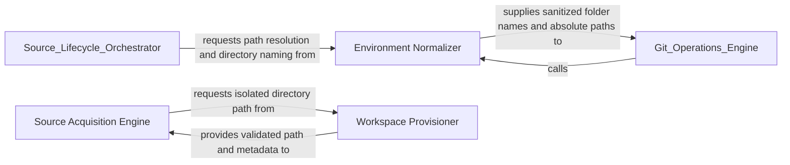

## Details

Responsible for the 'Source' phase, acquiring codebases and preparing the physical filesystem.

### Environment Normalizer
Handles path arithmetic, workspace integrity, and sanitization of repository URLs into valid directory structures.

**Related Classes/Methods**:

- `repo_utils.__init__.get_repo_name`:92-96
- `repo_utils.__init__.sanitize_repo_url`:60-74

**Source Files:**

- [`repo_utils/__init__.py`](https://github.com/CodeBoarding/CodeBoarding/blob/main/.codeboardingrepo_utils/__init__.py)
  - `repo_utils.__init__.require_git_import.decorator.wrapper` ([L39-L53](https://github.com/CodeBoarding/CodeBoarding/blob/main/.codeboardingrepo_utils/__init__.py#L39-L53)) - Function
  - `repo_utils.__init__.sanitize_repo_url` ([L60-L74](https://github.com/CodeBoarding/CodeBoarding/blob/main/.codeboardingrepo_utils/__init__.py#L60-L74)) - Function
  - `repo_utils.__init__.upload_onboarding_materials` ([L144-L173](https://github.com/CodeBoarding/CodeBoarding/blob/main/.codeboardingrepo_utils/__init__.py#L144-L173)) - Function
- [`utils.py`](https://github.com/CodeBoarding/CodeBoarding/blob/main/.codeboardingutils.py)
  - `utils.create_temp_repo_folder` ([L20-L24](https://github.com/CodeBoarding/CodeBoarding/blob/main/.codeboardingutils.py#L20-L24)) - Function
  - `utils.remove_temp_repo_folder` ([L27-L31](https://github.com/CodeBoarding/CodeBoarding/blob/main/.codeboardingutils.py#L27-L31)) - Function
  - `utils.copy_files` ([L117-L123](https://github.com/CodeBoarding/CodeBoarding/blob/main/.codeboardingutils.py#L117-L123)) - Function

### Source Acquisition Engine
Handles the retrieval of codebases from remote VCS or local paths, ensuring raw source code is accessible for the pipeline.

**Related Classes/Methods**:

- `codeboarding_workflows.sources.remote.remote_source`:32-71
- `codeboarding_workflows.sources.local.local_source`:22-23

**Source Files:**

- [`codeboarding_workflows/sources/local.py`](https://github.com/CodeBoarding/CodeBoarding/blob/main/.codeboardingcodeboarding_workflows/sources/local.py)
  - `codeboarding_workflows.sources.local.SourceContext` ([L8-L18](https://github.com/CodeBoarding/CodeBoarding/blob/main/.codeboardingcodeboarding_workflows/sources/local.py#L8-L18)) - Class
  - `codeboarding_workflows.sources.local.local_source` ([L22-L23](https://github.com/CodeBoarding/CodeBoarding/blob/main/.codeboardingcodeboarding_workflows/sources/local.py#L22-L23)) - Function
- [`codeboarding_workflows/sources/remote.py`](https://github.com/CodeBoarding/CodeBoarding/blob/main/.codeboardingcodeboarding_workflows/sources/remote.py)
  - `codeboarding_workflows.sources.remote.onboarding_materials_exist` ([L18-L28](https://github.com/CodeBoarding/CodeBoarding/blob/main/.codeboardingcodeboarding_workflows/sources/remote.py#L18-L28)) - Function
  - `codeboarding_workflows.sources.remote.remote_source` ([L32-L71](https://github.com/CodeBoarding/CodeBoarding/blob/main/.codeboardingcodeboarding_workflows/sources/remote.py#L32-L71)) - Function
- [`repo_utils/__init__.py`](https://github.com/CodeBoarding/CodeBoarding/blob/main/.codeboardingrepo_utils/__init__.py)
  - `repo_utils.__init__.remote_repo_exists` ([L78-L89](https://github.com/CodeBoarding/CodeBoarding/blob/main/.codeboardingrepo_utils/__init__.py#L78-L89)) - Function

### Workspace Provisioner
Manages the physical lifecycle of the analysis environment, including temporary directory creation and path normalization.

**Related Classes/Methods**:

- `utils.create_temp_repo_folder`:20-24

**Source Files:**

- [`repo_utils/__init__.py`](https://github.com/CodeBoarding/CodeBoarding/blob/main/.codeboardingrepo_utils/__init__.py)
  - `repo_utils.__init__.sanitize_repo_url` ([L60-L74](https://github.com/CodeBoarding/CodeBoarding/blob/main/.codeboardingrepo_utils/__init__.py#L60-L74)) - Function
  - `repo_utils.__init__.get_repo_name` ([L92-L96](https://github.com/CodeBoarding/CodeBoarding/blob/main/.codeboardingrepo_utils/__init__.py#L92-L96)) - Function
  - `repo_utils.__init__.clone_repository` ([L100-L122](https://github.com/CodeBoarding/CodeBoarding/blob/main/.codeboardingrepo_utils/__init__.py#L100-L122)) - Function
  - `repo_utils.__init__.upload_onboarding_materials` ([L144-L173](https://github.com/CodeBoarding/CodeBoarding/blob/main/.codeboardingrepo_utils/__init__.py#L144-L173)) - Function
- [`repo_utils/errors.py`](https://github.com/CodeBoarding/CodeBoarding/blob/main/.codeboardingrepo_utils/errors.py)
  - `repo_utils.errors.RepoDontExistError` ([L5-L6](https://github.com/CodeBoarding/CodeBoarding/blob/main/.codeboardingrepo_utils/errors.py#L5-L6)) - Class
- [`utils.py`](https://github.com/CodeBoarding/CodeBoarding/blob/main/.codeboardingutils.py)
  - `utils.create_temp_repo_folder` ([L20-L24](https://github.com/CodeBoarding/CodeBoarding/blob/main/.codeboardingutils.py#L20-L24)) - Function
  - `utils.remove_temp_repo_folder` ([L27-L31](https://github.com/CodeBoarding/CodeBoarding/blob/main/.codeboardingutils.py#L27-L31)) - Function
  - `utils.copy_files` ([L117-L123](https://github.com/CodeBoarding/CodeBoarding/blob/main/.codeboardingutils.py#L117-L123)) - Function

### [FAQ](https://github.com/CodeBoarding/GeneratedOnBoardings/tree/main?tab=readme-ov-file#faq)