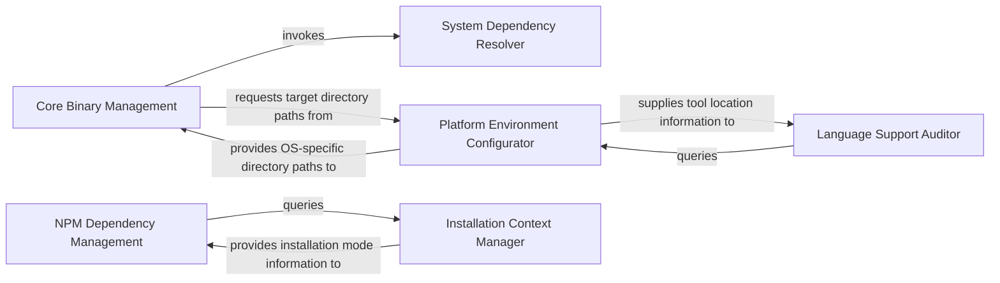

## Details

Manages the setup and configuration of the analysis environment. This includes downloading, installing, and configuring external language servers, package managers (e.g., npm, uv), and other necessary tools required for static analysis and code comprehension.

### Core Binary Management
Responsible for the secure downloading, verification, and initial placement of critical binaries, such as Java Development Tools Language Server (JDTLS) or other assets released via GitHub, that are essential for the static analysis process.

**Related Classes/Methods**:

- <a href="https://github.com/CodeBoarding/CodeBoarding/blob/main/.codeboardinginstall.py" target="_blank" rel="noopener noreferrer">`repos.codeboarding.environment.ToolingManager.CoreBinaryManagement`</a>

### NPM Dependency Management
Manages the installation, configuration, and ensures the availability of Node Package Manager (npm) and associated JavaScript/TypeScript tooling, which are prerequisites for supporting JavaScript/TypeScript language servers.

**Related Classes/Methods**:

- <a href="https://github.com/CodeBoarding/CodeBoarding/blob/main/.codeboardinginstall.py" target="_blank" rel="noopener noreferrer">`repos.codeboarding.environment.ToolingManager.NpmDependencyManagement`</a>

### System Dependency Resolver
Identifies and installs platform-specific system-level prerequisites, such as Visual C++ Redistributables on Windows, that are required by other binaries or tools within the analysis environment.

**Related Classes/Methods**:

- <a href="https://github.com/CodeBoarding/CodeBoarding/blob/main/.codeboardinginstall.py" target="_blank" rel="noopener noreferrer">`repos.codeboarding.environment.ToolingManager.SystemDependencyResolver`</a>

### Platform Environment Configurator
Provides operating system-specific directory paths for storing downloaded binaries and configuration files. It also updates static analysis configuration files to reflect the installed tools and environment settings.

**Related Classes/Methods**:

- <a href="https://github.com/CodeBoarding/CodeBoarding/blob/main/.codeboardinginstall.py" target="_blank" rel="noopener noreferrer">`repos.codeboarding.environment.ToolingManager.PlatformEnvironmentConfigurator`</a>

### Language Support Auditor
Evaluates the status and availability of installed language support components. It verifies the presence and correctness of language-specific tools and binaries, providing a summary of the environment's readiness for analysis.

**Related Classes/Methods**:

- <a href="https://github.com/CodeBoarding/CodeBoarding/blob/main/.codeboardinginstall.py" target="_blank" rel="noopener noreferrer">`repos.codeboarding.environment.ToolingManager.LanguageSupportAuditor`</a>

### Installation Context Manager
Determines the operational context of the installation process, specifically whether it is running in an interactive (user-guided) or non-interactive (automated) mode, guiding other components in adapting their installation strategies.

**Related Classes/Methods**:

- <a href="https://github.com/CodeBoarding/CodeBoarding/blob/main/.codeboardinginstall.py" target="_blank" rel="noopener noreferrer">`repos.codeboarding.environment.ToolingManager.InstallationContextManager`</a>

### [FAQ](https://github.com/CodeBoarding/GeneratedOnBoardings/tree/main?tab=readme-ov-file#faq)