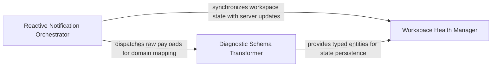

## Details

Manages the reactive side of the LSP protocol, processing unsolicited notifications and converting them into internal domain models.

### Reactive Notification Orchestrator
Acts as the subsystem's entry point, implementing the Observer pattern to intercept asynchronous JSON-RPC messages and dispatch them to specialized internal handlers.

**Related Classes/Methods**:

- `static_analyzer.engine.lsp_client.LSPClient._handle_notification`:734-791

**Source Files:**

- [`static_analyzer/engine/lsp_client.py`](https://github.com/CodeBoarding/CodeBoarding/blob/main/.codeboardingstatic_analyzer/engine/lsp_client.py)
  - `static_analyzer.engine.lsp_client.LSPClient._handle_notification` ([L734-L791](https://github.com/CodeBoarding/CodeBoarding/blob/main/.codeboardingstatic_analyzer/engine/lsp_client.py#L734-L791)) - Method
- [`static_analyzer/lsp_client/diagnostics.py`](https://github.com/CodeBoarding/CodeBoarding/blob/main/.codeboardingstatic_analyzer/lsp_client/diagnostics.py)
  - `static_analyzer.lsp_client.diagnostics.LSPDiagnostic.from_lsp_dict` ([L37-L50](https://github.com/CodeBoarding/CodeBoarding/blob/main/.codeboardingstatic_analyzer/lsp_client/diagnostics.py#L37-L50)) - Method

### Diagnostic Schema Transformer
A specialized data-mapping layer that converts raw LSP-compliant dictionaries into strongly-typed Python objects, validating external data against the internal domain model.

**Related Classes/Methods**: _None_

**Source Files:**

- [`static_analyzer/lsp_client/diagnostics.py`](https://github.com/CodeBoarding/CodeBoarding/blob/main/.codeboardingstatic_analyzer/lsp_client/diagnostics.py)
  - `static_analyzer.lsp_client.diagnostics.DiagnosticRange` ([L19-L23](https://github.com/CodeBoarding/CodeBoarding/blob/main/.codeboardingstatic_analyzer/lsp_client/diagnostics.py#L19-L23)) - Class
  - `static_analyzer.lsp_client.diagnostics.LSPDiagnostic.dedup_key` ([L52-L58](https://github.com/CodeBoarding/CodeBoarding/blob/main/.codeboardingstatic_analyzer/lsp_client/diagnostics.py#L52-L58)) - Method

### Workspace Health Manager
Manages the lifecycle and persistence of diagnostics within the application state, maintaining a synchronized cache of issues indexed by URI.

**Related Classes/Methods**: _None_

**Source Files:**

- [`static_analyzer/lsp_client/diagnostics.py`](https://github.com/CodeBoarding/CodeBoarding/blob/main/.codeboardingstatic_analyzer/lsp_client/diagnostics.py)
  - `static_analyzer.lsp_client.diagnostics.DiagnosticPosition` ([L11-L15](https://github.com/CodeBoarding/CodeBoarding/blob/main/.codeboardingstatic_analyzer/lsp_client/diagnostics.py#L11-L15)) - Class
  - `static_analyzer.lsp_client.diagnostics.LSPDiagnostic` ([L27-L58](https://github.com/CodeBoarding/CodeBoarding/blob/main/.codeboardingstatic_analyzer/lsp_client/diagnostics.py#L27-L58)) - Class

### [FAQ](https://github.com/CodeBoarding/GeneratedOnBoardings/tree/main?tab=readme-ov-file#faq)