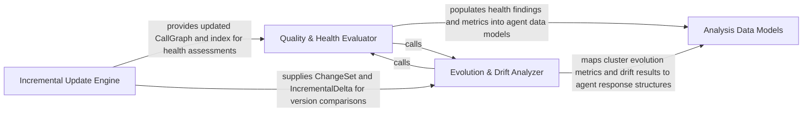

## Details

Manages temporal and qualitative analysis, using Git integration for incremental updates and running health checks to detect architectural issues.

### Incremental Update Engine
Manages synchronization between the Git repository and the internal architectural model by detecting file-level changes and applying surgical updates to indexes, reference maps, and call graphs to avoid full re-analysis.

**Related Classes/Methods**:

- `repo_utils.change_detector.detect_changes`:106-209
- `diagram_analysis.incremental_updater.IncrementalUpdater`:30-247
- `static_analyzer.git_diff_analyzer.GitDiffAnalyzer`:16-224

**Source Files:**

- [`agents/agent_responses.py`](https://github.com/CodeBoarding/CodeBoarding/blob/main/.codeboardingagents/agent_responses.py)
  - `agents.agent_responses.LLMBaseModel` ([L14-L45](https://github.com/CodeBoarding/CodeBoarding/blob/main/.codeboardingagents/agent_responses.py#L14-L45)) - Class
  - `agents.agent_responses.SourceCodeReference` ([L48-L87](https://github.com/CodeBoarding/CodeBoarding/blob/main/.codeboardingagents/agent_responses.py#L48-L87)) - Class
  - `agents.agent_responses.SourceCodeReference.llm_str` ([L69-L77](https://github.com/CodeBoarding/CodeBoarding/blob/main/.codeboardingagents/agent_responses.py#L69-L77)) - Method
  - `agents.agent_responses.SourceCodeReference.__str__` ([L79-L87](https://github.com/CodeBoarding/CodeBoarding/blob/main/.codeboardingagents/agent_responses.py#L79-L87)) - Method
  - `agents.agent_responses.Relation` ([L90-L102](https://github.com/CodeBoarding/CodeBoarding/blob/main/.codeboardingagents/agent_responses.py#L90-L102)) - Class
  - `agents.agent_responses.Relation.llm_str` ([L101-L102](https://github.com/CodeBoarding/CodeBoarding/blob/main/.codeboardingagents/agent_responses.py#L101-L102)) - Method
  - `agents.agent_responses.ClustersComponent` ([L105-L120](https://github.com/CodeBoarding/CodeBoarding/blob/main/.codeboardingagents/agent_responses.py#L105-L120)) - Class
  - `agents.agent_responses.ClusterAnalysis` ([L123-L135](https://github.com/CodeBoarding/CodeBoarding/blob/main/.codeboardingagents/agent_responses.py#L123-L135)) - Class
  - `agents.agent_responses.MethodEntry` ([L138-L166](https://github.com/CodeBoarding/CodeBoarding/blob/main/.codeboardingagents/agent_responses.py#L138-L166)) - Class
  - `agents.agent_responses.MethodEntry.__hash__` ([L150-L151](https://github.com/CodeBoarding/CodeBoarding/blob/main/.codeboardingagents/agent_responses.py#L150-L151)) - Method
  - `agents.agent_responses.MethodEntry.__eq__` ([L153-L156](https://github.com/CodeBoarding/CodeBoarding/blob/main/.codeboardingagents/agent_responses.py#L153-L156)) - Method
  - `agents.agent_responses.MethodEntry.from_method_change` ([L159-L166](https://github.com/CodeBoarding/CodeBoarding/blob/main/.codeboardingagents/agent_responses.py#L159-L166)) - Method
  - `agents.agent_responses.FileMethodGroup` ([L169-L180](https://github.com/CodeBoarding/CodeBoarding/blob/main/.codeboardingagents/agent_responses.py#L169-L180)) - Class
  - `agents.agent_responses.FileEntry` ([L183-L193](https://github.com/CodeBoarding/CodeBoarding/blob/main/.codeboardingagents/agent_responses.py#L183-L193)) - Class
  - `agents.agent_responses.Component` ([L196-L240](https://github.com/CodeBoarding/CodeBoarding/blob/main/.codeboardingagents/agent_responses.py#L196-L240)) - Class
  - `agents.agent_responses.Component.llm_str` ([L230-L240](https://github.com/CodeBoarding/CodeBoarding/blob/main/.codeboardingagents/agent_responses.py#L230-L240)) - Method
  - `agents.agent_responses.AnalysisInsights` ([L243-L267](https://github.com/CodeBoarding/CodeBoarding/blob/main/.codeboardingagents/agent_responses.py#L243-L267)) - Class
  - `agents.agent_responses.AnalysisInsights.llm_str` ([L257-L263](https://github.com/CodeBoarding/CodeBoarding/blob/main/.codeboardingagents/agent_responses.py#L257-L263)) - Method
  - `agents.agent_responses.AnalysisInsights.file_to_component` ([L265-L267](https://github.com/CodeBoarding/CodeBoarding/blob/main/.codeboardingagents/agent_responses.py#L265-L267)) - Method
  - `agents.agent_responses.assign_component_ids` ([L270-L296](https://github.com/CodeBoarding/CodeBoarding/blob/main/.codeboardingagents/agent_responses.py#L270-L296)) - Function
  - `agents.agent_responses.CFGComponent` ([L299-L315](https://github.com/CodeBoarding/CodeBoarding/blob/main/.codeboardingagents/agent_responses.py#L299-L315)) - Class
  - `agents.agent_responses.CFGComponent.llm_str` ([L308-L315](https://github.com/CodeBoarding/CodeBoarding/blob/main/.codeboardingagents/agent_responses.py#L308-L315)) - Method
  - `agents.agent_responses.CFGAnalysisInsights` ([L318-L330](https://github.com/CodeBoarding/CodeBoarding/blob/main/.codeboardingagents/agent_responses.py#L318-L330)) - Class
  - `agents.agent_responses.CFGAnalysisInsights.llm_str` ([L324-L330](https://github.com/CodeBoarding/CodeBoarding/blob/main/.codeboardingagents/agent_responses.py#L324-L330)) - Method
  - `agents.agent_responses.ExpandComponent` ([L333-L340](https://github.com/CodeBoarding/CodeBoarding/blob/main/.codeboardingagents/agent_responses.py#L333-L340)) - Class
  - `agents.agent_responses.ValidationInsights` ([L343-L353](https://github.com/CodeBoarding/CodeBoarding/blob/main/.codeboardingagents/agent_responses.py#L343-L353)) - Class
  - `agents.agent_responses.UpdateAnalysis` ([L356-L365](https://github.com/CodeBoarding/CodeBoarding/blob/main/.codeboardingagents/agent_responses.py#L356-L365)) - Class
  - `agents.agent_responses.MetaAnalysisInsights` ([L368-L394](https://github.com/CodeBoarding/CodeBoarding/blob/main/.codeboardingagents/agent_responses.py#L368-L394)) - Class
  - `agents.agent_responses.FileClassification` ([L397-L404](https://github.com/CodeBoarding/CodeBoarding/blob/main/.codeboardingagents/agent_responses.py#L397-L404)) - Class
  - `agents.agent_responses.ComponentFiles` ([L407-L419](https://github.com/CodeBoarding/CodeBoarding/blob/main/.codeboardingagents/agent_responses.py#L407-L419)) - Class
  - `agents.agent_responses.FilePath` ([L422-L436](https://github.com/CodeBoarding/CodeBoarding/blob/main/.codeboardingagents/agent_responses.py#L422-L436)) - Class
- [`agents/tools/read_git_diff.py`](https://github.com/CodeBoarding/CodeBoarding/blob/main/.codeboardingagents/tools/read_git_diff.py)
  - `agents.tools.read_git_diff.ReadDiffInput` ([L10-L19](https://github.com/CodeBoarding/CodeBoarding/blob/main/.codeboardingagents/tools/read_git_diff.py#L10-L19)) - Class
  - `agents.tools.read_git_diff.ReadDiffTool` ([L22-L131](https://github.com/CodeBoarding/CodeBoarding/blob/main/.codeboardingagents/tools/read_git_diff.py#L22-L131)) - Class
  - `agents.tools.read_git_diff.ReadDiffTool.__init__` ([L34-L38](https://github.com/CodeBoarding/CodeBoarding/blob/main/.codeboardingagents/tools/read_git_diff.py#L34-L38)) - Method
  - `agents.tools.read_git_diff.ReadDiffTool._run` ([L40-L131](https://github.com/CodeBoarding/CodeBoarding/blob/main/.codeboardingagents/tools/read_git_diff.py#L40-L131)) - Method
- [`diagram_analysis/incremental_types.py`](https://github.com/CodeBoarding/CodeBoarding/blob/main/.codeboardingdiagram_analysis/incremental_types.py)
  - `diagram_analysis.incremental_types.MethodChange` ([L10-L26](https://github.com/CodeBoarding/CodeBoarding/blob/main/.codeboardingdiagram_analysis/incremental_types.py#L10-L26)) - Class
  - `diagram_analysis.incremental_types.MethodChange.to_dict` ([L18-L26](https://github.com/CodeBoarding/CodeBoarding/blob/main/.codeboardingdiagram_analysis/incremental_types.py#L18-L26)) - Method
  - `diagram_analysis.incremental_types.FileDelta` ([L30-L52](https://github.com/CodeBoarding/CodeBoarding/blob/main/.codeboardingdiagram_analysis/incremental_types.py#L30-L52)) - Class
  - `diagram_analysis.incremental_types.FileDelta.to_dict` ([L40-L52](https://github.com/CodeBoarding/CodeBoarding/blob/main/.codeboardingdiagram_analysis/incremental_types.py#L40-L52)) - Method
  - `diagram_analysis.incremental_types.IncrementalDelta` ([L56-L70](https://github.com/CodeBoarding/CodeBoarding/blob/main/.codeboardingdiagram_analysis/incremental_types.py#L56-L70)) - Class
  - `diagram_analysis.incremental_types.IncrementalDelta.has_changes` ([L62-L63](https://github.com/CodeBoarding/CodeBoarding/blob/main/.codeboardingdiagram_analysis/incremental_types.py#L62-L63)) - Method
  - `diagram_analysis.incremental_types.IncrementalDelta.to_dict` ([L65-L70](https://github.com/CodeBoarding/CodeBoarding/blob/main/.codeboardingdiagram_analysis/incremental_types.py#L65-L70)) - Method
- [`diagram_analysis/incremental_updater.py`](https://github.com/CodeBoarding/CodeBoarding/blob/main/.codeboardingdiagram_analysis/incremental_updater.py)
  - `diagram_analysis.incremental_updater.IncrementalUpdater` ([L30-L247](https://github.com/CodeBoarding/CodeBoarding/blob/main/.codeboardingdiagram_analysis/incremental_updater.py#L30-L247)) - Class
  - `diagram_analysis.incremental_updater.IncrementalUpdater.__init__` ([L41-L52](https://github.com/CodeBoarding/CodeBoarding/blob/main/.codeboardingdiagram_analysis/incremental_updater.py#L41-L52)) - Method
  - `diagram_analysis.incremental_updater.IncrementalUpdater._get_current_methods` ([L54-L55](https://github.com/CodeBoarding/CodeBoarding/blob/main/.codeboardingdiagram_analysis/incremental_updater.py#L54-L55)) - Method
  - `diagram_analysis.incremental_updater.IncrementalUpdater._get_previous_methods` ([L57-L61](https://github.com/CodeBoarding/CodeBoarding/blob/main/.codeboardingdiagram_analysis/incremental_updater.py#L57-L61)) - Method
  - `diagram_analysis.incremental_updater.IncrementalUpdater._get_previous_active_methods` ([L63-L64](https://github.com/CodeBoarding/CodeBoarding/blob/main/.codeboardingdiagram_analysis/incremental_updater.py#L63-L64)) - Method
  - `diagram_analysis.incremental_updater.IncrementalUpdater._apply_method_diff_statuses` ([L66-L69](https://github.com/CodeBoarding/CodeBoarding/blob/main/.codeboardingdiagram_analysis/incremental_updater.py#L66-L69)) - Method
  - `diagram_analysis.incremental_updater.IncrementalUpdater._to_method_change` ([L72-L85](https://github.com/CodeBoarding/CodeBoarding/blob/main/.codeboardingdiagram_analysis/incremental_updater.py#L72-L85)) - Method
  - `diagram_analysis.incremental_updater.IncrementalUpdater._compute_file_delta` ([L87-L184](https://github.com/CodeBoarding/CodeBoarding/blob/main/.codeboardingdiagram_analysis/incremental_updater.py#L87-L184)) - Method
  - `diagram_analysis.incremental_updater.IncrementalUpdater._compute_reset_delta` ([L186-L209](https://github.com/CodeBoarding/CodeBoarding/blob/main/.codeboardingdiagram_analysis/incremental_updater.py#L186-L209)) - Method
  - `diagram_analysis.incremental_updater.IncrementalUpdater.compute_delta` ([L211-L247](https://github.com/CodeBoarding/CodeBoarding/blob/main/.codeboardingdiagram_analysis/incremental_updater.py#L211-L247)) - Method
  - `diagram_analysis.incremental_updater._component_lookup` ([L250-L255](https://github.com/CodeBoarding/CodeBoarding/blob/main/.codeboardingdiagram_analysis/incremental_updater.py#L250-L255)) - Function
  - `diagram_analysis.incremental_updater._ensure_file_entry` ([L258-L263](https://github.com/CodeBoarding/CodeBoarding/blob/main/.codeboardingdiagram_analysis/incremental_updater.py#L258-L263)) - Function
  - `diagram_analysis.incremental_updater._apply_method_changes` ([L266-L276](https://github.com/CodeBoarding/CodeBoarding/blob/main/.codeboardingdiagram_analysis/incremental_updater.py#L266-L276)) - Function
  - `diagram_analysis.incremental_updater._sorted_methods` ([L279-L280](https://github.com/CodeBoarding/CodeBoarding/blob/main/.codeboardingdiagram_analysis/incremental_updater.py#L279-L280)) - Function
  - `diagram_analysis.incremental_updater._apply_file_delta_to_index` ([L283-L308](https://github.com/CodeBoarding/CodeBoarding/blob/main/.codeboardingdiagram_analysis/incremental_updater.py#L283-L308)) - Function
  - `diagram_analysis.incremental_updater._sync_component_methods` ([L311-L374](https://github.com/CodeBoarding/CodeBoarding/blob/main/.codeboardingdiagram_analysis/incremental_updater.py#L311-L374)) - Function
  - `diagram_analysis.incremental_updater.apply_delta` ([L377-L411](https://github.com/CodeBoarding/CodeBoarding/blob/main/.codeboardingdiagram_analysis/incremental_updater.py#L377-L411)) - Function
- [`repo_utils/change_detector.py`](https://github.com/CodeBoarding/CodeBoarding/blob/main/.codeboardingrepo_utils/change_detector.py)
  - `repo_utils.change_detector.ChangeType` ([L22-L32](https://github.com/CodeBoarding/CodeBoarding/blob/main/.codeboardingrepo_utils/change_detector.py#L22-L32)) - Class
  - `repo_utils.change_detector.DetectedChange` ([L36-L53](https://github.com/CodeBoarding/CodeBoarding/blob/main/.codeboardingrepo_utils/change_detector.py#L36-L53)) - Class
  - `repo_utils.change_detector.DetectedChange.is_rename` ([L44-L45](https://github.com/CodeBoarding/CodeBoarding/blob/main/.codeboardingrepo_utils/change_detector.py#L44-L45)) - Method
  - `repo_utils.change_detector.DetectedChange.is_content_change` ([L47-L49](https://github.com/CodeBoarding/CodeBoarding/blob/main/.codeboardingrepo_utils/change_detector.py#L47-L49)) - Method
  - `repo_utils.change_detector.DetectedChange.is_structural` ([L51-L53](https://github.com/CodeBoarding/CodeBoarding/blob/main/.codeboardingrepo_utils/change_detector.py#L51-L53)) - Method
  - `repo_utils.change_detector.ChangeSet` ([L57-L103](https://github.com/CodeBoarding/CodeBoarding/blob/main/.codeboardingrepo_utils/change_detector.py#L57-L103)) - Class
  - `repo_utils.change_detector.ChangeSet.renames` ([L65-L67](https://github.com/CodeBoarding/CodeBoarding/blob/main/.codeboardingrepo_utils/change_detector.py#L65-L67)) - Method
  - `repo_utils.change_detector.ChangeSet.modified_files` ([L70-L72](https://github.com/CodeBoarding/CodeBoarding/blob/main/.codeboardingrepo_utils/change_detector.py#L70-L72)) - Method
  - `repo_utils.change_detector.ChangeSet.added_files` ([L75-L77](https://github.com/CodeBoarding/CodeBoarding/blob/main/.codeboardingrepo_utils/change_detector.py#L75-L77)) - Method
  - `repo_utils.change_detector.ChangeSet.deleted_files` ([L80-L82](https://github.com/CodeBoarding/CodeBoarding/blob/main/.codeboardingrepo_utils/change_detector.py#L80-L82)) - Method
  - `repo_utils.change_detector.ChangeSet.all_affected_files` ([L85-L87](https://github.com/CodeBoarding/CodeBoarding/blob/main/.codeboardingrepo_utils/change_detector.py#L85-L87)) - Method
  - `repo_utils.change_detector.ChangeSet.all_old_paths` ([L90-L92](https://github.com/CodeBoarding/CodeBoarding/blob/main/.codeboardingrepo_utils/change_detector.py#L90-L92)) - Method
  - `repo_utils.change_detector.ChangeSet.is_empty` ([L94-L95](https://github.com/CodeBoarding/CodeBoarding/blob/main/.codeboardingrepo_utils/change_detector.py#L94-L95)) - Method
  - `repo_utils.change_detector.ChangeSet.has_structural_changes` ([L97-L99](https://github.com/CodeBoarding/CodeBoarding/blob/main/.codeboardingrepo_utils/change_detector.py#L97-L99)) - Method
  - `repo_utils.change_detector.ChangeSet.has_only_renames` ([L101-L103](https://github.com/CodeBoarding/CodeBoarding/blob/main/.codeboardingrepo_utils/change_detector.py#L101-L103)) - Method
  - `repo_utils.change_detector.detect_changes` ([L106-L209](https://github.com/CodeBoarding/CodeBoarding/blob/main/.codeboardingrepo_utils/change_detector.py#L106-L209)) - Function
  - `repo_utils.change_detector.detect_changes._run_diff` ([L152-L159](https://github.com/CodeBoarding/CodeBoarding/blob/main/.codeboardingrepo_utils/change_detector.py#L152-L159)) - Function
  - `repo_utils.change_detector.detect_changes_from_commit` ([L212-L218](https://github.com/CodeBoarding/CodeBoarding/blob/main/.codeboardingrepo_utils/change_detector.py#L212-L218)) - Function
  - `repo_utils.change_detector.detect_uncommitted_changes` ([L221-L225](https://github.com/CodeBoarding/CodeBoarding/blob/main/.codeboardingrepo_utils/change_detector.py#L221-L225)) - Function
  - `repo_utils.change_detector._parse_status_line` ([L228-L279](https://github.com/CodeBoarding/CodeBoarding/blob/main/.codeboardingrepo_utils/change_detector.py#L228-L279)) - Function
  - `repo_utils.change_detector.get_current_commit` ([L282-L294](https://github.com/CodeBoarding/CodeBoarding/blob/main/.codeboardingrepo_utils/change_detector.py#L282-L294)) - Function
- [`repo_utils/git_diff.py`](https://github.com/CodeBoarding/CodeBoarding/blob/main/.codeboardingrepo_utils/git_diff.py)
  - `repo_utils.git_diff.FileChange` ([L7-L22](https://github.com/CodeBoarding/CodeBoarding/blob/main/.codeboardingrepo_utils/git_diff.py#L7-L22)) - Class
  - `repo_utils.git_diff.FileChange.llm_str` ([L18-L22](https://github.com/CodeBoarding/CodeBoarding/blob/main/.codeboardingrepo_utils/git_diff.py#L18-L22)) - Method
  - `repo_utils.git_diff.get_git_diff` ([L25-L74](https://github.com/CodeBoarding/CodeBoarding/blob/main/.codeboardingrepo_utils/git_diff.py#L25-L74)) - Function
- [`repo_utils/method_diff.py`](https://github.com/CodeBoarding/CodeBoarding/blob/main/.codeboardingrepo_utils/method_diff.py)
  - `repo_utils.method_diff._parse_hunk_side` ([L21-L28](https://github.com/CodeBoarding/CodeBoarding/blob/main/.codeboardingrepo_utils/method_diff.py#L21-L28)) - Function
  - `repo_utils.method_diff._parse_diff_hunks` ([L31-L60](https://github.com/CodeBoarding/CodeBoarding/blob/main/.codeboardingrepo_utils/method_diff.py#L31-L60)) - Function
  - `repo_utils.method_diff._method_overlaps_ranges` ([L63-L68](https://github.com/CodeBoarding/CodeBoarding/blob/main/.codeboardingrepo_utils/method_diff.py#L63-L68)) - Function
  - `repo_utils.method_diff._method_fully_inside_ranges` ([L71-L82](https://github.com/CodeBoarding/CodeBoarding/blob/main/.codeboardingrepo_utils/method_diff.py#L71-L82)) - Function
  - `repo_utils.method_diff._resolve_file_status` ([L85-L100](https://github.com/CodeBoarding/CodeBoarding/blob/main/.codeboardingrepo_utils/method_diff.py#L85-L100)) - Function
  - `repo_utils.method_diff.get_method_statuses_for_file` ([L103-L162](https://github.com/CodeBoarding/CodeBoarding/blob/main/.codeboardingrepo_utils/method_diff.py#L103-L162)) - Function
  - `repo_utils.method_diff.apply_method_diffs_to_file_index` ([L165-L177](https://github.com/CodeBoarding/CodeBoarding/blob/main/.codeboardingrepo_utils/method_diff.py#L165-L177)) - Function
- [`static_analyzer/git_diff_analyzer.py`](https://github.com/CodeBoarding/CodeBoarding/blob/main/.codeboardingstatic_analyzer/git_diff_analyzer.py)
  - `static_analyzer.git_diff_analyzer.GitDiffAnalyzer` ([L16-L224](https://github.com/CodeBoarding/CodeBoarding/blob/main/.codeboardingstatic_analyzer/git_diff_analyzer.py#L16-L224)) - Class
  - `static_analyzer.git_diff_analyzer.GitDiffAnalyzer.__init__` ([L24-L37](https://github.com/CodeBoarding/CodeBoarding/blob/main/.codeboardingstatic_analyzer/git_diff_analyzer.py#L24-L37)) - Method
  - `static_analyzer.git_diff_analyzer.GitDiffAnalyzer.get_changed_files` ([L39-L84](https://github.com/CodeBoarding/CodeBoarding/blob/main/.codeboardingstatic_analyzer/git_diff_analyzer.py#L39-L84)) - Method
  - `static_analyzer.git_diff_analyzer.GitDiffAnalyzer.get_current_commit` ([L86-L107](https://github.com/CodeBoarding/CodeBoarding/blob/main/.codeboardingstatic_analyzer/git_diff_analyzer.py#L86-L107)) - Method
  - `static_analyzer.git_diff_analyzer.GitDiffAnalyzer.has_uncommitted_changes` ([L109-L153](https://github.com/CodeBoarding/CodeBoarding/blob/main/.codeboardingstatic_analyzer/git_diff_analyzer.py#L109-L153)) - Method
  - `static_analyzer.git_diff_analyzer.GitDiffAnalyzer._get_uncommitted_changes` ([L155-L209](https://github.com/CodeBoarding/CodeBoarding/blob/main/.codeboardingstatic_analyzer/git_diff_analyzer.py#L155-L209)) - Method
  - `static_analyzer.git_diff_analyzer.GitDiffAnalyzer._is_git_repository` ([L211-L224](https://github.com/CodeBoarding/CodeBoarding/blob/main/.codeboardingstatic_analyzer/git_diff_analyzer.py#L211-L224)) - Method
- [`static_analyzer/reference_resolve_mixin.py`](https://github.com/CodeBoarding/CodeBoarding/blob/main/.codeboardingstatic_analyzer/reference_resolve_mixin.py)
  - `static_analyzer.reference_resolve_mixin.ReferenceResolverMixin` ([L12-L187](https://github.com/CodeBoarding/CodeBoarding/blob/main/.codeboardingstatic_analyzer/reference_resolve_mixin.py#L12-L187)) - Class
  - `static_analyzer.reference_resolve_mixin.ReferenceResolverMixin.__init__` ([L15-L17](https://github.com/CodeBoarding/CodeBoarding/blob/main/.codeboardingstatic_analyzer/reference_resolve_mixin.py#L15-L17)) - Method
  - `static_analyzer.reference_resolve_mixin.ReferenceResolverMixin.fix_source_code_reference_lines` ([L19-L39](https://github.com/CodeBoarding/CodeBoarding/blob/main/.codeboardingstatic_analyzer/reference_resolve_mixin.py#L19-L39)) - Method
  - `static_analyzer.reference_resolve_mixin.ReferenceResolverMixin._resolve_single_reference` ([L41-L60](https://github.com/CodeBoarding/CodeBoarding/blob/main/.codeboardingstatic_analyzer/reference_resolve_mixin.py#L41-L60)) - Method
  - `static_analyzer.reference_resolve_mixin.ReferenceResolverMixin._try_exact_match` ([L62-L76](https://github.com/CodeBoarding/CodeBoarding/blob/main/.codeboardingstatic_analyzer/reference_resolve_mixin.py#L62-L76)) - Method
  - `static_analyzer.reference_resolve_mixin.ReferenceResolverMixin._try_loose_match` ([L78-L93](https://github.com/CodeBoarding/CodeBoarding/blob/main/.codeboardingstatic_analyzer/reference_resolve_mixin.py#L78-L93)) - Method
  - `static_analyzer.reference_resolve_mixin.ReferenceResolverMixin._try_file_path_resolution` ([L95-L102](https://github.com/CodeBoarding/CodeBoarding/blob/main/.codeboardingstatic_analyzer/reference_resolve_mixin.py#L95-L102)) - Method
  - `static_analyzer.reference_resolve_mixin.ReferenceResolverMixin._try_existing_reference_file` ([L104-L116](https://github.com/CodeBoarding/CodeBoarding/blob/main/.codeboardingstatic_analyzer/reference_resolve_mixin.py#L104-L116)) - Method
  - `static_analyzer.reference_resolve_mixin.ReferenceResolverMixin._try_qualified_name_as_path` ([L118-L162](https://github.com/CodeBoarding/CodeBoarding/blob/main/.codeboardingstatic_analyzer/reference_resolve_mixin.py#L118-L162)) - Method
  - `static_analyzer.reference_resolve_mixin.ReferenceResolverMixin._remove_unresolved_references` ([L164-L179](https://github.com/CodeBoarding/CodeBoarding/blob/main/.codeboardingstatic_analyzer/reference_resolve_mixin.py#L164-L179)) - Method
  - `static_analyzer.reference_resolve_mixin.ReferenceResolverMixin._relative_paths` ([L181-L187](https://github.com/CodeBoarding/CodeBoarding/blob/main/.codeboardingstatic_analyzer/reference_resolve_mixin.py#L181-L187)) - Method

### Quality & Health Evaluator
Executes architectural health checks on the current code graph to identify structural anti-patterns (e.g., high coupling, low cohesion, circular dependencies) and produce quantitative quality metrics.

**Related Classes/Methods**:

- `health.runner.run_health_checks`:187-236
- `static_analyzer.graph.CallGraph`:67-675
- `health.checks.coupling.check_fan_out`:35-85

**Source Files:**

- [`health/checks/circular_deps.py`](https://github.com/CodeBoarding/CodeBoarding/blob/main/.codeboardinghealth/checks/circular_deps.py)
  - `health.checks.circular_deps.check_circular_dependencies` ([L10-L48](https://github.com/CodeBoarding/CodeBoarding/blob/main/.codeboardinghealth/checks/circular_deps.py#L10-L48)) - Function
- [`health/checks/cohesion.py`](https://github.com/CodeBoarding/CodeBoarding/blob/main/.codeboardinghealth/checks/cohesion.py)
  - `health.checks.cohesion.check_component_cohesion` ([L9-L93](https://github.com/CodeBoarding/CodeBoarding/blob/main/.codeboardinghealth/checks/cohesion.py#L9-L93)) - Function
- [`health/checks/coupling.py`](https://github.com/CodeBoarding/CodeBoarding/blob/main/.codeboardinghealth/checks/coupling.py)
  - `health.checks.coupling.collect_coupling_values` ([L15-L32](https://github.com/CodeBoarding/CodeBoarding/blob/main/.codeboardinghealth/checks/coupling.py#L15-L32)) - Function
  - `health.checks.coupling.check_fan_out` ([L35-L85](https://github.com/CodeBoarding/CodeBoarding/blob/main/.codeboardinghealth/checks/coupling.py#L35-L85)) - Function
  - `health.checks.coupling.check_fan_in` ([L88-L140](https://github.com/CodeBoarding/CodeBoarding/blob/main/.codeboardinghealth/checks/coupling.py#L88-L140)) - Function
- [`health/checks/god_class.py`](https://github.com/CodeBoarding/CodeBoarding/blob/main/.codeboardinghealth/checks/god_class.py)
  - `health.checks.god_class._group_methods_by_class` ([L16-L27](https://github.com/CodeBoarding/CodeBoarding/blob/main/.codeboardinghealth/checks/god_class.py#L16-L27)) - Function
  - `health.checks.god_class.collect_god_class_values` ([L30-L64](https://github.com/CodeBoarding/CodeBoarding/blob/main/.codeboardinghealth/checks/god_class.py#L30-L64)) - Function
  - `health.checks.god_class.check_god_classes` ([L67-L167](https://github.com/CodeBoarding/CodeBoarding/blob/main/.codeboardinghealth/checks/god_class.py#L67-L167)) - Function
- [`health/checks/inheritance.py`](https://github.com/CodeBoarding/CodeBoarding/blob/main/.codeboardinghealth/checks/inheritance.py)
  - `health.checks.inheritance._compute_inheritance_depths` ([L15-L50](https://github.com/CodeBoarding/CodeBoarding/blob/main/.codeboardinghealth/checks/inheritance.py#L15-L50)) - Function
  - `health.checks.inheritance.check_inheritance_depth` ([L53-L104](https://github.com/CodeBoarding/CodeBoarding/blob/main/.codeboardinghealth/checks/inheritance.py#L53-L104)) - Function
- [`health/checks/instability.py`](https://github.com/CodeBoarding/CodeBoarding/blob/main/.codeboardinghealth/checks/instability.py)
  - `health.checks.instability.check_package_instability` ([L8-L77](https://github.com/CodeBoarding/CodeBoarding/blob/main/.codeboardinghealth/checks/instability.py#L8-L77)) - Function
- [`health/checks/unused_code_diagnostics.py`](https://github.com/CodeBoarding/CodeBoarding/blob/main/.codeboardinghealth/checks/unused_code_diagnostics.py)
  - `health.checks.unused_code_diagnostics.DeadCodeCategory` ([L31-L41](https://github.com/CodeBoarding/CodeBoarding/blob/main/.codeboardinghealth/checks/unused_code_diagnostics.py#L31-L41)) - Class
  - `health.checks.unused_code_diagnostics.DiagnosticIssue` ([L45-L54](https://github.com/CodeBoarding/CodeBoarding/blob/main/.codeboardinghealth/checks/unused_code_diagnostics.py#L45-L54)) - Class
  - `health.checks.unused_code_diagnostics.FileDiagnostic` ([L131-L135](https://github.com/CodeBoarding/CodeBoarding/blob/main/.codeboardinghealth/checks/unused_code_diagnostics.py#L131-L135)) - Class
  - `health.checks.unused_code_diagnostics.LSPDiagnosticsCollector` ([L138-L262](https://github.com/CodeBoarding/CodeBoarding/blob/main/.codeboardinghealth/checks/unused_code_diagnostics.py#L138-L262)) - Class
  - `health.checks.unused_code_diagnostics.LSPDiagnosticsCollector.__init__` ([L141-L143](https://github.com/CodeBoarding/CodeBoarding/blob/main/.codeboardinghealth/checks/unused_code_diagnostics.py#L141-L143)) - Method
  - `health.checks.unused_code_diagnostics.LSPDiagnosticsCollector.add_diagnostic` ([L145-L146](https://github.com/CodeBoarding/CodeBoarding/blob/main/.codeboardinghealth/checks/unused_code_diagnostics.py#L145-L146)) - Method
  - `health.checks.unused_code_diagnostics.LSPDiagnosticsCollector.process_diagnostics` ([L148-L183](https://github.com/CodeBoarding/CodeBoarding/blob/main/.codeboardinghealth/checks/unused_code_diagnostics.py#L148-L183)) - Method
  - `health.checks.unused_code_diagnostics.LSPDiagnosticsCollector._convert_to_issue` ([L185-L213](https://github.com/CodeBoarding/CodeBoarding/blob/main/.codeboardinghealth/checks/unused_code_diagnostics.py#L185-L213)) - Method
  - `health.checks.unused_code_diagnostics.LSPDiagnosticsCollector._categorize_diagnostic` ([L215-L235](https://github.com/CodeBoarding/CodeBoarding/blob/main/.codeboardinghealth/checks/unused_code_diagnostics.py#L215-L235)) - Method
  - `health.checks.unused_code_diagnostics.LSPDiagnosticsCollector._categorize_by_message` ([L237-L243](https://github.com/CodeBoarding/CodeBoarding/blob/main/.codeboardinghealth/checks/unused_code_diagnostics.py#L237-L243)) - Method
  - `health.checks.unused_code_diagnostics.LSPDiagnosticsCollector._map_severity` ([L245-L253](https://github.com/CodeBoarding/CodeBoarding/blob/main/.codeboardinghealth/checks/unused_code_diagnostics.py#L245-L253)) - Method
  - `health.checks.unused_code_diagnostics.LSPDiagnosticsCollector.get_issues_by_category` ([L255-L262](https://github.com/CodeBoarding/CodeBoarding/blob/main/.codeboardinghealth/checks/unused_code_diagnostics.py#L255-L262)) - Method
  - `health.checks.unused_code_diagnostics.check_unused_code_diagnostics` ([L265-L340](https://github.com/CodeBoarding/CodeBoarding/blob/main/.codeboardinghealth/checks/unused_code_diagnostics.py#L265-L340)) - Function
  - `health.checks.unused_code_diagnostics.get_category_description` ([L343-L355](https://github.com/CodeBoarding/CodeBoarding/blob/main/.codeboardinghealth/checks/unused_code_diagnostics.py#L343-L355)) - Function
- [`health/config.py`](https://github.com/CodeBoarding/CodeBoarding/blob/main/.codeboardinghealth/config.py)
  - `health.config._initialize_template` ([L76-L83](https://github.com/CodeBoarding/CodeBoarding/blob/main/.codeboardinghealth/config.py#L76-L83)) - Function
  - `health.config.initialize_health_dir` ([L86-L97](https://github.com/CodeBoarding/CodeBoarding/blob/main/.codeboardinghealth/config.py#L86-L97)) - Function
  - `health.config._load_health_exclude_patterns` ([L100-L125](https://github.com/CodeBoarding/CodeBoarding/blob/main/.codeboardinghealth/config.py#L100-L125)) - Function
  - `health.config.load_health_config` ([L128-L172](https://github.com/CodeBoarding/CodeBoarding/blob/main/.codeboardinghealth/config.py#L128-L172)) - Function
- [`health/models.py`](https://github.com/CodeBoarding/CodeBoarding/blob/main/.codeboardinghealth/models.py)
  - `health.models.Severity` ([L10-L15](https://github.com/CodeBoarding/CodeBoarding/blob/main/.codeboardinghealth/models.py#L10-L15)) - Class
  - `health.models.FindingEntity` ([L18-L39](https://github.com/CodeBoarding/CodeBoarding/blob/main/.codeboardinghealth/models.py#L18-L39)) - Class
  - `health.models.FindingGroup` ([L42-L48](https://github.com/CodeBoarding/CodeBoarding/blob/main/.codeboardinghealth/models.py#L42-L48)) - Class
  - `health.models.BaseCheckSummary` ([L51-L60](https://github.com/CodeBoarding/CodeBoarding/blob/main/.codeboardinghealth/models.py#L51-L60)) - Class
  - `health.models.StandardCheckSummary` ([L63-L85](https://github.com/CodeBoarding/CodeBoarding/blob/main/.codeboardinghealth/models.py#L63-L85)) - Class
  - `health.models.StandardCheckSummary.findings` ([L76-L85](https://github.com/CodeBoarding/CodeBoarding/blob/main/.codeboardinghealth/models.py#L76-L85)) - Method
  - `health.models.CircularDependencyCheck` ([L88-L103](https://github.com/CodeBoarding/CodeBoarding/blob/main/.codeboardinghealth/models.py#L88-L103)) - Class
  - `health.models.CircularDependencyCheck.score` ([L97-L103](https://github.com/CodeBoarding/CodeBoarding/blob/main/.codeboardinghealth/models.py#L97-L103)) - Method
  - `health.models.FileHealthSummary` ([L110-L119](https://github.com/CodeBoarding/CodeBoarding/blob/main/.codeboardinghealth/models.py#L110-L119)) - Class
  - `health.models.HealthReport` ([L122-L135](https://github.com/CodeBoarding/CodeBoarding/blob/main/.codeboardinghealth/models.py#L122-L135)) - Class
  - `health.models.HealthCheckConfig` ([L138-L186](https://github.com/CodeBoarding/CodeBoarding/blob/main/.codeboardinghealth/models.py#L138-L186)) - Class
- [`health/runner.py`](https://github.com/CodeBoarding/CodeBoarding/blob/main/.codeboardinghealth/runner.py)
  - `health.runner._matches_exclude_pattern` ([L34-L41](https://github.com/CodeBoarding/CodeBoarding/blob/main/.codeboardinghealth/runner.py#L34-L41)) - Function
  - `health.runner._apply_exclude_patterns` ([L44-L63](https://github.com/CodeBoarding/CodeBoarding/blob/main/.codeboardinghealth/runner.py#L44-L63)) - Function
  - `health.runner._relativize_path` ([L66-L68](https://github.com/CodeBoarding/CodeBoarding/blob/main/.codeboardinghealth/runner.py#L66-L68)) - Function
  - `health.runner._collect_checks_for_language` ([L71-L125](https://github.com/CodeBoarding/CodeBoarding/blob/main/.codeboardinghealth/runner.py#L71-L125)) - Function
  - `health.runner._compute_overall_score` ([L128-L136](https://github.com/CodeBoarding/CodeBoarding/blob/main/.codeboardinghealth/runner.py#L128-L136)) - Function
  - `health.runner._aggregate_file_summaries` ([L139-L165](https://github.com/CodeBoarding/CodeBoarding/blob/main/.codeboardinghealth/runner.py#L139-L165)) - Function
  - `health.runner._relativize_report_paths` ([L168-L184](https://github.com/CodeBoarding/CodeBoarding/blob/main/.codeboardinghealth/runner.py#L168-L184)) - Function
  - `health.runner.run_health_checks` ([L187-L236](https://github.com/CodeBoarding/CodeBoarding/blob/main/.codeboardinghealth/runner.py#L187-L236)) - Function
- [`health_main.py`](https://github.com/CodeBoarding/CodeBoarding/blob/main/.codeboardinghealth_main.py)
  - `health_main.run_health_check_local` ([L28-L48](https://github.com/CodeBoarding/CodeBoarding/blob/main/.codeboardinghealth_main.py#L28-L48)) - Function
  - `health_main.run_health_check_remote` ([L51-L70](https://github.com/CodeBoarding/CodeBoarding/blob/main/.codeboardinghealth_main.py#L51-L70)) - Function
  - `health_main._run_health_checks` ([L73-L93](https://github.com/CodeBoarding/CodeBoarding/blob/main/.codeboardinghealth_main.py#L73-L93)) - Function
  - `health_main.main` ([L96-L147](https://github.com/CodeBoarding/CodeBoarding/blob/main/.codeboardinghealth_main.py#L96-L147)) - Function
- [`logging_config.py`](https://github.com/CodeBoarding/CodeBoarding/blob/main/.codeboardinglogging_config.py)
  - `logging_config.setup_logging` ([L14-L71](https://github.com/CodeBoarding/CodeBoarding/blob/main/.codeboardinglogging_config.py#L14-L71)) - Function
  - `logging_config.add_file_handler` ([L74-L95](https://github.com/CodeBoarding/CodeBoarding/blob/main/.codeboardinglogging_config.py#L74-L95)) - Function
  - `logging_config._resolve_log_path` ([L98-L120](https://github.com/CodeBoarding/CodeBoarding/blob/main/.codeboardinglogging_config.py#L98-L120)) - Function
  - `logging_config._fix_console_encoding` ([L123-L136](https://github.com/CodeBoarding/CodeBoarding/blob/main/.codeboardinglogging_config.py#L123-L136)) - Function
- [`static_analyzer/constants.py`](https://github.com/CodeBoarding/CodeBoarding/blob/main/.codeboardingstatic_analyzer/constants.py)
  - `static_analyzer.constants.Language` ([L10-L26](https://github.com/CodeBoarding/CodeBoarding/blob/main/.codeboardingstatic_analyzer/constants.py#L10-L26)) - Class
  - `static_analyzer.constants.ClusteringConfig` ([L29-L54](https://github.com/CodeBoarding/CodeBoarding/blob/main/.codeboardingstatic_analyzer/constants.py#L29-L54)) - Class
  - `static_analyzer.constants.NodeType` ([L57-L108](https://github.com/CodeBoarding/CodeBoarding/blob/main/.codeboardingstatic_analyzer/constants.py#L57-L108)) - Class
  - `static_analyzer.constants.NodeType.label` ([L94-L96](https://github.com/CodeBoarding/CodeBoarding/blob/main/.codeboardingstatic_analyzer/constants.py#L94-L96)) - Method
  - `static_analyzer.constants.NodeType.from_name` ([L99-L108](https://github.com/CodeBoarding/CodeBoarding/blob/main/.codeboardingstatic_analyzer/constants.py#L99-L108)) - Method
- [`static_analyzer/graph.py`](https://github.com/CodeBoarding/CodeBoarding/blob/main/.codeboardingstatic_analyzer/graph.py)
  - `static_analyzer.graph.LocationKey` ([L20-L27](https://github.com/CodeBoarding/CodeBoarding/blob/main/.codeboardingstatic_analyzer/graph.py#L20-L27)) - Class
  - `static_analyzer.graph.ClusterResult` ([L31-L49](https://github.com/CodeBoarding/CodeBoarding/blob/main/.codeboardingstatic_analyzer/graph.py#L31-L49)) - Class
  - `static_analyzer.graph.Edge` ([L52-L64](https://github.com/CodeBoarding/CodeBoarding/blob/main/.codeboardingstatic_analyzer/graph.py#L52-L64)) - Class
  - `static_analyzer.graph.Edge.__init__` ([L53-L55](https://github.com/CodeBoarding/CodeBoarding/blob/main/.codeboardingstatic_analyzer/graph.py#L53-L55)) - Method
  - `static_analyzer.graph.Edge.get_source` ([L57-L58](https://github.com/CodeBoarding/CodeBoarding/blob/main/.codeboardingstatic_analyzer/graph.py#L57-L58)) - Method
  - `static_analyzer.graph.Edge.get_destination` ([L60-L61](https://github.com/CodeBoarding/CodeBoarding/blob/main/.codeboardingstatic_analyzer/graph.py#L60-L61)) - Method
  - `static_analyzer.graph.Edge.__repr__` ([L63-L64](https://github.com/CodeBoarding/CodeBoarding/blob/main/.codeboardingstatic_analyzer/graph.py#L63-L64)) - Method
  - `static_analyzer.graph.CallGraph` ([L67-L675](https://github.com/CodeBoarding/CodeBoarding/blob/main/.codeboardingstatic_analyzer/graph.py#L67-L675)) - Class
  - `static_analyzer.graph.CallGraph.__init__` ([L68-L90](https://github.com/CodeBoarding/CodeBoarding/blob/main/.codeboardingstatic_analyzer/graph.py#L68-L90)) - Method
  - `static_analyzer.graph.CallGraph.add_node` ([L92-L129](https://github.com/CodeBoarding/CodeBoarding/blob/main/.codeboardingstatic_analyzer/graph.py#L92-L129)) - Method
  - `static_analyzer.graph.CallGraph.has_node` ([L131-L133](https://github.com/CodeBoarding/CodeBoarding/blob/main/.codeboardingstatic_analyzer/graph.py#L131-L133)) - Method
  - `static_analyzer.graph.CallGraph._resolve_name` ([L135-L137](https://github.com/CodeBoarding/CodeBoarding/blob/main/.codeboardingstatic_analyzer/graph.py#L135-L137)) - Method
  - `static_analyzer.graph.CallGraph.add_edge` ([L139-L154](https://github.com/CodeBoarding/CodeBoarding/blob/main/.codeboardingstatic_analyzer/graph.py#L139-L154)) - Method
  - `static_analyzer.graph.CallGraph.to_networkx` ([L156-L168](https://github.com/CodeBoarding/CodeBoarding/blob/main/.codeboardingstatic_analyzer/graph.py#L156-L168)) - Method
  - `static_analyzer.graph.CallGraph.cluster` ([L170-L232](https://github.com/CodeBoarding/CodeBoarding/blob/main/.codeboardingstatic_analyzer/graph.py#L170-L232)) - Method
  - `static_analyzer.graph.CallGraph.filter_by_files` ([L234-L259](https://github.com/CodeBoarding/CodeBoarding/blob/main/.codeboardingstatic_analyzer/graph.py#L234-L259)) - Method
  - `static_analyzer.graph.CallGraph.to_cluster_string` ([L261-L302](https://github.com/CodeBoarding/CodeBoarding/blob/main/.codeboardingstatic_analyzer/graph.py#L261-L302)) - Method
  - `static_analyzer.graph.CallGraph._get_abstract_node_name` ([L304-L314](https://github.com/CodeBoarding/CodeBoarding/blob/main/.codeboardingstatic_analyzer/graph.py#L304-L314)) - Method
  - `static_analyzer.graph.CallGraph._cluster_with_algorithm` ([L316-L332](https://github.com/CodeBoarding/CodeBoarding/blob/main/.codeboardingstatic_analyzer/graph.py#L316-L332)) - Method
  - `static_analyzer.graph.CallGraph._score_clustering` ([L334-L365](https://github.com/CodeBoarding/CodeBoarding/blob/main/.codeboardingstatic_analyzer/graph.py#L334-L365)) - Method
  - `static_analyzer.graph.CallGraph._cluster_at_level` ([L367-L387](https://github.com/CodeBoarding/CodeBoarding/blob/main/.codeboardingstatic_analyzer/graph.py#L367-L387)) - Method
  - `static_analyzer.graph.CallGraph._try_all_algorithms` ([L389-L406](https://github.com/CodeBoarding/CodeBoarding/blob/main/.codeboardingstatic_analyzer/graph.py#L389-L406)) - Method
  - `static_analyzer.graph.CallGraph._map_candidates_to_original` ([L408-L432](https://github.com/CodeBoarding/CodeBoarding/blob/main/.codeboardingstatic_analyzer/graph.py#L408-L432)) - Method
  - `static_analyzer.graph.CallGraph._coverage` ([L434-L439](https://github.com/CodeBoarding/CodeBoarding/blob/main/.codeboardingstatic_analyzer/graph.py#L434-L439)) - Method
  - `static_analyzer.graph.CallGraph._build_result` ([L441-L472](https://github.com/CodeBoarding/CodeBoarding/blob/main/.codeboardingstatic_analyzer/graph.py#L441-L472)) - Method
  - `static_analyzer.graph.CallGraph.__cluster_str` ([L475-L550](https://github.com/CodeBoarding/CodeBoarding/blob/main/.codeboardingstatic_analyzer/graph.py#L475-L550)) - Method
  - `static_analyzer.graph.CallGraph.__non_cluster_str` ([L553-L571](https://github.com/CodeBoarding/CodeBoarding/blob/main/.codeboardingstatic_analyzer/graph.py#L553-L571)) - Method
  - `static_analyzer.graph.CallGraph.__str__` ([L573-L578](https://github.com/CodeBoarding/CodeBoarding/blob/main/.codeboardingstatic_analyzer/graph.py#L573-L578)) - Method
  - `static_analyzer.graph.CallGraph.llm_str` ([L580-L601](https://github.com/CodeBoarding/CodeBoarding/blob/main/.codeboardingstatic_analyzer/graph.py#L580-L601)) - Method
  - `static_analyzer.graph.CallGraph._llm_str_detailed` ([L603-L628](https://github.com/CodeBoarding/CodeBoarding/blob/main/.codeboardingstatic_analyzer/graph.py#L603-L628)) - Method
  - `static_analyzer.graph.CallGraph._llm_str_class_level` ([L630-L675](https://github.com/CodeBoarding/CodeBoarding/blob/main/.codeboardingstatic_analyzer/graph.py#L630-L675)) - Method
- [`static_analyzer/node.py`](https://github.com/CodeBoarding/CodeBoarding/blob/main/.codeboardingstatic_analyzer/node.py)
  - `static_analyzer.node.Node` ([L9-L69](https://github.com/CodeBoarding/CodeBoarding/blob/main/.codeboardingstatic_analyzer/node.py#L9-L69)) - Class
  - `static_analyzer.node.Node.__init__` ([L12-L27](https://github.com/CodeBoarding/CodeBoarding/blob/main/.codeboardingstatic_analyzer/node.py#L12-L27)) - Method
  - `static_analyzer.node.Node.entity_label` ([L29-L31](https://github.com/CodeBoarding/CodeBoarding/blob/main/.codeboardingstatic_analyzer/node.py#L29-L31)) - Method
  - `static_analyzer.node.Node.is_callable` ([L33-L35](https://github.com/CodeBoarding/CodeBoarding/blob/main/.codeboardingstatic_analyzer/node.py#L33-L35)) - Method
  - `static_analyzer.node.Node.is_class` ([L37-L39](https://github.com/CodeBoarding/CodeBoarding/blob/main/.codeboardingstatic_analyzer/node.py#L37-L39)) - Method
  - `static_analyzer.node.Node.is_data` ([L41-L43](https://github.com/CodeBoarding/CodeBoarding/blob/main/.codeboardingstatic_analyzer/node.py#L41-L43)) - Method
  - `static_analyzer.node.Node.is_callback_or_anonymous` ([L48-L57](https://github.com/CodeBoarding/CodeBoarding/blob/main/.codeboardingstatic_analyzer/node.py#L48-L57)) - Method
  - `static_analyzer.node.Node.added_method_called_by_me` ([L59-L63](https://github.com/CodeBoarding/CodeBoarding/blob/main/.codeboardingstatic_analyzer/node.py#L59-L63)) - Method
  - `static_analyzer.node.Node.__hash__` ([L65-L66](https://github.com/CodeBoarding/CodeBoarding/blob/main/.codeboardingstatic_analyzer/node.py#L65-L66)) - Method
  - `static_analyzer.node.Node.__repr__` ([L68-L69](https://github.com/CodeBoarding/CodeBoarding/blob/main/.codeboardingstatic_analyzer/node.py#L68-L69)) - Method

### Evolution & Drift Analyzer
Compares component clusters across versions to measure movement, stability, and drift, identifying volatile areas and tracking architectural evolution over time.

**Related Classes/Methods**:

- `static_analyzer.cluster_change_analyzer.ClusterChangeAnalyzer`:80-329
- `static_analyzer.cluster_change_analyzer.ChangeMetrics`:39-58

**Source Files:**

- [`static_analyzer/cluster_change_analyzer.py`](https://github.com/CodeBoarding/CodeBoarding/blob/main/.codeboardingstatic_analyzer/cluster_change_analyzer.py)
  - `static_analyzer.cluster_change_analyzer.ChangeClassification` ([L18-L23](https://github.com/CodeBoarding/CodeBoarding/blob/main/.codeboardingstatic_analyzer/cluster_change_analyzer.py#L18-L23)) - Class
  - `static_analyzer.cluster_change_analyzer.ClusterMatch` ([L27-L35](https://github.com/CodeBoarding/CodeBoarding/blob/main/.codeboardingstatic_analyzer/cluster_change_analyzer.py#L27-L35)) - Class
  - `static_analyzer.cluster_change_analyzer.ChangeMetrics` ([L39-L58](https://github.com/CodeBoarding/CodeBoarding/blob/main/.codeboardingstatic_analyzer/cluster_change_analyzer.py#L39-L58)) - Class
  - `static_analyzer.cluster_change_analyzer.ChangeMetrics.node_movement_ratio` ([L55-L58](https://github.com/CodeBoarding/CodeBoarding/blob/main/.codeboardingstatic_analyzer/cluster_change_analyzer.py#L55-L58)) - Method
  - `static_analyzer.cluster_change_analyzer.ClusterChangeResult` ([L62-L77](https://github.com/CodeBoarding/CodeBoarding/blob/main/.codeboardingstatic_analyzer/cluster_change_analyzer.py#L62-L77)) - Class
  - `static_analyzer.cluster_change_analyzer.ClusterChangeResult.__str__` ([L72-L77](https://github.com/CodeBoarding/CodeBoarding/blob/main/.codeboardingstatic_analyzer/cluster_change_analyzer.py#L72-L77)) - Method
  - `static_analyzer.cluster_change_analyzer.ClusterChangeAnalyzer` ([L80-L329](https://github.com/CodeBoarding/CodeBoarding/blob/main/.codeboardingstatic_analyzer/cluster_change_analyzer.py#L80-L329)) - Class
  - `static_analyzer.cluster_change_analyzer.ClusterChangeAnalyzer.__init__` ([L100-L108](https://github.com/CodeBoarding/CodeBoarding/blob/main/.codeboardingstatic_analyzer/cluster_change_analyzer.py#L100-L108)) - Method
  - `static_analyzer.cluster_change_analyzer.ClusterChangeAnalyzer.analyze_changes` ([L110-L145](https://github.com/CodeBoarding/CodeBoarding/blob/main/.codeboardingstatic_analyzer/cluster_change_analyzer.py#L110-L145)) - Method
  - `static_analyzer.cluster_change_analyzer.ClusterChangeAnalyzer._match_clusters` ([L147-L214](https://github.com/CodeBoarding/CodeBoarding/blob/main/.codeboardingstatic_analyzer/cluster_change_analyzer.py#L147-L214)) - Method
  - `static_analyzer.cluster_change_analyzer.ClusterChangeAnalyzer._calculate_metrics` ([L216-L282](https://github.com/CodeBoarding/CodeBoarding/blob/main/.codeboardingstatic_analyzer/cluster_change_analyzer.py#L216-L282)) - Method
  - `static_analyzer.cluster_change_analyzer.ClusterChangeAnalyzer._classify_change` ([L284-L329](https://github.com/CodeBoarding/CodeBoarding/blob/main/.codeboardingstatic_analyzer/cluster_change_analyzer.py#L284-L329)) - Method
  - `static_analyzer.cluster_change_analyzer.analyze_cluster_changes_for_languages` ([L332-L370](https://github.com/CodeBoarding/CodeBoarding/blob/main/.codeboardingstatic_analyzer/cluster_change_analyzer.py#L332-L370)) - Function
  - `static_analyzer.cluster_change_analyzer.get_overall_classification` ([L373-L391](https://github.com/CodeBoarding/CodeBoarding/blob/main/.codeboardingstatic_analyzer/cluster_change_analyzer.py#L373-L391)) - Function
- [`static_analyzer/graph.py`](https://github.com/CodeBoarding/CodeBoarding/blob/main/.codeboardingstatic_analyzer/graph.py)
  - `static_analyzer.graph.ClusterResult.get_cluster_ids` ([L39-L40](https://github.com/CodeBoarding/CodeBoarding/blob/main/.codeboardingstatic_analyzer/graph.py#L39-L40)) - Method
  - `static_analyzer.graph.ClusterResult.get_files_for_cluster` ([L42-L43](https://github.com/CodeBoarding/CodeBoarding/blob/main/.codeboardingstatic_analyzer/graph.py#L42-L43)) - Method
  - `static_analyzer.graph.ClusterResult.get_clusters_for_file` ([L45-L46](https://github.com/CodeBoarding/CodeBoarding/blob/main/.codeboardingstatic_analyzer/graph.py#L45-L46)) - Method
  - `static_analyzer.graph.ClusterResult.get_nodes_for_cluster` ([L48-L49](https://github.com/CodeBoarding/CodeBoarding/blob/main/.codeboardingstatic_analyzer/graph.py#L48-L49)) - Method

### Analysis Data Models
Defines structured schemas and formatting logic to translate raw health and evolution results into semantically rich models that AI agents can consume effectively.

**Related Classes/Methods**:

- `agents.agent_responses.ClusterAnalysis`:123-135
- `agents.agent_responses.LLMBaseModel`:14-45

**Source Files:**

- [`agents/agent_responses.py`](https://github.com/CodeBoarding/CodeBoarding/blob/main/.codeboardingagents/agent_responses.py)
  - `agents.agent_responses.LLMBaseModel.llm_str` ([L18-L19](https://github.com/CodeBoarding/CodeBoarding/blob/main/.codeboardingagents/agent_responses.py#L18-L19)) - Method
  - `agents.agent_responses.LLMBaseModel.extractor_str` ([L22-L45](https://github.com/CodeBoarding/CodeBoarding/blob/main/.codeboardingagents/agent_responses.py#L22-L45)) - Method
  - `agents.agent_responses.ClustersComponent.llm_str` ([L118-L120](https://github.com/CodeBoarding/CodeBoarding/blob/main/.codeboardingagents/agent_responses.py#L118-L120)) - Method
  - `agents.agent_responses.ClusterAnalysis.llm_str` ([L130-L135](https://github.com/CodeBoarding/CodeBoarding/blob/main/.codeboardingagents/agent_responses.py#L130-L135)) - Method
  - `agents.agent_responses.ExpandComponent.llm_str` ([L339-L340](https://github.com/CodeBoarding/CodeBoarding/blob/main/.codeboardingagents/agent_responses.py#L339-L340)) - Method
  - `agents.agent_responses.ValidationInsights.llm_str` ([L352-L353](https://github.com/CodeBoarding/CodeBoarding/blob/main/.codeboardingagents/agent_responses.py#L352-L353)) - Method
  - `agents.agent_responses.UpdateAnalysis.llm_str` ([L364-L365](https://github.com/CodeBoarding/CodeBoarding/blob/main/.codeboardingagents/agent_responses.py#L364-L365)) - Method
  - `agents.agent_responses.MetaAnalysisInsights.llm_str` ([L384-L394](https://github.com/CodeBoarding/CodeBoarding/blob/main/.codeboardingagents/agent_responses.py#L384-L394)) - Method
  - `agents.agent_responses.FileClassification.llm_str` ([L403-L404](https://github.com/CodeBoarding/CodeBoarding/blob/main/.codeboardingagents/agent_responses.py#L403-L404)) - Method
  - `agents.agent_responses.ComponentFiles.llm_str` ([L414-L419](https://github.com/CodeBoarding/CodeBoarding/blob/main/.codeboardingagents/agent_responses.py#L414-L419)) - Method
  - `agents.agent_responses.FilePath.llm_str` ([L435-L436](https://github.com/CodeBoarding/CodeBoarding/blob/main/.codeboardingagents/agent_responses.py#L435-L436)) - Method

### [FAQ](https://github.com/CodeBoarding/GeneratedOnBoardings/tree/main?tab=readme-ov-file#faq)