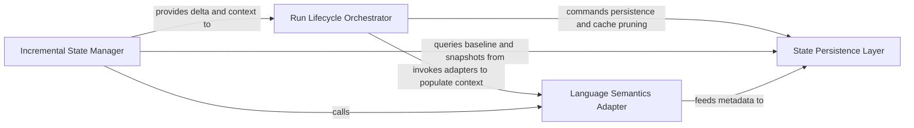

## Details

Manages stateful aspects of a run, particularly for incremental analysis, and interfaces with language-specific adapters to understand codebase state.

### Run Lifecycle Orchestrator
Manages the initialization, execution environment, and finalization of an analysis session, ensuring unique identity and clean workspace management.

**Related Classes/Methods**:

- `diagram_analysis.run_context.RunContext`:13-40
- `diagram_analysis.run_context.RunContext.finalize`:38-40

**Source Files:**

- [`codeboarding_cli/commands/incremental_analysis.py`](https://github.com/CodeBoarding/CodeBoarding/blob/main/.codeboardingcodeboarding_cli/commands/incremental_analysis.py)
  - `codeboarding_cli.commands.incremental_analysis.add_arguments` ([L19-L36](https://github.com/CodeBoarding/CodeBoarding/blob/main/.codeboardingcodeboarding_cli/commands/incremental_analysis.py#L19-L36)) - Function
  - `codeboarding_cli.commands.incremental_analysis._emit_error` ([L126-L133](https://github.com/CodeBoarding/CodeBoarding/blob/main/.codeboardingcodeboarding_cli/commands/incremental_analysis.py#L126-L133)) - Function
  - `codeboarding_cli.commands.incremental_analysis._emit` ([L136-L139](https://github.com/CodeBoarding/CodeBoarding/blob/main/.codeboardingcodeboarding_cli/commands/incremental_analysis.py#L136-L139)) - Function

### Incremental State Manager
Determines the scope of analysis by comparing current repository state against previous snapshots to identify changed components.

**Related Classes/Methods**:

- `codeboarding_cli.commands.incremental_analysis.run_from_args`:44-123

**Source Files:**

- [`codeboarding_cli/commands/incremental_analysis.py`](https://github.com/CodeBoarding/CodeBoarding/blob/main/.codeboardingcodeboarding_cli/commands/incremental_analysis.py)
  - `codeboarding_cli.commands.incremental_analysis.validate_arguments` ([L39-L41](https://github.com/CodeBoarding/CodeBoarding/blob/main/.codeboardingcodeboarding_cli/commands/incremental_analysis.py#L39-L41)) - Function
  - `codeboarding_cli.commands.incremental_analysis.run_from_args` ([L44-L123](https://github.com/CodeBoarding/CodeBoarding/blob/main/.codeboardingcodeboarding_cli/commands/incremental_analysis.py#L44-L123)) - Function
- [`diagram_analysis/io_utils.py`](https://github.com/CodeBoarding/CodeBoarding/blob/main/.codeboardingdiagram_analysis/io_utils.py)
  - `diagram_analysis.io_utils._AnalysisFileStore.__init__` ([L73-L79](https://github.com/CodeBoarding/CodeBoarding/blob/main/.codeboardingdiagram_analysis/io_utils.py#L73-L79)) - Method
  - `diagram_analysis.io_utils.load_analysis_commit_hash` ([L322-L349](https://github.com/CodeBoarding/CodeBoarding/blob/main/.codeboardingdiagram_analysis/io_utils.py#L322-L349)) - Function

### Language Semantics Adapter
Provides a standardized interface for extracting structural information from different programming languages into abstract state models.

**Related Classes/Methods**:

- `static_analyzer.engine.adapters.python_adapter.PythonAdapter`:10-57

**Source Files:**

- [`diagram_analysis/io_utils.py`](https://github.com/CodeBoarding/CodeBoarding/blob/main/.codeboardingdiagram_analysis/io_utils.py)
  - `diagram_analysis.io_utils.load_snapshot_commit` ([L352-L374](https://github.com/CodeBoarding/CodeBoarding/blob/main/.codeboardingdiagram_analysis/io_utils.py#L352-L374)) - Function
- [`diagram_analysis/run_context.py`](https://github.com/CodeBoarding/CodeBoarding/blob/main/.codeboardingdiagram_analysis/run_context.py)
  - `diagram_analysis.run_context.RunContext.finalize` ([L38-L40](https://github.com/CodeBoarding/CodeBoarding/blob/main/.codeboardingdiagram_analysis/run_context.py#L38-L40)) - Method
- [`static_analyzer/engine/adapters/python_adapter.py`](https://github.com/CodeBoarding/CodeBoarding/blob/main/.codeboardingstatic_analyzer/engine/adapters/python_adapter.py)
  - `static_analyzer.engine.adapters.python_adapter.PythonAdapter` ([L10-L57](https://github.com/CodeBoarding/CodeBoarding/blob/main/.codeboardingstatic_analyzer/engine/adapters/python_adapter.py#L10-L57)) - Class
  - `static_analyzer.engine.adapters.python_adapter.PythonAdapter.get_lsp_init_options` ([L28-L37](https://github.com/CodeBoarding/CodeBoarding/blob/main/.codeboardingstatic_analyzer/engine/adapters/python_adapter.py#L28-L37)) - Method
  - `static_analyzer.engine.adapters.python_adapter.PythonAdapter.get_workspace_settings` ([L39-L57](https://github.com/CodeBoarding/CodeBoarding/blob/main/.codeboardingstatic_analyzer/engine/adapters/python_adapter.py#L39-L57)) - Method

### State Persistence Layer
Interfaces with physical storage to persist and retrieve analysis results, managing long-term and short-term caches.

**Related Classes/Methods**:

- `diagram_analysis.io_utils`

**Source Files:**

- [`static_analyzer/engine/adapters/python_adapter.py`](https://github.com/CodeBoarding/CodeBoarding/blob/main/.codeboardingstatic_analyzer/engine/adapters/python_adapter.py)
  - `static_analyzer.engine.adapters.python_adapter.PythonAdapter.language` ([L13-L14](https://github.com/CodeBoarding/CodeBoarding/blob/main/.codeboardingstatic_analyzer/engine/adapters/python_adapter.py#L13-L14)) - Method
  - `static_analyzer.engine.adapters.python_adapter.PythonAdapter.language_enum` ([L17-L18](https://github.com/CodeBoarding/CodeBoarding/blob/main/.codeboardingstatic_analyzer/engine/adapters/python_adapter.py#L17-L18)) - Method
  - `static_analyzer.engine.adapters.python_adapter.PythonAdapter.lsp_command` ([L21-L22](https://github.com/CodeBoarding/CodeBoarding/blob/main/.codeboardingstatic_analyzer/engine/adapters/python_adapter.py#L21-L22)) - Method
  - `static_analyzer.engine.adapters.python_adapter.PythonAdapter.language_id` ([L25-L26](https://github.com/CodeBoarding/CodeBoarding/blob/main/.codeboardingstatic_analyzer/engine/adapters/python_adapter.py#L25-L26)) - Method
- [`utils.py`](https://github.com/CodeBoarding/CodeBoarding/blob/main/.codeboardingutils.py)
  - `utils.CFGGenerationError` ([L16-L17](https://github.com/CodeBoarding/CodeBoarding/blob/main/.codeboardingutils.py#L16-L17)) - Class
  - `utils.monitoring_enabled` ([L74-L76](https://github.com/CodeBoarding/CodeBoarding/blob/main/.codeboardingutils.py#L74-L76)) - Function

### [FAQ](https://github.com/CodeBoarding/GeneratedOnBoardings/tree/main?tab=readme-ov-file#faq)