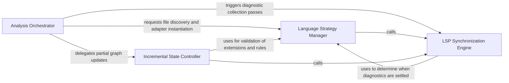

## Details

The primary entry point and state machine for the analysis process, determining scan types and managing LSP session lifecycles.

### Analysis Orchestrator
The primary state machine and entry point managing high-level execution flow, initialization, full LSP passes, and result validation.

**Related Classes/Methods**:

- `static_analyzer.__init__.StaticAnalyzer.analyze`:490-549
- `static_analyzer.__init__.StaticAnalyzer._run_full_analysis`:709-750
- `static_analyzer.analysis_result.StaticAnalysisResults`:166-317

**Source Files:**

- [`static_analyzer/__init__.py`](https://github.com/CodeBoarding/CodeBoarding/blob/main/.codeboardingstatic_analyzer/__init__.py)
  - `static_analyzer.__init__.StaticAnalysisFatalError` ([L47-L48](https://github.com/CodeBoarding/CodeBoarding/blob/main/.codeboardingstatic_analyzer/__init__.py#L47-L48)) - Class
  - `static_analyzer.__init__.StaticAnalyzer.analyze` ([L490-L549](https://github.com/CodeBoarding/CodeBoarding/blob/main/.codeboardingstatic_analyzer/__init__.py#L490-L549)) - Method
  - `static_analyzer.__init__.StaticAnalyzer._run_full_lsp_pass` ([L551-L591](https://github.com/CodeBoarding/CodeBoarding/blob/main/.codeboardingstatic_analyzer/__init__.py#L551-L591)) - Method
  - `static_analyzer.__init__.StaticAnalyzer._update_cached_results` ([L593-L639](https://github.com/CodeBoarding/CodeBoarding/blob/main/.codeboardingstatic_analyzer/__init__.py#L593-L639)) - Method
  - `static_analyzer.__init__.StaticAnalyzer._loc_for_adapter` ([L699-L707](https://github.com/CodeBoarding/CodeBoarding/blob/main/.codeboardingstatic_analyzer/__init__.py#L699-L707)) - Method
  - `static_analyzer.__init__.StaticAnalyzer._run_full_analysis` ([L709-L750](https://github.com/CodeBoarding/CodeBoarding/blob/main/.codeboardingstatic_analyzer/__init__.py#L709-L750)) - Method
  - `static_analyzer.__init__.StaticAnalyzer._validate_analysis_results` ([L752-L771](https://github.com/CodeBoarding/CodeBoarding/blob/main/.codeboardingstatic_analyzer/__init__.py#L752-L771)) - Method
- [`static_analyzer/analysis_result.py`](https://github.com/CodeBoarding/CodeBoarding/blob/main/.codeboardingstatic_analyzer/analysis_result.py)
  - `static_analyzer.analysis_result.StaticAnalysisResults` ([L166-L317](https://github.com/CodeBoarding/CodeBoarding/blob/main/.codeboardingstatic_analyzer/analysis_result.py#L166-L317)) - Class
- [`static_analyzer/engine/language_adapter.py`](https://github.com/CodeBoarding/CodeBoarding/blob/main/.codeboardingstatic_analyzer/engine/language_adapter.py)
  - `static_analyzer.engine.language_adapter.LanguageAdapter.fail_on_empty_symbols` ([L195-L197](https://github.com/CodeBoarding/CodeBoarding/blob/main/.codeboardingstatic_analyzer/engine/language_adapter.py#L195-L197)) - Method

### Language Strategy Manager
Implements the Strategy pattern to handle multi-language support, discovering source files and routing them to appropriate adapters.

**Related Classes/Methods**:

- `static_analyzer.engine.language_adapter.LanguageAdapter`:22-368
- `static_analyzer.__init__.StaticAnalyzer.get_adapter_for_file`:431-437
- `static_analyzer.engine.adapters.go_adapter.GoAdapter.discover_source_files`:188-200

**Source Files:**

- [`static_analyzer/__init__.py`](https://github.com/CodeBoarding/CodeBoarding/blob/main/.codeboardingstatic_analyzer/__init__.py)
  - `static_analyzer.__init__.StaticAnalyzer.notify_file_changed` ([L387-L404](https://github.com/CodeBoarding/CodeBoarding/blob/main/.codeboardingstatic_analyzer/__init__.py#L387-L404)) - Method
  - `static_analyzer.__init__.StaticAnalyzer.get_adapter_for_file` ([L431-L437](https://github.com/CodeBoarding/CodeBoarding/blob/main/.codeboardingstatic_analyzer/__init__.py#L431-L437)) - Method
- [`static_analyzer/engine/adapters/go_adapter.py`](https://github.com/CodeBoarding/CodeBoarding/blob/main/.codeboardingstatic_analyzer/engine/adapters/go_adapter.py)
  - `static_analyzer.engine.adapters.go_adapter.GoAdapter.discover_source_files` ([L188-L200](https://github.com/CodeBoarding/CodeBoarding/blob/main/.codeboardingstatic_analyzer/engine/adapters/go_adapter.py#L188-L200)) - Method
  - `static_analyzer.engine.adapters.go_adapter.GoAdapter._has_excluding_build_tag` ([L203-L223](https://github.com/CodeBoarding/CodeBoarding/blob/main/.codeboardingstatic_analyzer/engine/adapters/go_adapter.py#L203-L223)) - Method
- [`static_analyzer/engine/language_adapter.py`](https://github.com/CodeBoarding/CodeBoarding/blob/main/.codeboardingstatic_analyzer/engine/language_adapter.py)
  - `static_analyzer.engine.language_adapter.LanguageAdapter.language` ([L27-L28](https://github.com/CodeBoarding/CodeBoarding/blob/main/.codeboardingstatic_analyzer/engine/language_adapter.py#L27-L28)) - Method
  - `static_analyzer.engine.language_adapter.LanguageAdapter.file_extensions` ([L40-L46](https://github.com/CodeBoarding/CodeBoarding/blob/main/.codeboardingstatic_analyzer/engine/language_adapter.py#L40-L46)) - Method
  - `static_analyzer.engine.language_adapter.LanguageAdapter.language_id` ([L77-L79](https://github.com/CodeBoarding/CodeBoarding/blob/main/.codeboardingstatic_analyzer/engine/language_adapter.py#L77-L79)) - Method
  - `static_analyzer.engine.language_adapter.LanguageAdapter.discover_source_files` ([L230-L250](https://github.com/CodeBoarding/CodeBoarding/blob/main/.codeboardingstatic_analyzer/engine/language_adapter.py#L230-L250)) - Method

### LSP Synchronization Engine
Manages asynchronous communication with LSP clients to ensure diagnostics are fresh and mapped to the internal data model.

**Related Classes/Methods**:

- `static_analyzer.__init__.StaticAnalyzer.collect_fresh_diagnostics`:337-349
- `static_analyzer.engine.lsp_client.LSPClient.get_collected_diagnostics`:402-405
- `static_analyzer.engine.language_adapter.LanguageAdapter.wait_for_diagnostics`:199-214

**Source Files:**

- [`static_analyzer/__init__.py`](https://github.com/CodeBoarding/CodeBoarding/blob/main/.codeboardingstatic_analyzer/__init__.py)
  - `static_analyzer.__init__.StaticAnalyzer.collect_fresh_diagnostics` ([L337-L349](https://github.com/CodeBoarding/CodeBoarding/blob/main/.codeboardingstatic_analyzer/__init__.py#L337-L349)) - Method
  - `static_analyzer.__init__.StaticAnalyzer._collect_diagnostics_for` ([L675-L697](https://github.com/CodeBoarding/CodeBoarding/blob/main/.codeboardingstatic_analyzer/__init__.py#L675-L697)) - Method
- [`static_analyzer/engine/language_adapter.py`](https://github.com/CodeBoarding/CodeBoarding/blob/main/.codeboardingstatic_analyzer/engine/language_adapter.py)
  - `static_analyzer.engine.language_adapter.LanguageAdapter.language_enum` ([L32-L37](https://github.com/CodeBoarding/CodeBoarding/blob/main/.codeboardingstatic_analyzer/engine/language_adapter.py#L32-L37)) - Method
  - `static_analyzer.engine.language_adapter.LanguageAdapter.wait_for_diagnostics` ([L199-L214](https://github.com/CodeBoarding/CodeBoarding/blob/main/.codeboardingstatic_analyzer/engine/language_adapter.py#L199-L214)) - Method
- [`static_analyzer/engine/lsp_client.py`](https://github.com/CodeBoarding/CodeBoarding/blob/main/.codeboardingstatic_analyzer/engine/lsp_client.py)
  - `static_analyzer.engine.lsp_client.LSPClient.get_collected_diagnostics` ([L402-L405](https://github.com/CodeBoarding/CodeBoarding/blob/main/.codeboardingstatic_analyzer/engine/lsp_client.py#L402-L405)) - Method

### Incremental State Controller
Optimizes analysis by managing partial updates, tracking file changes, and updating CFGs and symbol tables.

**Related Classes/Methods**:

- `static_analyzer.incremental_orchestrator.update_cfg_for_changed_files`:34-106
- `static_analyzer.engine.call_graph_builder.CallGraphBuilder.symbol_table`:40-42
- `static_analyzer.analysis_result.AnalysisData.to_dict`:60-70

**Source Files:**

- [`static_analyzer/analysis_result.py`](https://github.com/CodeBoarding/CodeBoarding/blob/main/.codeboardingstatic_analyzer/analysis_result.py)
  - `static_analyzer.analysis_result.AnalysisData.to_dict` ([L60-L70](https://github.com/CodeBoarding/CodeBoarding/blob/main/.codeboardingstatic_analyzer/analysis_result.py#L60-L70)) - Method
- [`static_analyzer/engine/call_graph_builder.py`](https://github.com/CodeBoarding/CodeBoarding/blob/main/.codeboardingstatic_analyzer/engine/call_graph_builder.py)
  - `static_analyzer.engine.call_graph_builder.CallGraphBuilder` ([L23-L302](https://github.com/CodeBoarding/CodeBoarding/blob/main/.codeboardingstatic_analyzer/engine/call_graph_builder.py#L23-L302)) - Class
  - `static_analyzer.engine.call_graph_builder.CallGraphBuilder.symbol_table` ([L40-L42](https://github.com/CodeBoarding/CodeBoarding/blob/main/.codeboardingstatic_analyzer/engine/call_graph_builder.py#L40-L42)) - Method
- [`static_analyzer/incremental_orchestrator.py`](https://github.com/CodeBoarding/CodeBoarding/blob/main/.codeboardingstatic_analyzer/incremental_orchestrator.py)
  - `static_analyzer.incremental_orchestrator.update_cfg_for_changed_files` ([L34-L106](https://github.com/CodeBoarding/CodeBoarding/blob/main/.codeboardingstatic_analyzer/incremental_orchestrator.py#L34-L106)) - Function

### [FAQ](https://github.com/CodeBoarding/GeneratedOnBoardings/tree/main?tab=readme-ov-file#faq)