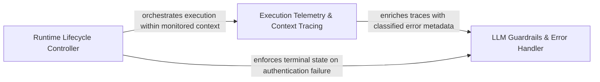

## Details

Manages operational safety, including authentication, execution timeouts, and tracing hooks for observability.

### LLM Guardrails & Error Handler
Acts as the primary safety layer for external AI provider interactions, intercepting exceptions to distinguish between transient network issues, authentication failures, and model-specific errors.

**Related Classes/Methods**: _None_

**Source Files:**

- [`agents/llm_errors.py`](https://github.com/CodeBoarding/CodeBoarding/blob/main/.codeboardingagents/llm_errors.py)
  - `agents.llm_errors.LLMAuthError` ([L55-L70](https://github.com/CodeBoarding/CodeBoarding/blob/main/.codeboardingagents/llm_errors.py#L55-L70)) - Class
  - `agents.llm_errors.LLMAuthError.__init__` ([L66-L70](https://github.com/CodeBoarding/CodeBoarding/blob/main/.codeboardingagents/llm_errors.py#L66-L70)) - Method
  - `agents.llm_errors._status_code` ([L73-L82](https://github.com/CodeBoarding/CodeBoarding/blob/main/.codeboardingagents/llm_errors.py#L73-L82)) - Function
  - `agents.llm_errors._is_auth_failure` ([L85-L92](https://github.com/CodeBoarding/CodeBoarding/blob/main/.codeboardingagents/llm_errors.py#L85-L92)) - Function

### Execution Telemetry & Context Tracing
Provides deep observability into the agentic reasoning process using a decorator-based mechanism to track execution stacks and data flow.

**Related Classes/Methods**: _None_

**Source Files:**

- [`agents/llm_errors.py`](https://github.com/CodeBoarding/CodeBoarding/blob/main/.codeboardingagents/llm_errors.py)
  - `agents.llm_errors.detect_auth_error` ([L95-L125](https://github.com/CodeBoarding/CodeBoarding/blob/main/.codeboardingagents/llm_errors.py#L95-L125)) - Function
- [`monitoring/context.py`](https://github.com/CodeBoarding/CodeBoarding/blob/main/.codeboardingmonitoring/context.py)
  - `monitoring.context.trace._create_wrapper` ([L139-L161](https://github.com/CodeBoarding/CodeBoarding/blob/main/.codeboardingmonitoring/context.py#L139-L161)) - Function
  - `monitoring.context.trace._create_wrapper.wrapper` ([L141-L159](https://github.com/CodeBoarding/CodeBoarding/blob/main/.codeboardingmonitoring/context.py#L141-L159)) - Function

### Runtime Lifecycle Controller
Manages operational boundaries, enforcing timeouts on long-running analysis tasks and ensuring correct agent lifecycle management to prevent resource leaks.

**Related Classes/Methods**: _None_

**Source Files:**

- [`monitoring/context.py`](https://github.com/CodeBoarding/CodeBoarding/blob/main/.codeboardingmonitoring/context.py)
  - `monitoring.context.trace.decorator` ([L169-L171](https://github.com/CodeBoarding/CodeBoarding/blob/main/.codeboardingmonitoring/context.py#L169-L171)) - Function

### [FAQ](https://github.com/CodeBoarding/GeneratedOnBoardings/tree/main?tab=readme-ov-file#faq)