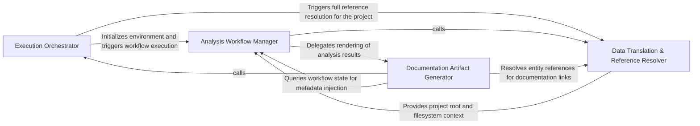

## Details

Manages entry/exit points for CLI and GitHub Actions, and transforms internal models into documentation artifacts.

### Execution Orchestrator
Manages the lifecycle of the analysis process, handling configuration ingestion, environment validation, and sequential triggering of the analysis pipeline across different execution contexts.

**Related Classes/Methods**: _None_

**Source Files:**

- [`codeboarding_cli/commands/full_analysis.py`](https://github.com/CodeBoarding/CodeBoarding/blob/main/.codeboardingcodeboarding_cli/commands/full_analysis.py)
  - `codeboarding_cli.commands.full_analysis._run_local.scope` ([L93-L101](https://github.com/CodeBoarding/CodeBoarding/blob/main/.codeboardingcodeboarding_cli/commands/full_analysis.py#L93-L101)) - Function
- [`github_action.py`](https://github.com/CodeBoarding/CodeBoarding/blob/main/.codeboardinggithub_action.py)
  - `github_action._seed_existing_analysis` ([L78-L84](https://github.com/CodeBoarding/CodeBoarding/blob/main/.codeboardinggithub_action.py#L78-L84)) - Function
- [`monitoring/paths.py`](https://github.com/CodeBoarding/CodeBoarding/blob/main/.codeboardingmonitoring/paths.py)
  - `monitoring.paths.get_latest_run_dir` ([L30-L50](https://github.com/CodeBoarding/CodeBoarding/blob/main/.codeboardingmonitoring/paths.py#L30-L50)) - Function

### Analysis Workflow Manager
Coordinates the stateful execution of the multi-step agentic analysis, aggregating results from static analysis and LLM-driven steps to prepare the internal model for rendering.

**Related Classes/Methods**: _None_

**Source Files:**

- [`codeboarding_workflows/rendering.py`](https://github.com/CodeBoarding/CodeBoarding/blob/main/.codeboardingcodeboarding_workflows/rendering.py)
  - `codeboarding_workflows.rendering.render_docs` ([L104-L139](https://github.com/CodeBoarding/CodeBoarding/blob/main/.codeboardingcodeboarding_workflows/rendering.py#L104-L139)) - Function
- [`github_action.py`](https://github.com/CodeBoarding/CodeBoarding/blob/main/.codeboardinggithub_action.py)
  - `github_action.generate_html` ([L32-L41](https://github.com/CodeBoarding/CodeBoarding/blob/main/.codeboardinggithub_action.py#L32-L41)) - Function
  - `github_action.generate_rst` ([L61-L75](https://github.com/CodeBoarding/CodeBoarding/blob/main/.codeboardinggithub_action.py#L61-L75)) - Function
- [`monitoring/context.py`](https://github.com/CodeBoarding/CodeBoarding/blob/main/.codeboardingmonitoring/context.py)
  - `monitoring.context.monitor_execution.MonitorContext.step` ([L77-L81](https://github.com/CodeBoarding/CodeBoarding/blob/main/.codeboardingmonitoring/context.py#L77-L81)) - Method
- [`monitoring/paths.py`](https://github.com/CodeBoarding/CodeBoarding/blob/main/.codeboardingmonitoring/paths.py)
  - `monitoring.paths.get_monitoring_base_dir` ([L8-L12](https://github.com/CodeBoarding/CodeBoarding/blob/main/.codeboardingmonitoring/paths.py#L8-L12)) - Function
  - `monitoring.paths.get_monitoring_run_dir` ([L15-L22](https://github.com/CodeBoarding/CodeBoarding/blob/main/.codeboardingmonitoring/paths.py#L15-L22)) - Function
- [`repo_utils/__init__.py`](https://github.com/CodeBoarding/CodeBoarding/blob/main/.codeboardingrepo_utils/__init__.py)
  - `repo_utils.__init__.get_branch` ([L222-L227](https://github.com/CodeBoarding/CodeBoarding/blob/main/.codeboardingrepo_utils/__init__.py#L222-L227)) - Function
- [`repo_utils/git_ops.py`](https://github.com/CodeBoarding/CodeBoarding/blob/main/.codeboardingrepo_utils/git_ops.py)
  - `repo_utils.git_ops.get_current_commit` ([L45-L62](https://github.com/CodeBoarding/CodeBoarding/blob/main/.codeboardingrepo_utils/git_ops.py#L45-L62)) - Function

### Documentation Artifact Generator
Transforms internal Pydantic models and analysis insights into structured documentation, including Mermaid.js diagrams and Markdown reports.

**Related Classes/Methods**: _None_

**Source Files:**

- [`codeboarding_cli/commands/full_analysis.py`](https://github.com/CodeBoarding/CodeBoarding/blob/main/.codeboardingcodeboarding_cli/commands/full_analysis.py)
  - `codeboarding_cli.commands.full_analysis._process_one_remote.scope` ([L164-L197](https://github.com/CodeBoarding/CodeBoarding/blob/main/.codeboardingcodeboarding_cli/commands/full_analysis.py#L164-L197)) - Function
- [`github_action.py`](https://github.com/CodeBoarding/CodeBoarding/blob/main/.codeboardinggithub_action.py)
  - `github_action.generate_mdx` ([L44-L58](https://github.com/CodeBoarding/CodeBoarding/blob/main/.codeboardinggithub_action.py#L44-L58)) - Function
  - `github_action.generate_analysis` ([L87-L131](https://github.com/CodeBoarding/CodeBoarding/blob/main/.codeboardinggithub_action.py#L87-L131)) - Function
- [`repo_utils/__init__.py`](https://github.com/CodeBoarding/CodeBoarding/blob/main/.codeboardingrepo_utils/__init__.py)
  - `repo_utils.__init__.checkout_repo` ([L130-L137](https://github.com/CodeBoarding/CodeBoarding/blob/main/.codeboardingrepo_utils/__init__.py#L130-L137)) - Function

### Data Translation & Reference Resolver
Ensures data integrity by mapping architectural entities to their physical source locations, fixing line references, and assigning stable identifiers.

**Related Classes/Methods**: _None_

**Source Files:**

- [`codeboarding_workflows/analysis.py`](https://github.com/CodeBoarding/CodeBoarding/blob/main/.codeboardingcodeboarding_workflows/analysis.py)
  - `codeboarding_workflows.analysis.run_full` ([L49-L74](https://github.com/CodeBoarding/CodeBoarding/blob/main/.codeboardingcodeboarding_workflows/analysis.py#L49-L74)) - Function
- [`github_action.py`](https://github.com/CodeBoarding/CodeBoarding/blob/main/.codeboardinggithub_action.py)
  - `github_action.generate_markdown` ([L15-L29](https://github.com/CodeBoarding/CodeBoarding/blob/main/.codeboardinggithub_action.py#L15-L29)) - Function
- [`monitoring/context.py`](https://github.com/CodeBoarding/CodeBoarding/blob/main/.codeboardingmonitoring/context.py)
  - `monitoring.context.monitor_execution.DummyContext.step` ([L33-L34](https://github.com/CodeBoarding/CodeBoarding/blob/main/.codeboardingmonitoring/context.py#L33-L34)) - Method
- [`utils.py`](https://github.com/CodeBoarding/CodeBoarding/blob/main/.codeboardingutils.py)
  - `utils.get_project_root` ([L59-L64](https://github.com/CodeBoarding/CodeBoarding/blob/main/.codeboardingutils.py#L59-L64)) - Function

### [FAQ](https://github.com/CodeBoarding/GeneratedOnBoardings/tree/main?tab=readme-ov-file#faq)