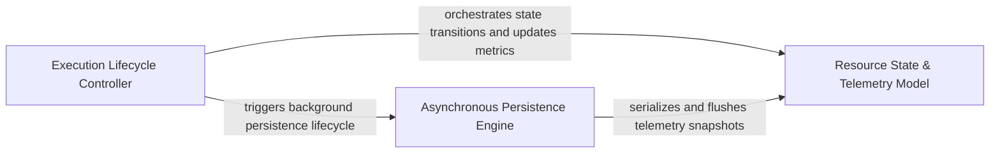

## Details

Tracks the internal state, performance metrics, and resource consumption (specifically LLM tokens) during an active analysis run. It provides the infrastructure for real-time statistics streaming and execution wrapping.

### Execution Lifecycle Controller
Manages the operational boundaries of an analysis run using context managers to initialize monitoring states, track execution steps, and ensure clean teardown.

**Related Classes/Methods**:

- `monitoring.context.monitor_execution`:19-128
- `monitoring.context.monitor_execution.MonitorContext`:73-91
- `monitoring.context.monitor_execution.MonitorContext.end_step`:83-87

**Source Files:**

- [`monitoring/context.py`](https://github.com/CodeBoarding/CodeBoarding/blob/main/.codeboardingmonitoring/context.py)
  - `monitoring.context.monitor_execution` ([L19-L128](https://github.com/CodeBoarding/CodeBoarding/blob/main/.codeboardingmonitoring/context.py#L19-L128)) - Function
  - `monitoring.context.monitor_execution.DummyContext` ([L32-L37](https://github.com/CodeBoarding/CodeBoarding/blob/main/.codeboardingmonitoring/context.py#L32-L37)) - Class
  - `monitoring.context.monitor_execution.MonitorContext` ([L73-L91](https://github.com/CodeBoarding/CodeBoarding/blob/main/.codeboardingmonitoring/context.py#L73-L91)) - Class
  - `monitoring.context.monitor_execution.MonitorContext.end_step` ([L83-L87](https://github.com/CodeBoarding/CodeBoarding/blob/main/.codeboardingmonitoring/context.py#L83-L87)) - Method
  - `monitoring.context.monitor_execution.MonitorContext.close` ([L89-L91](https://github.com/CodeBoarding/CodeBoarding/blob/main/.codeboardingmonitoring/context.py#L89-L91)) - Method

### Resource State & Telemetry Model
Defines the schema and state containers for performance metrics, acting as the source of truth for token usage and execution timing with serialization capabilities.

**Related Classes/Methods**:

- `monitoring.stats.RunStats`:10-46
- `telemetry.schemas.TokenSnapshot`:63-67
- `monitoring.stats.RunStats.to_dict`:28-46

**Source Files:**

- [`monitoring/callbacks.py`](https://github.com/CodeBoarding/CodeBoarding/blob/main/.codeboardingmonitoring/callbacks.py)
  - `monitoring.callbacks.MonitoringCallback` ([L16-L163](https://github.com/CodeBoarding/CodeBoarding/blob/main/.codeboardingmonitoring/callbacks.py#L16-L163)) - Class
- [`monitoring/mixin.py`](https://github.com/CodeBoarding/CodeBoarding/blob/main/.codeboardingmonitoring/mixin.py)
  - `monitoring.mixin.MonitoringMixin.__init__` ([L6-L12](https://github.com/CodeBoarding/CodeBoarding/blob/main/.codeboardingmonitoring/mixin.py#L6-L12)) - Method
- [`monitoring/stats.py`](https://github.com/CodeBoarding/CodeBoarding/blob/main/.codeboardingmonitoring/stats.py)
  - `monitoring.stats.RunStats` ([L10-L46](https://github.com/CodeBoarding/CodeBoarding/blob/main/.codeboardingmonitoring/stats.py#L10-L46)) - Class
  - `monitoring.stats.RunStats.__init__` ([L13-L15](https://github.com/CodeBoarding/CodeBoarding/blob/main/.codeboardingmonitoring/stats.py#L13-L15)) - Method
  - `monitoring.stats.RunStats.reset` ([L17-L26](https://github.com/CodeBoarding/CodeBoarding/blob/main/.codeboardingmonitoring/stats.py#L17-L26)) - Method
  - `monitoring.stats.RunStats.to_dict` ([L28-L46](https://github.com/CodeBoarding/CodeBoarding/blob/main/.codeboardingmonitoring/stats.py#L28-L46)) - Method
- [`telemetry/events.py`](https://github.com/CodeBoarding/CodeBoarding/blob/main/.codeboardingtelemetry/events.py)
  - `telemetry.events._token_usage` ([L58-L70](https://github.com/CodeBoarding/CodeBoarding/blob/main/.codeboardingtelemetry/events.py#L58-L70)) - Function
- [`telemetry/schemas.py`](https://github.com/CodeBoarding/CodeBoarding/blob/main/.codeboardingtelemetry/schemas.py)
  - `telemetry.schemas.TokenSnapshot` ([L63-L67](https://github.com/CodeBoarding/CodeBoarding/blob/main/.codeboardingtelemetry/schemas.py#L63-L67)) - Class

### Asynchronous Persistence Engine
Handles background streaming and physical storage of monitoring data, running a dedicated loop to flush statistics to the filesystem without blocking the main analysis thread.

**Related Classes/Methods**:

- `monitoring.writers.StreamingStatsWriter._loop`:84-88
- `monitoring.writers.StreamingStatsWriter._save_llm_usage`:116-137
- `monitoring.mixin.MonitoringMixin.get_monitoring_results`:14-16

**Source Files:**

- [`monitoring/mixin.py`](https://github.com/CodeBoarding/CodeBoarding/blob/main/.codeboardingmonitoring/mixin.py)
  - `monitoring.mixin.MonitoringMixin` ([L5-L16](https://github.com/CodeBoarding/CodeBoarding/blob/main/.codeboardingmonitoring/mixin.py#L5-L16)) - Class
  - `monitoring.mixin.MonitoringMixin.get_monitoring_results` ([L14-L16](https://github.com/CodeBoarding/CodeBoarding/blob/main/.codeboardingmonitoring/mixin.py#L14-L16)) - Method
- [`monitoring/writers.py`](https://github.com/CodeBoarding/CodeBoarding/blob/main/.codeboardingmonitoring/writers.py)
  - `monitoring.writers.StreamingStatsWriter.__init__` ([L24-L44](https://github.com/CodeBoarding/CodeBoarding/blob/main/.codeboardingmonitoring/writers.py#L24-L44)) - Method
  - `monitoring.writers.StreamingStatsWriter.llm_usage_file` ([L47-L48](https://github.com/CodeBoarding/CodeBoarding/blob/main/.codeboardingmonitoring/writers.py#L47-L48)) - Method
  - `monitoring.writers.StreamingStatsWriter.__enter__` ([L50-L52](https://github.com/CodeBoarding/CodeBoarding/blob/main/.codeboardingmonitoring/writers.py#L50-L52)) - Method
  - `monitoring.writers.StreamingStatsWriter.__exit__` ([L54-L56](https://github.com/CodeBoarding/CodeBoarding/blob/main/.codeboardingmonitoring/writers.py#L54-L56)) - Method
  - `monitoring.writers.StreamingStatsWriter.start` ([L58-L68](https://github.com/CodeBoarding/CodeBoarding/blob/main/.codeboardingmonitoring/writers.py#L58-L68)) - Method
  - `monitoring.writers.StreamingStatsWriter.stop` ([L70-L82](https://github.com/CodeBoarding/CodeBoarding/blob/main/.codeboardingmonitoring/writers.py#L70-L82)) - Method
  - `monitoring.writers.StreamingStatsWriter._loop` ([L84-L88](https://github.com/CodeBoarding/CodeBoarding/blob/main/.codeboardingmonitoring/writers.py#L84-L88)) - Method
  - `monitoring.writers.StreamingStatsWriter._stream_token_usage` ([L90-L114](https://github.com/CodeBoarding/CodeBoarding/blob/main/.codeboardingmonitoring/writers.py#L90-L114)) - Method
  - `monitoring.writers.StreamingStatsWriter._save_llm_usage` ([L116-L137](https://github.com/CodeBoarding/CodeBoarding/blob/main/.codeboardingmonitoring/writers.py#L116-L137)) - Method
  - `monitoring.writers.StreamingStatsWriter._save_run_metadata` ([L139-L172](https://github.com/CodeBoarding/CodeBoarding/blob/main/.codeboardingmonitoring/writers.py#L139-L172)) - Method

### [FAQ](https://github.com/CodeBoarding/GeneratedOnBoardings/tree/main?tab=readme-ov-file#faq)