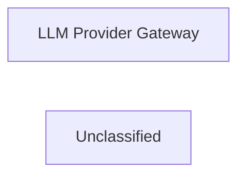

## Details

This analysis describes the `LLM Provider Gateway` component, which serves as a crucial abstraction layer for the internal system to interact with various external Large Language Model services. Its primary purpose is to simplify and standardize communication with different LLM providers by handling complexities such as request/response formatting, authentication, and provider-specific integration logic, thereby ensuring a unified interface for the internal system.

### LLM Provider Gateway
Provides a unified and abstracted interface for the internal system to interact with various third-party Large Language Model services (e.g., OpenAI, Anthropic, Google Gemini). It handles request/response formatting, authentication, authorization, and encapsulates provider-specific integration logic, thereby abstracting away the complexities of individual LLM APIs.

**Related Classes/Methods**:

- <a href="https://github.com/CodeBoarding/CodeBoarding/blob/main/.codeboardingagents/tools/external_deps.py" target="_blank" rel="noopener noreferrer">`agents.tools.external_deps`</a>

### Unclassified
Component for all unclassified files and utility functions (Utility functions/External Libraries/Dependencies)

**Related Classes/Methods**: _None_

### [FAQ](https://github.com/CodeBoarding/GeneratedOnBoardings/tree/main?tab=readme-ov-file#faq)
