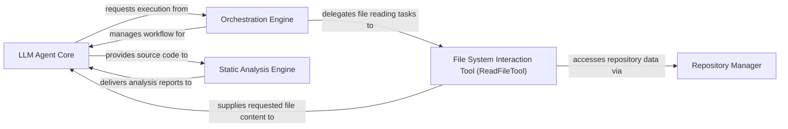

## Details

Specialized tool that enables the LLM Agent Core to read specific file contents from the repository, providing direct access to source code. It serves as an interface to the underlying File System Interaction Layer.

### LLM Agent Core
The intelligent core responsible for interpreting user queries, planning actions, and making decisions on what information to retrieve or analyze. It orchestrates the use of various tools, including ReadFileTool.

**Related Classes/Methods**:

- <a href="https://github.com/CodeBoarding/CodeBoarding/blob/main/.codeboardingagents/abstraction_agent.py#L35-L144" target="_blank" rel="noopener noreferrer">`Agent`:35-144</a>
- <a href="https://github.com/CodeBoarding/CodeBoarding/blob/main/.codeboardingagents/abstraction_agent.py" target="_blank" rel="noopener noreferrer">`LLM`</a>
- <a href="https://github.com/CodeBoarding/CodeBoarding/blob/main/.codeboardingagents/agent.py#L64-L66" target="_blank" rel="noopener noreferrer">`Tool`:64-66</a>

### Orchestration Engine
Manages the workflow and execution of tasks across different components, ensuring that operations are performed in the correct sequence and that data flows appropriately.

**Related Classes/Methods**: _None_

### File System Interaction Tool (ReadFileTool)
Specialized tool that enables the LLM Agent Core to read specific file contents from the repository, providing direct access to source code. It serves as an interface to the underlying File System Interaction Layer.

**Related Classes/Methods**:

- <a href="https://github.com/CodeBoarding/CodeBoarding/blob/main/.codeboardingagents/tools/read_file.py#L19-L90" target="_blank" rel="noopener noreferrer">`ReadFileTool`:19-90</a>
- <a href="https://github.com/CodeBoarding/CodeBoarding/blob/main/.codeboardingagents/tools/external_deps.py#L51-L94" target="_blank" rel="noopener noreferrer">`_run`:51-94</a>
- <a href="https://github.com/CodeBoarding/CodeBoarding/blob/main/.codeboardingagents/tools/read_file.py" target="_blank" rel="noopener noreferrer">`FileContentSchema`</a>
- <a href="https://github.com/CodeBoarding/CodeBoarding/blob/main/.codeboardingagents/tools/read_file.py" target="_blank" rel="noopener noreferrer">`ToolInputSchema`</a>

### Repository Manager
The underlying layer responsible for abstracting and managing access to code repositories. It handles the actual file system operations.

**Related Classes/Methods**: _None_

### Static Analysis Engine
A component dedicated to performing in-depth analysis of source code to extract structural information, identify patterns, and detect potential issues without executing the code.

**Related Classes/Methods**:

- <a href="https://github.com/CodeBoarding/CodeBoarding/blob/main/.codeboardingstatic_analyzer/incremental_orchestrator.py#L27-L671" target="_blank" rel="noopener noreferrer">`AnalysisOrchestrator`:27-671</a>

### [FAQ](https://github.com/CodeBoarding/GeneratedOnBoardings/tree/main?tab=readme-ov-file#faq)