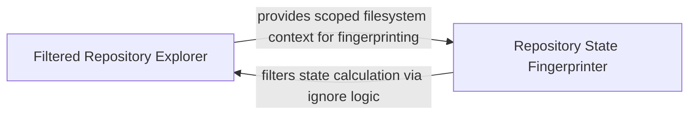

## Details

Provides foundational utilities for recursive directory walking while respecting ignore patterns to provide a clean view of the repository.

### Filtered Repository Explorer
Responsible for the recursive discovery and structural mapping of the repository, integrating ignore-pattern logic to filter out irrelevant files and directories.

**Related Classes/Methods**:

- `agents.tools.base.RepoContext._perform_walk`:49-61

**Source Files:**

- [`agents/dependency_discovery.py`](https://github.com/CodeBoarding/CodeBoarding/blob/main/.codeboardingagents/dependency_discovery.py)
  - `agents.dependency_discovery.Ecosystem` ([L12-L17](https://github.com/CodeBoarding/CodeBoarding/blob/main/.codeboardingagents/dependency_discovery.py#L12-L17)) - Class
  - `agents.dependency_discovery.FileRole` ([L20-L23](https://github.com/CodeBoarding/CodeBoarding/blob/main/.codeboardingagents/dependency_discovery.py#L20-L23)) - Class
  - `agents.dependency_discovery.DependencyFileSpec` ([L27-L30](https://github.com/CodeBoarding/CodeBoarding/blob/main/.codeboardingagents/dependency_discovery.py#L27-L30)) - Class
  - `agents.dependency_discovery.DiscoveredDependencyFile` ([L98-L100](https://github.com/CodeBoarding/CodeBoarding/blob/main/.codeboardingagents/dependency_discovery.py#L98-L100)) - Class
  - `agents.dependency_discovery.discover_dependency_files._walk` ([L127-L150](https://github.com/CodeBoarding/CodeBoarding/blob/main/.codeboardingagents/dependency_discovery.py#L127-L150)) - Function
- [`agents/tools/base.py`](https://github.com/CodeBoarding/CodeBoarding/blob/main/.codeboardingagents/tools/base.py)
  - `agents.tools.base.RepoContext._perform_walk` ([L49-L61](https://github.com/CodeBoarding/CodeBoarding/blob/main/.codeboardingagents/tools/base.py#L49-L61)) - Method
- [`repo_utils/__init__.py`](https://github.com/CodeBoarding/CodeBoarding/blob/main/.codeboardingrepo_utils/__init__.py)
  - `repo_utils.__init__.get_repo_state_hash` ([L188-L218](https://github.com/CodeBoarding/CodeBoarding/blob/main/.codeboardingrepo_utils/__init__.py#L188-L218)) - Function
- [`repo_utils/ignore.py`](https://github.com/CodeBoarding/CodeBoarding/blob/main/.codeboardingrepo_utils/ignore.py)
  - `repo_utils.ignore.RepoIgnoreManager.should_ignore` ([L225-L253](https://github.com/CodeBoarding/CodeBoarding/blob/main/.codeboardingrepo_utils/ignore.py#L225-L253)) - Method
  - `repo_utils.ignore.RepoIgnoreManager.filter_paths` ([L255-L257](https://github.com/CodeBoarding/CodeBoarding/blob/main/.codeboardingrepo_utils/ignore.py#L255-L257)) - Method

### Repository State Fingerprinter
Generates unique identifiers for the repository's current state to support incremental analysis and caching by aggregating Git metadata and file changes.

**Related Classes/Methods**: _None_

**Source Files:**

- [`static_analyzer/engine/language_adapter.py`](https://github.com/CodeBoarding/CodeBoarding/blob/main/.codeboardingstatic_analyzer/engine/language_adapter.py)
  - `static_analyzer.engine.language_adapter.LanguageAdapter._walk` ([L266-L279](https://github.com/CodeBoarding/CodeBoarding/blob/main/.codeboardingstatic_analyzer/engine/language_adapter.py#L266-L279)) - Method
- [`static_analyzer/typescript_config_scanner.py`](https://github.com/CodeBoarding/CodeBoarding/blob/main/.codeboardingstatic_analyzer/typescript_config_scanner.py)
  - `static_analyzer.typescript_config_scanner.TypeScriptConfigScanner._resolve_project_files` ([L105-L127](https://github.com/CodeBoarding/CodeBoarding/blob/main/.codeboardingstatic_analyzer/typescript_config_scanner.py#L105-L127)) - Method
  - `static_analyzer.typescript_config_scanner.TypeScriptConfigScanner._showconfig` ([L129-L153](https://github.com/CodeBoarding/CodeBoarding/blob/main/.codeboardingstatic_analyzer/typescript_config_scanner.py#L129-L153)) - Method
  - `static_analyzer.typescript_config_scanner.TypeScriptConfigScanner._fallback_walk` ([L155-L175](https://github.com/CodeBoarding/CodeBoarding/blob/main/.codeboardingstatic_analyzer/typescript_config_scanner.py#L155-L175)) - Method
  - `static_analyzer.typescript_config_scanner._is_ancestor` ([L207-L212](https://github.com/CodeBoarding/CodeBoarding/blob/main/.codeboardingstatic_analyzer/typescript_config_scanner.py#L207-L212)) - Function

### [FAQ](https://github.com/CodeBoarding/GeneratedOnBoardings/tree/main?tab=readme-ov-file#faq)