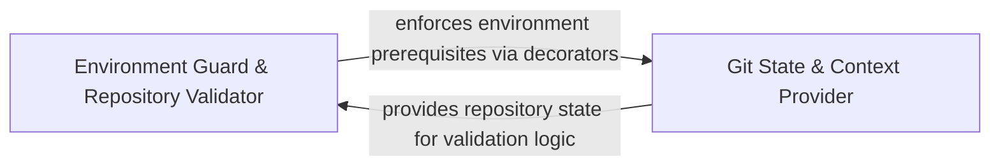

## Details

Foundational layer that validates repository integrity and extracts global state information such as commits and branches.

### Environment Guard & Repository Validator
Acts as the system's fail-fast gatekeeper, validating that the execution environment meets all prerequisites, including Git installation and repository validity.

**Related Classes/Methods**:

- `repo_utils.__init__.require_git_import`:30-61

**Source Files:**

- [`repo_utils/__init__.py`](https://github.com/CodeBoarding/CodeBoarding/blob/main/.codeboardingrepo_utils/__init__.py)
  - `repo_utils.__init__.require_git_import` ([L30-L61](https://github.com/CodeBoarding/CodeBoarding/blob/main/.codeboardingrepo_utils/__init__.py#L30-L61)) - Function
- [`repo_utils/change_detector.py`](https://github.com/CodeBoarding/CodeBoarding/blob/main/.codeboardingrepo_utils/change_detector.py)
  - `repo_utils.change_detector.FileChange.classify_method_statuses` ([L180-L221](https://github.com/CodeBoarding/CodeBoarding/blob/main/.codeboardingrepo_utils/change_detector.py#L180-L221)) - Method

### Git State & Context Provider
Extracts high-level repository metadata such as current branch, commit hashes, and repository root to provide situational awareness and enrich LLM prompts.

**Related Classes/Methods**: _None_

**Source Files:**

- [`repo_utils/__init__.py`](https://github.com/CodeBoarding/CodeBoarding/blob/main/.codeboardingrepo_utils/__init__.py)
  - `repo_utils.__init__.require_git_import.decorator` ([L37-L59](https://github.com/CodeBoarding/CodeBoarding/blob/main/.codeboardingrepo_utils/__init__.py#L37-L59)) - Function
- [`repo_utils/change_detector.py`](https://github.com/CodeBoarding/CodeBoarding/blob/main/.codeboardingrepo_utils/change_detector.py)
  - `repo_utils.change_detector._fully_inside` ([L317-L327](https://github.com/CodeBoarding/CodeBoarding/blob/main/.codeboardingrepo_utils/change_detector.py#L317-L327)) - Function

### [FAQ](https://github.com/CodeBoarding/GeneratedOnBoardings/tree/main?tab=readme-ov-file#faq)