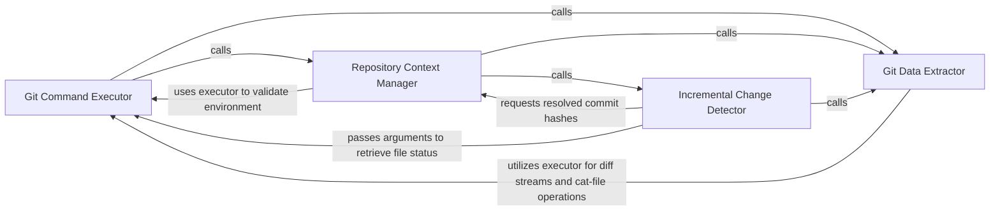

## Details

Acts as the low-level adapter for the Git binary, handling command execution, repository state verification, and the retrieval of raw file lists and diff streams.

### Git Command Executor
The low-level adapter responsible for constructing and executing Git subprocesses, ensuring deterministic output and consistent environment handling.

**Related Classes/Methods**:

- `repo_utils.git_ops._git_argv`:36-44
- `repo_utils.git_ops._parse_name_status_paths`:305-319

**Source Files:**

- [`repo_utils/git_ops.py`](https://github.com/CodeBoarding/CodeBoarding/blob/main/.codeboardingrepo_utils/git_ops.py)
  - `repo_utils.git_ops.get_changed_files_since` ([L115-L137](https://github.com/CodeBoarding/CodeBoarding/blob/main/.codeboardingrepo_utils/git_ops.py#L115-L137)) - Function
  - `repo_utils.git_ops.run_raw_diff` ([L140-L169](https://github.com/CodeBoarding/CodeBoarding/blob/main/.codeboardingrepo_utils/git_ops.py#L140-L169)) - Function
  - `repo_utils.git_ops.list_untracked_files` ([L183-L193](https://github.com/CodeBoarding/CodeBoarding/blob/main/.codeboardingrepo_utils/git_ops.py#L183-L193)) - Function
  - `repo_utils.git_ops.read_file_at_ref` ([L196-L214](https://github.com/CodeBoarding/CodeBoarding/blob/main/.codeboardingrepo_utils/git_ops.py#L196-L214)) - Function
  - `repo_utils.git_ops.worktree_has_changes` ([L252-L267](https://github.com/CodeBoarding/CodeBoarding/blob/main/.codeboardingrepo_utils/git_ops.py#L252-L267)) - Function
  - `repo_utils.git_ops._list_uncommitted_changed_files` ([L279-L302](https://github.com/CodeBoarding/CodeBoarding/blob/main/.codeboardingrepo_utils/git_ops.py#L279-L302)) - Function

### Repository Context Manager
Validates the operational environment, resolves symbolic references, and identifies commit anchors for analysis.

**Related Classes/Methods**:

- `repo_utils.git_ops.is_git_repository`:79-91
- `repo_utils.git_ops.resolve_ref`:217-229
- `repo_utils.git_ops.require_current_commit`:67-76

**Source Files:**

- [`repo_utils/__init__.py`](https://github.com/CodeBoarding/CodeBoarding/blob/main/.codeboardingrepo_utils/__init__.py)
  - `repo_utils.__init__.store_token` ([L136-L140](https://github.com/CodeBoarding/CodeBoarding/blob/main/.codeboardingrepo_utils/__init__.py#L136-L140)) - Function
- [`repo_utils/errors.py`](https://github.com/CodeBoarding/CodeBoarding/blob/main/.codeboardingrepo_utils/errors.py)
  - `repo_utils.errors.NoGithubTokenFoundError` ([L1-L2](https://github.com/CodeBoarding/CodeBoarding/blob/main/.codeboardingrepo_utils/errors.py#L1-L2)) - Class
- [`repo_utils/git_ops.py`](https://github.com/CodeBoarding/CodeBoarding/blob/main/.codeboardingrepo_utils/git_ops.py)
  - `repo_utils.git_ops.git_object_type` ([L232-L249](https://github.com/CodeBoarding/CodeBoarding/blob/main/.codeboardingrepo_utils/git_ops.py#L232-L249)) - Function
  - `repo_utils.git_ops._parse_name_status_paths` ([L305-L319](https://github.com/CodeBoarding/CodeBoarding/blob/main/.codeboardingrepo_utils/git_ops.py#L305-L319)) - Function

### Incremental Change Detector
Identifies deltas between repository states, filtering modified, staged, and untracked files to drive incremental analysis.

**Related Classes/Methods**:

- `repo_utils.git_ops.get_changed_files_since`:115-137
- `repo_utils.git_ops.has_uncommitted_changes`:94-112
- `repo_utils.git_ops.list_untracked_files`:183-193

**Source Files:**

- [`repo_utils/diff_parser.py`](https://github.com/CodeBoarding/CodeBoarding/blob/main/.codeboardingrepo_utils/diff_parser.py)
  - `repo_utils.diff_parser._run_diff_with_fetch_retry` ([L59-L81](https://github.com/CodeBoarding/CodeBoarding/blob/main/.codeboardingrepo_utils/diff_parser.py#L59-L81)) - Function
- [`repo_utils/git_ops.py`](https://github.com/CodeBoarding/CodeBoarding/blob/main/.codeboardingrepo_utils/git_ops.py)
  - `repo_utils.git_ops.require_current_commit` ([L67-L76](https://github.com/CodeBoarding/CodeBoarding/blob/main/.codeboardingrepo_utils/git_ops.py#L67-L76)) - Function
  - `repo_utils.git_ops.has_uncommitted_changes` ([L94-L112](https://github.com/CodeBoarding/CodeBoarding/blob/main/.codeboardingrepo_utils/git_ops.py#L94-L112)) - Function
  - `repo_utils.git_ops.approve_https_credentials` ([L270-L276](https://github.com/CodeBoarding/CodeBoarding/blob/main/.codeboardingrepo_utils/git_ops.py#L270-L276)) - Function

### Git Data Extractor
Retrieves content and patches from the Git database, generating raw diff streams and reading file blobs at historical snapshots.

**Related Classes/Methods**:

- `repo_utils.git_ops.run_raw_diff`:140-169
- `repo_utils.git_ops.read_file_at_ref`:196-214
- `repo_utils.git_ops.git_object_type`:232-249

**Source Files:**

- [`repo_utils/git_ops.py`](https://github.com/CodeBoarding/CodeBoarding/blob/main/.codeboardingrepo_utils/git_ops.py)
  - `repo_utils.git_ops._git_argv` ([L36-L44](https://github.com/CodeBoarding/CodeBoarding/blob/main/.codeboardingrepo_utils/git_ops.py#L36-L44)) - Function
  - `repo_utils.git_ops.is_git_repository` ([L79-L91](https://github.com/CodeBoarding/CodeBoarding/blob/main/.codeboardingrepo_utils/git_ops.py#L79-L91)) - Function
  - `repo_utils.git_ops.fetch_all` ([L172-L180](https://github.com/CodeBoarding/CodeBoarding/blob/main/.codeboardingrepo_utils/git_ops.py#L172-L180)) - Function
  - `repo_utils.git_ops.resolve_ref` ([L217-L229](https://github.com/CodeBoarding/CodeBoarding/blob/main/.codeboardingrepo_utils/git_ops.py#L217-L229)) - Function

### [FAQ](https://github.com/CodeBoarding/GeneratedOnBoardings/tree/main?tab=readme-ov-file#faq)