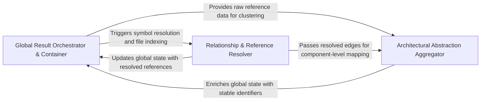

## Details

Manages the persistence and merging of analysis data, providing a unified interface for accessing the global state of the codebase.

### Global Result Orchestrator & Container
Acts as the primary source of truth for the codebase state, managing high-level aggregation logic and maintaining the integrity of the global Control Flow Graph.

**Related Classes/Methods**:

- `static_analyzer.__init__.StaticAnalyzer._absorb_into_results`:729-736
- `static_analyzer.analysis_result.StaticAnalysisResults.add_cfg`:190-192

**Source Files:**

- [`static_analyzer/__init__.py`](https://github.com/CodeBoarding/CodeBoarding/blob/main/.codeboardingstatic_analyzer/__init__.py)
  - `static_analyzer.__init__.StaticAnalyzer._absorb_into_results` ([L729-L736](https://github.com/CodeBoarding/CodeBoarding/blob/main/.codeboardingstatic_analyzer/__init__.py#L729-L736)) - Method
- [`static_analyzer/analysis_result.py`](https://github.com/CodeBoarding/CodeBoarding/blob/main/.codeboardingstatic_analyzer/analysis_result.py)
  - `static_analyzer.analysis_result.StaticAnalysisResults._bucket` ([L179-L180](https://github.com/CodeBoarding/CodeBoarding/blob/main/.codeboardingstatic_analyzer/analysis_result.py#L179-L180)) - Method
  - `static_analyzer.analysis_result.StaticAnalysisResults.add_class_hierarchy` ([L186-L188](https://github.com/CodeBoarding/CodeBoarding/blob/main/.codeboardingstatic_analyzer/analysis_result.py#L186-L188)) - Method
  - `static_analyzer.analysis_result.StaticAnalysisResults.add_cfg` ([L190-L192](https://github.com/CodeBoarding/CodeBoarding/blob/main/.codeboardingstatic_analyzer/analysis_result.py#L190-L192)) - Method
  - `static_analyzer.analysis_result.StaticAnalysisResults.add_package_dependencies` ([L194-L196](https://github.com/CodeBoarding/CodeBoarding/blob/main/.codeboardingstatic_analyzer/analysis_result.py#L194-L196)) - Method
  - `static_analyzer.analysis_result.StaticAnalysisResults.add_references` ([L198-L204](https://github.com/CodeBoarding/CodeBoarding/blob/main/.codeboardingstatic_analyzer/analysis_result.py#L198-L204)) - Method

### Relationship & Reference Resolver
Handles the linking phase by resolving cross-file and cross-package references, fixing source code line mappings, and indexing relationship endpoints.

**Related Classes/Methods**: _None_

**Source Files:**

- [`static_analyzer/analysis_result.py`](https://github.com/CodeBoarding/CodeBoarding/blob/main/.codeboardingstatic_analyzer/analysis_result.py)
  - `static_analyzer.analysis_result.StaticAnalysisResults.add_source_files` ([L311-L313](https://github.com/CodeBoarding/CodeBoarding/blob/main/.codeboardingstatic_analyzer/analysis_result.py#L311-L313)) - Method
- [`static_analyzer/language_results.py`](https://github.com/CodeBoarding/CodeBoarding/blob/main/.codeboardingstatic_analyzer/language_results.py)
  - `static_analyzer.language_results.ClassHierarchy.merge` ([L65-L73](https://github.com/CodeBoarding/CodeBoarding/blob/main/.codeboardingstatic_analyzer/language_results.py#L65-L73)) - Method
  - `static_analyzer.language_results.PackageDependencies.merge` ([L105-L109](https://github.com/CodeBoarding/CodeBoarding/blob/main/.codeboardingstatic_analyzer/language_results.py#L105-L109)) - Method
  - `static_analyzer.language_results.LanguageResults` ([L135-L149](https://github.com/CodeBoarding/CodeBoarding/blob/main/.codeboardingstatic_analyzer/language_results.py#L135-L149)) - Class

### Architectural Abstraction Aggregator
Bridges raw static data with high-level architectural concepts by grouping code into logical clusters and assigning stable component identifiers.

**Related Classes/Methods**: _None_

**Source Files:**

- [`static_analyzer/language_results.py`](https://github.com/CodeBoarding/CodeBoarding/blob/main/.codeboardingstatic_analyzer/language_results.py)
  - `static_analyzer.language_results.References.add` ([L87-L91](https://github.com/CodeBoarding/CodeBoarding/blob/main/.codeboardingstatic_analyzer/language_results.py#L87-L91)) - Method
  - `static_analyzer.language_results.SourceFiles.extend` ([L123-L126](https://github.com/CodeBoarding/CodeBoarding/blob/main/.codeboardingstatic_analyzer/language_results.py#L123-L126)) - Method

### [FAQ](https://github.com/CodeBoarding/GeneratedOnBoardings/tree/main?tab=readme-ov-file#faq)